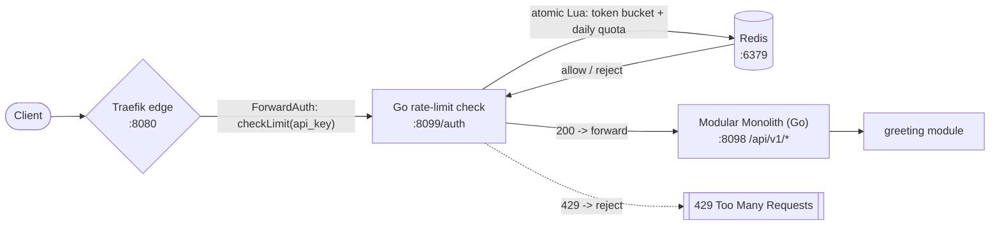

# API Gateway: Distributed Rate Limiter

A working implementation of the [`rate-limiter.md`](../rate-limiter.md) design
in **Go** + **Traefik**, structured as a **modular monolith**. It enforces the
design's two limits per client, keeps the check at the edge, and fails open
when the shared store is unavailable.

## Architecture



Single Go process, two listeners:

| Listener | Port | Purpose |
|----------|------|---------|
| Check    | `:8099` | `POST` `/auth` consumed by Traefik's **ForwardAuth** middleware. Returns `200` to allow, `429` + `Retry-After` to reject. This is the `checkLimit(api_key) -> allow|reject` interface from the design. |
| Gateway  | `:8098` | The protected module endpoints (e.g. `/api/v1/greet`) — the modular monolith behind the gateway. |

Traefik routes every `/api` request through the check **before** it reaches the
monolith, so a rejected request never consumes app-server resources.

## How it implements the design

- **Two limits, both must pass.** A per-second **token bucket** (refills
  continuously, so no fixed-window boundary burst) and a **daily quota**
  (fixed-window `INCR` with a 24h TTL).
- **Shared, atomic state.** The whole check is one Redis **Lua script**
  (`Eval`), so concurrent gateway instances cannot double-count a client — no
  distributed lock serializing the hot path.
- **Tiered limits.** `free` (100 req/s, 1M/day) vs `paid` (1k req/s, 10M/day),
  selected by API key. See `internal/ratelimit/limit.go`.
- **IP-based fallback.** Clients without an API key are keyed by `X-Forwarded-For`
  and limited at the free tier (abuse prevention).
- **Fail-open.** If Redis is unreachable the request is allowed through
  (over-admission during an outage beats blocking all traffic). Configurable via
  `FAIL_OPEN`.

## Layout

```
cmd/gateway/            entrypoint: wires store + limiter + two HTTP listeners
internal/config/        env-driven configuration
internal/ratelimit/     the rate limiter module
  limit.go              tiers + limits + Decision
  store.go              Store interface (atomic Check over both limits)
  lua.go                the atomic Redis Lua check
  redis.go              RedisStore (primary)
  memory.go             MemoryStore (local dev / tests)
  limiter.go            fail-open / fail-closed policy
internal/api/           gateway HTTP surface
  auth.go               ForwardAuth handler (allow 200 / reject 429)
  server.go             wires check + gateway listeners
internal/module/        the modular monolith's vertical modules
  greeting/             example protected endpoint
deploy/                 Docker + Traefik + Redis
  docker-compose.yml
  traefik/dynamic.yml   edge router + ForwardAuth middleware
```

## Running

### Quick start (full stack: Traefik + Redis + gateway)

```bash
make compose-up
```

Then hit the gateway (Traefik :8080):

```bash
# Allowed until the burst is exhausted.
curl -s -o /dev/null -w "%{http_code}\n" http://localhost:8080/api/v1/greet?name=world

# Rapid-fire to trigger the rate limiter (429).
for i in $(seq 1 200); do
  curl -s -o /dev/null -w "%{http_code}\n" -H "X-API-Key: anon-key" \
    http://localhost:8080/api/v1/greet?name=world
done
```

- Traefik dashboard: <http://localhost:8081/dashboard/>
- Gateway health: <http://localhost:8099/healthz>

`make compose-down` stops the stack.

### Local dev (no Docker, in-memory store)

```bash
make run
curl -s -o /dev/null -w "%{http_code}\n" http://localhost:8098/api/v1/greet
```

The in-memory store limits a single process only; use Redis for real
distributed deployments.

## Configuration (env vars)

| Variable         | Default           | Description                                   |
|------------------|-------------------|-----------------------------------------------|
| `GATEWAY_ADDR`   | `:8098`           | Protected module API bind address             |
| `CHECK_ADDR`     | `:8099`           | Rate-limit check bind address (ForwardAuth)   |
| `REDIS_ADDR`     | `localhost:6379`  | Shared Redis; `none` selects the memory store |
| `FAIL_OPEN`      | `true`            | Allow traffic when Redis is unavailable       |
| `CHECK_TIMEOUT`  | `50ms`            | Per-check budget to protect the <5ms p99 goal |

## Verify

```bash
make test   # unit tests: burst, refill, quota, fail-open, tiering, IP fallback
make vet
make lint   # golangci-lint, if installed
```

## Trade-offs (mirroring the design doc)

- **Single point of failure**: Redis. Mitigated by fail-open and (in production)
  primary + replica.
- **Approximate accuracy**: fail-open can briefly over-admit; acceptable for a
  best-effort protection mechanism.
- **Hot key**: a single noisy client's counter is one Redis key. If this bites,
  shard the counter into N sub-counters summed at check time (not implemented).