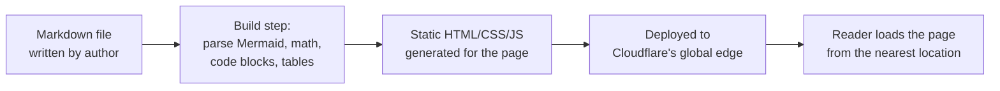
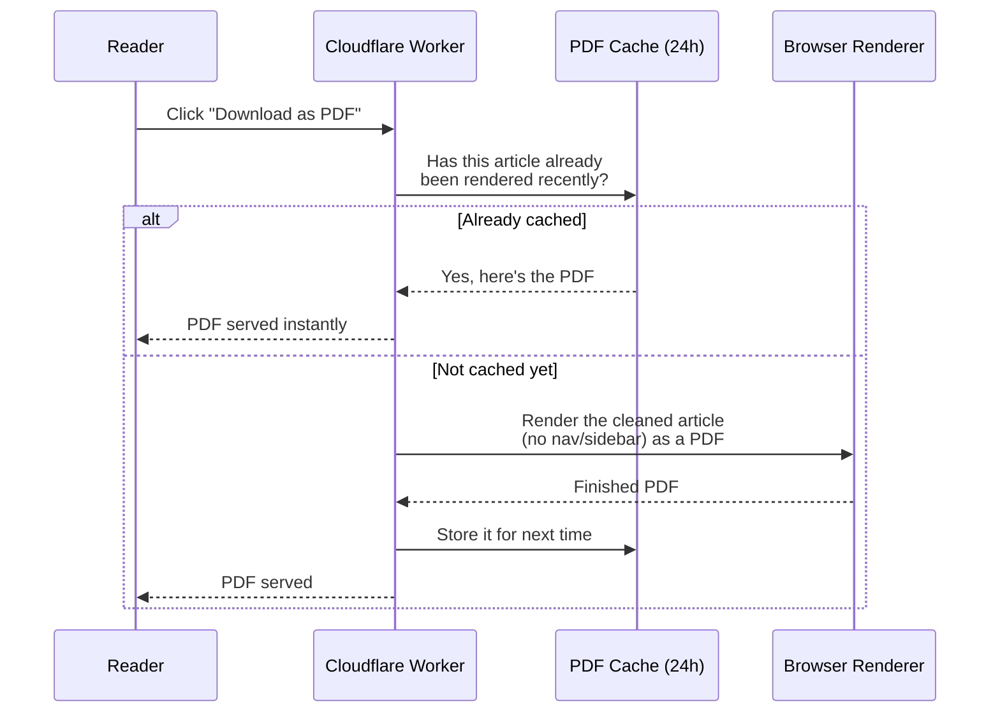

# What  is Atlas?

Atlas is what you  see in your web right now, its my blog. Atlas turns plain markdown files into a fast, readable blog with no server running behind it. Everything, including PDF generation, runs "serverless" on Cloudflare's edge network. The feature is:

- **Diagrams that just work.** Write a diagram description in plain text (using Mermaid syntax) and it turns into a proper flowchart or sequence diagram on the page no separate image files to draw and upload.
- **Math that renders properly.** Equations written in a simple text notation (KaTeX/LaTeX) show up as real typeset math, not a wall of symbols.
- **Readable code blocks.** Code samples get syntax highlighting so keywords, strings, and comments are visually distinct.
- **Tables**, for anything that's easier to scan as rows and columns than as prose.
- **Dark mode**, remembered across visits, and matching your system preference by default.
- **A table of contents that tracks where you are.** As you scroll, the section you're currently reading highlights itself in the sidebar automatically, you always know where you are in a long post without hunting for it.
- **Copy as Markdown.** One click copies the whole article as raw markdown — handy for pasting into notes, other tools, or feeding to an AI assistant.
- **Download as PDF.** One click turns the article into a printable PDF

## Serverless

There's no dedicated server running around the clock. The blog's pages are pre-built into plain HTML/CSS/JS files and handed out from Cloudflare's global network. For the one feature that needs real computation (generating a PDF), a Worker wakes up on Cloudflare's edge only when someone clicks the download button, does its job, and then goes back to sleep. Nothing is provisioned or paid for while nobody's asking for a PDF.

## Caching

- **The content itself** is built once ahead of time and served straight from Cloudflare's edge cache worldwide
- **Generated PDFs** are cached for 24 hours after the first person requests one for a given article. So the first download for an article takes a couple of seconds (real PDF rendering happens), and every download after that for the same content is served instantly from cache, with no re-rendering cost.

---

## Architecture

### 1. From markdown file to published page

Articles are written once as plain markdown, then processed into the finished, styled page you read.

### 2. Generating a PDF

This is the one part of the site that isn't purely static, it's a small serverless function that only runs when you ask for a PDF.

