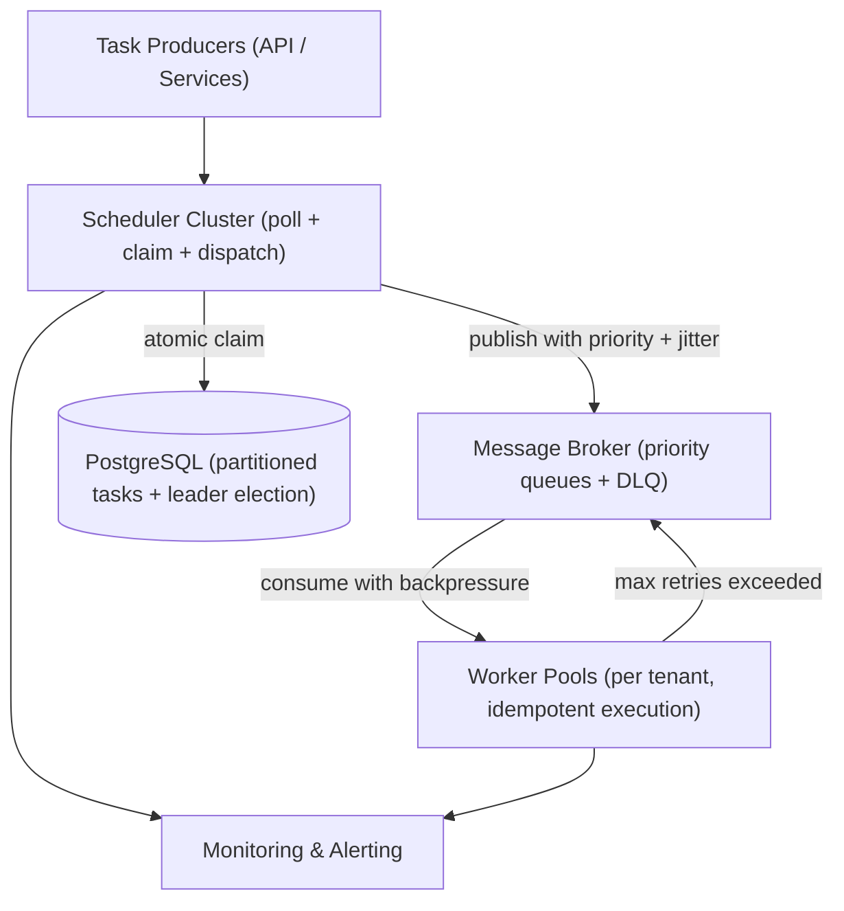
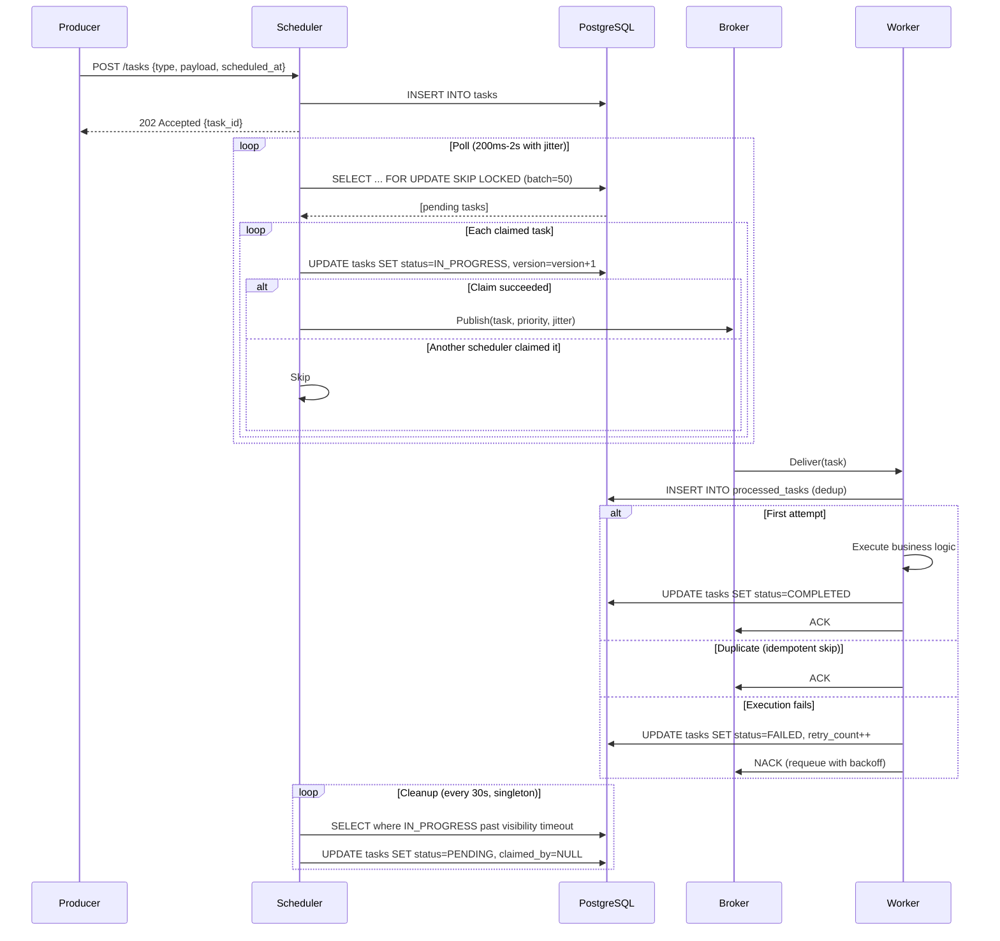

# Batch Scheduler

A batch scheduler runs background tasks at a scheduled time — sending emails, processing payments, generating nightly reports, expiring subscriptions. When a system grows to millions of tasks across dozens of tenants, the obvious approach (poll a database table every few seconds) breaks down: concurrent schedulers hammer the database, tasks execute twice, high-priority jobs starve low-priority ones, and crashed workers leave tasks stuck forever.

This document designs a distributed batch scheduler that survives that scale. It uses PostgreSQL as both task storage and coordination point, a message broker for resilient dispatch, and a polling loop with optimistic locking to ensure exactly-one claim per task.

**Audience:** Backend engineers building high-traffic systems. Familiarity with PostgreSQL, message queues, and distributed coordination assumed.

## Scenario & Requirements

| Dimension | Value |
|-----------|-------|
| Tasks enqueued per day | 50M (mixed: payments, reports, emails, data exports, subscription expiry) |
| Peak dispatch rate | 10,000 tasks per second (overnight batch window: 2:00–4:00 AM) |
| Tenants | 200, with per-tenant isolation guarantees |
| Storage | ~1 TB/year (≈1 KB metadata per task) |
| Scheduling precision | Within 5 seconds of scheduled time is acceptable |
| Task duration | 100ms–30 minutes (heterogeneous workers) |

**What the system must guarantee:**

- Every task is claimed exactly once — no double execution from concurrent schedulers.
- No task is lost if a scheduler or worker crashes mid-processing.
- Low-priority tasks always make progress, even during a high-priority flood.
- A failing tenant cannot starve other tenants of worker capacity.

## The Problem

Naively polling a `WHERE scheduled_at <= NOW() AND status = 'PENDING'` query from multiple servers creates three problems:

**Thundering herd on claim.** Every scheduler node runs the same poll query at the same interval. All N nodes return the same batch of pending tasks. If they all try to `UPDATE ... SET status = 'IN_PROGRESS'` simultaneously, most updates conflict and roll back. At 50 nodes polling every 500ms for 10K tasks, the database spends most of its CPU on rolled-back updates.

**Double execution without locking.** Two nodes can read the same task rows, both start processing, and neither knows the other exists. The task runs twice — bad for payment processing.

**No recovery on crash.** If a node claims a task and crashes mid-execution, the task stays stuck `IN_PROGRESS` forever. Someone must detect and reset stuck tasks.

A distributed batch scheduler solves all three with a single database query: `SELECT ... FOR UPDATE SKIP LOCKED` with optimistic locking, plus a singleton cleanup loop for crash recovery.

## Key Design Decisions

| Decision | Rationale | Rejected Alternative |
|---|---|---|
| Decoupled scheduler-broker-worker | Tasks survive worker outages; natural backpressure and priority queuing | Direct synchronous invocation (fragile, no retry buffer) |
| PostgreSQL `FOR UPDATE SKIP LOCKED` + version column | Atomic claim without extra infrastructure; defense-in-depth against double execution | Pure ZooKeeper (operational complexity) or pure Redis (data loss risk) |
| Time-based range partitioning (monthly) | Poll queries naturally hit recent partitions; old ones detached and archived automatically | Hash partitioning at DB level (complicates time-range archival) |
| Hash-partitioned poll keys for scheduler nodes | Linear horizontal scaling; zero lock contention across nodes | Single shared poll queue (contention at 50+ nodes) |
| Visibility timeout + singleton cleanup leader | Recovers crashed worker/scheduler tasks without per-task heartbeats | Per-task heartbeat (Nx traffic overhead, false positives on transient network glitches) |
| At-least-once execution by default; exactly-once via worker idempotency | Scheduler stays simple and fast; exactly-once is a system property, not single-component | Guaranteeing exactly-once in the scheduler (impossible without 2PC across worker and scheduler) |
| Priority queues with aging + weighted fair queuing | Low-priority tasks always make progress; starvation impossible | Strict priority (low-priority starves indefinitely) or pure FIFO (no urgency differentiation) |
| `pg_partman` for automatic partition management | No manual DDL; predictable retention; online detach/archive | Manual partition scripts (error-prone, requires scheduled operator intervention) |

## Architecture



### Data Flow



## Database Schema

```sql
CREATE TABLE tasks (
 id UUID PRIMARY KEY DEFAULT gen_random_uuid(),
 task_type VARCHAR(255) NOT NULL,
 tenant_id VARCHAR(64) NOT NULL, -- Multi-tenant isolation
 payload JSONB NOT NULL,
 status VARCHAR(20) NOT NULL DEFAULT 'PENDING',
 -- PENDING, IN_PROGRESS, COMPLETED, FAILED, DEAD_LETTERED
 priority INT NOT NULL DEFAULT 0, -- Higher = more urgent
 scheduled_at TIMESTAMP NOT NULL,
 max_retries INT NOT NULL DEFAULT 3,
 retry_count INT NOT NULL DEFAULT 0,
 version BIGINT NOT NULL DEFAULT 0, -- Optimistic lock
 claimed_by VARCHAR(255), -- Which scheduler claimed it
 claimed_at TIMESTAMP,
 started_at TIMESTAMP,
 completed_at TIMESTAMP,
 error_message TEXT,
 partition_key INT NOT NULL, -- Hash-based partitioning (0..N-1)
 created_at TIMESTAMP NOT NULL DEFAULT NOW(),
 updated_at TIMESTAMP NOT NULL DEFAULT NOW()
) PARTITION BY RANGE (scheduled_at);

-- Partitions created per month (auto-managed by pg_partman)
CREATE TABLE tasks_2026_01 PARTITION OF tasks
 FOR VALUES FROM ('2026-01-01') TO ('2026-02-01');
-- ... pg_partman auto-creates partitions ahead of time

-- Composite index for efficient polling
CREATE INDEX idx_tasks_poll ON tasks (status, scheduled_at, priority DESC)
 WHERE status = 'PENDING';

-- Index for partition-based polling
CREATE INDEX idx_tasks_partition ON tasks (partition_key, status, scheduled_at)
 WHERE status = 'PENDING';

-- Deduplication table for worker idempotency
CREATE TABLE processed_tasks (
 task_id UUID PRIMARY KEY,
 worker_id VARCHAR(255),
 processed_at TIMESTAMP DEFAULT NOW(),
 TTL TIMESTAMP DEFAULT NOW() + INTERVAL '30 days'
);

-- Leader election table for singleton operations
CREATE TABLE leader_election (
 role VARCHAR(100) PRIMARY KEY, -- e.g., 'cleanup_leader'
 instance_id VARCHAR(255) NOT NULL,
 acquired_at TIMESTAMP NOT NULL DEFAULT NOW(),
 expires_at TIMESTAMP NOT NULL
);
```

### Versioning & Optimistic Locking

Every task row includes a `version` column (BIGINT, starts at 0). All claim operations use:

```sql
UPDATE tasks
SET status = 'IN_PROGRESS', version = version + 1, claimed_by = ?, claimed_at = NOW()
WHERE id = ? AND version = ? AND status = 'PENDING';
```

If the `version` changed between read and update (another scheduler claimed it), zero rows are affected — the update is a no-op, and the scheduler moves on. This is defense-in-depth alongside `FOR UPDATE SKIP LOCKED`.

### Advisory Locks (Alternative / Complementary)

For operations that don't require row locking (e.g., leader election), PostgreSQL advisory locks provide lightweight, session-scoped locking:

```sql
SELECT pg_try_advisory_lock(hashtext('cleanup_leader'));
```

The cleanup singleton uses advisory locks to ensure only one node runs the visibility timeout scan at any time. If the lock holder crashes, the lock is released automatically when the connection drops.

---

## Poll & Claim Loop

**Conceptual flow:**

1. Scheduler queries for `PENDING` tasks where `scheduled_at <= now()`, ordered by `priority DESC, scheduled_at ASC`, limited to a batch size (e.g., 50 rows).
2. The query uses `FOR UPDATE SKIP LOCKED` to:
   * Lock the selected rows in this transaction
   * Skip rows already locked by another scheduler's concurrent query
   * Return immediately without blocking
3. For each returned row, the scheduler attempts the atomic `UPDATE... WHERE version = ?` claim.
4. If the update returns a row (claim succeeded), publish the task to the broker with its priority.
5. If the update returns zero rows (another scheduler got it), skip and continue to the next task.
6. If no tasks are returned, back off with exponential delay (with jitter) before polling again.
7. The broker dispatch adds a random 1–5 second jitter to smooth thundering herds.

**Go implementation (scheduler hot path):**

```go
func (s *Scheduler) pollAndClaim(ctx context.Context) error {
 rows, err := s.db.QueryContext(ctx, `
 SELECT id, task_type, tenant_id, payload, priority, max_retries, version
 FROM tasks
 WHERE partition_key = ANY($1)
 AND status = 'PENDING' AND scheduled_at <= NOW()
 ORDER BY priority DESC, scheduled_at ASC
 LIMIT $2
 FOR UPDATE SKIP LOCKED
 `, pq.Array(s.partitions), s.batchSize)
 if err != nil {
  return fmt.Errorf("poll: %w", err)
 }
 defer rows.Close()

 for rows.Next() {
  var t Task
  if err := rows.Scan(&t.ID, &t.Type, &t.TenantID, &t.Payload, &t.Priority, &t.MaxRetries, &t.Version); err != nil {
   s.metrics.PollErrors.Inc()
   continue
  }

  result, err := s.db.ExecContext(ctx, `
  UPDATE tasks
  SET status = 'IN_PROGRESS', version = version + 1,
   claimed_by = $1, claimed_at = NOW()
  WHERE id = $2 AND version = $3 AND status = 'PENDING'
  `, s.instanceID, t.ID, t.Version)
  if err != nil {
   continue
  }

  n, _ := result.RowsAffected()
  if n == 0 {
   s.metrics.ClaimConflicts.Inc()
   continue
  }

  s.metrics.ClaimsSucceeded.Inc()
  if err := s.broker.Publish(ctx, t); err != nil {
   s.broker.Nack(ctx, t.ID)
  }
 }
 return rows.Err()
}
```

---

## Priority Queues & Task Starvation Prevention

Tasks are published to the broker with a `priority` header. The broker routes to separate queues (high/medium/low). Without fairness mechanisms, a flood of high-priority tasks starves low-priority tasks indefinitely.

**Prevention mechanisms:**

| Mechanism | How It Works |
| -------------------------------------- | ------------------------------------------------------------------------------------------------------------------------------------------------------------------------------------------------------------------------ |
| **Weighted fair queuing** | Each priority queue gets a minimum share of worker capacity. Even if high-priority queue is overflowing, 10% of workers are reserved for low-priority. |
| **Aging** | Task priority increases the longer it waits. A marketing email queued for 24 hours gets promoted to medium priority automatically. The scheduler's poll query sorts by effective priority (`base_priority + age_bonus`). |
| **Separate worker pools per priority** | Dedicated workers for low-priority tasks. These workers never process high-priority tasks. Low-priority tasks always make progress, just slower. |
| **Priority inversion detection** | Monitor the maximum wait time per priority level. If low-priority tasks are waiting longer than 5 minutes, alert and investigate. |

---

## Visibility Timeout & Cleanup

A scheduler node might crash after claiming a task (`status = IN_PROGRESS`) but before dispatching it, or a worker might crash mid-execution without acknowledgement. Tasks stuck in `IN_PROGRESS` beyond a configurable timeout (default: 5 minutes) must be recovered.

**Cleanup job (singleton):**

* Runs every 30 seconds.
* Scans for tasks where `status = 'IN_PROGRESS'` AND `claimed_at < now() - visibility_timeout`.
* Resets them to `PENDING`, clearing `claimed_by` and `claimed_at`.
* Uses optimistic locking (`version` column) to ensure no race condition with a legitimate completion.
* Only the elected singleton cleanup leader runs this. Other nodes skip.

---

## Scheduler Leader Election for Singleton Operations

Some operations must run exactly once across the cluster: visibility timeout cleanup, partition maintenance, metric aggregation.

**Advisory lock-based leader election:**

```sql
INSERT INTO leader_election (role, instance_id, expires_at)
VALUES ('cleanup_leader', ?, NOW() + INTERVAL '30 seconds')
ON CONFLICT (role) DO UPDATE
SET instance_id = ?, acquired_at = NOW(), expires_at = NOW() + INTERVAL '30 seconds'
WHERE leader_election.expires_at < NOW();
```

1. If the update succeeds (the previous leader's lease expired), this node becomes the new cleanup leader.
2. The leader renews its lease every 10 seconds by updating `expires_at`.
3. If the leader crashes, its lease expires in 30 seconds, and another node takes over automatically.
4. Only the leader runs the cleanup loop.

---

## Backpressure

When workers are saturated, broker queues can grow unbounded unless backpressure is applied.

**Mechanisms:**

| Layer | Mechanism |
| ------------- | ------------------------------------------------------------------------------------------------------------------------------------------------------------------------------------------------------------------------- |
| **Worker** | Prefetch limit (`basic.qos(prefetch_count=10)`). Broker won't deliver more than N unacknowledged messages per worker. This is the first line of defense. |
| **Broker** | RabbitMQ memory/disk alarms. When resources exceed thresholds, the broker blocks publishers. The scheduler's publish calls will block or fail, naturally slowing the claim loop. |
| **Scheduler** | Queue depth monitoring. If a priority queue exceeds a configured depth threshold, the scheduler skips dispatching to that queue and logs a warning. This prevents one slow queue from consuming all scheduler throughput. |
| **Producer** | Rate limiting on task ingestion (per tenant). If Tenant A is enqueueing faster than their provisioned capacity, reject with HTTP 429. |

---

## At-Least-Once vs Exactly-Once Worker Execution

The scheduler guarantees exactly-once **claiming** of tasks. But execution can happen more than once if:

* The worker crashes after executing but before acknowledging
* The broker redelivers due to a network timeout
* The acknowledgment is lost in transit

**Achieving exactly-once execution:**

| Layer | Mechanism |
| ------------------------------------ | ----------------------------------------------------------------------------------------------------------------------------------------------------------------------------------------------------------------------------------- |
| **Task idempotency key** | Each task has a unique `task_id`. Before executing business logic, the worker inserts into `processed_tasks` table. If the insert fails (duplicate key), the task was already processed — skip execution and acknowledge immediately. |
| **Idempotent business operations** | Design operations to be safe on retry. "Set user status to ACTIVE" is idempotent. "Increment balance by $100" is not — use a ledger with a deduplication key instead. |
| **Worker acknowledgment discipline** | Acknowledge only after both business logic AND the deduplication record are persisted (atomically in a transaction). If either fails, nack with requeue. |

**Documented reality:** The overall system is at-least-once by default. Exactly-once requires worker-level idempotency or deduplication. The scheduler's responsibility ends at exactly-once **dispatch**.

---

## Partition-Based Polling (Further Scaling)

When the task volume exceeds what a single poll query can efficiently scan (100K+ pending tasks, 50+ scheduler nodes), poll contention becomes measurable.

**Hash-based partitioning:**

* Each task is assigned a `partition_key = hash(task_id) % N` on creation.
* Each scheduler node is statically or dynamically assigned a subset of partitions (e.g., Node 1 handles partitions 0–3, Node 2 handles 4–7).
* The poll query includes: `WHERE partition_key IN (0,1,2,3) AND status = 'PENDING' AND scheduled_at <= NOW()`.
* No lock contention across scheduler nodes because they never touch the same partitions.
* If a node fails, its partitions are reassigned. Pending tasks in those partitions are picked up by the new owner.

**Dynamic partition assignment:** Use a coordination service (ZooKeeper, etcd) or a database table to track partition ownership. On startup, a scheduler node claims unowned partitions. On shutdown, it releases them. This is lighter than full leader election — only partition ownership changes, not the claim loop itself.

---

## Partitioning at Scale (Database Level)

For tables with billions of rows:

| Strategy | How |
| ---------------------------------------- | ------------------------------------------------------------------------------------------------------------------------------------------------------------------------------------------- |
| **Range partitioning by `scheduled_at`** | Monthly partitions. The poll query naturally hits only recent partitions (today and a lookback window). Older partitions are rarely scanned. |
| **Automatic partition management** | `pg_partman` creates partitions ahead of time (e.g., next 3 months) and detaches/archives old partitions beyond retention policy (e.g., 90 days). |
| **Online schema changes** | Use `pgroll` or `gh-ost` for non-blocking migrations. Adding a column with a default value is instant in PostgreSQL 11+. Adding an index uses `CREATE INDEX CONCURRENTLY`. |
| **Archiving** | Detach old partitions and move to cold storage (S3 with `pg_tier` extension or manual export). Detached partitions are queryable if reattached but don't consume active database resources. |

---

## Putting It Together: Peak Batch Run

It is 2:00 AM. The overnight batch window is open.

**Load:**
- 10M payment settlement tasks at priority 5 (high)
- 500K marketing email campaigns at priority 1 (low)
- 200K report generation tasks at priority 3 (medium)
- 100K subscription expiry checks at priority 2 (medium-low)

**System acts as follows:**

1. **T+0s.** All 15 scheduler nodes poll their assigned partitions. Each finds ~1000 pending tasks. `FOR UPDATE SKIP LOCKED` ensures no two nodes see the same task. Each claims up to 50, publishes to the broker with priority + 1-5s random jitter.

2. **T+5s.** Broker queues fill: high-priority (settlements) gets the most workers. Weighted fair queuing reserves 10% for low-priority (emails) — they make progress slowly but never stall.

3. **T+30s.** One scheduler node crashes mid-dispatch. Three claimed tasks stay `IN_PROGRESS`. The cleanup leader (elected via advisory lock) scans and resets them 5 minutes later. The owning partition is reassigned to another node within 10 seconds.

4. **T+2min.** Settlement tasks drain first (high priority + most workers). Emails and reports continue at lower concurrency. Aging promotes 30-minute-old medium tasks dynamically.

5. **T+10min.** A tenant spikes with 200K bad tasks that all fail. The scheduler skips dispatching to that tenant. Other tenants unaffected.

6. **T+4hrs.** All tasks completed. Scheduler nodes back off to idle poll interval (2s). Monthly partition for last month is archived to cold storage.

**Resource usage at peak:**
- 15 scheduler nodes × 20 goroutines = 300 goroutines active
- 50 DB connections used (pgbouncer pooled)
- 3 broker nodes, quorum queues, ~50K messages inflight
- PostgreSQL primary: ~5000 tps (polls + claims + status updates), well within single-node capacity

---

## Failure Modes

| Failure | Probability | Impact | Mitigation |
|---|---|---|---|---|
| Scheduler node crashes mid-claim (tasks stuck IN_PROGRESS) | Low–Medium | Medium: tasks invisible until cleanup | Visibility timeout singleton resets stuck tasks; ≤30s recovery window |
| Worker crashes before ACK | Medium | Low: task re-delivered to another worker | Broker redelivers; idempotency key prevents double execution |
| PostgreSQL primary fails | Low | High: entire scheduler stalls | Streaming replicas + automated failover (Patroni); pgbouncer for connection resilience |
| Broker node failure | Low | Medium: no task dispatch until recovery | Quorum queues (RabbitMQ 3.8+) across 3-node cluster |
| Partition hotspot (uneven task distribution) | Medium | Medium: some nodes idle, others overloaded | Monitor per-partition task count; trigger rebalance or dynamic reassignment |
| Database connection pool exhaustion | Low–Medium | High: poll loop stalls, zero task progress | pgbouncer connection pooling; alert on connection wait time |
| Redis coordination data loss (if using Redis) | Low | Medium: pending tasks absent from PostgreSQL | PostgreSQL is source of truth; Redis is ephemeral augmentation; orphaned tasks recovered by cleanup leader |

---

## Graceful Shutdown

When a scheduler node receives SIGTERM:

1. Stop polling for new tasks immediately.
2. Drain the dispatch buffer: send all claimed-but-undispatched tasks to the broker within a deadline (e.g., 10 seconds).
3. If deadline expires before drain completes, release remaining undispatched tasks back to `PENDING` via an atomic update.
4. Release any advisory locks held by this instance.
5. Close database connections and broker channels cleanly.

---

## Tradeoffs

**1. Decoupled architecture (scheduler -> broker -> worker) over direct invocation.**\
Cost: One additional network hop and a small latency increase.\
Benefit: Durability (tasks survive worker outages), natural backpressure, priority queuing, independent retry/dead-letter handling, and worker deployability without scheduler coordination.

**2. PostgreSQL as coordination point over dedicated coordination service (ZooKeeper/etcd).**\
Cost: Database handles both storage and coordination. At extreme scale (50+ scheduler nodes), poll contention is possible.\
Benefit: No additional infrastructure to operate. Simpler deployment. Partition-based polling mitigates the contention issue.

**3. At-least-once execution by default; exactly-once requires worker idempotency.**\
Cost: Workers must implement idempotency or deduplication. Not all business operations are naturally idempotent.\
Benefit: The scheduler remains simple and fast. Exactly-once is a system property, not a single-component guarantee. This is architecturally honest — documented, not hidden.

**4. Hash-based partitioning over a single shared poll queue.**\
Cost: Partition assignment and rebalancing add complexity. Uneven partition assignment can create hotspots.\
Benefit: Linear horizontal scaling of scheduler nodes without lock contention. Required for billions of tasks.

---

## Storage Choice & Why

**PostgreSQL** remains the primary store. It provides ACID transactions, `FOR UPDATE SKIP LOCKED` for concurrent polling, advisory locks for leader election, and native partitioning for scale. For deployments with extreme write throughput, **CockroachDB** offers compatible SQL semantics with horizontal write scaling.

**Redis** is an optional coordination layer for sub-millisecond claim latency. It does not replace PostgreSQL — it augments it for the hot path. The database remains the source of truth.

---

## Appendix: Alternative Coordination Mechanisms

For environments where sub-millisecond claim latency is required or where the database is not the coordination point:

**Redis-based coordination:**

* On task creation, push the `task_id` and its `scheduled_at` score into a Redis Sorted Set (`ZADD tasks:pending <timestamp> <task_id>`).
* Scheduler nodes call `ZPOPMIN tasks:pending` (atomic pop of the earliest ready task). Redis 5.0+ supports this natively.
* If `ZPOPMIN` returns a task_id, the scheduler claims it. No other scheduler saw this task_id.
* **Tradeoff:** Redis must be configured with AOF persistence (`appendfsync everysec`) and replicas to avoid data loss on crash. If Redis loses data, orphaned tasks in PostgreSQL are recovered by the visibility timeout cleanup.

**ZooKeeper-based coordination:**

* Tasks are ephemeral sequential znodes under `/tasks/pending/`. Schedulers watch the children. The scheduler with the lowest sequence number claims the task.
* ZooKeeper's strong consistency guarantees make this suitable for leader election and task claiming without database locks.
* **Tradeoff:** ZooKeeper adds operational complexity (ensemble management, session timeouts). It's justified when you need CP (consistent) coordination without relying on the database.

**Choosing the right mechanism:**

| Mechanism | When to Use | Avoid When |
| ----------------------------------- | ------------------------------------------------------------ | ------------------------------------------------- |
| PostgreSQL `FOR UPDATE SKIP LOCKED` | Default. Works for 95% of cases. No extra infrastructure | You have extreme lock contention across 50+ nodes |
| Redis Sorted Sets | You need sub-ms claim latency and already run Redis | You can't tolerate Redis data loss risk |
| ZooKeeper | You need strong consistency for coordination without DB load | You don't want to operate a ZooKeeper ensemble |

---

## What This Design Doesn't Cover (Deferred to Implementation)

* **Worker idempotency implementation:** The design specifies the contract; the implementation is per-domain-service.
* **Disaster recovery procedures:** Point-in-time recovery, cross-region failover, backup schedules — these are operational runbooks, not architecture.
* **Capacity planning specifics:** Exact instance sizes, connection pool limits, broker cluster topology — these depend on load testing results.
* **SDK / client library:** How producers enqueue tasks — this is an API design, not core scheduler architecture.
`