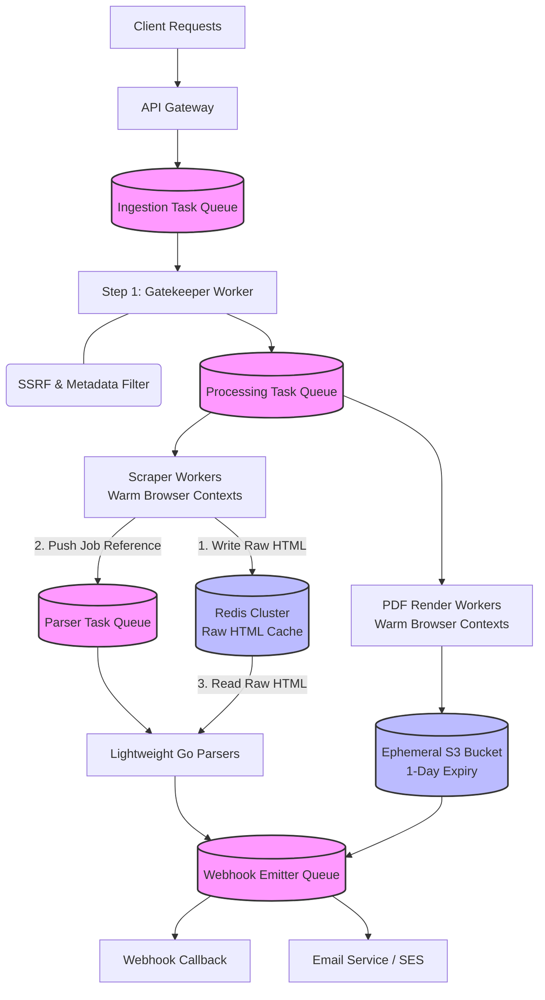

# Design a Scalable Headless Browser & Scraping Cluster

## Scope & Requirements

### Functional Requirements

- Users can submit a URL to scrape dynamic text/HTML or generate a PDF/Screenshot.
- System delivers the output asynchronously via download link, webhook, or email

### Non-Functional Requirements

- **Scale:** High throughput, daily volume of 50,000,000 jobs.
- **Availability:** Fault-tolerant architecture (a individual browser crash must not impact cluster stability).
- **Latency:** Asynchronous execution driven by robust SLA queue boundaries.

---

## Capacity Estimation (Back-of-the-Envelope)

- **Total Jobs:** 50,000,000 jobs / day (split 80% scraping, 20% PDF generation).
- **Average Ingestion Throughput:** 50,000,000 / 86,400 seconds = ~580 jobs/sec.
- **Peak Traffic QPS (3x multiplier):** ~1,740 jobs/sec.

### Storage (per day)

- **Scraping Payloads:** Handled temporarily via aggressive 10-minute cache TTL window (see memory calculations below).
- **PDF Generation:** 10,000,000 PDFs / day * 500 KB average size = 5,000 GB = 5 TB / day.
- **Storage Optimization:** Implementing a strict 24-hour automatic S3 object lifecycle expiration flat 5 TB at any single point in time.

### Network Bandwidth

- **Inbound Egress:** 1,740 peak requests/sec * 10 KB request metadata = 17.4 MB/sec.
- **Outbound Egress (PDF Delivery):** 10,000,000 PDFs * 500 KB = 5 TB / 86,400 sec = 58 MB/sec average egress (174 MB/sec peak footprint).

---

## High-Level Design



### Core API Endpoints

**POST /v1/jobs** Submits an asynchronous job payload. Returns 202 Accepted with a tracking ID.

```json
{
  "client_id": "internal-travel-service",
  "url": "https://example.com/invoice",
  "type": "pdf",
  "delivery": { "method": "email", "destination": "user@email.com" }
}
```

**GET /v1/jobs/:job_id** -> Polling fallback endpoint indicating state: PENDING, PROCESSING, SUCCESS, or FAILED.

**Note on Webhooks:** To mitigate security risks, webhook callback destinations are linked directly to authenticated client configuration templates managed securely via an internal Configuration Registry

### Database Schema

**Jobs Table (DynamoDB):** Manages metadata state routing. Sharded horizontally using a hash of the `user_id`/`tenant_id` to prevent cross-tenant read/write deadlocks.

- Schema: `job_id` (PK), `user_id`, `type`, `status`, `current_step`, `created_at`, `updated_at`

**Claim-Check Cache (Redis Cluster):** A temporary holding area to hand off raw HTML from the browser to the downstream code

- **40,000,000 scraping jobs per day**
- **40,000,000 × 50 KB (average page size) = 2,000 GB (2 TB) of raw HTML per day.**
- **Redis Job Cache Key:** job:state:[job_id] -> Stores parsed HTML content during multi-step pipeline handoffs before worker ejection.

Redis cluster with 2 TB of RAM would cost thousands of dollars a month. **But we don't need 2 TB of RAM.** Because this is a decoupled asynchronous pipeline, the parser picks up the job from the queue almost instantly after the Scraper drops it. The HTML only needs to live in Redis for the few seconds before processed .

If we apply a aggressive **10-minute TTL (Time-To-Live)** on the Redis keys:
- **Average throughput:** 40,000,000 jobs / 86,400 seconds = ~463 jobs/second.
- **Concurrent data in flight (10 mins / 600 seconds):** 463 jobs/sec × 600 seconds = ~277,800 active HTML payloads in cache at any single moment.
- **Total RAM required:** 277,800 payloads × 50 KB = **~13.8 GB of RAM**

A 14 GB Redis cluster is tiny, completely manageable, and very cheap (well under $100/month on AWS ElastiCache).

---

## Deep Dive

### Headless Chromium Lifecycle & Memory Isolation

- **Warm Worker Pooling with Browser Contexts:** Instead of launching a new browser process per request, workers spin up a fixed pool of long-lived Chromium instances using Puppeteer or Playwright. For individual incoming jobs, the worker creates an isolated, lightweight Browser Context (similar to an incognito tab) which provisions in milliseconds.

- **Max-Request Circuit Breaker:** To fix inevitable memory leaks, our background controller tracks how many pages each browser instance handles. Once a browser hits its limit (e.g., exactly 100 pages processed), the controller stops sending it new work, lets it finish what it's doing, completely shuts it down, and launches a fresh, clean browser to take its place.

- **The "Extract & Eject" Cost Optimization:** To stop the heavy browser from hogging server memory, the worker grabs the raw HTML text as soon as the web page finishes loading. The browser tab is immediately freed up for the next job. All the heavy text processing and HTML parsing are passed down to background workers that use low-memory search tools.

### Cluster Resilience, Security, & Operations

- **SSRF Mitigation (The Pre-Flight Gatekeeper):** Accepting any URLs introduces high risk. Before passing a payload to a heavy worker, a Gatekeeper node validates the target domain against internal address spaces (localhost, Private Subnets, Cloud Provider metadata endpoints like 169.254.169.254). It runs an HTTP HEAD metadata query via a fast HTTP client to drop non-HTML large streams (>50 MB) before they can crash browser worker allocations.
    
- **Thundering Herd Request Collapsing:** If an external breaking event prompts 10,000 immediate matching requests for a specific URL render, the ingestion layer use the **Singleflight Pattern**. A distributed Redis lock ensures only one worker renders the target page; all remaining parallel queues subscribe directly to that active job's output instead of hitting the cluster.

- **Telemetry-Driven Backpressure Scaling:** Scaling workers based on traditional metrics like CPU or RAM will cause failure loops because Chromium spikes unpredictably. Instead, the Kubernetes Horizontal Pod Autoscaler (HPA) targets Queue Depth Metrics from Kafka/RabbitMQ.

- **Circuit Breaker & Scaling Freeze:** If an upstream dependency crashes, queue sizes grow exponentially. To avoid spawning thousands of expensive, idle cloud servers, workers utilize an Open Circuit Breaker. If failure rates cross 50%, the circuit opens, autoscaling actions freeze, and traffic is immediately routed to a Dead Letter Queue (DLQ).

- **Distributed Tracing Across Pipelines:** Decoupling execution into independent microservice steps makes debugging difficult. We use **OpenTelemetry Context Propagation** to inject a unique correlation ID (`X-Correlation-ID`) into the initial API request headers, carry it through the message queue metadata, and print it across all logs to enable easy end-to-end debugging.

- **Graceful Disaster Degradation:** If like blackout happen we fallback into low-fidelity mode: the system fetches raw data values directly from the database and injects them into an inline HTML email template (no pdf) or maybe native proglang engine without pdf generator. The user still receives their confirmation data immediately, maintaining operational continuity.

## Where the gaps are

1. The Redis capacity math uses average QPS, not peak — and this is a sizing decision that can't afford to be wrong.

You calculated the in-flight cache size using 463 jobs/sec (average), but your own capacity estimation earlier established a peak multiplier of 3x. Scraping is 80% of total peak load: 1,740 × 0.8 ≈ 1,392 jobs/sec peak.

Redoing the math at peak: 1,392 × 600 sec = 835,200 payloads × 50KB ≈ 41.8 GB, not 13.8 GB.

This matters because the whole point of this cache is to never overflow during exactly the moment it's under the most pressure — sizing it off the average is the same category of mistake as the earlier feed-system QPS estimate that used the wrong baseline. Capacity planning should always size to the number that could actually break the system, not the typical-case number.

2. TTL-vs-backpressure creates a silent data-loss path — and it violates your own non-functional requirement.

You stated fault tolerance means "an individual browser crash must not impact cluster stability" — but there's an unaddressed failure mode: if the Parser Queue backs up for any reason (downstream slowness, a burst of jobs, a parser deployment) longer than the 10-minute Redis TTL, the raw HTML silently expires before being read. That's a lost job with no retry, no DLQ entry, nothing — a bigger reliability gap than a single browser crash. A real design needs either: alerting/backpressure that pauses the Scraper tier when Parser lag approaches the TTL window, or a TTL-extension-on-approach mechanism, or moving genuinely at-risk items to a DLQ before they age out.

3. The SSRF mitigation has a classic TOCTOU (time-of-check-to-time-of-use) hole: DNS rebinding.

The Gatekeeper validates the domain at pre-flight time via an HTTP HEAD request. But nothing stops the domain from resolving to a public IP at validation time and then re-resolving to 169.254.169.254 or a private subnet IP at actual fetch time — a well-known SSRF bypass technique. The fix needs to pin the resolved IP from the validation step and force the actual browser fetch to use that same IP (or re-validate at fetch time, immediately before use), not just check the domain once upstream and trust it stays the same.

4. The sharding justification is slightly off, and there's an unaddressed hot-partition risk that mirrors the celebrity problem from the earlier feed exercise.

"Sharding by tenant_id to prevent cross-tenant deadlocks" isn't quite right — DynamoDB's partition-key model doesn't really have classic lock-based deadlocks in the way this phrasing implies; the real benefit of tenant-based sharding is data locality and per-tenant isolation. But more importantly: if one tenant (say, a large enterprise client) submits a disproportionate burst of jobs, all of their writes land on the same partition — this is structurally the same "one hot key overwhelms a shard" problem you already solved elegantly in the celebrity fanout case, just recurring here in a different subsystem. Worth naming explicitly and either capping per-tenant write rate or adding a sub-sharding scheme (e.g., tenant_id + random_suffix) for unusually large tenants.

5. Two sources of truth for job state, without a stated reconciliation rule.

You have job:state:[job_id] in Redis and current_step/status in the DynamoDB Jobs Table. If these ever disagree (e.g., Redis entry expires or is evicted before DynamoDB is updated), which one wins? This needs an explicit statement — typically DynamoDB should be the durable source of truth and Redis should be treated as a disposable performance cache only, never authoritative for state a client might poll via GET /v1/jobs/:job_id.