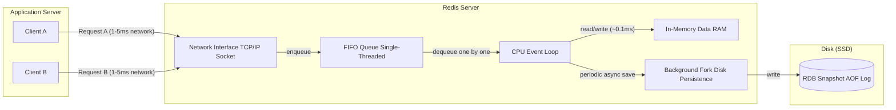
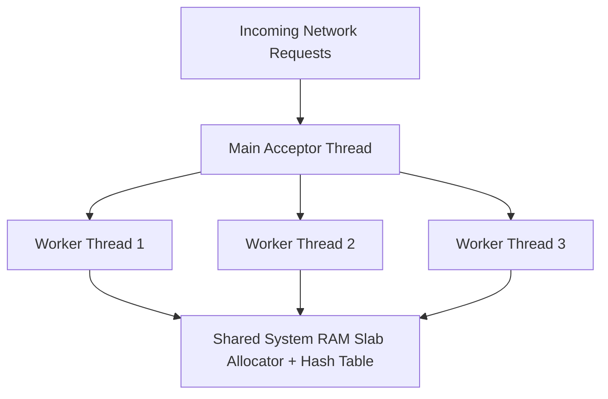
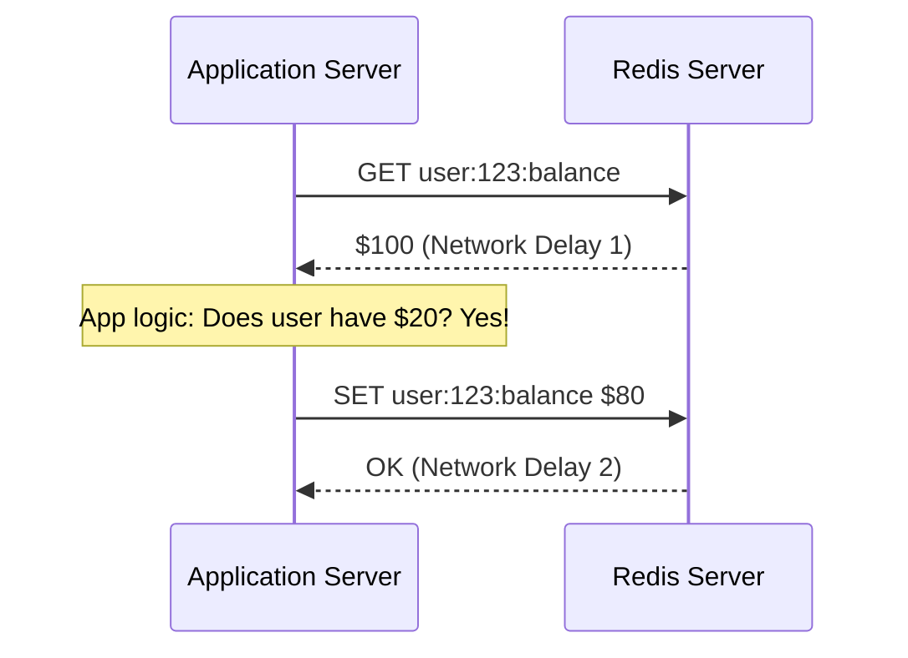
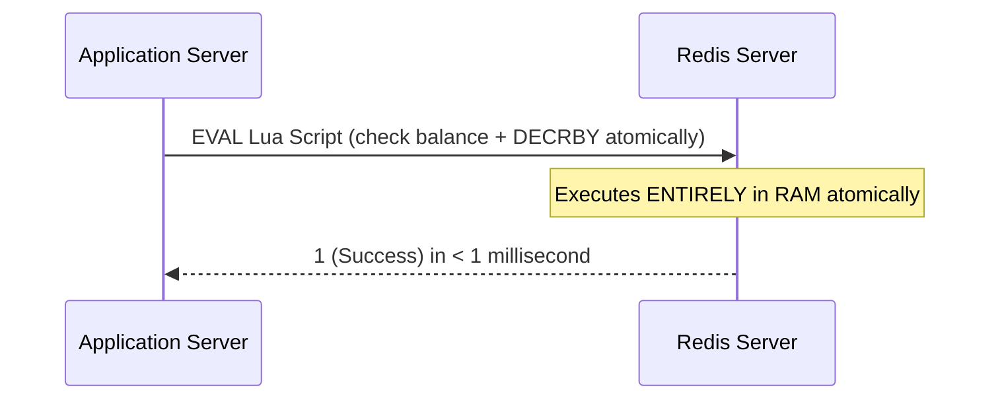
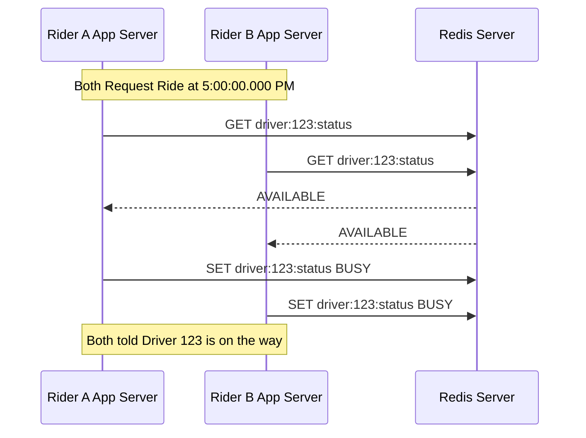
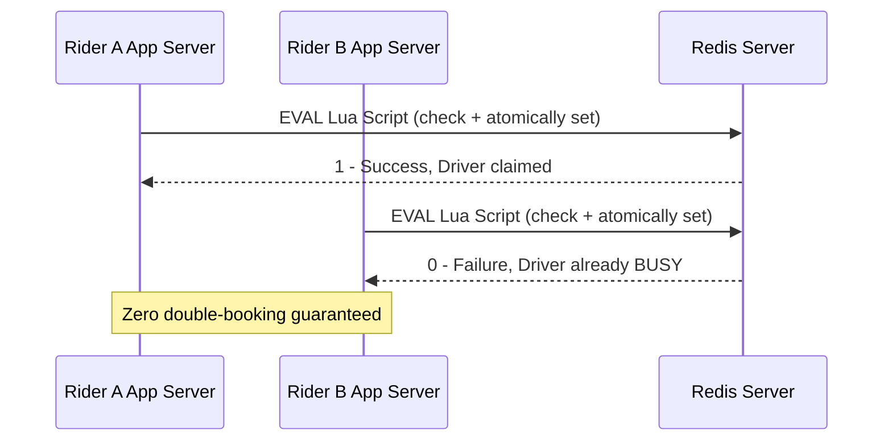
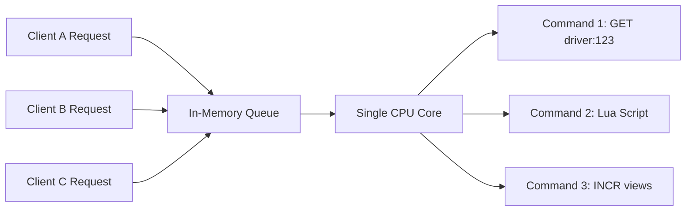
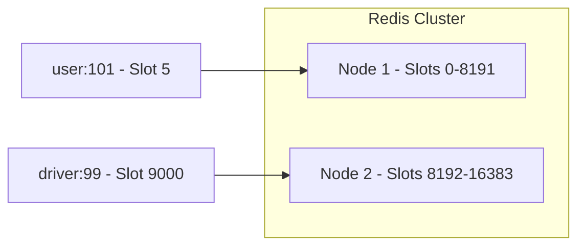

# Cache

## Locks vs. Atomic Operations: When to Use Which?

If 1,000 requests compete for a lock, 999 requests sit idle waiting for the lock holder to finish. This creates thread starvation and database timeouts.

- **Atomic Operation**: Single, lightning-fast CPU/Redis instruction that executes without interruption. No other process can read or modify the data midway through.
- **Distributed Lock**: A temporary "ownership tag" placed on a resource across multiple machines when a multi-step, slow, or external process must complete before anyone else touches that data.

**Decision Matrix: How to Choose**

| Use Case Scenario | Use Atomic Operation | Use Distributed Lock | Why? |
|---|---|---|---|
| Increment a view counter / balance | YES (INCRBY) | No | Single numeric mutation in Redis memory ($<1\text{ms}$). |
| Claim an available driver | YES (Lua Script) | No | Reading status + setting status happens inside Redis memory in sub-milliseconds. |
| Charge a credit card via Stripe | No | YES (SETNX) | Calling Stripe's API takes $500\text{ms}$ over the internet. You cannot hold Redis atomic operations during external network I/O. |
| Multi-database write across 3 services | No | YES | You need to lock the resource while multiple microservices complete slow SQL/HTTP steps. |

**Rule of Thumb**: If the entire state check and update happens 100% inside Redis RAM, use an Atomic Lua Script. If the process requires calling external APIs, slow SQL queries, or disk writes, use a Distributed Lock with a Time-To-Live (TTL).

## What is a Redis Lua Script?

Redis is single-threaded. It executes commands one by one in a FIFO queue (First In, First Out).

Normally, if your app runs two separate commands:

```
GET driver:status
SET driver:status "BUSY"
```

Another server can slip its own command right between step 1 and step 2, causing a race condition.

A Lua Script lets you package multiple logical steps into a single script that you send to Redis. Because Redis is single-threaded, Redis executes the entire Lua script atomically without stopping to let any other command execute in between.

## Redis Internals: Why It's So Fast

Understanding that Redis is primarily a CPU + RAM operation in memory is one of the most important concepts in system design.

Here is what happens under the hood when Redis executes a command or a Lua script:

**1. In-Memory Execution (RAM + CPU)**

- **No Disk I/O during execution**: Unlike traditional databases (like MySQL or PostgreSQL) that must read and write data to a disk drive (SSD/HDD), Redis stores 100% of its working data directly in RAM.
- **Zero Disk Bottlenecks**: Memory access speeds (RAM) are measured in nanoseconds, whereas disk read/write speeds are measured in milliseconds (100,000x slower).
- **Pure CPU Logic**: When a command or Lua script runs, the CPU modifies data structures (like HashMaps, SkipLists, or Sets) located directly inside RAM. This is why a simple Redis operation takes less than 1 millisecond.

**2. Single-Threaded Event Loop (No CPU Context Switching)**

- Redis handles incoming requests using a single-threaded CPU event loop.
- Because it is single-threaded, it handles requests sequentially (one after another).
- There are no thread locks, context switches, or race conditions inside the Redis engine itself.
- When you run an atomic operation or a Lua Script, the single CPU core executes your script from start to finish before moving to the next command in the queue.



**3. What About Network and Disk? (The 2 Exceptions)**

While data operations happen in RAM via the CPU, Redis still interacts with the network and disk in specific, controlled ways:

- **Network I/O (The Real Bottleneck)**: Before the CPU can run your operation, the data must travel over the network via TCP/IP from your app server to the Redis server. Network latency (e.g., 1ms to 5ms) is usually the slowest part of a Redis request, not the Redis CPU execution itself.
- **Disk Persistence (Asynchronous Background Thread)**: While Redis serves requests from RAM, it can periodically save data to disk (RDB snapshots or AOF logs) so data isn't lost if the server reboots. Redis offloads disk persistence to separate background process threads, ensuring that disk writes do not block the main CPU core from executing your real-time operations.

**Summary Checklist for System Design**

| Operation Type             | Where It Happens                   | Speed                                  |
| -------------------------- | ---------------------------------- | -------------------------------------- |
| Redis Command / Lua Script | CPU executing logic over RAM       | Sub-millisecond ($\sim 0.1\text{ ms}$) |
| Network Request to Redis   | Network Interface Card (NIC) / TCP | $1 - 5\text{ ms}$                      |
| Traditional SQL Query      | CPU reading/writing to SSD Disk    | $10 - 100\text{ ms}$                   |

## CPU Threads vs. RAM Memory

"Single-threaded" refers to how the Redis software uses your computer's CPU, not how RAM works. Here is a simple way to understand the difference between CPU threads and RAM memory:

**1. What is a CPU Thread vs. RAM Memory?**

Think of a computer like a kitchen:

- **The CPU is the Chef (Processor)**: The chef does the actual work (cooking, chopping, computing). A Single-Threaded system means there is only 1 chef in the kitchen working on orders one by one.
- **RAM is the Countertop (Memory)**: The countertop holds the ingredients (data). RAM is physical storage space. It doesn't "run" code or have threads; it holds data that the CPU reads from or writes to.

**2. How Redis Uses the CPU and RAM**

- **One CPU Core**: Redis uses 1 chef (1 CPU thread) to process all incoming data requests. It executes command #1, then command #2, then command #3 in a queue.
- **Shared RAM Access**: That single CPU thread reads from and writes to the computer's RAM. RAM can hold gigabytes of data across millions of memory addresses, and the CPU can jump anywhere in RAM instantly.

**3. Why Being Single-Threaded Makes Redis So Fast**

You might wonder: If having 8 or 16 CPU cores is faster for most applications, why would Redis use only 1 CPU core?

- **No Locking Needed**: If multiple CPU threads try to change the same memory location in RAM at the same time, they collide and corrupt the data. To prevent this, multi-threaded programs have to use locks, which slow things down.
- **No CPU Context Switching**: When a CPU switches between different threads, it loses time. A single thread running in a continuous loop avoids this overhead.
- **RAM is Already Fast**: Reading/writing to RAM takes nanoseconds. Because memory access is so fast, one CPU core can process over 100,000 requests per second without getting bottlenecked.

## Memcached vs. Redis: Multi-Threaded vs. Single-Threaded

Memcached takes the exact opposite approach to Redis when it comes to CPU threading. While classic Redis uses 1 single CPU thread to execute commands sequentially, Memcached is natively multi-threaded.

**1. The Multi-Threaded Architecture**

Memcached uses a worker thread pool (usually matching the number of CPU cores on the server, e.g., 4, 8, or 16 threads):



- **Main Thread**: Listens for incoming TCP connections and distributes client sockets to worker threads.
- **Worker Threads**: Multiple CPU cores process GET and SET commands in parallel simultaneously.
- **Internal Memory Locking**: Because multiple CPU threads are reading and writing to the same RAM space at the same time, Memcached uses fine-grained mutex locks internally inside its C code to prevent memory corruption.

**2. Memcached vs. Redis: Head-to-Head Comparison**

| Feature | Memcached | Redis |
|---|---|---|
| CPU Thread Model | Multi-threaded (Uses all available CPU cores) | Single-threaded for core command loop (Uses 1 CPU core) |
| Data Structures | Strings/Bytes only (Flat key-value cache) | Rich Data Types (Hashes, Lists, Sets, Sorted Sets, Geospatial/H3) |
| Scripting / Logic | None (Basic GET, SET, INCR, CAS) | Atomic Lua Scripts & Modules |
| Disk Persistence | ❌ No (Volatile cache only; rebooting wipes everything) | ✅ Yes (AOF logs & RDB snapshots) |
| Memory Allocation | Fixed Slab Allocator (Prevents RAM fragmentation) | Dynamic Memory Allocation |

**3. Why Would You Choose Memcached over Redis?**

Because Memcached is multi-threaded and simple, it excels in specific high-scale scenarios:

- **Scaling Up a Single Node (Vertical Scaling)**: If you give Memcached a 64-core, 256 GB RAM server, it will utilize all 64 CPU cores natively. A single Redis instance can only utilize 1 CPU core for its command loop (requiring you to run 64 separate Redis processes/shards on that same machine to achieve the same CPU utilization).
- **Pure, Simple Key-Value Caching**: Ideal for caching rendered HTML fragments, database SQL query results, or JSON blobs where you only need basic GET and SET operations.

**4. Why Has Redis Become More Popular for System Design?**

While Memcached handles simple string caching across multi-core CPUs, Redis is usually preferred in System Design interviews (like our Ride-Hailing example) for three reasons:

- **In-Memory Computations**: Redis can filter, sort, or modify data directly inside RAM (e.g., geospatial lookups, atomic set intersections). Memcached requires you to fetch the entire string over the network to your app server, modify it in application code, and write it back.
- **Atomic Logic & Lua**: Memcached lacks complex scripting or atomic multi-step execution tools like Redis Lua scripts.
- **Data Structures**: You cannot run Uber-style geospatial H3 indexing or leaderboards efficiently inside Memcached.

## Lua and Redis: The Embedded Scripting Engine

Lua is the embedded scripting engine that allows you to run custom, multi-step code directly inside Redis's memory with atomic, single-threaded execution.

Instead of sending multiple round-trip network requests from your app server to Redis, you send a single Lua script. Redis executes all the steps in that script in RAM without stopping or letting any other process interrupt it.

**Why Did Redis Embed Lua?**

Before Lua support was added (in Redis 2.6), if you wanted to read data, make a decision, and then write data to Redis, you had to perform multiple network round-trips:



Two Major Problems with this approach:

- **Network Latency**: You pay the network ping tax twice (or more).
- **Race Conditions**: Between step 1 and step 2, another app server could change `user:123:balance` (e.g., spending the money elsewhere). You get a double-spend bug unless you use heavy, slow distributed locks.

**How Lua Changes the Game**

With embedded Lua, you move the logic to the data, rather than bringing the data across the network to your logic:



**The 3 Big Benefits of Redis + Lua**

1. **Guaranteed Atomicity (No Race Conditions)**: Because Redis's core engine is single-threaded, when Redis runs a Lua script, it blocks all other incoming commands until the script finishes. No other client can read or write to the keys touched by your script midway through. You eliminate the need for complex distributed locks (SETNX or Redlock) for in-memory operations.

2. **Reduced Network Latency**: Instead of sending 5 or 10 separate commands back and forth over TCP/IP, you send 1 network request containing the script. Redis runs all 5-10 commands locally in RAM at CPU speed (nanoseconds) and returns the final result.

3. **Building Custom Atomic Operations**: Redis gives you basic primitives (INCR, HSET, ZADD). Lua lets you combine these primitives to create brand new, complex atomic database operations tailored to your business logic (like checking inventory before deducting a balance).

**Real-World Example: Rate Limiting**

Imagine you want to limit a user to max 5 requests per minute. The Lua Script sent to Redis:

```lua
-- KEYS[1]: "rate:user_9921"
-- ARGV[1]: Max limit (5)
-- ARGV[2]: Window TTL in seconds (60)

local current = redis.call("GET", KEYS[1])

if current and tonumber(current) >= tonumber(ARGV[1]) then
    return 0 -- Limit exceeded! Block request.
else
    redis.call("INCR", KEYS[1])
    if not current then
        redis.call("EXPIRE", KEYS[1], ARGV[2]) -- Set 60s TTL on first request
    end
    return 1 -- Allowed!
end
```

Because this runs inside Redis via Lua:

- Checking the count, incrementing it, and setting the key expiration happen as a single un-interruptible unit of work.
- It is impossible for two simultaneous requests to bypass the limit.

**How Redis Executes Lua (EVAL vs EVALSHA)**

To avoid sending the full script text over the network every time:

- **SCRIPT LOAD**: You send the script text to Redis once. Redis saves it in memory and gives you a SHA1 Hash (e.g., 438883e...).
- **EVALSHA**: For subsequent requests, your application sends the tiny 40-character SHA1 hash instead of the whole script string.

**Summary Rules to Remember for Interviews**

- Lua is the C-based scripting language embedded inside the Redis server binary.
- Redis + Lua = Atomic Execution in RAM.
- Never write slow or infinite loops in Redis Lua scripts. Because Redis is single-threaded while executing the script, a script that takes 5 seconds to run will freeze all other Redis operations for those 5 seconds! Keep Lua scripts tiny, fast, and sub-millisecond.

## Case Study: Ride-Hailing Double-Booking Prevention

We use a Redis Lua script to guarantee that two riders searching for a ride at the same millisecond never get matched to the same driver (Zero Double-Booking) without paying a heavy latency penalty.

**The Problem: The Simultaneous Tap Race Condition**

Imagine Rider A and Rider B both tap "Request Ride" in Downtown San Francisco at `5:00:00.000` PM. Driver 123 is available and nearby for both riders.

**Approach 1: Application-Level Logic (WITHOUT Lua Script)**

If your app server handles the checking and setting logic using standard Redis commands:



Outcome: Double-Booking Failure! Both riders are told "Driver 123 is on the way." Driver 123 receives two conflicting trip requests.

**Approach 2: Traditional Distributed Locks (SETNX or Redlock)**

To fix double-booking without Lua, developers often wrap the operation in a distributed lock:

1. Acquire lock on `lock:driver:123`.
2. Send network request to fetch `GET driver:123:status`.
3. If available, send network request to `SET driver:123:status "BUSY"`.
4. Release lock on `lock:driver:123`.

Outcome: Works functionally, but dramatically degrades performance. The Cost: You pay 4 separate network round-trips over TCP/IP (4 x 2ms = 8ms). At 500,000 location updates/sec, connection pools exhaust, latency spikes, and system throughput collapses.

**Approach 3: The Redis Lua Script Solution (Production Standard)**

Instead of sending 4 network commands back and forth, you package the check and assignment into 1 atomic Lua script executed directly in Redis RAM:

```lua
-- KEYS[1]: "driver:status:123"
-- ARGV[1]: "MATCHING"
-- ARGV[2]: "rider_456" (Rider ID)

local current_status = redis.call("GET", KEYS[1])

if current_status == "AVAILABLE" then
    redis.call("SET", KEYS[1], ARGV[1])
    redis.call("SET", "driver:match:123", ARGV[2])
    return 1 -- SUCCESS: Rider 456 gets the driver
else
    return 0 -- FAILURE: Driver already claimed
end
```



**Why the Lua Script Wins**

- **Absolute Consistency (100% Double-Booking Protection)**: Because Redis is single-threaded, it executes the entire Lua script from start to finish without interruption. When Rider A's Lua script runs, Rider B's request is held in the Redis command queue. Rider B's script runs milliseconds later, sees the status is no longer "AVAILABLE", and instantly fails.
- **Sub-Millisecond Execution (< 1ms)**: Because the script executes directly in RAM on the Redis server, there are no network hops between checking and setting.
- **Zero Distributed Lock Overhead**: You don't need complex distributed locking mechanisms, heartbeats, or lock expiration management.

## Distributed Atomicity: Single Node vs. Redis Cluster

To understand how atomic operations work in a distributed Redis environment, we need to separate two concepts:

- How atomicity works on a single Redis node (where the data lives).
- How atomicity works across a distributed, multi-node Redis cluster.

**1. Single-Node Atomicity: The Single-Threaded Event Loop**

At the hardware level, "atomic" means an operation happens as a single, indivisible unit of work. It either succeeds or fails. Nothing else can read or modify the data midway through.

Redis achieves this on a single node through its Single-Threaded Event Loop:



- **Sequential Queue**: Every incoming command (or Lua script) is placed in an in-memory queue.
- **Lock-Free Execution**: Redis picks up Command 1, executes it to completion, and then picks up Command 2.
- **No Interruption**: Because only one thread touches the RAM, it is physically impossible for Client B to modify driver:123 while Client A's command or Lua script is running. You get absolute thread safety without using software locks.

**2. Distributed Atomicity: How Redis Cluster Handles Scale**

When you scale Redis to a Distributed Cluster (across 10, 50, or 100 machines), data is split across nodes using Hash Slots (16,384 total slots).

Each key is mapped to a slot via CRC16 hashing:

```
Slot = CRC16(Key) mod 16384
```



This leads to two distinct scenarios for atomic operations in a distributed system:

**Scenario A: Single-Key Atomicity (Always Works Built-in)**

If your atomic operation or Lua script only touches one key (e.g., INCR user:101:balance or updating `driver:99:status`), the distributed cluster forwards the request to the exact single primary node that owns that key's hash slot. That node executes the command using its local single-threaded event loop. Single-key operations are always 100% atomic across the cluster.

**Scenario B: Multi-Key Atomicity and The Cross-Slot Error**

What happens if a Lua script needs to atomically update two keys (e.g., transfer money from `user:101` to `user:202`)?

If `user:101` lives on Node 1 and user:202 lives on Node 2, Redis cannot execute the Lua script atomically. A single-threaded Redis engine cannot reach across the network to lock memory on another server during a single execution step. If you attempt this, Redis throws a CROSSSLOT error.

**How to Achieve Multi-Key Atomicity in Distributed Redis**

To perform atomic operations across multiple keys in a distributed Redis cluster, engineers use two primary techniques:

**1. Hash Tags (Force Keys onto the Same Node)**

By wrapping a specific part of the key in curly braces {...}, you tell Redis Cluster to calculate the hash slot only for the text inside the braces.

- Key A: `user:{group_123}:balance`
- Key B: `user:{group_123}:discount_coupon`

Because both keys share `{group_123}`, Redis guarantees they map to the same Hash Slot and the same physical node. Now, a multi-key Lua script can run atomically over both keys without network hops.

**2. Distributed Locks (Redlock Algorithm for Multi-Node Systems)**

When keys must reside on different servers or datacenters, you must elevate atomicity from the database layer to the application distribution layer using Distributed Consensus Locks (such as Redlock).

```
Application Worker
   |
   +---> 1. Acquire Lock on Redis Node 1 (Success)
   +---> 2. Acquire Lock on Redis Node 2 (Success)
   +---> 3. Acquire Lock on Redis Node 3 (Success)
   |
   |  [ Majority (3/5) Locks Acquired within TTL ]
   |
   +---> 4. Perform Multi-Node Mutation
   +---> 5. Release All Locks
```

The client attempts to acquire a lock key (SET lock_key uuid NX PX 1000) across N independent Redis primary nodes (e.g., 5 nodes). If the client acquires the lock on a majority of nodes (> N/2, i.e., 3 out of 5) within a strict timeout, the distributed lock is granted. The application performs its business logic and releases the locks.

**Summary Checklist for System Design**

| Scale Scope                        | How Atomicity is Maintained                     | Cost / Latency                        |
| ---------------------------------- | ----------------------------------------------- | ------------------------------------- |
| Single Key on 1 Node               | Native Single-Threaded Event Loop (RAM)         | Sub-millisecond (~0.1 ms)             |
| Multi-Key on 1 Node (or Hash Tags) | Atomic Lua Script on the target node            | Sub-millisecond (~0.5 ms)             |
| Multi-Node / Multi-Cluster         | Distributed Locking (Redlock) or 2-Phase Commit | Higher latency (5-20 ms network hops) |
