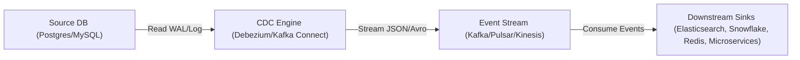
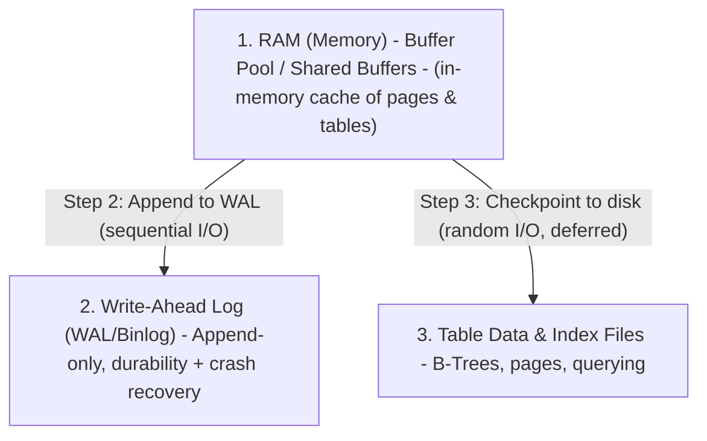
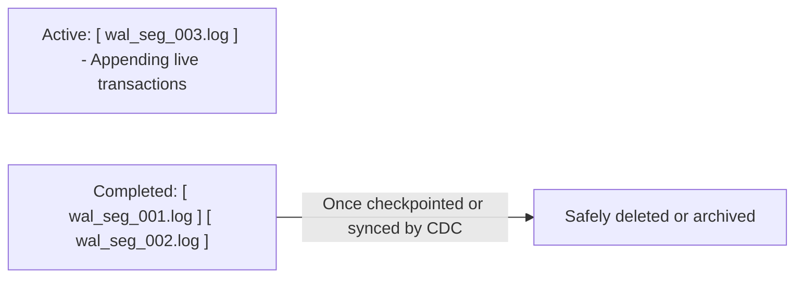
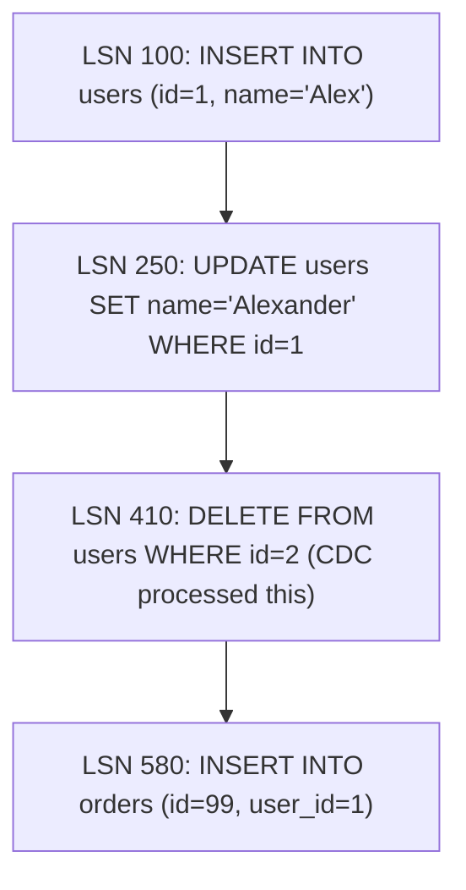
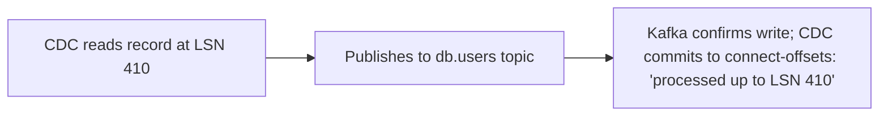
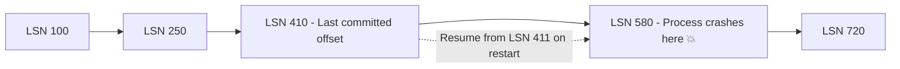
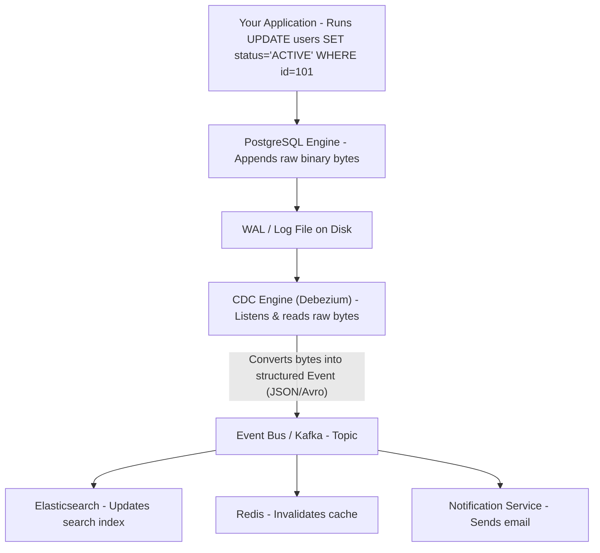

# Change Data Capture (CDC)

CDC (Change Data Capture) is a software architecture pattern used to track, capture, and stream row-level changes (e.g., INSERT, UPDATE, DELETE) from a source database to downstream targets (data warehouses, search indexes, event streaming platforms, or microservices) in near real-time.

Instead of performing expensive bulk extraction queries (like running `SELECT * WHERE updated_at > last_sync`), CDC taps into the database's internal change log to stream events as they happen without impacting database performance.

## High-Level CDC Architecture

In a modern event-driven architecture, CDC is typically implemented using three main components: the Source DB (Write-Ahead Log), the CDC Engine, and the Event Streaming Bus.



## Core Mechanics: Log-Based CDC vs. Query-Based CDC

There are two primary ways to capture changes from a database. In modern production systems, Log-Based CDC is the industry standard.

### A. Log-Based CDC (Industry Standard)

Every relational database maintains an internal, append-only log to ensure ACID compliance and allow crash recovery (e.g., WAL in PostgreSQL, Binlog in MySQL, Redo Log in Oracle). Whenever a transaction occurs, the database engine writes the raw change bytes to this log file before updating the actual tables on disk.

#### The 3 Core Storage Layers of a Database

A database like PostgreSQL or MySQL manages data across 3 distinct places:



**Step-by-step: What happens when you save data (INSERT)**

When you run an INSERT, UPDATE, or DELETE query, the database engine does not immediately write the changes to the main database tables on disk, because writing to structured table files (B-Trees, data pages) requires slow random disk I/O. Instead, imagine you run `INSERT INTO users (id, name) VALUES (1, 'Alex')`:

1. **Step 1 (RAM):** The database writes the row into its in-memory Buffer Pool in RAM.
2. **Step 2 (Disk - WAL Log):** The database immediately appends a record of this change to the WAL file on disk. Appending to the end of a log file uses sequential disk write, which is fast (even on old HDDs, and blazing fast on NVMe SSDs).
3. **Transaction Committed:** As soon as the WAL write hits the disk, the database tells your app: "Success! Data saved."
4. **Step 3 (Disk - Main Table):** The main table files on disk are NOT updated immediately. They are updated later in the background by a process called **Checkpointing**. Updating tables requires finding exact pages and writing to specific locations (random disk I/O), which is much slower, so the database defers this work to keep your queries fast.

**Why do we need BOTH the WAL and table files on disk?**

If both live on disk, why keep two separate formats?

| Storage File | Primary Purpose | Write Pattern |
| --- | --- | --- |
| Write-Ahead Log (WAL) | Durability & Crash Recovery: Ensures no data is lost if the server loses power or crashes. | Sequential Writes (append to end of file, fast) |
| Table Data & Indexes | Querying Efficiency: Formatted in B-Trees / Pages so `SELECT * WHERE id = 1` returns instantly without scanning the whole log. | Random Writes (modifying specific blocks on disk, slower) |

**What happens if power cuts out mid-operation?**

The data in RAM is wiped out, and the table files on disk might be outdated because the background checkpoint hadn't written to them yet. When the database boots back up, it opens the WAL file on disk, reads the recent transactions, and replays them into the table files. Zero data loss. This is why the Write-Ahead Log is the true "source of truth" for durability in relational databases.

#### Why Appending Is Fast: Sequential vs. Random I/O

The speed of appending to a log file comes down to hardware physics and Sequential I/O vs. Random I/O, rather than algorithmic complexity like O(1).

**1. Is it fast because it's O(1) appending?**

Yes, from a data structure perspective, appending is O(1). But memory and disk hardware are what make the speed difference noticeable:

- **On Spinning Hard Drives (HDD):** Random writes require a physical mechanical arm to move back and forth to find disk sectors (takes 5-10 milliseconds per operation). Sequential appending allows the disk head to stay in one place while the platter spins continuously beneath it (sub-millisecond).
- **On Solid State Drives (NVMe SSDs):** Even though SSDs have no moving parts, random updates force the SSD controller to perform expensive erase-and-rewrite cycles (garbage collection). Sequential writes allow the SSD controller to write clean continuous blocks with minimal flash translation layer (FTL) overhead.

**2. Is it LIFO, FIFO, or a Linked List?**

At the physical storage level, an append-only log (WAL) is structured like a Contiguous Array of Bytes / Segments, not a Linked List:


How it behaves in practice:

- **Writing behavior (Append-Only Queue):** New entries are added strictly at the end using an internal file offset pointer (similar to pushing to an array/queue).
- **Reading behavior for CDC (FIFO):** CDC engines (like Debezium) read the log chronologically from top to bottom, processing the oldest unread event first to ensure system updates occur in order.
- **Crash Recovery behavior (Sequential Replay / FIFO):** If the database crashes, it reads the WAL from the last committed checkpoint forward (FIFO) to restore memory state.

Why isn't it a Linked List? A linked list uses pointers (node.next -> node.next) stored across scattered memory or disk addresses. Traversing a linked list on disk requires random disk lookups, which would ruin the performance benefits of sequential logging. Instead, a WAL uses contiguous byte offsets where the next record starts where the previous record ends.

**3. How the log avoids filling up disk space**

Because a WAL is an append-only log file, it would eventually fill up the entire disk drive. Databases handle this through Log Segmentation & Archiving:



- The WAL is broken into smaller fixed-size file chunks (e.g., PostgreSQL uses 16MB segment files).
- Once the database flushes its in-memory tables to disk, older WAL segments are marked as safe to purge or recycle.
- CDC engines keep track of their position using a Log Sequence Number (LSN) or offset so they know which segment they are currently reading.

#### How Log-Based CDC Reads the WAL

- The CDC engine acts like a database replica. It connects to the database, requests replication access, and reads the raw byte-stream of the WAL/Binlog as new commits land.
- **Parsing:** It converts those binary log entries into structured event payloads (e.g., JSON or Avro).
- **Publishing:** It publishes those events to an event streaming platform (e.g., Apache Kafka).

#### How CDC Tracks Its Position (LSN / Offsets)

CDC engines track their progress down to the exact byte location inside the WAL file using a unique identifier called a **Log Sequence Number (LSN)** in PostgreSQL, or a **Log Position / GTID (Global Transaction ID)** in MySQL. This mechanism ensures that if the CDC engine crashes mid-process, it resumes without missing or reprocessing events.

**1. The Pointer: What is an LSN / Log Position?**

Every single byte written to a database's Write-Ahead Log is given an incremental 64-bit integer address. Think of the WAL file as a continuous tape marked with line numbers:



When the CDC engine (e.g., Debezium) reads the database log, it parses LSN 410, converts it into a JSON event, and sends it to Kafka.

**2. How the CDC Engine Tracks Its State (Offset Committing)**

To survive crashes, the CDC engine must persist its current LSN position to external storage. It does not write this back into the source database. If you are using Debezium with Kafka Connect, it saves its state in a dedicated, durable Kafka topic called `connect-offsets`:



The `connect-offsets` topic stores a state entry like:

```json
{ "connector": "postgres-db", "lsn": 410, "file": "001.log" }
```

**3. What Happens During a Crash?**

Imagine the CDC engine crashes while processing LSN 580:



The Recovery Sequence:

1. **Restart:** The CDC process restarts (e.g., Kubernetes boots up a new container).
2. **Fetch Offset:** The CDC engine connects to Kafka and asks: "Where did I leave off?" Kafka responds: "Your last saved position was LSN 410."
3. **Re-attach to DB:** The CDC engine opens a connection to the PostgreSQL database and requests: "Start streaming the WAL from LSN 410 onwards."
4. **Resume:** The database skips LSNs 100-410 and begins streaming immediately from LSN 411.

**4. Handling "At-Least-Once" Delivery & Duplicate Data**

Because committing the offset happens after sending the event to Kafka, a crash can occasionally lead to a scenario where LSN 580 was sent to Kafka, but the CDC engine crashed before updating its offset state to 580. When it recovers, it reads from LSN 410 again and re-sends LSN 580 to Kafka. This means CDC systems guarantee **"At-Least-Once" event delivery**, so downstream consumers (like your cache, search index, or microservices) must handle occasional duplicate events gracefully.

How downstream consumers handle duplicates (Idempotency):

- **Using Primary Key / Idempotent Writes:** In Elasticsearch or Redis, performing `SET user:1 {name: 'Alexander'}` 5 times yields the same result as doing it once.
- **LSN / Timestamp Comparison:** A consumer compares incoming LSNs: if `incoming_lsn <= last_processed_lsn`, discard it as a duplicate.

Why Log-Based CDC Wins:

- **Zero Performance Overhead on Tables:** It does not run SELECT queries on the database tables. It reads log files directly from disk/RAM.
- **Captures Hard Deletes:** If a row is deleted (`DELETE FROM users WHERE id=1`), the WAL records the deletion event.
- **Captures Intermediate States:** If a row is updated three times in 1 second, Log-Based CDC streams all 3 individual change events.

### B. Query-Based / Polling-Based CDC (Legacy/Fallback)

The application or an ETL tool periodically queries the source table (e.g., every 5 minutes):

```sql
SELECT * FROM orders WHERE updated_at > :last_poll_time;
```

Drawbacks:

- Misses deleted rows (a deleted row no longer exists to be queried).
- High query load/CPU spikes on the primary database.
- Loses intermediate updates between polling cycles.

## Structure of a CDC Event Payload

When the CDC engine (e.g., Debezium) converts a database commit from the transaction log into an event payload, it typically produces a JSON structure containing both the before and after state of the row:

```json
{
  "schema": { ... },
  "payload": {
    "before": {
      "id": 1021,
      "status": "PENDING",
      "amount": 99.50
    },
    "after": {
      "id": 1021,
      "status": "SHIPPED",
      "amount": 99.50
    },
    "source": {
      "version": "2.4.0.Final",
      "connector": "postgresql",
      "db": "production_db",
      "table": "orders",
      "lsn": 24891024,
      "ts_ms": 1723187357000
    },
    "op": "u",
    "ts_ms": 1723187357102
  }
}
```

- **op (Operation Type):** `"c"` (Create/Insert), `"u"` (Update), `"d"` (Delete), `"r"` (Read - initial snapshot).
- **before / after:** Shows the exact state mutation, making it easy for downstream consumers to compute delta changes.

## The Role of the Event in CDC

The database's internal log file (WAL / Binlog) is written in raw binary data that only the database engine understands. Downstream applications (like search engines or cache servers) cannot read it directly. This is where the CDC Engine (e.g., Debezium) and an Event Streaming Bus (e.g., Apache Kafka) come in:



The event plays three key roles:

- **Decoupling:** The database doesn't know or care who needs the data. It writes to its log.
- **Standardization:** The CDC engine translates database-specific binary bytes into a standardized, language-agnostic event (like JSON or Avro).
- **Broadcasting:** The event bus (Kafka) allows 10 different microservices to listen to the same change event independently without slowing down the primary database.

## Key Production Challenges & Patterns in CDC

Building a resilient CDC pipeline requires addressing several distributed systems challenges:

### A. Initial Snapshotting (Cold Start)

When you enable CDC on a legacy database with 500 million rows, the transaction log only contains recent changes. To bridge this, modern CDC engines perform an Initial Consistent Snapshot:

- The CDC engine locks the schema definitions temporarily or creates a repeatable read transaction.
- It dumps existing table records into the event stream tagged as `"op": "r"` (Read/Snapshot).
- Once complete, it seamlessly switches to tailing the live WAL/Binlog for ongoing updates (`"op": "u"`, `"op": "c"`).

### B. Ordering Guarantees

If an order's status changes PENDING -> PAID -> SHIPPED, downstream services must process events in exact chronological order.

Solution: CDC engines map the database Primary Key as the partition key in Kafka (`partition_key = order_id`). Because Kafka guarantees ordering within a single partition, all updates for a specific order land on the same partition and are processed strictly in order.

### C. Schema Evolution (Schema Drift)

What happens if a developer runs `ALTER TABLE orders ADD COLUMN discount DECIMAL`?

Solution: CDC frameworks integrate with a Schema Registry (e.g., Confluent Schema Registry). When the database schema changes, the CDC engine detects the DDL change, updates the Schema Registry, and writes events with the new schema version without breaking downstream consumer deserialization.

## Popular Open-Source & Enterprise CDC Tech Stack

| Component          | Standard Technologies                                                                                              |
| ------------------ | ------------------------------------------------------------------------------------------------------------------ |
| Source Databases   | PostgreSQL (WAL via pgoutput), MySQL (Binlog), MongoDB (Change Streams), Oracle (LogMiner), SQL Server (CDC Agent) |
| CDC Engines        | Debezium (the global open-source standard), Flink CDC, AWS DMS, Airbyte, Canal                                     |
| Event Bus / Buffer | Apache Kafka, Apache Pulsar, AWS Kinesis, Redpanda                                                                 |
| Downstream Sinks   | Snowflake, Elasticsearch/OpenSearch, Redis, Neo4j, Microservices                                                   |
