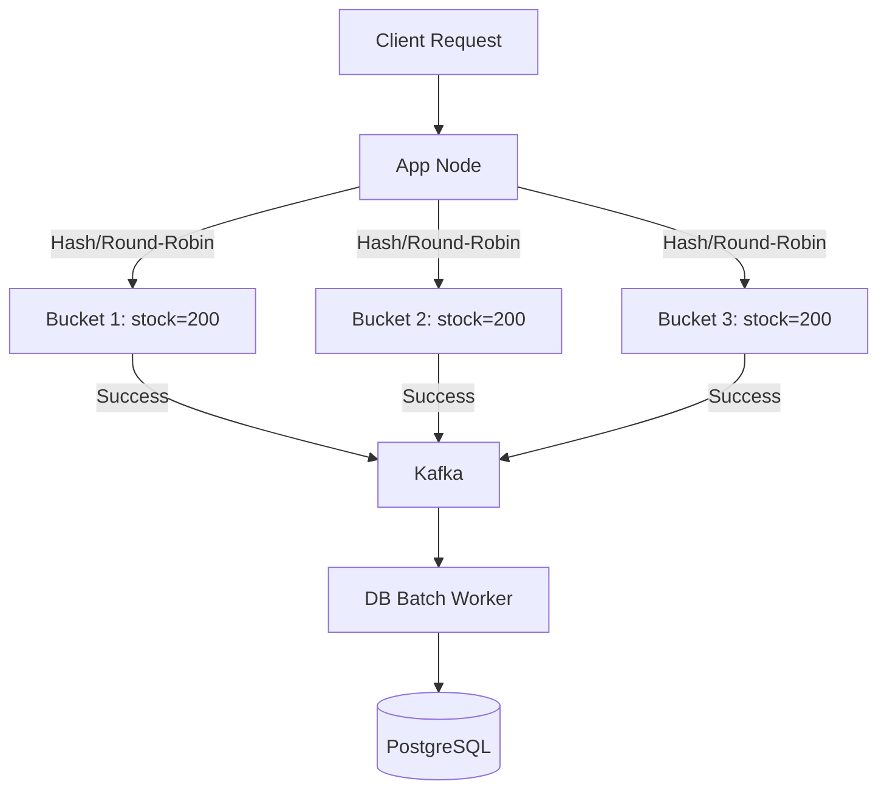

# Flash Sale System

## The Problem & Goals

### Problem
A limited-edition sneaker release or a highly discounted electronics sale. 100,000+ users land on a single product page and click "Buy Now" at the exact same second.

### Goals
* **Strict Business Accuracy:** Never oversell the item. If we have 1,000 units, exactly 1,000 orders must be created.
* **System Resilience:** Prevent cascading failures. Under extreme load, the API must remain responsive and fail gracefully.
* **Low Latency:** Keep checkout response times (p99) under **30ms** for the user's initial interaction.

---

## System Constraints

* **Peak Write Load:** 100,000 concurrent write attempts/sec targeting a *single* product ID.
* **Latency Target:** HTTP 202 Accepted returned in **< 30ms** (p99).
* **DB Persist Latency:** Actual writes catch up within **10 seconds** post-drop (100k orders / 10s = 10k inserts/sec → ~100 batch-commits/sec at batch size 100 → ~1 commit/connection/sec across a 100-connection pool, well within Postgres's per-connection throughput).
* **App Layer:** 10 stateless containers (2 vCPU / 4GB each), target ≤70% CPU, ≤60% memory.
* **Cache Layer:** 3-node Redis cluster (1 master, 2 replicas), master CPU ≤80%. Redis is single-threaded, so this is a hard wall.
* **Database Layer:** Single Postgres master (8 vCPU/32GB), connection pool capped at 100.

---

## High-Level Design

**Naive approach: single-key Redis DECR.** Run a Lua script that atomically checks stock and decrements one key (`inventory:product_42`), then queues the order for async DB write. Simple and fast (<2ms), but every write serializes through one key on one Redis thread, capping throughput at ~30k-50k ops/sec, well short of the 100k/sec requirement. Not viable as-is; the fix is sharding.

### Design: Inventory Sharding (Bucketing)

Split the item's stock across multiple Redis keys so writes spread across cores/nodes instead of bottlenecking on one.

**How it works:**
1. **Sharded keys:** 1,000 units split into 5 buckets of 200 (`product_42:bucket_1..5`), hashed across Redis cluster nodes for parallel CPU throughput.
2. **Per-bucket atomicity:** each bucket runs the same Lua script: dedupe check (`SETNX` on `checkout:{product_id}:{user_id}`), atomic decrement, and outbox write, all in one operation. The outbox write happening in the *same* atomic op as the decrement prevents inventory leaking if the app crashes between "decrement" and "publish"; a relay process tails the outbox to Kafka independently, and a periodic reconciliation sweep catches any gap.
3. **Cross-bucket dedupe:** because the same `user_id + product_id` dedupe key is checked before every bucket attempt, a retry that falls through to a second bucket after the first already succeeded is rejected, so there is no double-decrement across buckets.
4. **Fallback routing:** if a routed bucket is empty, retry against another bucket before returning "out of stock."
5. **Async persistence:** app returns HTTP 202 immediately; Kafka consumers batch-insert into Postgres (100+ rows/batch, `ON CONFLICT DO NOTHING`), client polls for confirmation.

**Trade-offs:** buys horizontal scalability (add buckets to scale past 100k/sec) and blast-radius isolation (one bucket's Redis node dying only locks a slice of inventory), at the cost of real complexity: empty-bucket routing, returning stock on cancellations, and reconstructing a global stock view all get harder than the single-key case.

---

## Room for Scalability

If load exceeds these targets: **rate limit at the edge** (API gateway, token bucket, fail fast with 429), **cache reads at the CDN** (product page detail + buy-button state, keep read traffic off origin entirely), and for extreme-demand events, **a virtual waiting room** to convert the traffic spike into a flat, controlled admission rate.
