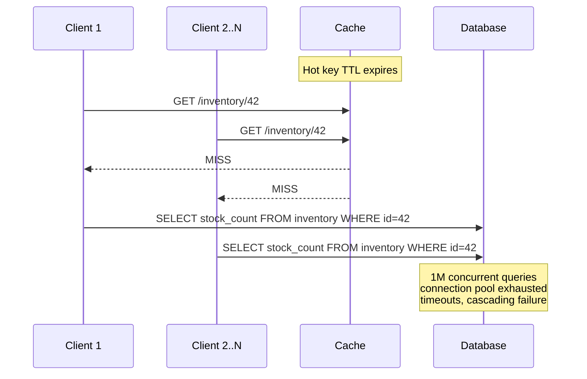
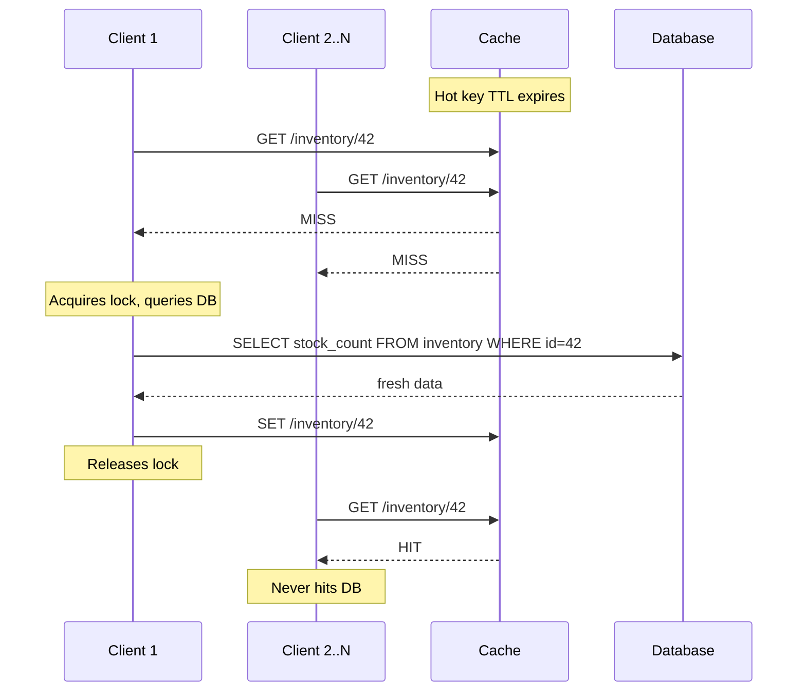
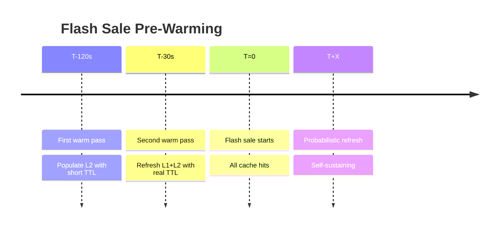

# Flash Sale

A flash sale is a short-duration event — typically a few minutes — where a limited number of items is sold at a steep discount. During those minutes, millions of people try to buy the same product at the same time. The system that handles this is suddenly asked to do millions of things in parallel, and unless it is designed for that burst, it slows down, errors out, or crashes entirely.

This document explains what makes flash sales hard and how to design a system that survives them.

**Audience:** Backend engineers building high-traffic systems. Familiarity with cache read/write patterns assumed.

## Scenario & Requirements

| Dimension | Value |
|-----------|-------|
| Concurrent users | 50M |
| Items on sale | 10,000 |
| Sale duration | 5 minutes |
| Traffic peak | 0 to 1M requests per second in <2s, all hitting one product |
| Database | Single-writer primary (no write scaling during sale) |
| Stale data tolerance | Up to 100ms of staleness is acceptable |

**What the system must guarantee:**

- Every user gets a response within 200ms (at the 99th percentile).
- The database never crashes or runs out of connections.
- If a user sees "10 left" and buys one, the next user must see "9 left" — not a stale count.
- No single component failure should bring down the whole read path.

## Cache Stampede

When the product's info expires from the cache, every concurrent request misses simultaneously. Each one issues its own database query, overwhelming the connection pool:



In a flash sale, this happens within milliseconds of the cache entry expiring. The database does not need to crash outright — it just needs to slow down enough that rebuilding the cache takes seconds. More timeouts trigger more retries, which make the database even slower. A positive feedback loop has begun.

## Mitigation Strategies

Each strategy prevents the storm in a different way. They are not mutually exclusive; a production system layers them.

### Request Coalescing (Locking)

Serialise cache recomputation so only one request hits the database:



The first request acquires a key-level mutex, queries the DB, and writes the fresh value. Subsequent requests block (or spin-wait) on the lock, then read the freshly cached value — zero DB hits.

```go
import "golang.org/x/sync/singleflight"

var sf singleflight.Group

func fetchInventory(id string) (int, error) {
 v, err, _ := sf.Do(id, func() (any, error) {
  stock, err := queryDB(id)
  if err != nil {
   return nil, err
  }
  cache.Set("inventory:"+id, stock, 5*time.Second)
  return stock, nil
 })
 return v.(int), err
}
```

**Caveats:** Blocking N-1 goroutines ties up resources. Under extreme concurrency (1M req/s), in-process locking serialises throughput to a single goroutine per key, creating a bottleneck. The solution is multi-tier caching (below).

### Probabilistic Early Expiration (Stay-Ahead)

Refresh the cache *before* the TTL expires, so the stale-but-valid value is never evicted:

```go
func shouldRefresh(ttl, remaining time.Duration) bool {
 return rand.Float64() < float64(ttl-remaining)/float64(ttl)
}
```

- Each request rolls a random check whose probability grows linearly from 0 (just refreshed) to 1 (at expiry).
- The "winner" refreshes early while the cache is still serving stale data to everyone else.
- Zero miss storms. Flat latency.

**Caveat:** Works best when the data is immutable or weakly consistent (product details, description). For flash sale inventory, where every read must show the latest count, stay-ahead alone cannot guarantee freshness — you still need a write-through or optimistic concurrency on the stock decrement path.

### Multi-Tier Cache

Place a fast in-process L1 cache (e.g., `sync.Map` with TTL) ahead of shared L2 (Redis). L1 absorbs the initial microburst before it reaches L2:

```
Request → L1 (sync.Map, TTL 1s) → L2 (Redis, TTL 5s) → DB
```

- 1M concurrent requests → 100k per process → L1 deduplicates to ~1 actual L2 lookup per process.
- Each process still uses request coalescing at the goroutine level, so even an L1 miss serialises to a single DB hit.
- Combined effect: 1M req/s translates to single-digit DB queries.

```go
type Cache struct {
 l1 *sync.Map // in-process: key → {value, expiry}
 l2 *redis.Client
}

func (c *Cache) Get(key string) (any, error) {
 if v, ok := c.l1.Load(key); ok {
  return v, nil
 }
 // L1 miss — check L2 (singleflight serialises per key)
 v, err, _ := sf.Do(key, func() (any, error) {
  val, err := c.l2.Get(key).Result()
  if err == redis.Nil {
   val, err = queryDB(key) // cold start
  }
  if err == nil {
   c.l1.Store(key, val)
  }
  return val, err
 })
 return v, err
}
```

**Caveat:** L1 consumes local memory. For a flash sale with one hot key, the overhead is negligible. For 10,000 hot products, budget ~100KB per process (key + 8-byte stock count).

### Pre-Warming Strategy

For scheduled events, populate the cache *before* traffic arrives:



- Background jobs at T-120s and T-30s write the hot key into L2 and L1.
- At T=0, every request hits L1. No misses, no DB queries.
- After the initial burst, probabilistic early expiry keeps the cycle going.
- Even if pre-warming misses its window (job crashes), request coalescing on the first real miss catches it — just with a ~100ms latency spike for that one request.

### Resilience & Fail-Safe

All strategies assume the cache and DB are available. When they are not:

- **Lock timeouts:** If the lock holder crashes or the DB is slow, release the lock after a timeout (e.g., 500ms) so others can retry.
- **Key-level capacity limit:** Cap waiters per key (e.g., 64). When the queue is full, return stale cached value with an `Age` header rather than blocking. Prevents OOM and gives the consumer visibility into freshness.
- **Circuit breaker on DB:** If the DB connection pool is at capacity, fail open — serve stale cache (or a configurable fallback value) and log. Do not queue requests; queuing under 1M req/s exhausts memory in milliseconds.
- **Stale fallback on L2 failure:** If Redis is unreachable, serve from L1 only (with possible staleness) or fall back to a read-only replica. Never fall through to the primary DB from every request.

## Putting It Together: Flash Sale Design

A production flash sale stacks all four strategies in a single read path:

```
                           ┌─────────────┐
 Client ──► L1 (sync.Map) ──► L2 (Redis) ──► DB
               │                │
               │  L1 hit        │  L2 miss
               ▼                ▼
           return           singleflight
                           serialises to
                           1 DB query
```

**Flow at T=0 (sale start):**

1. **Pre-warming (T-120s, T-30s):** Background workers populate L2 and L1 with the hot key's initial value. No client traffic yet.
2. **T=0, first 100ms:** 1M req/s arrive. Every request hits L1 (primed by pre-warming). L1 serves in <1µs. Zero L2 lookups, zero DB queries.
3. **L1 TTL expires (~1s later):** The first request to miss L1 goes to L2 (still hot from pre-warming). L1 is repopulated. Most requests still hit L1.
4. **L2 TTL approaches expiry (~5s):** Probabilistic early expiry triggers one process to refresh L2 before the key actually expires. No miss storm. L1 continues serving during the refresh.
5. **Recovery from pre-warm failure:** If the warm jobs crashed, the first real request for each key hits L1 miss → L2 miss → singleflight serialises a single DB query. One ~100ms latency spike, then the cache is hot.

**Write path (inventory decrement):**

- Writes go directly to the DB (the single-writer primary).
- After each successful decrement, invalidate the cache key (L1 + L2). The next read triggers a fresh fetch from DB.
- Because writes are infrequent relative to reads (~10M purchases in 5 minutes = ~33K writes/s vs 1M reads/s), the invalidation overhead is negligible.
- For higher write throughput, batch-decrement in Redis (decr) and flush to DB asynchronously — but that sacrifices read-after-write consistency.

**Goroutine pool sizing:**

- singleflight per key already serialises DB access. The goroutine pool for the L2 → DB path can be tiny: 10–20 workers.
- The L1 path needs no pool (in-process map lookup is non-blocking).
- Total goroutines across all processes: ~N_processes × 20. For 50 processes, ~1000 goroutines.

**Redis memory budget for the sale:**

- One hot key: `inventory:42` → 8-byte stock count = negligible.
- 10,000 product keys + metadata (name, price, image URL, stock): ~50 bytes per key → 500KB.
- Add L1 overhead: ~100KB per process × 50 processes = 5MB.
- Total: <10MB beyond baseline.

### Alternative: Single-Key Partitioning

If 1M req/s on one key is still too hot for Redis (single-threaded, ~100K–200K ops/s per shard), partition the hot key into N sub-keys:

```
inventory:42:shard-0
inventory:42:shard-1
...
inventory:42:shard-63
```

- Writes increment a random shard (or all shards, depending on consistency model).
- Reads sum all shards at query time.
- Pros: scales to arbitrarily high read throughput.
- Cons: stale reads (if not all shards are write-all), complex invalidation, write amplification.

For a flash sale where the inventory is a single counter that decrements, partitioning is hard to get right without overselling. Prefer the multi-tier + coalescing approach first; fall back to partitioning only if Redis becomes the bottleneck.

## Strategy Decision Matrix

| Strategy | Latency | DB Load | Complexity | Best For |
|----------|---------|---------|------------|----------|
| Request coalescing | +blocking | Low | Low | Moderate concurrency (<100K req/s) |
| Probabilistic early expiry | Low | Low | Medium | Weakly-consistent data, unpredictable traffic |
| Pre-warming + multi-tier | Low | None | High | Scheduled events with known hot keys |
| Single-key partitioning | Low | Varies | Very high | Extreme scale where Redis is bottleneck |

Pre-warming + multi-tier + coalescing together cover nearly all flash sale workloads. Add probabilistic early expiry for self-sustaining refresh. Avoid partitioning unless Redis itself is the bottleneck.

## References

- [Vattani et al., *Techniques to Reduce Cache Stampedes*](https://couchbase.com/blog/cache-stampede-paper)
- `golang.org/x/sync/singleflight` — [Go Docs](https://pkg.go.dev/golang.org/x/sync/singleflight)
- *Probabilistic Early Expiration* — [AWS Architecture Blog](https://aws.amazon.com/builders-library/caching-challenges-and-strategies/)
