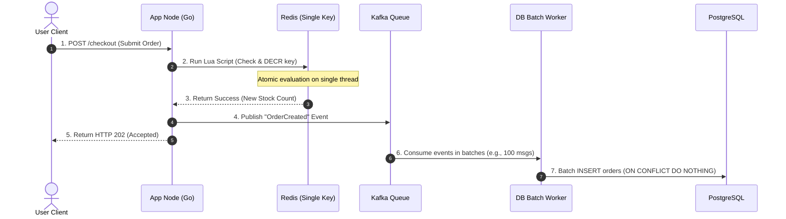
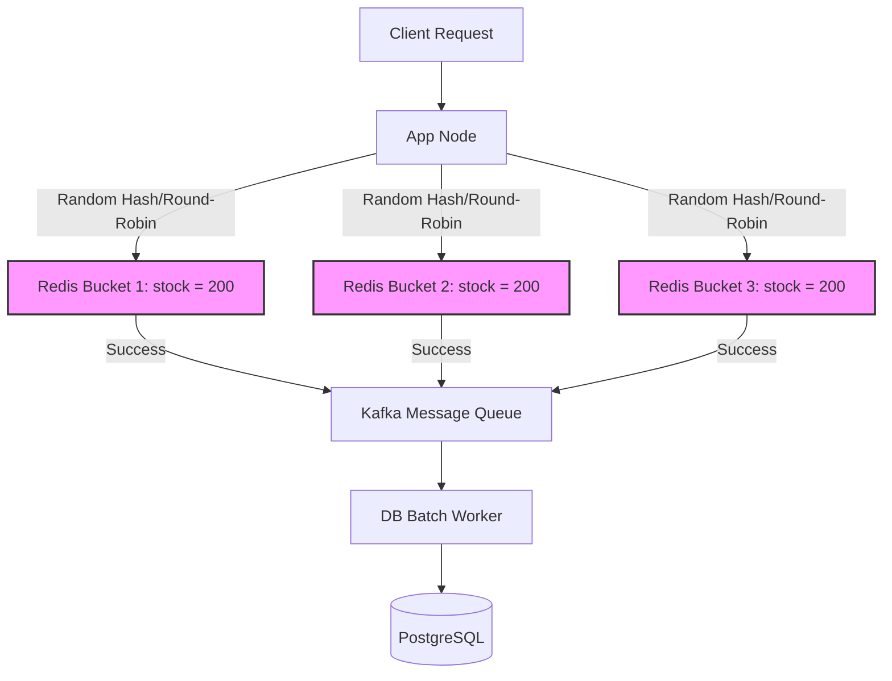

# Flash Sale System

## The Problem & Goals

### Problem
a limited-edition sneaker release or a highly discounted electronics sale. 100,000+ users land on a single product page and click "Buy Now" at the exact same second. 
### Goals
* **Strict Business Accuracy:** Never oversell the item. If we have 1,000 units, exactly 1,000 orders must be created.
* **System Resilience:** Prevent cascading failures. Under extreme load, the API must remain responsive and fail gracefully.
* **Low Latency:** Keep checkout response times (p99) under **50ms** for the user's initial interaction.

---

## System Constraints

### Traffic & Performance Targets
* **Peak Write Load:** 100,000 concurrent write attempts per second targeting a *single* product ID.
* **Latency Target:** Initial checkout response (HTTP 202 Accepted) returned in **< 30ms** (p99).
* **Database Persist Latency:** Actual database writes must catch up within **10 seconds** post-drop.
### Resource Constraints
* **Application Layer:** 10 stateless container instances (each allocated 2 vCPU, 4GB RAM).
  * *Target CPU Usage:* Max 70% under peak load to leave head-room for network I/O.
  * *Target Memory:* Max 60% (2.4GB) to prevent Out-Of-Memory (OOM) process restarts.
* **Cache Layer (Redis):** A single 3-node Redis cluster (1 Master, 2 Read Replicas). 
  * *Target CPU Usage:* Max 80% on the Master node. Since Redis is single-threaded, a single node's CPU is a hard wall.
* **Database Layer:** A single PostgreSQL master instance (8 vCPU, 32GB RAM). 
  * *Target Connection Pool:* Capped at 100 persistent connections to protect system memory.

---

## High-Level Design (HLD) & Trade-offs

We evaluate two architectural patterns to solve the hot-spot problem.

### Design Option 1: Single-Key Redis Decr + Asynchronous DB Queue

This design offloads write serialization from the disk-backed SQL database to an in-memory Redis instance.

#### How it Works
1. **Atomic In-Memory Decr:** The application runs a Lua script in Redis. Because Redis runs commands on a single thread, the Lua script safely checks if stock is available and decrements it atomically in a single operation.
2. **Decoupled Writes:** If Redis succeeds, the user has "reserved" their item. The app posts a message to a Kafka queue, returns an immediate **HTTP 202 (Accepted)**, and lets the client UI poll for the final order confirmation.
3. **Database Batching:** Background workers consume from Kafka and write to PostgreSQL in optimized batches of 100+ records, avoiding single-row lock contention.

#### Trade-offs

| Pros | Cons |
| :--- | :--- |
| **Simple Implementation:** Relies on standard Redis and Lua features. Very easy to maintain. | **Single-Threaded CPU Wall:** Because all writes hit *one* key (`inventory:product_42`), they must run on *one* Redis node. This limits maximum throughput to ~30k-50k operations/second. |
| **Excellent Latency:** In-memory operations return in <2ms, keeping application threads highly responsive. | **Eventual Consistency Lag:** Users must wait on a loading screen while background workers finish inserting their orders into the SQL DB. |

---

### Design Option 2: Inventory Sharding (Bucketing)

This design solves the Redis single-thread bottleneck by distributing the inventory of the hot item across multiple keys.

#### How it Works
1. **Sharded Keys:** If we have 1,000 items in stock, we split them into 5 buckets of 200 items each (`product_42:bucket_1` to `product_42:bucket_5`). 
2. **Cluster Distribution:** These buckets are hashed to different slots across the Redis cluster, utilizing multiple Redis nodes and CPU cores.
3. **Smart Routing:** The app randomly routes checkout requests to one of these buckets. If Bucket 1 is empty but Bucket 2 still has stock, a fallback mechanism routes the request to another bucket.

#### Trade-offs of Design Option 2

| Pros | Cons |
| :--- | :--- |
| **Horizontal Scalability:** We are no longer bottlenecked by a single Redis node's CPU. We can easily scale to 100k+ operations/second by adding more buckets. | **High Complexity:** Managing empty-bucket routing, returning inventory on canceled orders, and maintaining overall stock views becomes significantly harder to implement. |
| **No Single Point of Failure:** If a single Redis node crashes, only a portion of the inventory is temporarily locked. | **Uneven Distribution:** Some users might see "Out of Stock" if their routed bucket is empty, even if other buckets still contain items (mitigated by retry/fallback algorithms). |

---

## Room for Scalability

### 1. Ingress Rate Limiting & Load Shedding
When traffic exceeds our target constraints (e.g., more than 100,000 writes/sec), we must protect the system from crashing.
* **Implementation:** Deploy an API Gateway (like Kong or Envoy) configured with token-bucket rate limiting.
* **Action:** Instead of letting excessive traffic reach our app nodes, the gateway drops requests early, returning an immediate **HTTP 429 (Too Many Requests)**. This shields application memory and CPU from saturating.

### 2. Edge Caching & CDNs (L0 Cache)
We can offload almost 100% of read traffic (users refreshing the product page to see details and active/inactive status) away from our origin servers entirely.
* **Implementation:** Deploy a globally distributed Edge layer (like Cloudflare Workers or AWS CloudFront).
* **Action:** Cache static product details at the CDN edge. Use edge workers to dynamically change the buy button state (enabled/disabled) based on global flags, preventing invalid traffic from even reaching our load balancers.

### 3. Virtual Waiting Rooms (Queue-it)
For extreme-demand events, we can implement a traffic-smoothing gatekeeper.
* **Implementation:** Integrate a third-party waiting room platform.
* **Action:** Instead of letting 500,000 users hit our checkout endpoints at 12:00:00, the waiting room holds them in a FIFO queue on external servers. It lets users through to our checkout system in controlled batches (e.g., 5,000 users per second), transforming a traffic spike into a flat, predictable plateau.

## Where there are real correctness gaps

1. Option 1 doesn't actually satisfy your own stated peak requirement — this needs to be said explicitly, not left implicit.

Your constraints state 100,000 concurrent write attempts/sec. Option 1's own trade-off table says it caps at ~30k-50k ops/sec. That's not a "trade-off" to weigh against Option 2 — it's a disqualifying limitation: Option 1 alone cannot meet the stated peak load at all. Right now the doc presents these as two roughly equal alternatives with pros and cons; it should instead say plainly: "Option 1 fails to meet our 100k/sec requirement outright, so Option 2 (or a variant) is mandatory at this scale — Option 1 is only viable if peak load is meaningfully lower than the stated target." This is the same category of issue flagged in the PDF-service review — a design decision quietly contradicting a stated requirement instead of naming and reconciling it.

2. Missing idempotency protection at the Redis decrement step itself — this creates a silent under-sell bug.

The Lua script decrements stock atomically, but nothing dedupes by request or user. If a client's request times out on their end (but the server already succeeded), a client retry will run the Lua script again — decrementing stock a second time for what is logically the same purchase attempt. The DB's ON CONFLICT DO NOTHING only protects against duplicate rows, not duplicate decrements. The result: inventory shows sold out, but fewer than 1,000 real orders exist — a direct violation of your own goal, "if we have 1,000 units, exactly 1,000 orders must be created."

Fix: the Lua script needs an atomic guard keyed on something like user_id + product_id (a SETNX-style check) alongside the decrement, so retries are provably safe.

3. A crash between "Redis succeeds" and "Kafka publish" silently leaks inventory — and you already have the right pattern for this from an earlier design.

Look at step 3 → step 4 in the sequence diagram: if the app process dies after the Redis decrement succeeds but before the Kafka event publishes, that unit is gone forever — decremented, but with no order ever created and no way to recover it. Over enough failures, actual orders will land meaningfully below 1,000 even though all units show "sold." This is the exact class of problem the Transactional Outbox pattern (used correctly in your PDF-generation design earlier this session) was built to solve — decrement and publish need to be atomic, or at minimum reconciled via a periodic sweep for "decremented but no matching order" gaps.

4. Latency target is stated inconsistently.

Goals section: "p99 under 50ms." Constraints section: "< 30ms (p99)." These are two different numbers for what appears to be the same metric — worth reconciling into one authoritative target before this goes further.

5. The 10-second DB catch-up target is asserted, not derived.

100k orders persisted within 10 seconds implies ~10,000 inserts/sec sustained. With batches of 100, that's ~100 batch-commits/sec spread across a 100-connection pool — roughly 1 batch per connection per second, which is plausible for Postgres, but this arithmetic isn't shown anywhere in the doc. Given the connection pool was deliberately capped as a stated constraint, this is exactly the kind of number that should be derived and checked against the cap, the same estimation discipline flagged earlier in the session (peak-vs-average sizing in the scraping cluster), just showing up here in a lighter form.

6. Cross-bucket fallback (Option 2) isn't atomic, and this isn't addressed.

"If Bucket 1 is empty, fallback routes to Bucket 2" implies two separate Redis calls — the check-and-fallback sequence needs the same idempotency guard as point #2, or a retry during the fallback window could double-decrement across buckets for one logical request.