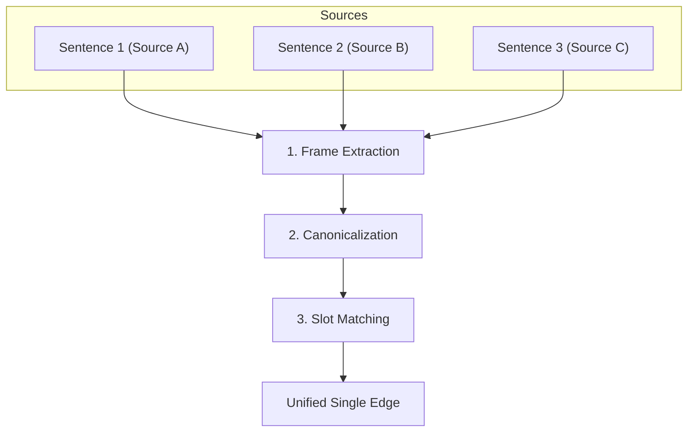
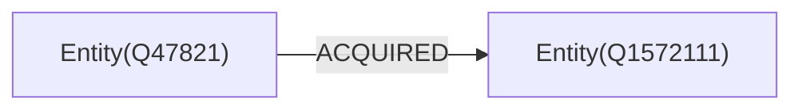
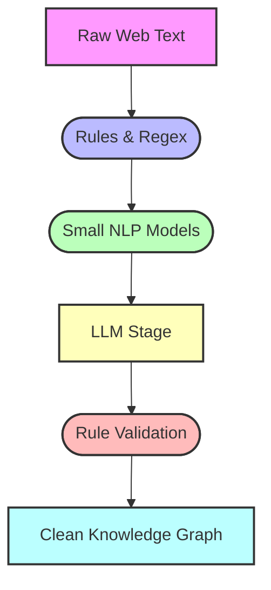
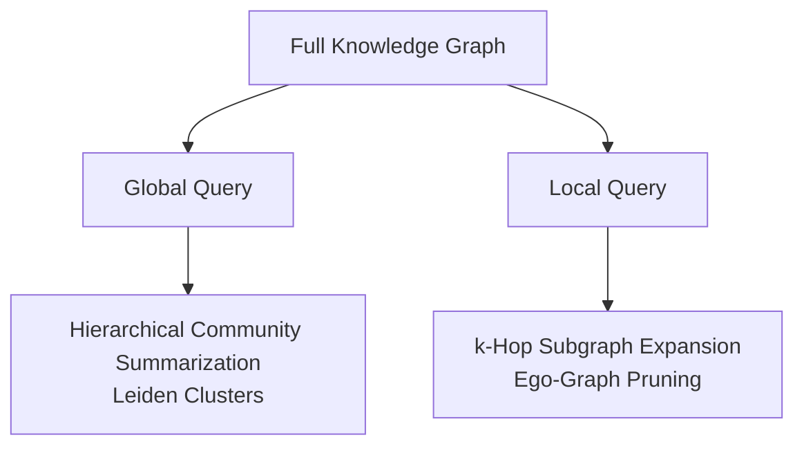
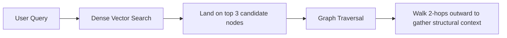

# Knowledge Graph

To build a graph that retains semantic clarity, modern graph architectures use four core engineering patterns to control entropy.

## Entity Resolution (ER) & Canonicalization

Without deduplication, the graph creates separate nodes for "Elon Musk", "Musk", "E. Musk", and "CEO of Tesla". This breaks path analysis because queries hit a dead end at one variation without traversing the rest.

**Named Entity Disambiguation (NED):** Incoming data must be resolved against a canonical entity index (using Wikidata URIs, global IDs, or vector embeddings).

**Node Merging:** When two nodes cross a similarity threshold based on context, aliases, and connected neighbors, they are merged into a single canonical node (e.g., Node: Elon Musk [ID: Q317521]). All incoming and outgoing edges redirect to this single master node.

## Ontology Enforcement & Edge Hierarchy

A graph where 90% of edges are generic RELATED_TO or MENTIONS loses its reasoning power. You cannot run "what-if" counterfactual simulations on an edge that doesn't specify the nature of the relationship.

**Strict Ontology Schemas:** Force relations into strict semantic categories ($Subject \xrightarrow{Predicate} Object$) defined by a predefined taxonomy:

- **Weak/Informational:** MENTIONS, LOCATED_IN
- **Structural/Ownership:** SUBSIDIARY_OF, INVESTED_IN, EMPLOYED_BY
- **Causal/Dynamic:** TRIGGERED, SUPPRESSED, ACCELERATED

**Relation Pruning & Reification:** Downgrade or suppress generic MENTIONS edges unless they are accompanied by a higher-order predicate. If "Company A mentions Company B," it remains ignored unless there is a specific action (e.g., FILED_LAWSUIT_AGAINST).

## Confidence Scoring & Provenance Weighting

Not all extracted statements carry equal factual or causal weight. An unverified tweet and an official SEC filing should not create edges with identical authority.

**Edge Attributes:** Every edge retains metadata properties:
- **confidence_score:** Probability assigned by the extraction model (0.0–1.0).
- **source_count:** How many independent sources verified this exact relationship.
- **timestamp / decay_rate:** How recent the edge is.

**Threshold Filtering:** Graph visualization and pathfinding algorithms dynamically filter out edges below a minimum confidence or source count threshold, automatically collapsing noise.

## Link Prediction (Bridging Disconnected Subgraphs)

When data is extracted from fragmented sources, two highly related clusters often sit side by side without a connecting edge simply because no single article explicitly stated their connection.

**Graph Embeddings (TransE, RotatE) & GNNs:** Machine learning models project nodes into vector spaces based on graph topology. If Node $A$ and Node $B$ share identical structural positions across separate subgraphs, link prediction algorithms propose a candidate edge with a probabilistic weight:

$$\text{Probability}(A \xrightarrow{\text{COLLABORATES\_WITH}} B) = \sigma(\mathbf{e}_A^T \mathbf{R} \mathbf{e}_B)$$

## How This Restores Meaning

| Problem in Raw Web Extraction | Architecture Fix | Impact on Your Cognitive Model |
|---|---|---|
| Duplicate Nodes ("Apple", "Apple Inc.") | Canonicalization & NED | Restores complete paths; no dead ends. |
| Trivial Noise (MENTIONS everywhere) | Ontology Schema Constraints | Keeps focus on high-leverage causal edges (CAUSES, ACQUIRED). |
| Unreliable Data | Edge Weights & Provenance | Allows filtering graph views by factual confidence. |
| Isolated Islands | Link Prediction & Graph Embeddings | Uncovers hidden, indirect "connect the dots" links across sources. |

By enforcing these constraints, the extracted graph transitions from a chaotic web of text snippets into a clean, operational map of real-world mechanics.

## Cross-Document Fact Coreference

Determining that three independent sentences from across the web describe the exact same real-world relationship is known as Cross-Document Fact Coreference (or Relation Consolidation).

Systems resolve this by converting unstructured text into structured relational frames, aligning their entities and predicates, and verifying that their contextual metadata matches.



### Frame Extraction (Deconstructing Text into Tuples)

First, an Information Extraction (IE) model breaks each sentence down into an N-ary tuple containing the core entities, the verb/relation, and modifiers:

Sentence 1 (News Site): "Tesla acquired SolarCity in an all-stock transaction in 2016."

→(Subj: Tesla,Pred: acquired,Obj: SolarCity,Time: 2016,Type: stock transaction)
Sentence 2 (Financial Report): "The EV manufacturer Tesla Motors finalized its buyout of SolarCity Corp."

→(Subj: Tesla Motors,Pred: buyout of,Obj: SolarCity Corp)
Sentence 3 (Tech Blog): "SolarCity was taken over by Tesla for $2.6B."

→(Subj: SolarCity,Pred: taken over by,Obj: Tesla,Amount: $2.6B)

### Entity & Predicate Canonicalization (Vocabulary Alignment)

Raw strings vary widely across independent sources. The system maps raw terms to single canonical IDs:

Entity Linking: Tesla, Tesla Motors, and EV manufacturer resolve to the single master entity ID Q47821 (Tesla, Inc.). SolarCity and SolarCity Corp resolve to Q1572111.

Relation Alignment (Ontology Mapping): The predicates "acquired", "buyout of", and "taken over by" are mapped to a single normalized relation type: ACQUIRED_BY or PURCHASED.

After canonicalization, all three sentences produce the identical core predicate structure:



### Slot & Attribute Matching (Verifying Reality Boundaries)

Just because two companies had an acquisition relation doesn't mean three sentences describe the same acquisition (e.g., Company A might have bought a subsidiary of Company B in 2010, and another in 2022).

The system checks Contextual Slots:

- **Temporal Overlap:** Do timestamps (2016) match or fit within the same timeframe window?
- **Numerical Alignment:** Do values ($2.6B, all-stock) reinforce or at least not contradict each other?
- **Directional Consistency:** Was Subject → Object active, or Object ← Subject passive?

If the slots align without logical contradictions, the confidence that these three sources refer to the exact same event approaches 100%.

### Vector Embedding Clustering (Semantic Coreference)

For complex or ambiguous sentences where rigid slot matching fails, systems use dense vector embeddings (such as cross-encoders or graph neural network embeddings).

The system projects the extracted relation tuples into a high-dimensional vector space:

$v_{\text{fact}} = \text{Encoder}(\text{Subject}, \text{Predicate}, \text{Object}, \text{Context})$

Sentences describing the exact same relationship form a dense cluster in vector space. Clustering algorithms (like HDBSCAN or cosine thresholding) group these vectors together into a single Fact Cluster.

### Edge Consolidation & Provenance Weighting

Once the system confirms all three sentences describe the same relationship, it does not create three duplicate lines in the database. Instead, it creates one single edge and attaches multi-source evidence (provenance) to it:

```json
{
  "source_node": "Tesla_Q47821",
  "target_node": "SolarCity_Q1572111",
  "relation": "ACQUIRED",
  "properties": {
    "year": 2016,
    "deal_size": "$2.6B",
    "deal_type": "all-stock"
  },
  "provenance": {
    "evidence_count": 3,
    "sources": ["news_site.com", "sec_filing.gov", "tech_blog.com"],
    "confidence_score": 0.98
  }
}
```

### Why This Prevents Graph Explosion

By using this pipeline, independent web sources don't create noise; they reinforce signal:

- **Duplicates become validation:** 3 sources saying the same thing increases the edge's confidence_score instead of cluttering the visual graph.
- **Partial facts merge into complete facts:** Source 1 provides the date, Source 2 provides the names, and Source 3 provides the amount. The graph synthesizes them into one complete, rich edge.

## The Three Layers of Knowledge Graph Extraction

| Layer | Technology | Primary Role | Strengths | Weaknesses |
|---|---|---|---|---|
| Predefined Rules & Ontologies | Regex, SHACL, OWL schemas, SPARQL constraints | Boundary Enforcement: Validating schemas, parsing numbers/dates, enforcing hard logic. | 100% deterministic, instant, zero compute cost. | Brittle; breaks if sentence structure changes slightly. |
| Specialized Small Models | SpaCy, BERT-based NER, OpenIE, Vector Embeddings | Bulk High-Throughput Extraction: Filtering text, tagging named entities, candidate matching. | Fast (thousands of docs/sec), cheap, predictable. | Struggles with nuanced, implicit context or multi-sentence logic. |
| Large Language Models (LLMs) | GPT-4o, Claude 3.5, Llama 3.3, DeepSeek | Complex Reasoning & Fusion: Disambiguating entities, canonicalizing triples, resolving edge conflicts. | Highly flexible, understands context, handles edge cases. | Expensive at scale, slower, potential for hallucination. |

## When Do You Need Predefined Rules?

You need predefined rules (or a predefined schema/ontology) for three critical tasks:

- **Schema Guardrails (Ontology):** Define what node types (e.g., Person, Company, Event) and relationship predicates are legal. Without a strict ontology rule, an LLM might invent 50 different variations for the same action (bought, purchased, acquired_majority_stake_in), breaking graph queries.
- **Deterministic Data Normalization:** Rules (like Regular Expressions) parse standardized data—timestamps (YYYY-MM-DD), monetary values ($2.6B → 2,600,000,000 USD), and legal IDs (tax numbers, stock tickers). Using an LLM for standard regex work wastes tokens and risks arithmetic errors.
- **Graph Integrity Checks:** Logical rules prevent invalid connections (e.g., a rule stating a Person cannot be a SUBSIDIARY_OF another Person). If an extraction model proposes an invalid triple, rule-based validation drops it before it enters the database.

## How a Modern Hybrid Pipeline Works in Practice

Instead of feeding millions of raw web pages straight into an LLM, production pipelines cascade data from cheapest to most expensive:



Why this approach works:

- **Cost Efficiency:** Small models and rules filter out 80% of the raw data noise at near-zero cost.
- **Accuracy:** LLMs spend their context windows strictly on the tricky 20%—resolving ambiguous names, inferring implicit relationships, and summarizing unified edges across multiple documents.
- **Safety:** Rule-based validation acts as the final gatekeeper, preventing LLM hallucinations from corrupting the graph database.

## End-to-End Knowledge Graph Frameworks (LLM + Hybrid)

These libraries orchestrate document chunking, LLM/NLP triple extraction, and database loading.

- **Microsoft GraphRAG:** An open-source data pipeline designed to extract entities, relationships, and claims from unstructured text using LLMs. It automatically builds community hierarchies and summarizes node clusters to synthesize high-level patterns across datasets.
- **LlamaIndex (PropertyGraphIndex):** A framework built specifically for Property Graph extraction. It supports Schema-Guided Extraction (enforcing allowed entities/relations), Dynamic Extraction (LLM-inferred), and hybrid querying combining vector search with graph traversals.
- **LangChain (LLMGraphTransformer):** A module that converts unstructured text into graph structures (nodes and edges with properties) and writes directly to databases like Neo4j or Memgraph.
- **ctxgraph / Graphiti:** Open-source context graph engines designed for AI agents. They track temporal entity-event relations efficiently using a combination of local lightweight models and graph storage.

## Ultra-Fast NLP Extraction (Small / Zero-Shot Models)

If you want to extract entities and relations at scale without paying high LLM API costs for every document, these specialized models perform zero-shot extraction in milliseconds:

- **GLiNER & GLiREL:** Open-source Python libraries for zero-shot Named Entity Recognition (GLiNER) and Relation Extraction (GLiREL). They allow you to pass arbitrary text and extract custom entity types (Person, Company, Event) and relational predicates (ACQUIRED, TRIGGERED_BY) using lightweight local transformer models.
- **DeepKE (Zhejiang University):** An open-source knowledge extraction toolkit for NER, Relation Extraction (RE), and Attribute Extraction supporting both standard text and multimodal data.
- **REBEL (Babelscape):** A sequence-to-sequence model fine-tuned specifically to translate raw sentences into standardized Subject-Predicate-Object triples.

## Entity Resolution & Deduplication Libraries

To solve the "graph entropy" problem (e.g., merging duplicate nodes like "Apple Inc." and "Apple"), these open-source libraries handle entity matching:

- **Zingg:** An open-source Python/Spark entity resolution framework designed specifically to deduplicate, link records, and merge canonical entities at scale using machine learning.
- **Splink (UK Ministry of Justice):** A fast, open-source Python library for probabilistic record linkage and entity resolution across large datasets.
- **Dedupe Python Library:** A machine-learning-driven Python library that uses fuzzy matching and active learning to resolve duplicate entities.

## Graph Databases & Storage Layer

- **Neo4j (Community Edition):** The standard open-source labeled property graph database, featuring the Cypher query language and plugins like APOC for text/schema manipulation.
- **Memgraph:** A fast, C++-based open-source property graph database fully compatible with Cypher and Python-native tooling (gqlalchemy).

## Recommended Tech Stack Combination

If you are building a side project to extract people/events and connect relational dots, combining these tools offers a balanced architecture:

| Pipeline Stage | Recommended Open-Source Tool | Why Use It |
|---|---|---|
| Pass 1: Fast Extraction | GLiNER + GLiREL | Cheaply extracts raw entities/relations from 80% of standard web text. |
| Pass 2: Complex Synthesis | LlamaIndex PropertyGraphIndex | Uses an LLM only on ambiguous text chunks to extract complex context and temporal slots. |
| Pass 3: Entity Resolution | Zingg or Splink | Deduplicates nodes across your web dataset before writing to disk. |
| Graph Storage & Queries | Neo4j or Memgraph | Stores the property graph and lets you write Cypher queries to navigate paths.

## Temporal Dynamics: Facts Have Expiration Dates (Temporal KGs)

In a static graph, an edge like (Person A) -[EMPLOYED_BY]-> (Company X) is either true or false. In reality, relationships are dynamic; they have birth, life, and death.

Without temporal modeling, your graph will assert contradictory facts simultaneously (e.g., Person A is CEO of Company X and Company Y, even though those roles happened 10 years apart).

To model reality accurately, production KGs use **Bi-Temporal Modeling**:

- **Valid Time (World Time):** The actual real-world timeframe when the fact was true (valid_from: 2012, valid_to: 2018).
- **Transaction Time (System Time):** The exact timestamp when your extraction system discovered and wrote the edge to the database.

Temporal knowledge graphs allow you to perform **Interpolation** (reconstructing what the network looked like on a specific date in history) and **Extrapolation/Forecasting** (predicting future edge formation based on historical cadences).

## Topological Intelligence: Graph Data Science (GDS)

You don't just extract information from what nodes say; you extract intelligence from the shape of the graph itself. Graph Data Science uses mathematical topology algorithms to surface hidden patterns:

**Centrality Metrics (Power Brokers & Bottlenecks):**

- **Betweenness Centrality:** Identifies nodes that bridge isolated subgraphs. If a single person or event has high betweenness, removing them completely severs communication between two groups.
- **PageRank / Eigenvector:** Identifies influential nodes based not just on how many links they have (Degree), but on how important their neighbors are.

**Community Detection (Leiden & Louvain Algorithms):** Algorithms automatically partition a graph of millions of nodes into densely connected "communities" or factions without human labeling. This reveals implicit leagues, syndicates, or hidden thematic clusters.

**Graph Embeddings (Node2Vec, FastRP):** Converts a node's structural neighborhood into a dense vector, allowing machine learning models to classify nodes or predict links based purely on topological position.

## Semantic Inference & Formal Reasoning (The Logic Layer)

You do not need an LLM or an extraction pipeline to explicitly extract every single connection. Formal KGs use Semantic Reasoners (Inference Engines using OWL/RDFS rules) to mathematically deduce unwritten edges:

- **Transitive Rules:** If $A \xrightarrow{\text{LOCATED\_IN}} B$ and $B \xrightarrow{\text{LOCATED\_IN}} C$, the reasoner automatically materializes $A \xrightarrow{\text{LOCATED\_IN}} C$.
- **Inverse Properties:** Defining parentOf automatically infers childOf in the reverse direction without doubling storage input.
- **Symmetric & Asymmetric Constraints:** Defining CO_FOUNDED_WITH as symmetric means an edge $A \rightarrow B$ implicitly creates $B \rightarrow A$.
- **Subsumption (Ontology Inheritance):** If TechStartup is defined as a subclass of Organization, any rule, property, or security permission applied to Organization automatically inherits down to every TechStartup node.

## Graph-RAG Architecture: Hierarchical Summarization

When you connect a Knowledge Graph to a downstream LLM or reasoning system, you face a scaling bottleneck: you cannot fit a 50,000-node graph into a context window. Modern GraphRAG architectures solve this through two sub-graph retrieval patterns:



**Hierarchical Community Summarization (Global Queries):** The graph is clustered into micro-communities, which are then clustered into macro-communities. Summaries are generated for each cluster, allowing an LLM to answer high-level questions ("What are the overarching trends across the dataset?") by reading top-level community reports instead of raw nodes.

**$k$-Hop Subgraph Extraction / Ego-Graphs (Local Queries):** When asking about a specific entity, the system extracts only that entity's immediate neighbors ($1$-hop) or neighbors-of-neighbors ($2$-hop), pruning away irrelevant branches to build a compact prompt context.

## Belief Revision & Knowledge Lifecycle

Real-world data is contradictory, messy, and constantly updating. A production graph must act as a **Truth Maintenance System (TMS)**:

- **Conflict Resolution Policies:** What happens when Source A asserts $Person A \xrightarrow{LIVES\_IN} City X$ and Source B asserts $Person A \xrightarrow{LIVES\_IN} City Y$? Systems handle this via Probabilistic Soft Logic (PSL), prioritizing higher source provenance scores, or maintaining both edges with competing belief weights.
- **Revocation & Edge Decay:** When a fact is proven false or outdated, deleting the edge isn't always enough. You must calculate downstream edge invalidation—if Edge $X$ is deleted, all facts that were inferred solely because Edge $X$ existed must also be revoked.

## Hypergraphs & N-ary Relations (Beyond Binary Edges)

Standard graph databases are binary: an edge connects exactly two nodes ($Node_A \xrightarrow{edge} Node_B$). However, real-world events often involve multi-entity contexts simultaneously:

"Person A used Tool B at Company C on Project D during Event E."

If you break this into multiple separate binary edges, you lose the atomic context of how those five things interacted together. Advanced graph architectures solve this via two approaches:

- **Reification:** Converting the relationship itself into a standalone "Context Node" that connects to all participating entities.
- **Hypergraphs:** Using mathematical hyperedges that can natively bind $N$ nodes together in a single hyper-relationship.

## Vector-Graph Fusion (Hybrid Search Engines)

Modern AI architectures no longer treat Vector Databases and Graph Databases as separate silos. They merge them into Graph-Vector Hybrid Engines:



Vector embeddings excel at fuzzy, semantic "landing" (finding where to start looking), while Knowledge Graphs excel at precise, deterministic "walking" (following explicit causal paths). Unifying them gives you both deep intuition and strict logical precision.

## Graph Neural Networks (GNNs) & Deep Geometric Learning

Classical Graph Data Science uses hardcoded formulas (like PageRank or Leiden clustering). Graph Neural Networks (GNNs)—such as GraphSAGE or Graph Attention Networks (GATs)—apply deep learning directly to graph structures.

- **Message Passing:** Nodes continuously pass feature vectors back and forth along their edges to their neighbors.
- **Inductive Learning:** A trained GNN can look at a brand-new, unseen node, analyze its surrounding graph topology, and instantly predict missing edges, classify entity types, or detect fraud/anomalies with high precision.

## Distributed Graph Sharding (The Engineering Scale Ceiling)

If your side project scales to billions of nodes and edges, you run into the hardest problem in database engineering: Graph Partitioning.

- Relational tables are easy to partition (e.g., puts Users 1–1,000,000 on Server A, and Users 1,000,001+ on Server B).
- Graphs are densely interconnected. If you cut a graph across multiple servers, a single query traversal might force thousands of slow network calls between servers ("cross-partition hops").

High-scale architectures use techniques like Vertex-Cut (duplicating high-degree "hub" nodes across servers) or Edge-Cut to minimize distributed query latency.

## Final Synthesis: The Complete Architecture

You now possess the entire blueprint:

$$\text{Human Cognition} \xrightarrow{\text{Top-Down/Causal}} \text{Hybrid Pipeline} \xrightarrow{\text{Extraction}} \text{Property Graph} \xrightarrow{\text{Reasoning/GDS}} \text{Emergent Intelligence}$$

- **Cognitive Model:** Top-down framing, counterfactual "what-ifs", first-principles reduction.
- **Data Extraction:** Rules + Small Models (GLiNER) + LLMs (LlamaIndex/GraphRAG) + Entity Resolution (Zingg).
- **Graph Structure:** Bipartite Event-Person topology, Labeled Property Graphs, Bi-Temporal metadata.
- **Graph Intelligence:** Community Detection (Leiden), Centrality (PageRank), Semantic Reasoners, Graph-Vector Fusion.

## The Cost, Latency, Speed & Accuracy Trade-Off Matrix

When building a Knowledge Graph extraction pipeline, no single engine excels at every metric. Systems manage this by matching each step to the appropriate model tier:

| Extraction Approach | Latency (per chunk) | Cost (per 1M tokens) | Entity & Relation Accuracy | Schema Adherence & Reliability | Best Suited For |
|---|---|---|---|---|---|
| Rule-Based / Regex / Named Entity Recognizers (SpaCy) | < 10 ms | ~$0.00 (CPU bound) | Moderate (High Precision, Low Recall) | 100% (Strictly deterministic) | Standard dates, monetary figures, stock tickers, strict canonical formats. |
| Specialized Zero-Shot Models (GLiNER / GLiREL) | 10–50 ms | ~$0.01 (Cheap GPU) | High on standard entities; moderate on complex relations. | High | Bulk high-volume extraction across millions of web pages. |
| Task Fine-Tuned Small Models (Llama-3-8B / Qwen-8B SFT) | 50–200 ms | ~$0.10–$0.30 | Very High on domain-specific extraction. | 98–99% | Repeatable extraction pipelines with predefined ontologies. |
| Frontier API LLMs (GPT-4o, Claude 3.5, Gemini 2.5) | 800–3,000 ms | $2.50–$15.00+ | Highest on open-ended reasoning & implicit relations. | 95–99% | Resolving ambiguous nodes, multi-document coreference, and complex edge synthesis. |

## Key Metrics to Benchmark Next

To evaluate your extraction pipeline, measure performance against these specific metrics:

**Extraction Accuracy (F1-Score):**

- **Entity Precision & Recall:** Did the system catch all real-world entities without inventing fake ones?
- **Relation Precision:** Did the model accurately assign the correct directed predicate ($A \xrightarrow{\text{CAUSES}} B$ vs $A \xrightarrow{\text{CORRELATES\_WITH}} B$)?

**Hallucination Rate:**

- **Property/Relation Hallucination:** How frequently does the model extract facts that do not exist in the source text?

**Entity Resolution Error Rate:**

- **False Positive Merges:** Merging two different entities into one node (e.g., merging two distinct people with identical names).
- **False Negative Merges:** Failing to merge duplicate references, leading to fragmented subgraphs.

**End-to-End Latency & Ingestion Throughput:**

- Measure how many document chunks are processed per second across the entire pipeline (extraction → resolution → database write).
