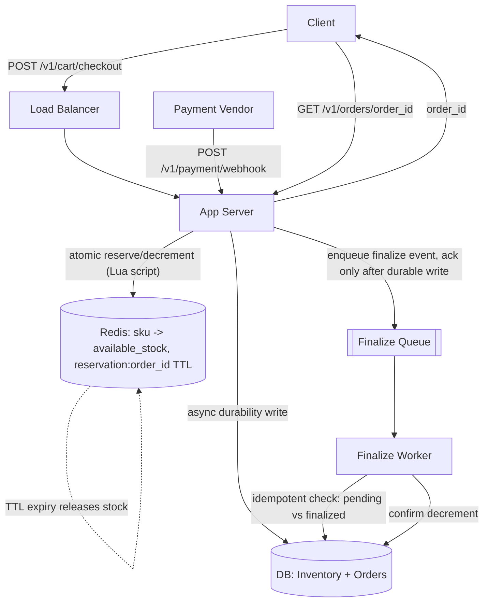

# E-commerce Order & Inventory System

## Scope & Requirements

### Functional Requirements
*  User can add products to a cart and place an order.
*  System reserves stock during checkout so two users can't both purchase the last unit.
*  System coordinates with an external payment vendor (not built in-house) to charge the user.
*  Search and the payment gateway itself are out of scope; only the coordination logic around payment is in scope.

### Non-Functional Requirements
*  **Availability/Consistency:** Strong consistency required specifically for inventory count and order state (no negative stock, no double-sell). Other data (order history views, etc.) can be eventually consistent.
*  **Latency:** Order placement end-to-end < 500ms p99.
*  **Scale:** ~2,000 orders/sec average, ~20,000/sec peak (e.g. flash sale/Black Friday).

---

## Capacity Estimation
*  **Order QPS:** 2,000/sec avg, 20,000/sec peak.
*  **Inventory check/decrement ops:** roughly matches order QPS, since each order touches at least one SKU's stock.
*  **Storage:** order + inventory records are small (structured rows), not a major sizing concern compared to the concurrency problem.
*  Bandwidth not a major factor: no media, small payloads per request.

---

## High-Level Design

### Core API Endpoints
*  `POST /v1/cart/checkout` -> Reserves stock for items in cart, returns a reservation/order_id.
*  `POST /v1/payment/webhook` -> Received from payment vendor when a charge succeeds or fails.
*  `GET /v1/orders/{order_id}` -> Returns order status.

### Data Model (abstract)
*  **Inventory (Redis):** `sku -> available_stock` (atomic counter, authoritative for live decrement).
*  **Inventory (DB):** durable record of stock, updated asynchronously from Redis, used as audit/recovery source.
*  **Reservation (Redis):** `reservation:{order_id}` with TTL (e.g. 10 min), tied to a decremented unit.
*  **Order (DB):** `order_id` (PK), `user_id`, `status` (pending / finalized / released), `created_at`.

### System Architecture
Client -> Load Balancer -> App Server -> Redis (atomic reserve/decrement, TTL-based reservation) -> async write to DB for durability. On payment webhook -> queue -> worker finalizes order (idempotent, checks order status before acting) -> decrement confirmed in DB.

---

## Deep Dive: Core Bottlenecks

**Deep Dive 1: Preventing overselling under concurrency**
- Naive approach (decrement inventory only after payment succeeds) doesn't prevent two users from both completing payment for the same last unit, since nothing blocks concurrent checkouts before payment.
- Fix: reserve stock atomically at checkout start, before payment, using a Redis atomic operation (e.g. a Lua script doing a conditional check-and-decrement), not a distributed lock, since a lock would serialize requests for hot SKUs at high throughput.
- Reservation has a TTL; if payment isn't completed in time, stock is released back automatically.
- Redis is treated as the authoritative source for live available stock; the DB is updated asynchronously for durability/audit. **Tradeoff**: if Redis loses recent writes before they reach the DB (e.g. crash), a small oversell window is possible. Verified this is a known, accepted real-world tradeoff (see: sellers commonly keeping a small stock buffer, and oversell being handled operationally via cancellation/refund rather than solved architecturally in some real systems).

**Deep Dive 2: Finalizing an order after payment succeeds**
- Payment vendor notifies via webhook. Webhook is acked only after the "finalize order" work is durably written to an internal queue, so a crash before full processing doesn't silently lose the event (vendor retries if not acked in time).
- Message queues are at-least-once, not exactly-once: the same finalize message can be delivered more than once (e.g. if a worker crashes after processing but before acking).
- Idempotency required: worker checks order status (`pending` vs `finalized`) via an atomic conditional update before applying the inventory decrement/order completion, so a duplicate delivery is a no-op rather than a double effect.

---

## Scaling & Trade-offs

*  **Single point of failure:** Redis, for live stock reservation. Mitigated with Redis persistence (AOF/RDB) and replica failover, similar to the approach used in the rate limiter design.
*  **Consistency tradeoff:** Chose Redis-as-source-of-truth with async DB sync for throughput, accepting a rare, bounded oversell risk rather than paying the latency cost of synchronous DB writes on every reservation.
*  **Open item:** tightening the Redis-DB sync window (fsync frequency, replica lag) and adding a reconciliation job to detect and correct drift between the two, rather than only relying on rare-case tolerance.