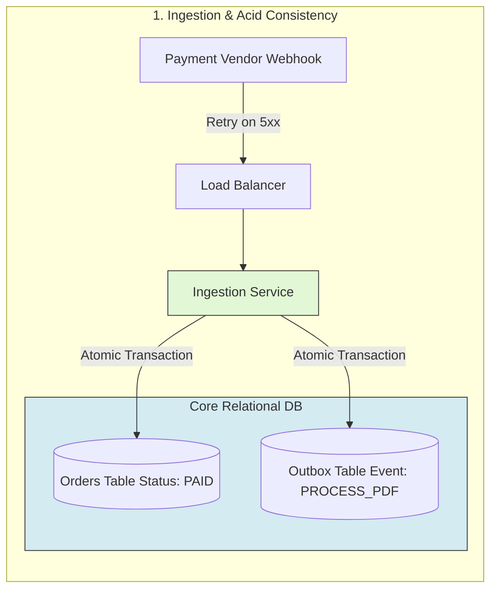
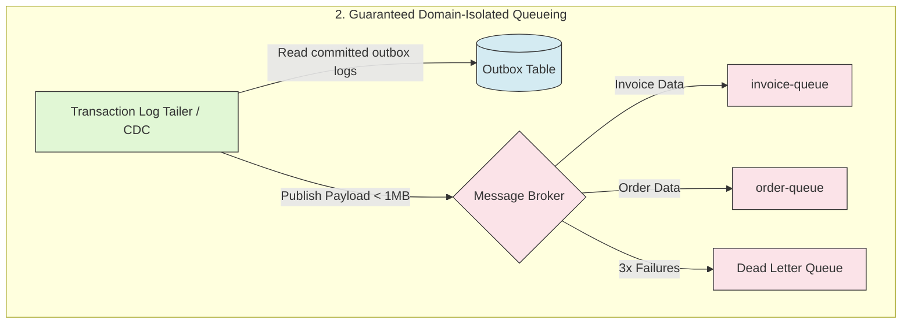
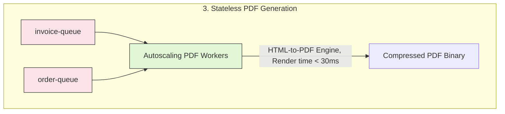
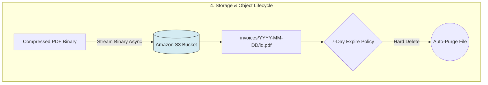
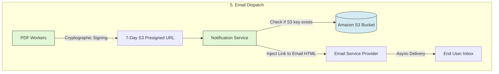

# PDF Generation Service

## System Requirements & Constraints

**Core Metric:** The system must reliably process **1,000 PDFs per second** at peak load without dropping events or degrading upstream checkout performance.

### Functional Requirements

- **Trigger:** Asynchronous execution immediately after a successful payment event.
- **Output:** Generate a standardized single-page A4 document (text structured layout + a compressed company logo).
- **Delivery:** Deliver the PDF directly to the user's email inbox.
- **Public Access:** Provide a public view link within the email that remains accessible for exactly **7 days** before automatically expiring.

### Non-Functional Requirements

- **High Availability & Fault Tolerance:** Microservice failures must not result in data loss or duplicate PDF generation.
- **Scalability:** Independent scaling of ingestion, processing, and delivery tiers.
- **Stateless Processing:** The eager render-and-email-attach workers require minimal dependencies and zero direct database connections. (The lazy-regeneration API tier introduced below is a deliberate, scoped exception — see [Improvement](#improvement).)

## High-Level Architecture & End-to-End Pipeline

The system uses an **Event-Driven Architecture (EDA)** paired with the **Transactional Outbox Pattern** to decouple the heavy compute layer from the critical path of the payment checkout flow.

### 1. Payment Ingestion & Webhook Handling

The Payment Vendor sends a `payment_success` webhook. The Ingestion Service captures this, logs the transaction status as `PAID`, and writes a `PROCESS_PDF` task into an append-only database outbox table within a single local transaction.

### 2. Domain-Isolated Message Queueing

A transaction log tailer polls the outbox table and streams the full data payload (all text primitives + logo asset URLs) directly into domain-specific message queues (e.g., `invoice-queue`, `order-queue`).

### 3. Stateless PDF Generation

An autoscaling pool of stateless workers consumes messages from the queues. Workers read the raw data payload directly from the message (&lt;1mb), compile the layout using an HTML-to-PDF template engine, and output the compressed binary.

### 4. Object Storage Upload & Lifecycle Policy

The worker streams the generated PDF binary directly to an Object Storage bucket (e.g., Amazon S3). The bucket is configured with a strict **7-day expiration lifecycle policy** to handle automatic data purging.

### 5. Cryptographic Link Tokenization & Email Delivery

The worker generates an **S3 Presigned URL** valid for 7 days. This URL is injected into the email template and passed to an asynchronous Notification Service to handle the final email dispatch.

## Component Deep Dive & Trade-offs

| **Component**         | **Design Choice**                       | **Operational Advantage**                                                                                                                 | **Trade-off / Mitigation**                                                                                     |
| --------------------- | --------------------------------------- | ----------------------------------------------------------------------------------------------------------------------------------------- | -------------------------------------------------------------------------------------------------------------- |
| **Data Ingestion**    | Payload-Driven Queue Messages           | Eliminates database lookups; workers receive everything they need inside the message broker payload.                                      | Slightly larger message size (~100 KB), easily handled by modern brokers like Kafka/RabbitMQ.                  |
| **Worker Processing** | Native HTML Engines + Idempotency Flags | Processing drops from 2s to &lt;30ms compared to heavy headless browsers. Database status flags prevent duplicate renders during retries. | HTML layouts must be strictly structured to ensure exact A4 page-boundary compilation.                         |
| **File Storage**      | Standard Object Storage (S3)            | Highly scalable, built-in high-availability, and native data purging via Lifecycle Policies.                                              | Requires a structured naming convention (`/invoices/YYYY-MM-DD/id.pdf`) to optimize S3 partitioning.           |
| **Link Security**     | Stateless S3 Presigned URLs             | Offloads 100% of download bandwidth and auth compute from our internal servers directly to the cloud provider.                            | Hard ceiling on expiration modification once the email is sent; links cannot easily be manually revoked early. |

## Failure Modes & Resiliency Strategy

- **Sudden Ingestion Crash:** If an ingestion instance dies mid-transaction, the payment vendor's native retry policy will hit a sibling instance via the Load Balancer. The system checks the database status flag to guarantee a task is never double-queued (idempotency).
- **Concurrent Retry Race:** Two retries of the same event can arrive at different workers at nearly the same instant, so a plain read-then-write status check is not enough — both could read `PENDING` before either writes `DONE`. The claim is made atomic instead: a unique constraint on `(order_id, status)` (or a `SETNX`-style compare-and-swap on a `claimed` key) means only one concurrent writer can transition the row from `PENDING` to `PROCESSING`; the loser's write fails and it discards its render instead of emitting a duplicate.
- **Poison Pill Messages:** If a corrupted layout payload causes a worker thread to crash repeatedly, the message is automatically moved to a **Dead Letter Queue (DLQ)** after 3 failed retries to avoid blocking the main processing pipeline.
- **Email Delivery Failure:** If the third-party email provider experiences a network drop, the Notification Service retries the event. The worker first checks if the PDF file already exists in S3; if it does, it skips regeneration entirely and goes straight to generating the presigned link.

---

## Bottlenecks & Cost

### The S3 Write Tax

AWS S3 charges 0.005 USD per 1,000 PUT requests. At 1,000 PDFs/second, that is 86.4 million PUT requests a day.

(86,400,000 / 1,000) × 0.005 = 432 USD per day just in S3 write API calls. That is approximately 13,000 USD a month completely wasted on writing temporary 7-day invoices to disk.

Do not generate and store the PDF for S3 immediately. Instead, stream the lightweight HTML data primitives directly to the Email Service Provider (like SendGrid/SES) which compiles the email layout on their dime. The "7-day public link" in the email points to a lazy-loading API gateway. Only if a user actually clicks that public link do we dynamically compile the PDF in 30ms and stream it to them. Because less than 10% of users actually click the public link, you instantly slash your cloud storage and API bill by 90%.

### The CPU Autoscaling Trap

If your downstream Email Service Provider starts throttling your requests, your workers will stall while waiting for network I/O. Their CPU usage will actually drop to near zero because they are just waiting on sockets. Kubernetes will see low CPU and start killing your workers, making the queue backup even worse.

Scale the worker pods based on Queue Lag (Message Backlog), not CPU or memory. If the queue size grows, spin up pods instantly, regardless of what the CPU is doing.

### The Upstream Schema Drift Problem

At 1,000 requests/second, you aren't the only engineer touching the system. The checkout team, the localization team, and the marketing team are all modifying the upstream data structures. If a developer on the checkout team renames a database column from `invoice_amount` to `total_price`, your stateless PDF worker will instantly start spitting out broken or blank PDFs at a rate of 1,000 failed jobs per second.

Use a Schema Registry (like Confluent Schema Registry using Apache Avro or Protobuf) onto message broker. The queue payload is strictly typed and versioned. If an upstream team tries to deploy a breaking change to the payment payload, the CI/CD pipeline or the schema registry will reject the event at the broker gate, protecting your production rendering engine from human error.

---

## Improvement

### Dropping Eager S3 Writes to Save Cost ("Lazy, Click-Triggered Generation")

Instead of rendering and uploading a PDF to S3 for every payment event, attach the PDF directly to the confirmation email (generated once, inline, at send time) so the common case never touches object storage at all. The "7-day public view link" in the email is not a pre-generated S3 object — it points at a lazy-loading API gateway route (`/view/{token}`) that only compiles a PDF on demand, the first time it's actually clicked. Since fewer than 10% of recipients click the link, this removes ~90% of the PUT-request volume calculated above.

This pivot relaxes the **Stateless Processing** requirement, but only for this one code path, and deliberately:

- The eager path (render → attach → email) stays exactly as stateless as originally designed: the worker gets everything it needs from the queue payload and never talks to a database.
- The lazy path (click → regenerate → serve) necessarily needs a data source, because the queue message that triggered the original render is long gone by the time someone clicks days later. It performs a single indexed point-lookup by `order_id` against the read replica of the Orders table — a much lighter dependency than a stateful worker pool, and one we accept explicitly as a trade-off for the cost savings, rather than leaving it as an unstated contradiction.

**Expiration, without S3's lifecycle policy:** S3 doesn't auto-delete anything here, because most PDFs are never saved to S3 in the first place — one is only made when someone clicks the link. So instead of deleting a file after 7 days, the system makes the *link itself* expire.

The link emailed to the user is `/view/{token}`, where `token` is a signed code that secretly holds the `order_id` and an expiry date (`sent_at + 7 days`). Every time someone clicks the link, the API gateway checks the code is genuine and checks whether the expiry date has passed. If it has, the request is rejected immediately with a 410 ("Gone") — no PDF is generated. No database write or cleanup job is needed to enforce the 7-day window; the link simply stops working on its own once it's past its expiry date.

**Interim storage cost check:** sometimes a PDF still does get saved to S3 — either because a hybrid mode is used, or because the click-triggered regen saves its output so a second click on the same link doesn't need to re-render. Does this bring back the storage cost problem? No, because S3 has two separate costs:

- **Writing a file** (the PUT cost from the section above) — charged per write, no matter the file size. This is what was costing $13k/month.
- **Storing a file** — a much smaller, separate charge, billed per GB kept in the bucket per month.

Even in the worst case — every saved PDF (50–150 KB each) sitting around for the full 7 days, at 1,000 saves/sec — the total amount of data sitting in S3 at any one time is only a few TB. Storing a few TB costs roughly tens to low hundreds of dollars a month, which is still tiny next to the $13k/month in write costs this design avoids.

### Headless Browsers

At 1,000 requests/second, spinning up Chromium tabs (Puppeteer/Playwright) will crash your servers due to memory leaks.

We are absolutely not using a headless browser like Puppeteer or Chromium at 1,000 requests/second. Managing browser contexts, tabs, and memory leaks at this scale is an operational nightmare. Instead, we are using a native, low-level binary compiled engine (like a Go-based PDF generator or a lightweight C++ HTML-to-PDF library). These don't boot up a browser; they parse HTML/CSS primitives directly into raw PDF byte streams in-memory, keeping CPU and memory usage flat.

Further reading on this browser-engine trade-off: https://chan179.com/pdf-generation