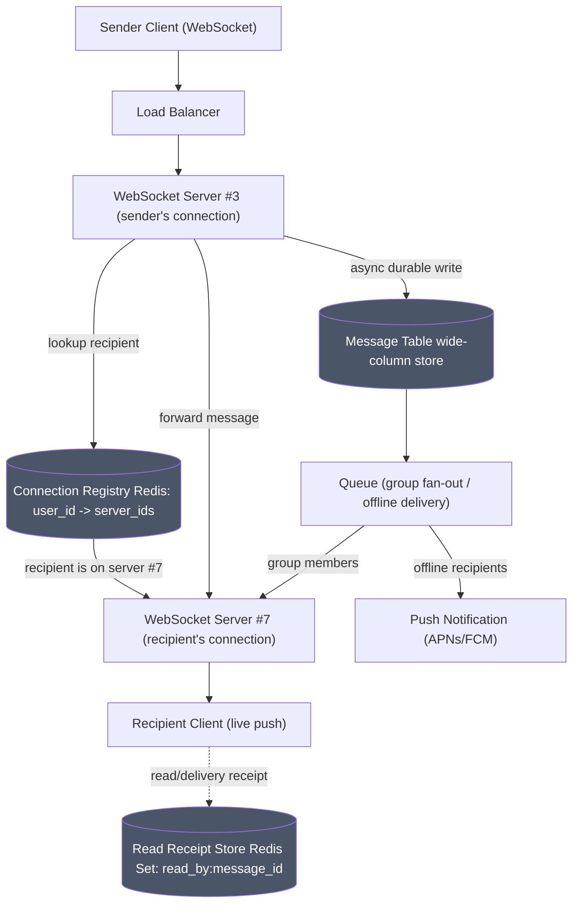

# Real-Time Chat App (WhatsApp-like)

## 1. Scope & Requirements

#### Functional Requirements

- User can send direct (1:1) messages to another user.
- User can create and send messages in group chats (up to ~500 members).
- User can send media (images/video) as message attachments (blob storage referenced by URL — not designed in depth).
- User can see delivery and read receipts per message (per-recipient granularity in groups).
- User can be logged in on multiple devices/sessions simultaneously and receive messages on all of them.
- Video/voice calling is explicitly **out of scope**.

#### Non-Functional Requirements

- **Availability/Consistency:** Eventual consistency is acceptable (not financial-grade data), but **message ordering within a conversation must be preserved** — no showing a reply before the message it replies to.
- **Latency:** Online-to-online message delivery < 100ms.
- **Scale:** 100M DAU, ~500,000 messages/sec average, ~2,000,000/sec peak.

---

## 2. Capacity Estimation

- **Write QPS (messages):** ~500K/sec avg, ~2M/sec peak.
- **Connections:** Up to 100M concurrent WebSocket connections at peak (multiplied further by multi-device sessions).
- **Storage:** Small text payload per message (~1-2KB with metadata) × 500K/sec ≈ manageable steady-state write volume for a wide-column store; media stored separately in blob storage, referenced by URL.
- **Read-receipt writes:** Not written per group member at send time (would cause write amplification) — only written lazily, one row per user, as each person actually reads a message.

---

## 3. High-Level Design

#### Core API / Interface

- WebSocket connection per active client session (persistent, bidirectional).
- `POST /v1/messages` -> durably accept a message (returns "sent" ack to sender).
- `GET /v1/messages?room_id=X&after=last_seen_message_id` -> fetch conversation history after a given point (not "before current time" — see Deep Dive 2).

#### Database Schema (Highly Abstract)

- **Room/Conversation Table:** `room_id` (PK) — shared by all participants (avoids each user storing only their own sent messages, which would force querying two places to reconstruct a conversation).
- **Message Table (wide-column store):** `room_id`, `message_id` (UUID), `sender_id`, `content`, `timestamp`.
- **Read Receipt Store (Redis Set):** `read_by:{message_id} -> {user_id_1, user_id_3, ...}` — cardinality of the set gives the "read by N of M" rollup cheaply; full set gives per-user detail on demand.
- **Connection Registry (Redis):** `connections:{user_id} -> {server_3, server_7, ...}` — tracks which WebSocket server instance(s) currently hold a user's live connection(s), supporting multi-device sessions.

#### System Architecture Map

Client (WebSocket) → Load Balancer → WebSocket Server instance → Connection Registry (Redis) lookup for recipient's server(s) → forward message to that server instance → push down recipient's live socket 

---

## 4. Deep Dive: Core Bottlenecks

**Deep Dive 1: Connection routing across WebSocket servers**  
A WebSocket connection is stateful and pinned to one specific server instance. When user A is connected to server #3 and user B (on server #7) sends A a message, server #7 needs to know _where_ A's live connection lives. Solved with a Redis-based connection registry (`user_id -> server_id(s)`), updated on connect/disconnect, looked up on every outbound message to route it to the correct server instance(s) — extended to a set (not single value) to support multi-device sessions.

**Deep Dive 2: Merging chat history with live messages**  
Naively fetching "history before current time" then subscribing to live messages leaves a race window: a message could arrive live while history is still being fetched, causing duplication or a silent gap. Fix:

- Dedupe by `message_id` (UUID, generated at creation) rather than timestamp, since timestamps aren't guaranteed unique.
- Track a **last-seen sequence marker per conversation** and fetch history as "everything after `last_seen_message_id`," not "everything before now." If a gap in sequence is detected between history and incoming live messages, trigger a targeted backfill for just the missing range.
- This same mechanism doubles as resilience against routing failures (Deep Dive 3) — if live delivery is delayed or dropped, the recipient still recovers the message on next reconnect/fetch via the backfill query, so failure degrades to latency, not data loss.

**Deep Dive 3: Group chat read receipts at scale**  
Real systems (per WhatsApp's public behavior) track granular per-recipient read state but only surface a simple aggregate ("read by all" vs not) in the main UI, computing the detailed per-person breakdown on demand rather than pushing live incremental updates for every read event. Modeled here as a Redis Set per message (`read_by:{message_id}`) — `SADD` is naturally idempotent, and `SCARD` against group member count gives the "all read" rollup cheaply without a separately-maintained counter that could drift out of sync.

---

## 5. Scaling & Trade-offs

- **Connection Registry (Redis) as a SPOF:** if it goes down, live routing breaks — but messages aren't lost, since they're durably written to the message store regardless; delivery just falls back to the history/backfill fetch path on reconnect (higher latency, not data loss). Mitigate further with Redis replication and considering a degraded fallback (e.g., push notification via APNs/FCM) to at least notify the recipient while live routing is impaired.
- **Read-receipt state loss:** if Redis holding `read_by` sets is lost, worst case is a message reverting from "read" to "delivered" in the UI until the recipient's client re-triggers the read event — self-healing, not permanent data loss.
- **Write amplification avoided:** read-receipt rows are written lazily (one per actual read event), not pre-created for all group members at send time — spreads cost over time instead of spiking it at send.
- **Open question for further scaling:** at very large group sizes (beyond ~500), per-recipient read tracking and live fan-out both become more expensive — would need to reassess whether full per-user read receipts remain worth maintaining, or whether large "channel"-style groups should drop granular read tracking entirely (as many large-scale broadcast-style chat systems do).