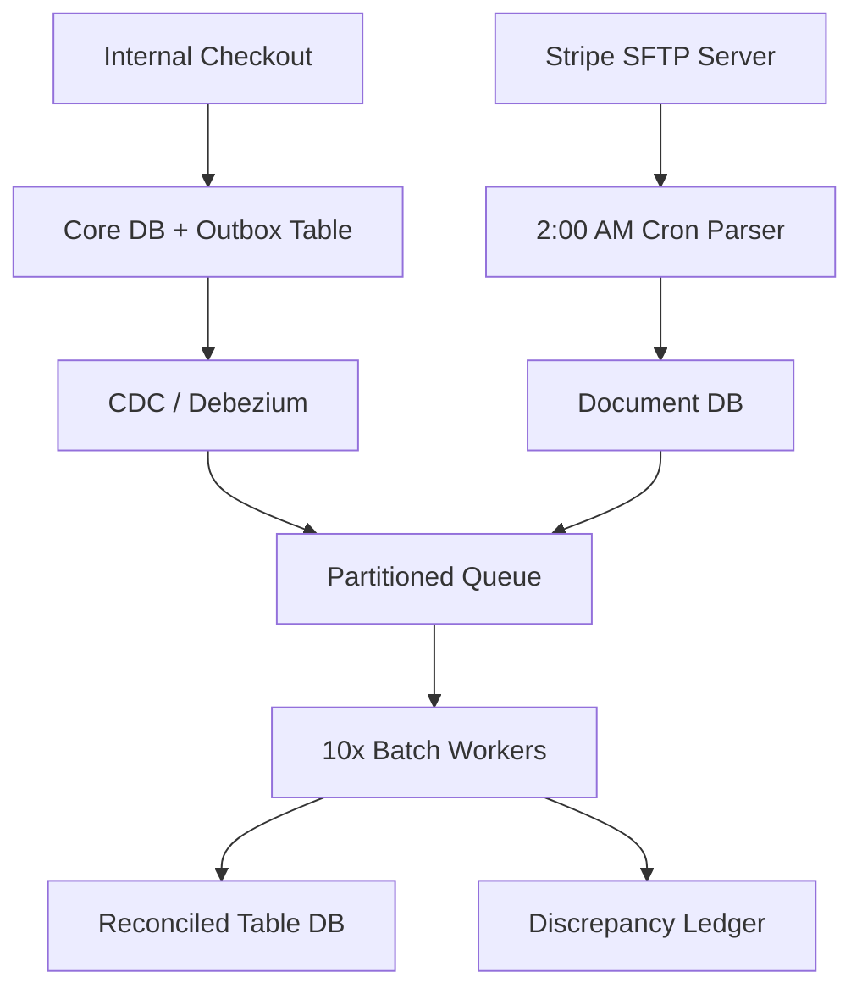
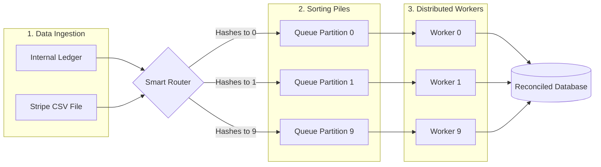
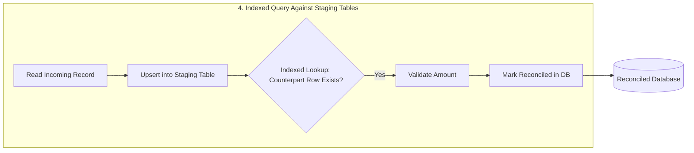

# Financial Reconciliation System

## Scope & Requirements

### Functional
- Ingest internal ledger data.
- Ingest external payment data (e.g., Stripe CSVs).
- Match transactions by ID.
- Flag and handle mismatches.
### Non-Functional
- **Scale:** 10 Million transactions per day.
- **Accuracy:** Strict financial consistency (no dropped data).
- **Latency:** Batch/offline processing (doesn't need to be real-time).

---

## Capacity Estimation (Back-of-the-Envelope Math)

- **Data Size:** Assume 1 record (internal ledger event or external CSV row) = 1 KB.
- **Daily Storage:**
  - Internal: 10,000,000 records × 1 KB = 10 GB / day.
  - External: 10,000,000 records × 1 KB = 10 GB / day.
  - Total Daily Raw Ingestion: 20 GB / day.
- **Throughput Rate (Flat Execution):** Spreading the 10M daily external transactions flatly across a controlled 24-hour ingestion window yields:
  $\approx 116 \text{ records/sec}$
  $\approx 116 \text{ KB/sec}$ inbound network bandwidth.

---

## High-Level

### Core API & Event Endpoints

- `POST /v1/internal-events` -> Internal webhook pipeline to push transaction updates to the messaging layer via CDC (Change Data Capture).
- `SFTP Pull Event (Cron-triggered)` -> Batch job reads from `/settlements/stripe/YYYY-MM-DD.csv`.

### Database Schema

```sql
-- Operational DB (Protected via Outbox Pattern)
CREATE TABLE transaction_outbox (
    event_id UUID PRIMARY KEY,
    transaction_id VARCHAR(64) NOT NULL,
    amount DECIMAL(18, 4),
    currency VARCHAR(3),
    status VARCHAR(20),
    created_at TIMESTAMP
);

-- Reconciliation Staging & Audit DB
CREATE TABLE external_stripe_staging (
    stripe_tx_id VARCHAR(64) PRIMARY KEY,
    amount DECIMAL(18, 4),
    settled_at TIMESTAMP,
    raw_payload JSONB
);

CREATE TABLE discrepancy_ledger (
    audit_id UUID PRIMARY KEY,
    transaction_id VARCHAR(64),
    expected_amount DECIMAL(18, 4),
    actual_amount DECIMAL(18, 4),
    variance DECIMAL(18, 4),
    error_type VARCHAR(50), -- 'AMOUNT_MISMATCH', 'MISSING_EXTERNAL', 'MISSING_INTERNAL'
    resolved BOOLEAN DEFAULT FALSE
);
```

### System Architecture Map



---
	
## Deep Dive: Core Bottlenecks

### Hash-Based Partitioning & Data Shuffling



To reconcile millions of rows without blowing up memory on any single machine, we partition work by hash instead of letting one process try to hold everything.

Internal data streams in live all day; Stripe's data lands once a night. Both get fed into a router that splits the combined workload across multiple workers.

The router keys each message on `transaction_id` and applies `hash(transaction_id) % 10` to both streams. That guarantees the internal ledger event and the matching Stripe record always land in the same partition, no matter which one arrives first.

Each partition has one worker, but the worker doesn't keep records in memory. Internal records can wait up to ~17 hours for their Stripe match (see Capacity Estimation), and a full day of unmatched records adds up to ~10 GB. That's too much for one process's RAM, and a crash would lose it all anyway. So both streams write straight to disk instead, into staging tables (`transaction_outbox` / `external_stripe_staging`, indexed on `transaction_id`). Matching is a lookup: grab a record from one table, check if its counterpart exists in the other. Since everything lives on disk, a worker crash loses nothing. It restarts and keeps querying the same partition where it left off.



### Resiliency & The Exception Pipeline

In financial systems, dropping or blocking execution loops over data anomalies introduces extreme operational risk. Our architecture separates automated stream matching from human auditing loops to guarantee uninterrupted batch execution.

**The Missing Record Trap (internal exists, Stripe missing):** If an internal record exists but the Stripe record is absent, the matching worker marks it as `UNRECONCILED_PENDING`. This has two explicit stages, not one ambiguous number: a **24-hour soft-pending window** to absorb normal processing delays or trailing bank webhooks, followed by escalation to a **48-hour hard-failure threshold**: if the record is still missing at that point, it is promoted to `RECONCILIATION_FAILURE` and routes to the `discrepancy_ledger` with `error_type = 'MISSING_EXTERNAL'`.

**The Reverse Case (Stripe exists, internal missing):** A Stripe settlement with no matching internal record is arguably the more dangerous case: it means money moved that the internal ledger never recorded. It follows the same staged grace period (24-hour soft-pending, 48-hour hard-failure) since the internal CDC event could be delayed, but on hard-failure it routes to `discrepancy_ledger` with `error_type = 'MISSING_INTERNAL'` and is paged to on-call immediately rather than waiting for routine audit review, since it represents unaccounted-for cash movement rather than a bookkeeping delay.

**The Amount Mismatch Bug:** If an internal event specifies a charge of $50 but Stripe reports only $45 was processed, the system considers the real-world cash movement (Stripe) as the ground truth. The matching worker flags this immediately as an application bug or telemetry fault. It bypasses any dangerous automated corrections or charge retries, writes the exact mismatch delta into the `discrepancy_ledger` with `error_type = 'AMOUNT_MISMATCH'`, increments a Prometheus metric counter, and safely processes the next message.

## Scaling & Trade-offs

**Transactional Outbox Over Live Ingestion:** We explicitly chose to implement a transactional outbox table instead of having the core checkout service publish directly to the reconciliation queue. This trades minor write latency overhead in the core checkout service for data integrity, ensuring we never drop transaction telemetry during network blips or broker failures.

**Scheduled Processing Over Real-Time Joins:** Instead of utilizing a massive, expensive, real-time distributed cache to hold millions of un-reconciled transactions for hours while waiting for Stripe's file, we trade real-time visibility for operational safety. By scheduling the core matching pipeline around Stripe's batch schedule and keeping the standing unmatched population in the indexed staging tables (see Deep Dive) rather than in worker RAM, we achieve flat, fully predictable compute costs, avoid out-of-memory cascading faults, and survive worker restarts without losing any in-flight match state.