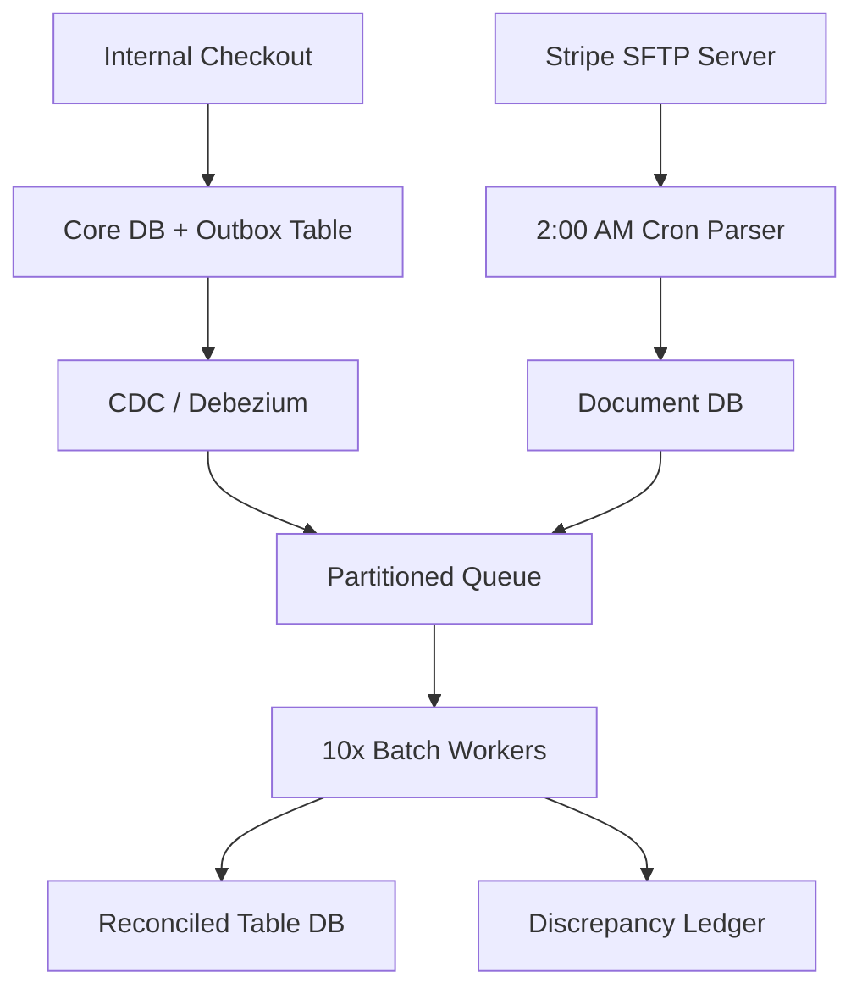
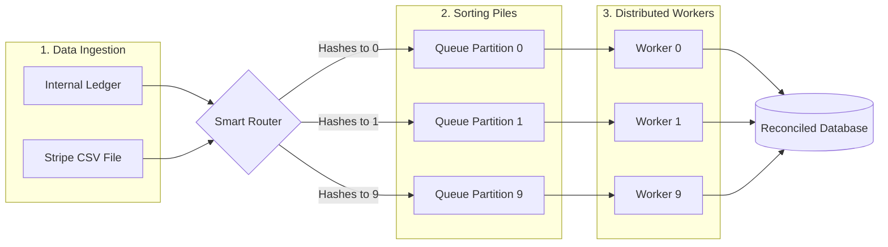
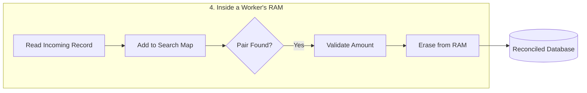

# Financial Reconciliation System

## Scope & Requirements

### Functional
- Ingest internal ledger data.
- Ingest external payment data (e.g., Stripe CSVs).
- Match transactions by ID.
- Flag and handle mismatches.
### Non-Functional
- **Scale:** 50 Million transactions per day.
- **Accuracy:** Strict financial consistency (no dropped data).
- **Latency:** Batch/offline processing (doesn't need to be real-time).

---

## Capacity Estimation (Back-of-the-Envelope Math)

- **Data Size:** Assume 1 record (internal ledger event or external CSV row) = 1 KB.
- **Daily Storage:**
  - Internal: 50,000,000 records × 1 KB = 50 GB / day.
  - External: 50,000,000 records × 1 KB = 50 GB / day.
  - Total Daily Raw Ingestion: 100 GB / day.
- **Throughput Rate (Flat Execution):** Spreading the 50M daily external transactions flatly across a controlled 24-hour ingestion window yields:
  $\approx 580 \text{ records/sec}$
  $\approx 580 \text{ KB/sec}$ inbound network bandwidth.
- **Memory Footprint:** At 580 records per second, the data volume is actually very low. A standard 16 GB RAM server gives us way more than enough breathing room to hold the transactions in memory while we match them, ensuring we never run out of memory.

---

## High-Level

### Core API & Event Endpoints

- `POST /v1/internal-events` -> Internal webhook pipeline to push transaction updates to the messaging layer via CDC (Change Data Capture).
- `SFTP Pull Event (Cron-triggered)` -> Batch job reads from `/settlements/stripe/YYYY-MM-DD.csv`.

### Database Schema

```sql
-- Operational DB (Protected via Outbox Pattern)
CREATE TABLE transaction_outbox (
    event_id UUID PRIMARY KEY,
    transaction_id VARCHAR(64) NOT NULL,
    amount DECIMAL(18, 4),
    currency VARCHAR(3),
    status VARCHAR(20),
    created_at TIMESTAMP
);

-- Reconciliation Staging & Audit DB
CREATE TABLE external_stripe_staging (
    stripe_tx_id VARCHAR(64) PRIMARY KEY,
    amount DECIMAL(18, 4),
    settled_at TIMESTAMP,
    raw_payload JSONB
);

CREATE TABLE discrepancy_ledger (
    audit_id UUID PRIMARY KEY,
    transaction_id VARCHAR(64),
    expected_amount DECIMAL(18, 4),
    actual_amount DECIMAL(18, 4),
    variance DECIMAL(18, 4),
    error_type VARCHAR(50), -- 'AMOUNT_MISMATCH', 'MISSING_EXTERNAL'
    resolved BOOLEAN DEFAULT FALSE
);
```

### System Architecture Map



---
	
## Deep Dive: Core Bottlenecks

### Hash-Based Partitioning & Data Shuffling



To reconcile millions of rows across distributed hardware without causing massive memory overhead or cross-worker chat network bottlenecks, we enforce strict Hash-Based Partitioning for distributing task to worker. 

The system collects our own data live all day then grabs Stripe's data once a night, and throws both into a smart sorting system that splits the heavy workload so multiple computers can share the job.

By setting the message key exclusively to the `transaction_id`, the message router runs an identical routing algorithm across both streams: `hash(transaction_id) % 10`. This guarantees that both the internal ledger event and the external Stripe record for any given ID are routed into the exact same partition queue. 

Distributed workers are assigned explicitly to individual partitions. When a worker reads its partition, it builds a in-memory hash map of the transactions it encounters. When it identifies the matching pair, it validates the amount, drops the pair from memory to keep RAM usage stable, and writes the success state to the database.



### Resiliency & The Exception Pipeline

In financial systems, dropping or blocking execution loops over data anomalies introduces extreme operational risk. Our architecture separates automated stream matching from human auditing loops to guarantee uninterrupted batch execution.

**The Missing Record Trap:** If an internal record exists but the Stripe record is absent, the matching worker marks it as `UNRECONCILED_PENDING`. The system applies a 24-hour grace period buffer to allow for processing delays or trailing bank webhooks. If the record remains missing after 48 hours, it is promoted to `RECONCILIATION_FAILURE` and routes to the `discrepancy_ledger`.

**The Amount Mismatch Bug:** If an internal event specifies a charge of $50 but Stripe reports only $45 was processed, the system considers the real-world cash movement (Stripe) as the ground truth. The matching worker flags this immediately as an application bug or telemetry fault. It bypasses any dangerous automated corrections or charge retries, writes the exact mismatch delta into the `discrepancy_ledger`, increments a Prometheus metric counter, and safely processes the next message.

## Scaling & Trade-offs

**Transactional Outbox Over Live Ingestion:** We explicitly chose to implement a transactional outbox table instead of having the core checkout service publish directly to the reconciliation queue. This trades minor write latency overhead in the core checkout service for data integrity, ensuring we never drop transaction telemetry during network blips or broker failures.

**Scheduled Processing Over Real-Time Joins:** Instead of utilizing a massive, expensive, real-time distributed cache to hold millions of un-reconciled transactions for hours while waiting for Stripe's file, we trade real-time visibility for operational safety. By scheduling the core matching pipeline around Stripe's batch schedule, we achieve flat, fully predictable compute costs and protect our nodes from out-of-memory cascading faults.

## Where there's a serious contradiction — the memory model doesn't survive contact with your own architecture

This is the big one. Your capacity estimate says:

"580 records/sec... a standard 16GB RAM server gives us way more than enough breathing room to hold the transactions in memory while we match them."

But your own architecture explicitly describes internal events arriving continuously all day via CDC, while the Stripe file only arrives once, at 2:00 AM. That means an internal record for a transaction that happens at, say, 9:00 AM has to sit in a worker's in-memory hash map for up to 17 hours before its Stripe counterpart even exists to match against.

The 580 records/sec figure only tells you the arrival rate — it says nothing about the standing population of unmatched records waiting in RAM at any given moment. The actual number you need is: how many internal records accumulate between Stripe batches? That's the full day's volume — 50,000,000 records × 1KB ≈ 50GB sitting unmatched in memory right before the 2 AM batch arrives, not a "way more than enough 16GB" trickle.

This is the same category of error flagged in the scraping-cluster design earlier this session (sizing off average throughput instead of the actual peak/standing-population number) — except here the stakes are higher, because this isn't a cache that can gracefully expire; it's the working set your matching algorithm depends on to avoid falsely flagging MISSING_EXTERNAL for records still legitimately waiting on Stripe.

It also directly contradicts your own stated trade-off in the Scaling section: "Instead of utilizing a massive, expensive, real-time distributed cache to hold millions of un-reconciled transactions for hours... we trade real-time visibility for operational safety." — but the in-memory hash map design in the Deep Dive is precisely that: holding millions of transactions in memory for hours. The two sections disagree with each other, and that needs to be reconciled, not left as an internal contradiction.

The fix: the "search map" can't be a pure in-memory structure held by a single stateless worker process for a batch window this long. It needs to be backed by something durable and shared — e.g., the external_stripe_staging table itself (already in your schema!) combined with an indexed lookup against pending internal records, or a persistent key-value store (Redis with proper sizing, or the staging DB with an index on transaction_id) — not a plain in-process hash map that vanishes if the worker restarts.

Second gap — worker crash mid-batch loses all unmatched state

Because the matching state lives only in a worker's process memory, a crash or restart mid-batch wipes out every unmatched record that worker was tracking — with no way to recover which internal records it had already seen before the crash. Given the earlier point about the standing population being ~50GB across a day, this isn't a small edge case; it's a guaranteed-to-happen event over enough operating days, in a system whose core promise is "no dropped data." This needs either checkpointing of in-progress match state to durable storage, or (better, given the fix above) simply doing the matching as a durable query against the staging tables rather than in-process memory at all.

Third gap — grace period numbers are inconsistent

"applies a 24-hour grace period... If the record remains missing after 48 hours, it is promoted to RECONCILIATION_FAILURE"

This reads as two different numbers for the same concept — is the grace period 24 hours or 48 hours? Worth tightening to one authoritative figure (or explicitly stating there are two stages, e.g., a 24-hour soft-pending window followed by a 48-hour hard-failure threshold, if that's actually the intent).

Fourth gap — only one direction of "missing" is handled

The discrepancy_ledger handles internal record exists, Stripe record missing. What about the reverse — a Stripe settlement exists with no matching internal record at all? This is arguably the more dangerous case in a financial system (money moved that your internal ledger never recorded), and it isn't addressed anywhere in the failure-mode section.