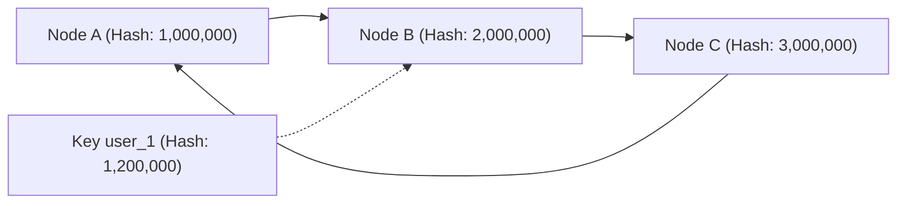
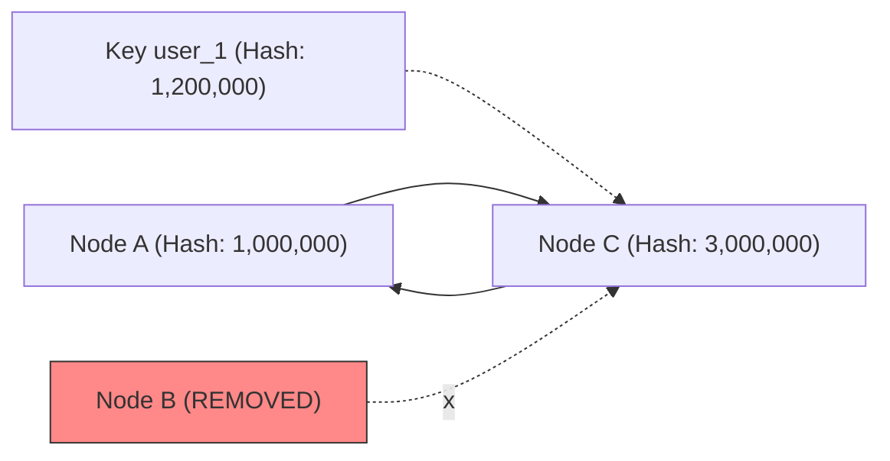
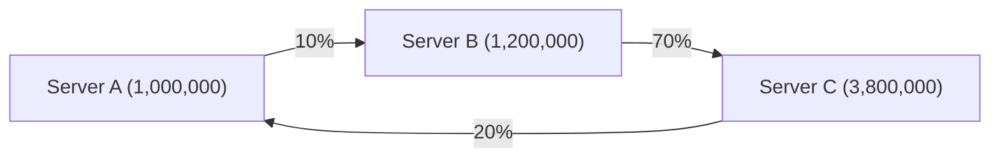
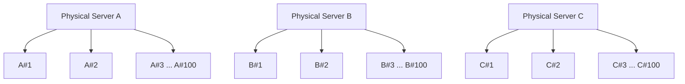
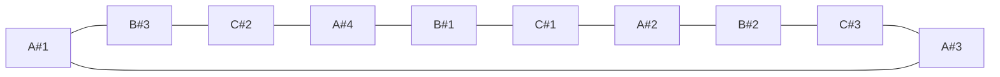
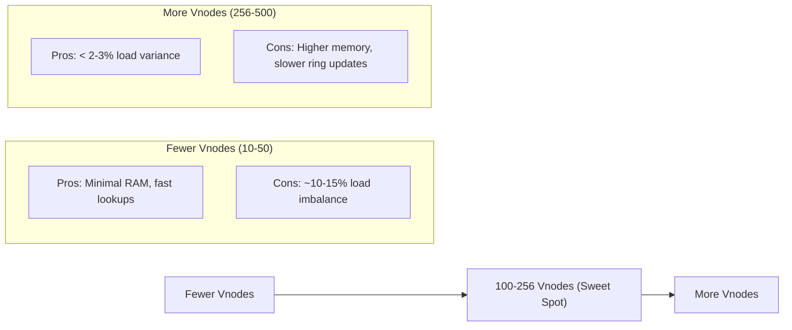

# Consistent Hashing

Consistent hashing is the go-to standard whenever you need to partition data or route traffic across a dynamic set of nodes without a central routing bottleneck.

## The Problem with Traditional Hashing

In a standard system with $N$ servers, you assign data using a modulo operation:

$$\text{Server} = \text{Hash}(\text{Key}) \pmod N$$

If you have $3$ servers ($N = 3$):

- Hash("user_A") = 10 $\rightarrow$ $10 \pmod 3 = \mathbf{1}$ (Server 1)
- Hash("user_B") = 11 $\rightarrow$ $11 \pmod 3 = \mathbf{2}$ (Server 2)
- Hash("user_C") = 12 $\rightarrow$ $12 \pmod 3 = \mathbf{0}$ (Server 0)

What happens when Server 2 crashes or a 4th server is added? $N$ changes from $3$ to $4$. Now, almost every single key calculates a different server index:

- Hash("user_A") = 10 $\rightarrow$ $10 \pmod 4 = \mathbf{2}$ (Was 1 $\rightarrow$ Moved!)
- Hash("user_B") = 11 $\rightarrow$ $11 \pmod 4 = \mathbf{3}$ (Was 2 $\rightarrow$ Moved!)
- Hash("user_C") = 12 $\rightarrow$ $12 \pmod 4 = \mathbf{0}$ (Unchanged)

In a database or cache with millions of keys, $90\%+$ of your data suddenly maps to the wrong node. In a cache, this causes a catastrophic cache stampede; in a database, it causes massive network congestion as entire datasets move between servers.

## How Consistent Hashing Works: The Hash Ring

Instead of taking the hash modulo $N$ (the number of servers), consistent hashing takes the hash modulo a fixed, enormous number, typically $2^{32} - 1$ (the maximum value of a 32-bit integer). Imagine wrapping the number range from $0$ to $2^{32}-1$ into a circle: the hash ring.



### Step 1: Mapping Servers onto the Ring

Both servers and data keys are passed through the exact same hash function (e.g., MD5 or MurmurHash). Hash the server IP addresses/names to position them on the ring:

- Hash("Server_A") = 1,000,000
- Hash("Server_B") = 2,000,000
- Hash("Server_C") = 3,000,000

### Step 2: Mapping Data Keys to Servers

When a request comes in for Key "user_1":

1. Hash the key: Hash("user_1") = 1,200,000.
2. Place it on the ring at position 1,200,000.
3. Walk CLOCKWISE around the ring until you hit the first server.

1,200,000 walks clockwise and hits Server B at 2,000,000. So, Key "user_1" is stored on Server B.

### Why Is It Called "Consistent"?

It is called consistent because adding or removing a server does NOT disrupt the rest of the ring. The mapping of keys to servers remains almost consistent.

#### Scenario A: A Server Fails (Node B Crashes)



When Server B at 2,000,000 goes offline, Key "user_1" at 1,200,000 travels clockwise. Since Server B is gone, it keeps going until it hits Server C at 3,000,000.

- **What changed?** ONLY the keys that were previously assigned to Server B move to Server C.
- **What stayed the same?** All keys stored on Server A and Server C stay on Server A and Server C. $0\%$ of their traffic is disrupted.

#### Scenario B: Adding a New Server (Node D)

If you insert Server D at position 1,500,000 (between Server A and Server B), Server D only takes over keys falling between 1,000,000 and 1,500,000 (a fraction of Server B's former traffic). Server A and Server C remain $100\%$ unaffected.

**Mathematical Guarantee:** In a ring with $N$ servers, adding or removing a server requires moving only $\frac{1}{N}$ of the total keys on average.

## The Hotspot Problem

If all your incoming keys happen to hash into a single range, they would all pile up on one server. This is known as the **Data Skew / Hotspot Problem**. There are two distinct causes and two different fixes:

### Cause 1: Low-Quality Hash Function 

A scenario where 50% of all incoming keys hash into a single narrow range like 1000 to 2000 is statistically impossible if you use a standard cryptographic or high-entropy hash function (MurmurHash3, MD5, SHA-256). If that were happening, your hash function is broken, not the consistent hashing ring.

**Why a Good Hash Function Never Does This.** A proper hash function behaves like a pseudo-random number generator with two strict properties:

- **Uniform Distribution:** Output values are distributed evenly across the entire $0$ to $2^{32}-1$ spectrum. Every number has equal probability.
- **The Avalanche Effect:** Changing 1 bit or 1 letter in the input changes every byte of the output hash.

Example using MurmurHash3 with sequential keys:

- Key: "user_1001" $\rightarrow$ 0x3F8A1201 (1,066,011,137)
- Key: "user_1002" $\rightarrow$ 0x91B3C00A (2,444,419,082)
- Key: "user_1003" $\rightarrow$ 0x0A2FE41C (170,910,748)
- Key: "user_1004" $\rightarrow$ 0xE2051189 (3,791,983,113)

user_1001 and user_1002 are almost identical strings, yet their hashes land in opposite quadrants of the ring.

**What Would Cause Keys to Pile Up in Practice?** If you observe keys clustering in production, one of two bugs is occurring:

1. **Non-uniform / custom hash function**: Someone writes `return key.length()` or `return key.charAt(0)`. Fix: Use standard MurmurHash3, xxHash, or MD5. Never write custom hash math for consistent hashing.

2. **Single hot key**: 50% of traffic isn't many different keys, but one key (e.g., a viral product ID). The hash for that key always outputs the same number, overwhelming whichever Vnode owns that position. Consistent hashing cannot solve this alone; systems use two patterns:
   - **Local In-Memory Caching (L1 Cache):** The API gateway or app servers cache the hot key locally for 1-5 seconds so they don't query the ring.
   - **Key Salting / Scatter-Gather:** Append a random suffix to the key for hot reads (e.g., query `user_1234_salt_1`, `user_1234_salt_2`, `user_1234_salt_3`). These salted keys produce different hashes, scattering the hot key across multiple servers.

### Cause 2: Uneven Node Gaps on the Ring

Even if the key hashes are spread out randomly, the servers themselves might end up placed far apart on the ring:



In this setup, Server C is responsible for everything between 1,200,000 and 3,800,000 (70% of the entire circle). Even with perfect random key distribution, Server C will get flooded with 70% of all requests.

**The Solution: Virtual Nodes (Vnodes).** Instead of placing a physical server on the ring once, the system creates 100 or 250 virtual aliases for each server:

- ServerA#1, ServerA#2, ..., ServerA#100
- ServerB#1, ServerB#2, ..., ServerB#100
- ServerC#1, ServerC#2, ..., ServerC#100



Scattering hundreds of virtual points for every physical server across the ring means the 1,000,000-2,000,000 range no longer belongs to one server. It contains virtual slices belonging to Server A, Server B, and Server C. If keys land in that range, they get evenly divided among all physical machines in the cluster.



### Why Virtual Nodes are Crucial

- **Uniform Distribution:** Interleaving hundreds of virtual points across the ring ensures data is split near-perfectly ($33.3\%$ per server across 3 nodes).
- **Heterogeneous Hardware:** If Server A has $2\times$ the RAM/CPU of Server B, you give Server A $200$ virtual nodes and Server B $100$ virtual nodes. Server A will naturally take double the load.

## How Vnodes Actually Land on the Ring

Vnodes are generated randomly, then sorted in numerical order to form the clockwise ring.

### Step 1: Generate Hashes for Every Vnode

Imagine 2 physical servers (Server_A, Server_B) with 3 Vnodes each:

- Hash("Server_A#1") $\rightarrow$ 1,500,000
- Hash("Server_A#2") $\rightarrow$ 8,100,000
- Hash("Server_A#3") $\rightarrow$ 3,200,000
- Hash("Server_B#1") $\rightarrow$ 5,400,000
- Hash("Server_B#2") $\rightarrow$ 100,000
- Hash("Server_B#3") $\rightarrow$ 9,800,000

The hash numbers look random and scattered.

### Step 2: Sort the Hashes Numerically

Before any requests come in, the system sorts all generated numbers from smallest to largest:

| Index | Hash Position | Owner |
|---|---|---|
| [0] | 100,000 | Server_B (#2) |
| [1] | 1,500,000 | Server_A (#1) |
| [2] | 3,200,000 | Server_A (#3) |
| [3] | 5,400,000 | Server_B (#1) |
| [4] | 8,100,000 | Server_A (#2) |
| [5] | 9,800,000 | Server_B (#3) |

This sorted array IS the clockwise ring. Moving down the array index ($0 \rightarrow 1 \rightarrow 2 \rightarrow 3$) is identical to moving clockwise around a circle.

### Step 3: Clockwise Lookup

A key comes in: Hash("user_99") = 4,000,000. Binary search finds the first hash greater than 4,000,000: index [3] at 5,400,000, owned by Server_B. The request goes to Server_B.

## How We Guarantee "Clockwise" Lookup

"Walking clockwise around the ring" sounds like a physical action, but in code, the hash ring is an ordered array (or balanced binary search tree) of integers.

### The Ring Data Structure

In memory, the hash ring is represented as a sorted list of key-value pairs mapping Hash Value -> Server Node:

```
Array / TreeMap:
[
  { hash: 100000, node: "Server_A" },
  { hash: 300000, node: "Server_B" },
  { hash: 700000, node: "Server_C" },
  { hash: 900000, node: "Server_A" }
]
```

### The Lookup Algorithm: Binary Search (ceiling or firstAfter)

When a request comes in for Key_X with Hash("Key_X") = 450000:

1. **Perform Binary Search:** The system looks for the first server hash that is greater than or equal to 450,000.
2. **Find the Match:** In the array above, 700,000 is the smallest number greater than 450,000. This corresponds to Server_C. That is mathematically identical to "walking clockwise."
3. **Wrap Around (The End of the Ring):** If Hash("Key_Y") = 950000 (greater than the highest server hash on the ring), binary search finds no match. The code wraps around to index 0 (Server_A at 100,000).

In code (such as Java's TreeMap), this is a single $O(\log N)$ operation:

```java
public String getServer(String key) {
    if (ring.isEmpty()) return null;
    int hash = hashFunction.hash(key);
    if (!ring.containsKey(hash)) {
        SortedMap<Integer, String> tailMap = ring.tailMap(hash);
        hash = tailMap.isEmpty() ? ring.firstKey() : tailMap.firstKey();
    }
    return ring.get(hash);
}
```

## How to Determine the Number of Vnodes

The number of Virtual Nodes per physical machine involves a direct trade-off: Data Balance vs. Memory/CPU Overhead.



### The Rule of 100 to 256 Vnodes

Mathematically, load variance follows standard deviation. Research and production benchmarks (such as the original Amazon Dynamo paper) show that:

- With 10 Vnodes per node, load variance between machines is roughly $\pm 25\%$.
- With 100 Vnodes per node, load variance drops to roughly $\pm 5\%$.
- With 256 Vnodes per node, load variance drops below $\pm 2\%$.

Beyond 256 Vnodes, you hit diminishing returns: adding more Vnodes uses extra memory without significantly improving balance.

### Industry Standards in Real Systems

- **Apache Cassandra:** Default setting: 128 or 256 vnodes (`num_tokens: 128` in cassandra.yaml). Gives near-perfect data distribution across large multi-terabyte nodes.
- **Amazon DynamoDB / Riak:** Uses a fixed ring divided into 1024 or 2048 static partitions (vnodes) distributed dynamically among available physical hardware.

### Weight-Proportional Vnode Calculation

If your cluster has hardware with different specs (e.g., Server A has 64GB RAM, Server B has 32GB RAM), you scale the Vnode count proportionally:

$$\text{Vnodes}_{\text{Node}} = \text{Base Vnodes (e.g., 100)} \times \left( \frac{\text{Capacity}_{\text{Node}}}{\text{Capacity}_{\text{Standard}}} \right)$$

- Server A (64GB RAM): $100 \times 2 = 200\text{ Vnodes}$
- Server B (32GB RAM): $100 \times 1 = 100\text{ Vnodes}$

Server A naturally owns $2/3$ of the hash ring slices, taking twice as much traffic automatically.