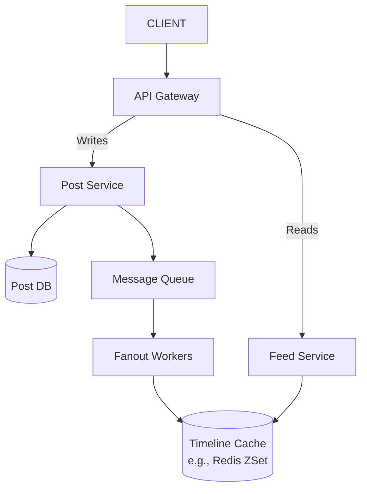

# Design a Social Media Feed System (Twitter/Instagram-style)

## 1. Scope & Requirements
*Always ask clarifying questions before drawing. Do not assume.*

### Functional Requirements
*   Users can create **text posts** (media upload explicitly out of scope for this version, but design should extend to object storage/CDN/async processing later).
*   Each post has: `post_id`, `user_id`, `content`, `created_at`, `visibility` (`ACTIVE`, `DELETED`).
*   Users can fetch a personalized feed via `GET /v1/feed?cursor=<cursor>&limit=20`, using cursor-based pagination with infinite scroll.
*   Read tracking (impressions, clicks) and analytics are explicitly out of scope.

### Non-Functional Requirements
*   **Consistency:** Eventual consistency is acceptable. A new post should appear in followers' feeds within a few seconds (not immediate). **Losing a post permanently is unacceptable.**
*   **Latency:** Feed reads should feel fast/interactive; celebrity posts must not take minutes/hours to propagate.
*   **Scale:**
    *   100M Daily Active Users (DAU)
    *   10M posts/day, ~1KB average post size
    *   User opens feed ~20 times/day
    *   Celebrity case: a single account (`@celebrity`) with 50M followers

---

## 2. Capacity Estimation (Back-of-the-Envelope Math)

*   **Write QPS:**
    *   10,000,000 posts/day ÷ 86,400 sec ≈ **116 writes/sec average**
    *   Assume peak = 10x average → **~1,160 writes/sec peak** (rounded to ~1-2k/sec)
    *   Key insight: *writing posts is not the hard part — fanout is.*

*   **Read QPS:**
    *   100M DAU × 20 feed opens/day = 2,000,000,000 feed requests/day
    *   2B ÷ 86,400 sec ≈ **23,000 requests/sec average**
    *   Peak (5-10x) → **~115,000-230,000 QPS** → rounded to **100k-200k/sec peak**
    *   This is the real scaling challenge, not writes.

*   **Storage (per day/year):**
    *   Post content: 10M posts × 1KB ≈ **10 GB/day**
    *   Realistic per-post storage including metadata (post_id, user_id, timestamp, visibility, engagement counters) ≈ 5KB/post → **~50 GB/day ≈ 18 TB/year**
    *   **Timeline storage is the bigger problem:** 100M users × 20 feed items/day = 2 billion timeline entries/day; at ~100 bytes each ≈ **200 GB/day** — this dwarfs post storage.

*   **Celebrity Fanout Load:**
    *   Naive fanout-on-write for a 50M-follower celebrity = 50,000,000 cache writes for a *single post* → clogs queues, burns CPU/memory, breaks the "few seconds" latency requirement.

---

## 3. High-Level Design

### Core API Endpoints
*   `POST /v1/posts` -> Creates a post; returns `201 Created` immediately after durable write + queue emit (does not wait for fanout).
*   `GET /v1/feed?cursor=<cursor>&limit=20` -> Returns 20 personalized post IDs (hydrated with content), cursor-paginated for infinite scroll.

### Database Schema (Highly Abstract)
*   **Post Table (Post DB):** `post_id` (PK), `user_id` (FK), `content`, `created_at`, `visibility` (`ACTIVE`/`DELETED`)
*   **User/Social Graph:** `user_id` (PK), `following` (set), `followers` (set), `is_celebrity` (denormalized flag, updated async)
*   **Timeline Cache (Redis ZSet, per user):** member = `post_id`, score = `published_at` (Unix timestamp)
*   **Per-user "recent posts" cache:** last N (~20-50) `post_id`s per user — used for both celebrity pull-fanout *and* cold-start rebuild

### System Architecture Map

*   **Write Path:** Client → API Gateway → Post Service writes to Post DB (source of truth) + Post Cache, emits `PostCreated` event to Message Queue, returns `201` immediately (no synchronous fanout).
*   **Fanout Path (async):** Fanout Workers consume `PostCreated` events, look up followers via Social Graph, push `post_id` into each follower's Timeline Cache ZSet (only for non-celebrity accounts — see Deep Dive).
*   **Read Path:** Client → API Gateway → Feed Service queries Timeline Cache for top 20 post_ids → hydrates with content from Post Cache (fallback to Post DB on miss) → returns payload.
*   **Key principle:** Never mix the post store with the timeline store — Post DB stores *what was published*, Timeline Store stores *who should see what*.

---

## 4. Deep Dive: Core Bottlenecks

### Deep Dive 1: Celebrity Fanout Problem (Push vs. Pull Hybrid)

*   **Normal users (small follower count):** Fanout-on-write (push). Cheap — Fanout Worker writes `post_id` into each follower's Timeline Cache at post time.
*   **Celebrities (follower count above threshold):** Fanout-on-read (pull). Never fan out to millions of timelines; instead maintain a `celebrity:{id}:recent_posts` cache (last 20-50 posts).
*   **Threshold:** Not a fixed universal number — should be based on system write capacity ÷ acceptable fanout latency, realistically in the **10K-100K follower range**, not 50M. Stored as a denormalized `is_celebrity` flag on the user record (updated via periodic background job, not computed live on every post) so the Fanout Worker can check it cheaply without an extra DB query per post.
*   **Read-time merge:** Feed Service combines pushed Timeline Cache entries + pulled celebrity recent-posts entries via a k-way merge sorted by `created_at`, deduplicated by `post_id` (cheap insurance), then returns top 20.
*   **Migration across the threshold:** Posts are naturally **time-partitioned** — posts made *before* a user flips to celebrity status live only in the push path (already delivered); posts made *after* the flip are only ever pulled (Fanout Worker checks the flag at *processing time*, not cached at enqueue time). This avoids duplicate or missing posts without needing a receipt/tracking log.
*   **Hot-key protection:** Single-flight/request-coalescing applies to protecting the `celebrity:{id}:recent_posts` cache key from thundering-herd reads when many followers open their feed simultaneously right after a celebrity posts — not to deduplicating feed reads generally.

### Deep Dive 2: Timeline Cache Design & Cold-Start Rebuild

*   **ZSet structure:** member = `post_id` only (score already handles sort, no need to duplicate `published_at` in the member); score = `published_at`.
*   **Cap size:** Should be sized to **pagination depth**, not "one phone screen." Since the API supports infinite scroll (`limit=20` per page), a cap of 5-10 is far too small — realistic cap is **~200-800 entries** per user, still only a few KB per user even at scale.
*   **Cache miss / cold-start rebuild (fan-in approach):**
    1. Fetch the user's follow list from the Social Graph.
    2. For each followed user, pull their last N posts from the **per-user "recent posts" cache** (same structure celebrities use for pull-fanout) — in parallel, not a full historical scan.
    3. K-way merge all fetched lists by `created_at`, take top ~200, batch-write into the Timeline Cache ZSet.
    4. Serve the original request from the now-populated cache.
    *   **Risk:** users who follow a very large number of accounts make this fan-in proportionally expensive — the mirror image of the celebrity fanout problem. Mitigate with follow-count caps or caching "recently rebuilt" status to avoid repeat fan-in on every miss.

### Deep Dive 3: Queue Partitioning & Fanout Worker Failure Handling

*   **Partitioning problem:** A naive single queue lets one celebrity's fanout job block/delay normal users' fanout jobs queued behind it.
*   **Fix:**
    *   Split celebrity fanout into many small **sub-tasks/shards** (e.g., 50M followers ÷ 10K per shard = 5,000 sub-tasks) so no single message can starve a partition.
    *   Use **separate topics/queues** for celebrity vs. normal fanout (e.g., Kafka `fanout-celebrity` vs `fanout-normal`) with independently scalable consumer groups.
*   **Worker failure handling:**
    *   `ZADD` (the fanout write operation) is naturally **idempotent** — redundant writes from a retried job cause no harm.
    *   Rely on standard **at-least-once delivery** (Kafka offset commits / SQS visibility timeout + redelivery) rather than building distributed-transaction/exactly-once guarantees.
    *   Optional: shard-level checkpointing so a coordinator can re-enqueue just the incomplete shard of a large celebrity fanout, instead of restarting from zero.

### Deep Dive 4: Post DB Sharding & Delete/Visibility Lifecycle

*   **Sharding key: `post_id` (or hash of it), not `user_id`.** Dominant access pattern is point lookups by `post_id` during feed hydration (batch of ~20 IDs per page), which parallelizes well across shards. Sharding by `user_id` would create hot shards for celebrity accounts (same problem as fanout).
*   **Delete/visibility handling:** Deletes are a **soft filter applied at hydration time**, not a cache invalidation problem.
    *   Deletion = flip `visibility` to `DELETED` in the Post DB (source of truth for visibility).
    *   Timeline Cache ZSets never get purged of the deleted `post_id` — too expensive to reverse-fanout across potentially millions of caches.
    *   Feed Service silently filters out `DELETED` posts at hydration time (may over-fetch a few extra `post_id`s to backfill the page to the requested size).
    *   Stale `post_id`s in ZSets are harmless dead weight, naturally aged out as the capped ZSet rolls off old entries.

---

## 5. Scaling & Trade-offs
*Conclude by identifying single points of failure (SPOFs) and how to handle them.*

*   **Database Sharding:** Shard Post DB by `post_id` to distribute write and hydration-read load evenly; avoids hot shards from celebrity accounts.
*   **Caching Strategy:** Hybrid push/pull fanout is itself the core caching/scaling strategy — push for normal users (cheap fanout), pull via `celebrity:{id}:recent_posts` for high-follower accounts (avoids fanout explosion).
*   **Queue Partitioning:** Shard celebrity fanout into many sub-tasks and use separate topics per account tier so large jobs can't starve normal-user throughput.
*   **Idempotent Writes:** Rely on idempotent `ZADD` + at-least-once delivery instead of complex exactly-once guarantees for fanout worker resilience.
*   **Not yet designed (open gaps / follow-ups for next session):**
    *   Read-path fallback if the Timeline Cache (Redis) is down entirely — does the system degrade to pure pull-based reconstruction for all users, and is that survivable at 100k-200k QPS?
    *   Feed staleness/cursor stability while new posts arrive mid-scroll.

---

## Interview Performance Retro (Self-Assessment Notes)

**Overall readiness rating: 5/10 for senior-level bar.**

**Strengths:**
*   Strong product instincts — asked the right scoping questions upfront (media, consistency, read tracking).
*   Independently arrived at async fanout via message queue before being prompted.
*   Correctly identified push vs. pull as the celebrity fanout solution unprompted.
*   Good self-checking habit ("is this enough," "does this cover the core mechanism").

**Weaknesses to improve:**
1.  **Estimation mechanics** — initial QPS/storage calculations mixed units and jumped to ungrounded extreme numbers (e.g., assuming 2M writes/sec with no derivation). Needs drilling until "requests/day → QPS → peak QPS" is reflexive.
2.  **Naming techniques before earning them** — reached for plausible-sounding solutions (single-flight, "detect via post rate") without first identifying the precise failure mode being solved. Should state the problem explicitly before naming the fix.
3.  **Depth requires prompting** — most answers were directionally correct but needed 2-3 follow-up questions to become fully concrete (threshold logic, ZSet cap sizing, rebuild mechanism, dedup). At a senior bar, first-pass answers should already contain this depth.
4.  **Relying on interviewer to generate the design** rather than iterating on own draft under time pressure — good for learning material, but needs more reps producing (not just reviewing) designs solo.

**Study plan:**
1.  Estimation drills across multiple system types (URL shortener, chat app, video platform) until QPS/storage math is automatic.
2.  Study real-world references (Twitter timeline architecture, Instagram feed ranking) to internalize *why* specific tradeoffs were made, not just *what* they are.
3.  Practice narrating tradeoffs explicitly: "the alternative was X, but that fails because Y" for every technique used.
4.  Run timed (20-25 min) mock interviews to build the habit of proactively surfacing edge cases and depth without needing follow-up scaffolding.