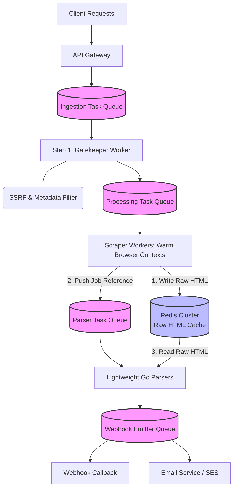

# Web Scraping System

## Scope & Requirements

### Functional Requirements

- Users can submit a URL to scrape dynamic (JS-rendered) text/HTML.
- System delivers the extracted output asynchronously via download link, webhook, or email.

### Non-Functional Requirements

- **Scale:** High throughput, daily volume of 4,000,000 scraping jobs.
- **Availability:** Fault-tolerant architecture (an individual browser crash must not impact cluster stability).
- **Latency:** Asynchronous execution driven by robust SLA queue boundaries.

---

## Capacity Estimation (Back-of-the-Envelope)

- **Total Jobs:** 4,000,000 scraping jobs / day.
- **Average Ingestion Throughput:** 4,000,000 / 86,400 seconds ≈ 46 jobs/sec.
- **Peak Traffic QPS (3x multiplier):** ≈ 139 jobs/sec.

### Storage

- **Scraped Payloads:** No long-term storage. Handled temporarily via aggressive 10-minute Redis cache TTL window (see Claim-Check Cache below). Final extracted output is small (parsed JSON/text) and delivered via webhook/email, not retained as a durable blob store.

### Network Bandwidth

- **Inbound Egress:** 139 peak requests/sec × 10 KB request metadata ≈ 1.4 MB/sec.
- **Outbound (raw HTML fetch, worker-side):** 139 peak jobs/sec × 50 KB average page size ≈ 6.9 MB/sec peak fetch bandwidth.

---

## High-Level Design



### Core API Endpoints

**POST /v1/jobs** Submits an asynchronous scrape job. Returns 202 Accepted with a tracking ID.

```json
{
  "client_id": "internal-travel-service",
  "url": "https://example.com/listing",
  "delivery": { "method": "webhook", "destination": "https://client.example.com/callback" }
}
```

**GET /v1/jobs/:job_id** -> Polling fallback endpoint indicating state: PENDING, PROCESSING, SUCCESS, or FAILED.

**Note on Webhooks:** To mitigate security risks, webhook callback destinations are linked directly to authenticated client configuration templates managed securely via an internal Configuration Registry, not to arbitrary URLs supplied per-request.

### Database Schema

**Jobs Table (DynamoDB):**
- Manages metadata state routing. Sharded horizontally using a hash of `user_id`/`tenant_id` as the partition key.
- Tenant-based sharding introduces a hot-partition risk: a single large enterprise client submitting a burst of jobs lands all of their writes on one partition. Large tenants are sub-sharded with a `tenant_id + random_suffix` composite key, and per-tenant write rates are capped, so no single tenant can saturate a partition.
- Schema: `job_id` (PK), `user_id`, `status`, `current_step`, `created_at`, `updated_at`

**Source of Truth:** DynamoDB is the durable source of job state; Redis is a disposable performance cache only. If the two ever disagree (e.g., a Redis entry expires or is evicted before DynamoDB reflects the same transition), DynamoDB wins. `GET /v1/jobs/:job_id` always reads from DynamoDB (or a consistent read path derived from it), never from Redis, so a client's poll can never observe a stale or evicted cache value as if it were current state.

**Claim-Check Cache (Redis Cluster):** A temporary holding area to hand off raw HTML from the browser to the downstream parser.

- **4,000,000 scraping jobs per day**
- **4,000,000 × 50 KB (average page size) = 200 GB of raw HTML per day.**
- **Redis Job Cache Key:** `html:claim:[job_id]` -> Stores raw HTML content during the handoff between scraper and parser.

Sizing the cluster to hold a full day's worth of raw HTML (200 GB) would be wasteful. **But we don't need 200 GB of RAM.** Because this is a decoupled asynchronous pipeline, the parser picks up the job from the queue right after the Scraper drops it, so the HTML only needs to live in Redis for a few seconds.

If we apply an aggressive **10-minute TTL (Time-To-Live)** on the Redis keys, we size the cluster off **peak** throughput, not average:

- **Peak scraping throughput:** 139 jobs/sec (see Capacity Estimation).
- **Concurrent data in flight (10 mins / 600 seconds):** 139 jobs/sec × 600 seconds ≈ 83,400 active HTML payloads in cache at any single moment.
- **Total RAM required:** 83,400 payloads × 50 KB ≈ **4.2 GB of RAM**

A ~4.2 GB Redis cluster (round up to ~5 GB with headroom) is still cheap and manageable, well under a hundred dollars/month on AWS ElastiCache, but it's the number that could break under load, not the average-case number that would silently under-provision the cache during the exact traffic spike it exists to absorb.

**TTL vs. backpressure:** a 10-minute TTL races the Parser Queue's lag. If parsing falls behind for over 10 minutes, HTML expires in Redis before it's read, and the job is lost silently, with no retry and no DLQ entry. To fix this: producers watch Parser Queue lag. At 5 minutes (half the TTL), the Gatekeeper throttles new scrape admissions, and any key close to expiring without a parser ack is copied to a DLQ first, instead of vanishing.

---

## Deep Dive

### DNS Rebinding (TOCTOU) Protection

- **SSRF Mitigation (The Pre-Flight Gatekeeper):** Accepting any URLs introduces high risk. Before passing a payload to a heavy worker, a Gatekeeper node validates the target domain against internal address spaces (localhost, Private Subnets, Cloud Provider metadata endpoints like 169.254.169.254). It runs an HTTP HEAD metadata query via a fast HTTP client to drop non-HTML large streams (>50 MB) before they can crash browser worker allocations.

- A domain-only check at pre-flight time is bypassable: an attacker's DNS can resolve to a public IP during the Gatekeeper's validation HEAD request, then re-resolve to `169.254.169.254` or a private-subnet address by the time the browser worker fetches it moments later. To close this, the Gatekeeper pins the resolved IP at validation time and passes that exact IP (not the hostname) down to the browser worker, which connects to the pinned IP directly (with the original `Host` header preserved for TLS/vhost routing), so re-resolution between check and use can't smuggle a private-address fetch through.

### Redis TTL Sizing & Backpressure Race

See Claim-Check Cache section above for full numbers (peak 139 jobs/sec → ~83,400 payloads in flight → ~4.2 GB RAM). Key point to articulate live: size Redis off **peak**, not average, because the 10-minute TTL races the Parser Queue's lag. If parsing falls behind more than 10 minutes, HTML silently expires with no retry/DLQ. Fix: producers watch queue lag, throttle admission at 5 minutes (half TTL), and copy near-expiry unacked keys to a DLQ before they vanish.