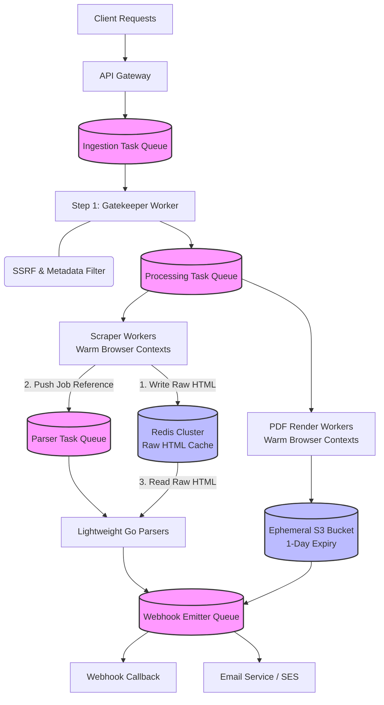

# Design a Scalable Headless Browser & Scraping Cluster

## Scope & Requirements

### Functional Requirements

- Users can submit a URL to scrape dynamic text/HTML or generate a PDF/Screenshot.
- System delivers the output asynchronously via download link, webhook, or email

### Non-Functional Requirements

- **Scale:** High throughput, daily volume of 5,000,000 jobs.
- **Availability:** Fault-tolerant architecture (a individual browser crash must not impact cluster stability).
- **Latency:** Asynchronous execution driven by robust SLA queue boundaries.

---

## Capacity Estimation (Back-of-the-Envelope)

- **Total Jobs:** 5,000,000 jobs / day (split 80% scraping, 20% PDF generation).
- **Average Ingestion Throughput:** 5,000,000 / 86,400 seconds = ~58 jobs/sec.
- **Peak Traffic QPS (3x multiplier):** ~174 jobs/sec.

### Storage (per day)

- **Scraping Payloads:** Handled temporarily via aggressive 10-minute cache TTL window (see memory calculations below).
- **PDF Generation:** 1,000,000 PDFs / day * 500 KB average size = 500 GB / day.
- **Storage Optimization:** Implementing a strict 24-hour automatic S3 object lifecycle expiration flat 500 GB at any single point in time.

### Network Bandwidth

- **Inbound Egress:** 174 peak requests/sec * 10 KB request metadata = 1.74 MB/sec.
- **Outbound Egress (PDF Delivery):** 1,000,000 PDFs * 500 KB = 500 GB / 86,400 sec = 5.8 MB/sec average egress (17.4 MB/sec peak footprint).

---

## High-Level Design



### Core API Endpoints
y from the database and injects them into an inline 
**POST /v1/jobs** Submits an asynchronous job payload. Returns 202 Accepted with a tracking ID.

```json
{
  "client_id": "internal-travel-service",
  "url": "https://example.com/invoice",
  "type": "pdf",
  "delivery": { "method": "email", "destination": "user@email.com" }
}
```

**GET /v1/jobs/:job_id** -> Polling fallback endpoint indicating state: PENDING, PROCESSING, SUCCESS, or FAILED.

**Note on Webhooks:** To mitigate security risks, webhook callback destinations are linked directly to authenticated client configuration templates managed securely via an internal Configuration Registry

### Database Schema

**Jobs Table (DynamoDB):** 
- Manages metadata state routing. Sharded horizontally using a hash of `user_id`/`tenant_id` as the partition key. 
- DynamoDB's partition model doesn't have classic lock-based deadlocks, so the real benefit here is data locality and per-tenant isolation, not deadlock avoidance — but tenant-based sharding introduces its own hot-partition risk: a single large enterprise client submitting a  burst of jobs lands all of their writes on one partition, the same "hot key overwhelms a shard" problem as a celebrity-fanout scenario, just recurring in this subsystem. Large tenants are sub-sharded with a `tenant_id + random_suffix` composite key, and per-tenant write rates are capped, so no single tenant can saturate a partition.
- Schema: `job_id` (PK), `user_id`, `type`, `status`, `current_step`, `created_at`, `updated_at`

**Source of Truth:** DynamoDB is the durable source of job state; Redis is a disposable performance cache only. If the two ever disagree — e.g., a Redis entry expires or is evicted before DynamoDB reflects the same transition — DynamoDB wins. `GET /v1/jobs/:job_id` always reads from DynamoDB (or a consistent read path derived from it), never from Redis, so a client's poll can never observe a stale or evicted cache value as if it were current state.

**Claim-Check Cache (Redis Cluster):** A temporary holding area to hand off raw HTML from the browser to the downstream code

- **4,000,000 scraping jobs per day**
- **4,000,000 × 50 KB (average page size) = 200 GB of raw HTML per day.**
- **Redis Job Cache Key:** html:claim:[job_id] -> Stores raw HTML content during multi-step pipeline handoffs before worker ejection.

Sizing the cluster to hold a full day's worth of raw HTML (200 GB) would be wasteful. **But we don't need 200 GB of RAM.** Because this is a decoupled asynchronous pipeline, the parser picks up the job from the queue after the Scraper drops it. The HTML only needs to live in Redis for the few seconds before processed .

If we apply a aggressive **10-minute TTL (Time-To-Live)** on the Redis keys, we size the cluster off **peak** throughput, not average

- **Peak scraping throughput:** overall peak QPS is 174 jobs/sec (the 3x multiplier from Capacity Estimation); scraping is 80% of that mix, so 174 × 0.8 ≈ 139 jobs/sec peak.
- **Concurrent data in flight (10 mins / 600 seconds):** 139 jobs/sec × 600 seconds ≈ 83,400 active HTML payloads in cache at any single moment.
- **Total RAM required:** 83,400 payloads × 50 KB ≈ **4.2 GB of RAM**

A ~4.2 GB Redis cluster (round up to ~5 GB with headroom) is still cheap and manageable — well under a hundred dollars/month on AWS ElastiCache — but it's the number that could actually break under load, not the average-case number that would silently under-provision the cache during the exact traffic spike it exists to absorb.

**TTL vs. backpressure:** a 10-minute TTL races the Parser Queue's lag. If parsing falls behind for over 10 minutes, HTML expires in Redis before it's read — the job is lost silently, with no retry and no DLQ entry. To fix this: producers watch Parser Queue lag. At 5 minutes (half the TTL), the Gatekeeper throttles new scrape admissions, and any key close to expiring without a parser ack is copied to a DLQ first, instead of just vanishing.

---

## Deep Dive

### Headless Chromium Lifecycle & Memory Isolation

- **Warm Worker Pooling with Browser Contexts:** Instead of launching a new browser process per request, workers spin up a fixed pool of long-lived Chromium instances using Puppeteer or Playwright. For individual incoming jobs, the worker creates an isolated, lightweight Browser Context (similar to an incognito tab) which provisions in milliseconds.

- **Max-Request Circuit Breaker:** To fix inevitable memory leaks, our background controller tracks how many pages each browser instance handles. Once a browser hits its limit (e.g., exactly 100 pages processed), the controller stops sending it new work, lets it finish what it's doing, completely shuts it down, and launches a fresh, clean browser to take its place.

- **The "Extract & Eject" Cost Optimization:** To stop the heavy browser from hogging server memory, the worker grabs the raw HTML text as soon as the web page finishes loading. The browser tab is immediately freed up for the next job. All the heavy text processing and HTML parsing are passed down to background workers that use low-memory search tools.

### Cluster Resilience, Security, & Operations

- **SSRF Mitigation (The Pre-Flight Gatekeeper):** Accepting any URLs introduces high risk. Before passing a payload to a heavy worker, a Gatekeeper node validates the target domain against internal address spaces (localhost, Private Subnets, Cloud Provider metadata endpoints like 169.254.169.254). It runs an HTTP HEAD metadata query via a fast HTTP client to drop non-HTML large streams (>50 MB) before they can crash browser worker allocations.

- **DNS Rebinding (TOCTOU) Protection:** A domain-only check at pre-flight time is bypassable: an attacker's DNS can resolve to a public IP during the Gatekeeper's validation HEAD request, then re-resolve to `169.254.169.254` or a private-subnet address by the time the browser worker actually fetches it moments later. To close this, the Gatekeeper pins the resolved IP at validation time and passes that exact IP (not the hostname) down to the browser worker, which connects to the pinned IP directly (with the original `Host` header preserved for TLS/vhost routing) — so re-resolution between check and use can't smuggle a private-address fetch through.
    
- **Thundering Herd Request Collapsing:** If an external breaking event prompts 10,000 immediate matching requests for a specific URL render, the ingestion layer use the **Singleflight Pattern**. A distributed Redis lock ensures only one worker renders the target page; all remaining parallel queues subscribe directly to that active job's output instead of hitting the cluster.
y from the database and injects them into an inline 
- **Telemetry-Driven Backpressure Scaling:** Scaling workers based on traditional metrics like CPU or RAM will cause failure loops because Chromium spikes unpredictably. Instead, the Kubernetes Horizontal Pod Autoscaler (HPA) targets Queue Depth Metrics from Kafka/RabbitMQ.

- **Circuit Breaker & Scaling Freeze:** If an upstream dependency crashes, queue sizes grow exponentially. To avoid spawning thousands of expensive, idle cloud servers, workers utilize an Open Circuit Breaker. If failure rates cross 50%, the circuit opens, autoscaling actions freeze, and traffic is immediately routed to a Dead Letter Queue (DLQ).

- **Distributed Tracing Across Pipelines:** Decoupling execution into independent microservice steps makes debugging difficult. We use **OpenTelemetry Context Propagation** to inject a unique correlation ID (`X-Correlation-ID`) into the initial API request headers, carry it through the message queue metadata, and print it across all logs to enable easy end-to-end debugging.

- **Graceful Disaster Degradation:** If like blackout happen we fallback into low-fidelity mode: the system fetches raw data values directly from the database and injects them into an inline HTML email template (no pdf) or maybe native proglang engine without pdf generator. The user still receives their confirmation data immediately, maintaining operational continuity.