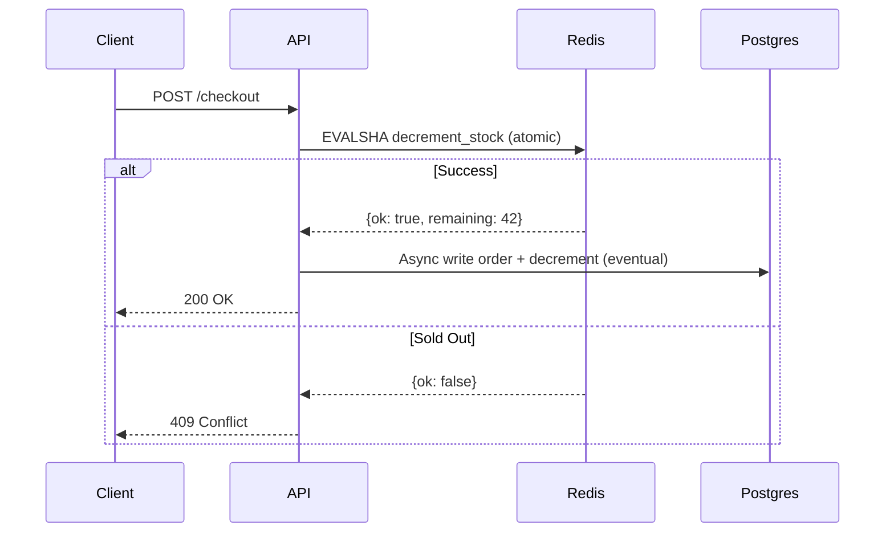
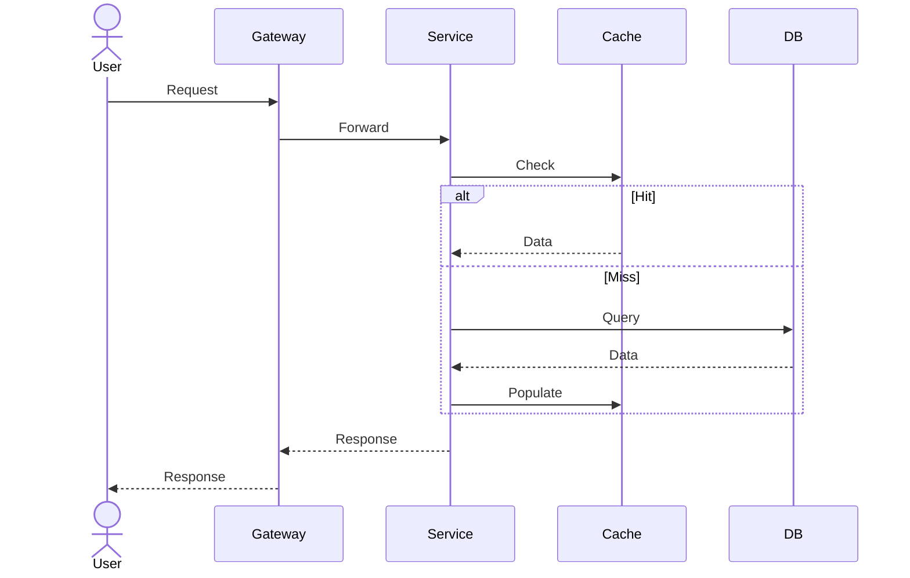
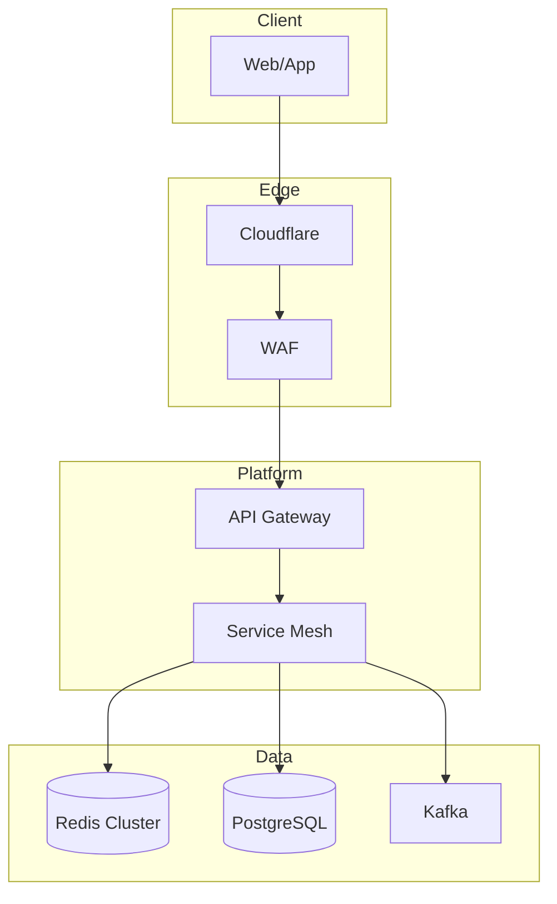

# Case Study Template: Technical Deep-Dive Design Doc

## Metadata
- **Title**: Case Study: How We Solved [The Bottleneck]
- **Author**: [Name/Handle]
- **Date**: [YYYY-MM-DD]
- **Tags**: [performance, database, caching, scaling, distributed-systems, etc.]
- **Status**: [Draft / In Review / Published]
- **Repo/Link**: [GitHub PR, internal doc, blog post URL]

---

## 1. Executive Summary (TL;DR)
**2-3 sentences max.** What broke, what you did, what the outcome was.
> Example: "Our ticketing API melted at 5k RPS due to row-level locking in Postgres. We moved inventory decrements to atomic Redis operations, achieving 50k RPS with p99 < 20ms—on the same hardware."

---

## 2. Context & Background

### 2.1 System Overview
- **Service/Component**: [Name, repo, team ownership]
- **Architecture Diagram**: [Link to diagram or embed mermaid]
- **Traffic Profile**: [QPS, peak/avg, read vs write ratio, data volume]
- **SLA/SLO**: [Latency targets, availability, error budget]

### 2.2 The Incident / Trigger
- **When**: [Date/time, timezone]
- **Duration**: [How long degraded/outage lasted]
- **Impact**: [Users affected, revenue lost, error rate, latency degradation]
- **Alert**: [What fired, how detected]

---

## 3. Problem Analysis

### 3.1 What Broke (Symptoms)
| Metric | Normal | During Incident |
|--------|--------|-----------------|
| p99 Latency | 45ms | 30s+ |
| Error Rate | 0.01% | 12% |
| DB CPU | 30% | 100% |
| Queue Depth | 5 | 50,000 |

### 3.2 Root Cause Analysis
- **Primary Cause**: [e.g., "SELECT FOR UPDATE on inventory table serialized all writes"]
- **Contributing Factors**:
  - [Missing index / bad query plan]
  - [No connection pooling / connection exhaustion]
  - [Single-threaded bottleneck in application code]
  - [Cache stampede / thundering herd]
- **Why It Wasn't Caught Earlier**: [Load test gap, missing alert, staging != prod]

### 3.3 Constraints & Non-Goals
| Constraint | Detail |
|------------|--------|
| **Performance Target** | 10k RPS, p99 < 50ms |
| **Budget** | No new infra; existing Redis cluster only |
| **Downtime Window** | Zero-downtime deploy required |
| **Data Consistency** | Strong consistency for inventory; eventual OK for analytics |
| **Non-Goals** | [e.g., "Not rewriting the entire checkout flow"] |

---

## 4. Solution Design

### 4.1 High-Level Approach
[One paragraph: the core idea. e.g., "Move hot inventory counters from Postgres to Redis with Lua scripting for atomicity."]

### 4.2 Architecture Diagram (New Flow)


### 4.3 Component Changes
| Component | Before | After | Risk |
|-----------|--------|-------|------|
| Inventory Check | `SELECT * FROM inventory WHERE id=? FOR UPDATE` | `redis.call('decr', key)` | Low |
| Order Write | Single transaction | Async via Kafka/CDC | Medium |
| Read Path | Postgres | Redis (cache-aside) | Low |

---

## 5. Implementation Deep-Dive

### 5.1 Core Algorithm / Data Structure
```lua
-- Redis Lua script: atomic decrement with floor at 0
-- KEYS[1] = inventory:{sku}:stock
-- Returns: {success: 1/0, remaining: N}
local stock = tonumber(redis.call('GET', KEYS[1]) or '0')
if stock > 0 then
    redis.call('DECR', KEYS[1])
    return {1, stock - 1}
end
return {0, 0}
```

### 5.2 Key Code Changes
**File**: `services/inventory/redis_inventory.go`
```go
func (r *RedisInventory) Reserve(ctx context.Context, sku string, qty int) (bool, error) {
    key := fmt.Sprintf("inventory:%s:stock", sku)
    script := redis.NewScript(reserveScript)
    result, err := script.Run(ctx, r.client, key, qty).Slice()
    // ...
}
```

### 5.3 Migration Strategy
1. **Shadow Mode** (Week 1): Dual-write to Redis + Postgres; compare results
2. **Canary** (Week 2): 5% traffic to new path; monitor error rate / drift
3. **Full Cutover** (Week 3): Switch read path to Redis; Postgres becomes async sink
4. **Cleanup** (Week 4): Remove `FOR UPDATE` logic; add reconciliation job

### 5.4 Testing Strategy
- **Unit**: Lua script edge cases (negative stock, key missing, TTL expiry)
- **Integration**: Jepsen-style concurrent decrement test (10k parallel clients)
- **Load**: k6 script simulating flash sale (ramp to 50k RPS)
- **Chaos**: Redis failover during load; verify fallback to Postgres

---

## 6. Results & Metrics

### 6.1 Before vs After
| Metric | Before | After | Improvement |
|--------|--------|-------|-------------|
| Peak RPS Handled | 2,000 | 50,000 | **25x** |
| p99 Latency | 30,000ms | 18ms | **1,666x** |
| Error Rate (peak) | 12% | 0.001% | **12,000x** |
| DB CPU (peak) | 100% | 15% | — |
| Infra Cost | $2,400/mo | $2,400/mo | **0%** |

### 6.2 Dashboards & Alerts Added
- [Grafana dashboard: Inventory Redis health]
- [Alert: Redis stock drift > 1% vs Postgres]
- [Alert: Lua script error rate > 0.1%]

---

## 7. Trade-offs & Retrospective

### 7.1 What We Gave Up
| Trade-off | Decision | Mitigation |
|-----------|----------|------------|
| **Strong Consistency** | Eventual consistency for inventory counts | Reconciliation job runs every 60s; admin API for manual correction |
| **Operational Complexity** | Added Redis as critical path | Runbook: Redis failover < 30s; fallback to Postgres with rate-limit |
| **Debugging Difficulty** | Distributed trace across Redis + Postgres | OpenTelemetry spans on both paths; correlation IDs |

### 7.2 Failure Scenarios & Handling
| Scenario | Detection | Fallback |
|----------|-----------|----------|
| Redis OOM / Crash | Health check + circuit breaker | Direct Postgres writes with `FOR UPDATE` + token bucket (100 RPS) |
| Lua Script Bug | Error rate alert | Feature flag to disable new path instantly |
| Stock Drift | Reconciliation job diff > threshold | Alert + auto-correct from Postgres source of truth |

### 7.3 What We'd Do Differently
- [e.g., "Start with Redis Cluster from day one; single-instance was a SPOF"]
- [e.g., "Invest in chaos testing earlier—found the fallback path bug in prod"]
- [e.g., "Add distributed tracing before the migration, not after"]

---

## 8. Operational Runbook

### 8.1 Deploy Checklist
- [ ] Lua script loaded to all Redis shards (`SCRIPT LOAD`)
- [ ] Feature flag `use_redis_inventory` default OFF
- [ ] Canary config: 5% traffic, 30min soak
- [ ] Rollback plan tested: flag OFF + drain connections

### 8.2 Monitoring Queries
```promql
# Redis stock vs Postgres drift
abs(redis_inventory_stock - pg_inventory_stock) / pg_inventory_stock > 0.01

# Lua script error rate
rate(redis_lua_errors_total[5m]) > 0.001
```

### 8.3 Incident Response
1. **Redis Down**: Flip feature flag → traffic routes to Postgres fallback
2. **Stock Drift**: Run `make reconcile-inventory`; alert on-call if > 100 SKUs affected
3. **Latency Spike**: Check `redis_slowlog`; scale read replicas if needed

---

## 9. Related Artifacts
- **PR/Commit**: [Link]
- **Design Doc**: [Link]
- **Load Test Results**: [Link to k6/Grafana snapshot]
- **Postmortem**: [Link]
- **Runbook**: [Link to internal wiki]

---

## 10. Template Usage Guide

### When to Use This Template
- Production incidents with clear technical root cause
- Performance optimization projects with measurable outcomes
- Architecture migrations (DB → cache, sync → async, monolith → service)

### How to Fill It
1. **Start with Section 3** (Problem) during/after incident
2. **Fill Section 4-5** during design & implementation
3. **Complete Section 6-7** after production validation
4. **Section 8** is living—update as you operate it

### Quality Bar
- Every claim in Section 6 backed by dashboard screenshot or log link
- Trade-offs (Section 7) must be honest—no "no downsides"
- Runbook (Section 8) must be executable by on-call who didn't build it

---

## Appendix: Mermaid Diagram Templates

### Sequence Diagram (Request Flow)


### Architecture Diagram (Component View)


---

*Template Version: 2.0 | Last Updated: 2026-07-16*
*Inspired by: Google SRE Book, Netflix Tech Blog, Dan Luu's Postmortems, AWS Well-Architected*