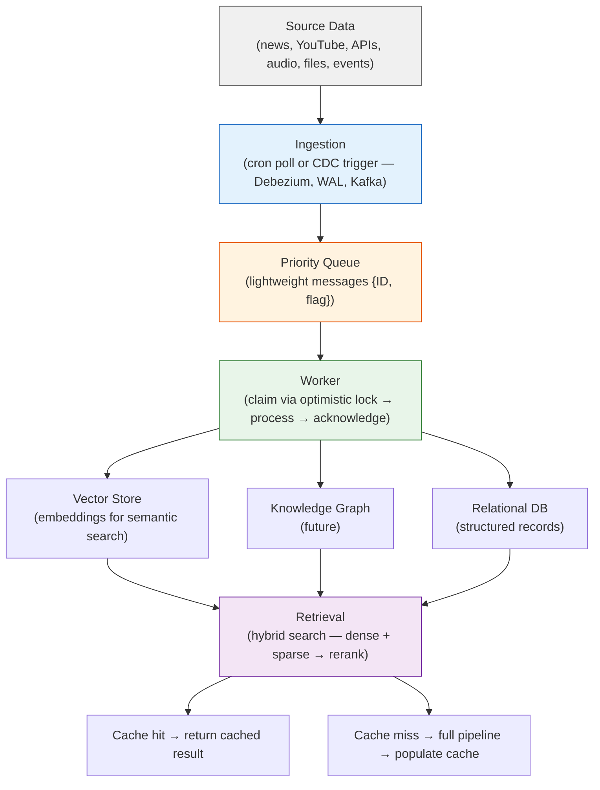

# Data Pipeline Architecture

A universal data ingestion and processing pipeline. Not RAG-specific — the same patterns apply to any system that ingests raw data, processes it through a state machine, and serves it via search or inference.

## Pipeline Stages

## System Constraints

- **Scale**: Monitor queue depth, processing time per request, traffic (req/s) vs CPU.
- **Durability**: Acknowledge/delete messages only after successful processing. Backup: global remote replicas or S3.
- **Idempotency**: Version-based optimistic locking prevents duplicate processing from at-least-once delivery.

## Files

| File | Domain |
|------|--------|
| [ingestion.md](./ingestion.md) | Data collection, cron vs CDC, priority queue, error handling, DLQ |
| [idempotency.md](./idempotency.md) | Optimistic locking, version-based state machine, worker claim flow |
| [retrieval.md](./retrieval.md) | Hybrid search, sparse/dense vectors, reranking, evaluation loop |
| [infrastructure.md](./infrastructure.md) | Semantic caching, billion-row scaling, partitioning, hot state offload |
