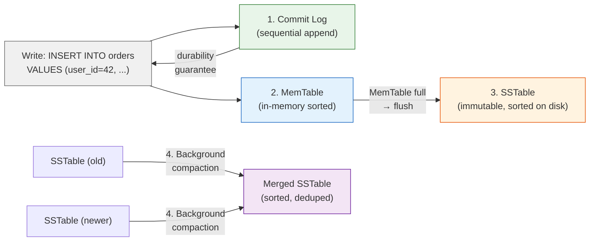
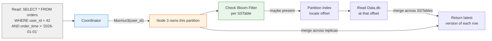

# Cassandra Architecture

For the underlying mechanics of LSM-Trees, Merkle Trees, and Bloom Filters,
see [Storage Engines](../storage-engines.md) and [Database Algorithms](../algorithms.md).

This deep dive examines Cassandra's internal architecture, storage model, and indexing design. Understanding these trade-offs helps data engineers and platform teams select the right database for pipeline workloads and avoid the sharp edges that bite production deployments.

### AP in CAP always-writable, eventual consistency

Most databases choose consistency or availability when a partition occurs. Cassandra chooses availability every time. Every node accepts writes at any time no master to fail over, no replica to promote. A client writes to any node, the node accepts locally and propagates asynchronously to the replicas responsible for that key range.

When you have multiple clients writing to the same key simultaneously on different nodes, Cassandra resolves conflicts with last-write-wins using client-provided timestamps the highest timestamp wins, and if timestamps are equal, the lexicographically larger value wins. So the "correct" value depends on clock synchronization between clients, not on the application's intended order.

When someone uses Cassandra for financial transactions and two concurrent requests debit the same account on different nodes, both nodes accept the writes (no locking, no coordination). Both writes carry timestamps from different client machines. The "later" write wins based on which clock was slightly ahead, and the other write is silently discarded. Money disappears. Cassandra offers Paxos-based lightweight transactions for linearizable writes, but they're slow (4-round-trip Paxos per operation) and limited to a single partition key.

**If you're thinking about CP like HBase:** HBase is CP in the CAP theorem it uses a single master coordinated through ZooKeeper. If the master fails, writes pause until a new master is elected. Cassandra chose AP so the cluster never stops accepting writes, even during node failures ideal for write-heavy ingestion but unsuitable for strongly consistent workloads without careful consistency management.

---

### LSM-Tree for linear write scaling

Traditional B-Tree databases write data in-place updating a row modifies the page where it lives, requiring random I/O. Cassandra uses an LSM-Tree (Log-Structured Merge-Tree). Instead of modifying pages in place, it buffers writes in memory inside a structure called a MemTable a sorted buffer that accumulates new data. When the MemTable fills, it flushes to disk as an SSTable (Sorted String Table) a read-only file that never changes after creation, so all writes are sequential appends. Over time, many SSTables accumulate for the same rows, so a background process called compaction reads and merges them, combining updates and discarding tombstones (deletion markers).

When you write in Cassandra, it's always sequential append never in-place update. Write throughput scales nearly linearly with nodes because consistent hashing distributes data evenly. There's no read-before-write Cassandra just appends a new version and relies on compaction to resolve the final state. But LSM-Trees create write amplification of 10-30x: every write goes to commit log, MemTable, SSTable flush, and then compaction reads and rewrites the same data multiple times.

When someone runs Cassandra on spinning HDDs without enough memory, compaction reads and rewrites the same 100GB of SSTables repeatedly. The disk spends 100% of its IOPS on compaction, leaving zero capacity for live reads and writes. Throughput drops to single-digit operations per second. SSDs are strongly recommended for any Cassandra deployment write amplification requires high random-read performance for compaction.

**If you're thinking about B-Tree like PostgreSQL:** B-Trees modify pages in place, generating random I/O for every write. On HDDs, random I/O is 10-100x slower than sequential. LSM-Trees eliminate random writes at the cost of read overhead. Cassandra optimizes for "maximum write throughput at any scale" over "lowest read latency for a single row."

---

### Partition key defines everything

Cassandra distributes data by `Murmur3(partition_key)` a hash of the partition key decides which node owns the row. All rows with the same partition key live together on the same node. Within a partition, clustering columns determine sort order. This is the fundamental constraint of the data model.

When you design tables in Cassandra, you must design them for your query patterns one table per query is best practice. Every query must include the partition key; queries without it are cluster-wide scans touching every node. The partition key cannot be changed after data is written without creating a new table and migrating all data.

When someone designs a Cassandra table like a relational database `CREATE TABLE users (name TEXT, ...)` with `name` not being the partition key then runs `SELECT * FROM users WHERE name = 'Alice'`, the query must scan every node. With 100 nodes, each scans its local data, the coordinator merges 100 partial results, and a 10ms query becomes 10 seconds. The only fix is creating a new table with `name` as the partition key and migrating all data.

**If you're thinking about secondary indexes like PostgreSQL:** PostgreSQL's secondary indexes are global B-Trees the query planner chooses to use them, and any column can be indexed independently. In Cassandra, a secondary index is local to each node querying a non-partition-key column fans out to every node because the coordinator can't know which node holds matching data without scanning. Cassandra's philosophy is the opposite of relational flexibility: you know your access patterns at design time, so you build your schema around them.

---

### Gossip-based membership no central metadata

Cassandra has no master node and no external metadata store. Every node runs a gossip protocol periodically exchanging state with random peers. Nodes learn about new nodes, failures, and token range ownership through eventual propagation. Failure detection uses a phi-accrual algorithm that tracks inter-arrival times to compute a suspicion level.

When you add a node, you configure it with seed nodes and start it it learns the ring topology through gossip automatically. Removing a node is `nodetool decommission`, which streams data to remaining nodes. But gossip is eventually consistent during a network partition, nodes on each side have different views of membership. Phi-accrual detection requires several gossip rounds to confirm a failure, so a node with a 30-second GC pause may not be marked down before it recovers.

When a node experiences a 30-second GC pause during peak traffic, the gossip protocol detects it as suspicious but doesn't confirm it as down before the GC finishes. Meanwhile, 10 million hinted handoff records accumulated on other nodes each representing a write the paused node was supposed to receive. Replaying 10 million hints on the revived node takes 30 minutes, during which read repair and compaction contend for I/O. The cluster is degraded for an hour.

**If you're thinking about Raft or Paxos for membership:** Raft-based membership (used by etcd, CockroachDB) requires a majority to agree on membership changes slower but consistent. Gossip is faster and decentralized, matching Cassandra's AP design: availability over consistency, even for metadata.

---

### Tunable consistency per query

Cassandra doesn't have a single consistency guarantee every query specifies its own level. `ONE` is fastest (one replica responds), `QUORUM` requires majority agreement, `ALL` requires all replicas. This applies independently to reads and writes.

When you optimize each query for its requirement dashboard reads use `ONE` for speed, payment writes use `QUORUM` for safety you create subtle bugs. A write with `ONE` succeeds after one replica acknowledges, but a subsequent read with `QUORUM` reads from three replicas, potentially none of which received the write. The read returns stale data, and the application behaves inconsistently. Background repair eventually reconciles replicas, but the window of inconsistency can last minutes to hours.

When a shopping cart app uses `QUORUM` for writes and `ONE` for reads, a user adds an item (write succeeds on a QUORUM), then refreshes the page (read hits a replica that hasn't received the write). The cart appears empty. The user adds the item again now there are two copies. Read repair will eventually delete the duplicate, but the user sees a broken experience.

**If you're thinking about defaulting to strong consistency like Spanner:** Strong consistency requires coordination Spanner's TrueTime plus Paxos adds 1-10ms commit-wait on every write. Cassandra's use cases (time-series, IoT, recommendations) are dominated by workloads where eventual consistency is acceptable. Cassandra lets the application choose per operation rather than paying the coordination cost for every operation. If you need strong consistency for all operations, Cassandra is not the right database.

---

**When to reach for it:** Time-series metrics ingestion (millions of writes from sensors/servers), IoT data streams, messaging systems, recommendation engines, any write-heavy workload that needs linear scalability across many nodes, and can tolerate eventual consistency.

**When not to:** Strongly consistent financial transactions (use Spanner or PostgreSQL), complex ad-hoc queries (Cassandra requires query-driven schema design), small datasets (<1TB Cassandra overhead isn't worth it), need native SQL JOINs, or when you need to change query patterns frequently (schema changes in Cassandra are expensive and require data migration).

## Architecture

- **Dynamo-inspired ring topology** every node is identical; no master, no failover; gossip protocol for membership and failure detection
- **Consistent hashing (Murmur3)** data distributed by partition key hash; tunable replication factor across datacenters
- **AP in CAP** prefers availability and partition tolerance; eventual consistency by default; linearizable consistency opt-in via Paxos for lightweight transactions
- **SEDA event-driven architecture** request pipeline stages decoupled by bounded queues; predictable latency under load through back-pressure

## Storage Model

Cassandra uses an **LSM-Tree** storage engine. Writes flow through:

1. **Commit Log** (sequential append for durability)
2. **MemTable** (in-memory sorted structure)
3. **SSTable** (immutable sorted file on disk)

SSTables use a **multi-component format** (Cassandra 5.0 BTI format): `Data.db` (sorted rows),
`Partitions.db` (partition index), `Rows.db` (row index), `Filter.db` (bloom filter),
`Summary.db` (index sampling), and metadata/checksum files.

Data is distributed via **consistent hashing** `Murmur3(partition_key)` maps each row to a node.
The **partition key** part of the PRIMARY KEY determines placement. All rows in a partition are stored
together on one node. **Clustering columns** determine sort order within a partition.

Compaction merges SSTables using one of three strategies:
**Size-Tiered** (merge N files of similar size), **Leveled** (L0 → L1 → L2, non-overlapping exponential levels),
or **Time-Window** (compact within time windows, drop expired windows).

(For LSM-Tree mechanics, see [LSM-Tree](../storage-engines.md#lsm-tree))

## Indexing Model

Cassandra's primary "index" is the partition key hash it tells the coordinator which node owns the data.
**Clustering columns** act as an ordered index within a partition, enabling efficient range scans
(`WHERE partition_key = ? AND clustering_col > ?`).

Secondary indexes are limited and use SSTable-attached storage:
- **SAI (Storage-Attached Indexing)** index files alongside SSTables. Supports prefix and numeric
 range queries. Better performance than legacy SASI.
- **Materialized Views** automatic denormalization. Writes to the base table propagate to view tables
 on different partition keys, enabling different query patterns.

**Best practice**: design tables for your query patterns (one table per query) rather than relying on
secondary indexes.

**Key partition size consideration**: large partitions degrade compaction and repair performance.
Monitor partition sizes and use time-bucketing or composite keys to keep partitions manageable.

(For Bloom Filter and Merkle Tree mechanics, see [Bloom Filters](../algorithms.md#bloom-filters) and [Merkle Trees](../algorithms.md#merkle-trees))
