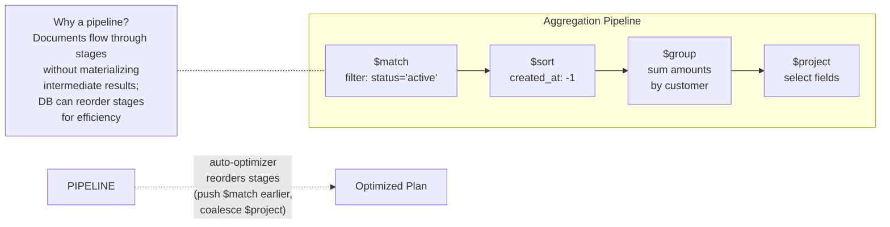
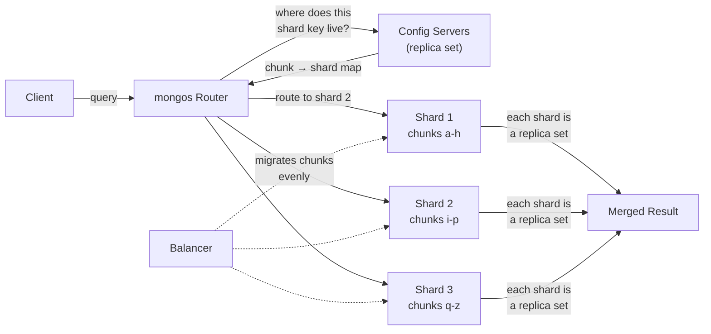

# MongoDB — Architecture

> For the underlying mechanics of B-Trees, WAL, and related algorithms,
> see [Storage Engines](../storage-engines.md) and [Database Algorithms](../algorithms.md).

## Why This Exists

MongoDB is the document database for flexible schemas and horizontal scale — built for applications that need to iterate quickly, store nested JSON-like documents, and scale out across many machines without manual sharding. It emerged because relational databases forced rigid schemas and painful migrations onto developers building web applications with rapidly changing data models.

**What it's for:** Rapid prototyping, content management systems, catalogs with variable product attributes, gaming (player profiles with dynamic fields), IoT event ingestion, real-time analytics aggregations — anything where the schema changes frequently or documents have deeply nested structure.

---

### BSON documents — no schema, no migrations

In a relational database, adding a field means `ALTER TABLE` — locking the table, writing a migration script, potentially hours of downtime. MongoDB stores documents as BSON (Binary JSON — a compact binary format that embeds type information alongside field values, making it faster to parse and more space-efficient than plain text JSON) in WiredTiger B-Trees, and by default a collection imposes no schema — one document can have fields another doesn't. Adding a field is just writing it to one document.

When you operate without schema validation, you get development speed — teams change document structure with every deploy, no migration scripts. But there's no safety net. A query summing `price` across all documents silently returns `NaN` if even one document stores `price` as a string. Renaming a field, trivial in SQL with `ALTER TABLE … RENAME COLUMN`, requires a script that touches every existing document.

When a production app launches with no schema validation because "we're moving fast," and one microservice writes `price: "free"` while another expects a number, the aggregation pipeline for the weekly revenue report silently returns `NaN`. The finance team reports "zero revenue" for a week before anyone discovers the type mismatch in a single document. Schema validation has been opt-in since MongoDB 3.6 — exactly for this reason — but it's not the default.

**If you're thinking about enforcing schemas strictly like PostgreSQL:** Strict schemas prevent data corruption at the cost of iteration speed. MongoDB's philosophy is "velocity first, correctness later" — opt into validation when the schema is stable. PostgreSQL makes you define columns up front; MongoDB lets you discover the schema through usage.

---

### Embedding over joining — the aggregation pipeline

Relational databases normalize data into separate tables and use JOINs to reconstruct it. MongoDB stores related data together — a user document contains addresses as an array, an order document contains line items as subdocuments. The Aggregation Pipeline streams documents through stages like `$match`, `$sort`, `$group`, `$project` instead of using SQL JOINs.

When you embed related data, reading a user and their 50 most recent orders is a single query. But embedding duplicates data and creates update anomalies — changing an order's status means finding every copy embedded in different documents and modifying each one. The `$lookup` stage offers JOIN-like behavior, but it issues a separate subquery for every input document — a join of 10,000 documents generates 10,000 subqueries.

When someone models a social graph with embedding — storing 10,000 follower IDs as an array in the user document — the document may exceed the 16MB BSON limit. Even if it fits, loading the profile reads 10,000 follower IDs the page doesn't display. And the embedding decision is hard to reverse: changing from embedding to referencing requires rewriting every query.

**If you're thinking about SQL JOINs like relational databases:** SQL JOINs are a solved problem — the optimizer finds the best join order, index strategy, and algorithm. MongoDB chose the document model to avoid JOINs for common web patterns (user + profile, order + line items). When your data fits an aggregate pattern, MongoDB is fast and natural. When your data is highly relational, you face a choice between embedding (update anomalies) and application-level joins (N+1 queries).

---

### Built-in sharding — but the shard key is forever

Before MongoDB, horizontal scaling meant application-level sharding — routing queries to the correct database by hashing a key in application code. MongoDB built sharding into the database: a `mongos` router layer, a config server for metadata, and shard replica sets for data. Data splits into chunks (128MB by default, defined by shard key ranges), and a balancer automatically migrates chunks between shards.

When you add a shard, you provision the node and the balancer redistributes chunks. But changing the shard key later is a heavy operation — MongoDB 5.0 added online resharding (`reshardCollection`), but it requires re-distributing every document across all nodes and is a multi-day affair at scale. When you choose a monotonically increasing shard key like `created_at`, all writes hit the shard owning the current timestamp range — one shard handles 100% of write throughput while others sit idle. A low-cardinality key like `status` with 3 values can never split into more than 3 chunks.

When an event-ingestion system shards on `created_at` because "it's the natural way to query recent events," every write goes to the shard owning "right now." The balancer migrates chunks from the hot shard, but by the time one chunk moves, several more have filled up. Write throughput is permanently capped at one shard's capacity. The shard key cannot be changed — the only fix is dumping every document, re-sharding with a hashed key, and reloading. A multi-day operation on a cluster with 100M documents.

**If you're thinking about changing the shard key later:** Changing the shard key requires redistributing every document across all nodes — effectively a full cluster rebuild. MongoDB chose immutability over supporting online re-sharding, which most distributed databases don't support either. Spanner handles this differently with key-range partitioning and automatic split/merge — hot splits are automatically balanced.

---

### Flexible indexes for document fields

MongoDB indexes any field or subdocument path with B-Trees. Compound indexes follow the ESR rule (Equality first for filtering, Sort next for ordering, Range last for boundaries — because MongoDB can only use one index for both filtering and sorting when the equality field comes first). Array fields automatically use multikey indexes — one index entry per array element. Additional types include text, geospatial, hashed, TTL, and wildcard indexes.

When you use a multikey index on an array field, there are limitations that aren't surfaced at index creation: multikey indexes cannot support covered queries (the projection fetches from the document, not the index), and compound indexes after an array field cannot include array fields from other paths.

When someone creates a compound index `(category, price)` where `category` is an array, MongoDB silently creates a multikey index. The `price` part of the compound index becomes partially disabled — every index lookup fetches the full document regardless of whether all required fields are in the index. Query performance degrades with no error. The only fix is dropping and recreating the index knowing that `category` is an array.

**If you're thinking about warning on multikey creation:** MongoDB's philosophy is "do what the developer means" — if the field is an array, a multikey index is the only option. Warning on every multikey creation would be noisy since many are intentional. The trade-off is documented but not surfaced in the index creation command.

---

### Developer velocity over relational integrity

MongoDB deliberately excludes features that slow down prototyping: no foreign keys, no multi-document ACID before 4.0, no SQL JOINs. A new collection is created implicitly on first insert — no `CREATE TABLE`, no schema definition.

When you model relational data like orders with line items, you face a choice: embed everything (duplication and update anomalies) or do application-level joins (N+1 queries). Multi-document transactions were added in MongoDB 4.0 and support cross-shard operations since 4.2, but distributed transactions across shards are slower than single-shard ones due to two-phase commit coordination.

When a financial application models a ledger as two separate operations — `db.debits.insertOne(...)` and `db.credits.insertOne(...)` — a server crash after the debit but before the credit causes permanent inconsistency. The debit is recorded, the credit is lost. Before 4.0, there was no transaction to wrap both operations. After 4.2, the transaction works across shards but pays the cost of two-phase commit — latency and throughput are significantly worse than single-shard transactions.

**If you're thinking about distributed ACID across shards:** MongoDB supports distributed transactions across shards since 4.2, but they require two-phase commit coordination — adding latency and reducing throughput compared to single-shard transactions. If you need cross-shard ACID with global external consistency, you need Spanner or CockroachDB.

---

**When to reach for it:** Rapid prototyping (schema evolves daily), content with variable structure (product catalogs, CMS), need to scale writes horizontally without manual sharding, embed-heavy data models (user + profile + settings stored together), real-time aggregation pipelines.

**When not to:** Strong consistency across multiple documents (multi-document ACID across shards is expensive due to 2PC), complex JOIN-heavy relational data (use PostgreSQL), small datasets where sharding overhead isn't worth it, need referential integrity with foreign keys, or any workload where query patterns aren't known in advance (shard key must be chosen upfront).

## Architecture

- **Document-level concurrency** — multiple clients modify different documents in the same collection simultaneously; optimistic concurrency control with intent locks at global, database, and collection levels
- **Snapshot isolation (MVCC)** — each operation gets a point-in-time snapshot; checkpoints every 60s flush consistent views to disk
- **Journal (WAL) for durability** — journal persists data modifications between checkpoints; Snappy-compressed, replayed on crash recovery
- **Dual cache architecture** — WiredTiger internal cache (uncompressed data) + OS filesystem cache (compressed on-disk format); internal cache defaults to 50% of (RAM - 1GB)

## Storage Model

MongoDB uses the **WiredTiger** storage engine (default since 3.2). WiredTiger uses **B-Trees** for
both data and indexes, with page-level compression (Snappy default, Zlib, Zstd).

Documents are stored as **BSON** (Binary JSON). Each document has an `_id` field — a 12-byte ObjectId
by default. Document size limit is 16MB; GridFS splits larger files into 255KB chunk documents.

Write path: **Journal (WAL)** → **WiredTiger Cache** → **Checkpoint** (every 60s, dirty pages flushed to disk).
The journal is 100MB per file, pruned after checkpoints.

(For B-Tree mechanics, see [B-Tree](../storage-engines.md#b-tree))

## Indexing Model

MongoDB indexes are **B-Trees** built over document fields. Index types include: single field, compound
(leftmost prefix rule), multikey (array fields — one index entry per element), text (inverted index),
geospatial (2dsphere), hashed (sharding), TTL (auto-delete), and wildcard (dynamic field coverage).

Compound indexes follow the **ESR rule** (Equality first, Sort next, Range last) for maximum selectivity.
A covered query reads from the index without fetching documents when the index stores all projected fields.

**Sharding architecture**: `mongos` routers receive queries, consult config servers (a replica set storing
cluster metadata), and fan out to shards. Data is split into **chunks** (128MB default contiguous shard-key
ranges). The **balancer** migrates chunks between shards. Choice of shard key is critical:
hashed (even distribution, no range queries) vs ranged (range queries supported, hot-spot risk) vs zones
(geo-pinning).

