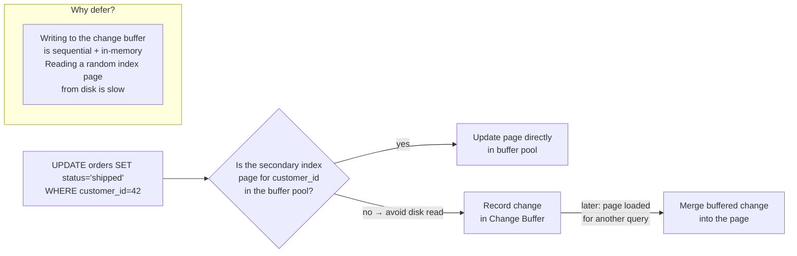

# MySQL (InnoDB) — Architecture

> For the underlying mechanics of B-Trees, WAL, MVCC, and related algorithms,
> see [Storage Engines](../storage-engines.md) and [Database Algorithms](../algorithms.md).

## Why This Exists

MySQL with InnoDB is the read-heavy OLTP workhorse — built for simplicity and performance over extensibility and standards pedantry. It became the default database for the LAMP stack (Linux, Apache, MySQL, PHP/Python/Perl) in the 2000s because it was fast, easy to set up, and "just worked" for web applications.

**What it's for:** High-read-volume web applications, e-commerce catalogs, CMS platforms, WordPress, any OLTP workload where PK lookups and simple queries dominate over complex joins and analytics.

---

### PK is a clustered B+Tree

InnoDB makes the primary key the physical storage itself — the PK B+Tree's leaf pages hold full rows, ordered by key value. There's no separate heap, no CTID, no double-hop lookup. A secondary index stores `(column_value, pk_value)`, so finding a row through a secondary index takes two steps: walk the secondary B+Tree to find the PK value, then walk the clustered B+Tree to find the row.

When you look up by PK, it's a single B+Tree traversal — one hop instead of two, and range scans on the PK are sequential disk reads because rows are physically adjacent by key order. But the PK value is embedded in every secondary index entry, so the wider the PK, the bigger every index gets. A UUID PK (16 bytes) adds 12 extra bytes per secondary index entry compared to an auto-increment INT (4 bytes) — with 10 indexes and 10M rows, that's 1.2GB of wasted space. And `PRIMARY KEY (a, b)` sorts rows by `a`, then `b` — so `WHERE b = something` cannot use the PK index at all since `b` isn't the leftmost column.

When someone puts a UUID PK on a table and does batch inserts, every insert scatters across the entire B+Tree instead of appending at the end — 50% of inserts cause page splits, the buffer pool thrashes, and write amplification hits 5-10x before touching user data. The same table with an auto-increment INT PK runs 5x faster with zero fragmentation. And when someone defines `PRIMARY KEY (tenant_id, created_at)` and queries `WHERE created_at > yesterday`, they get a full table scan because `created_at` is the second PK column — most developers don't realize the PK is not an index on each column individually.

**If you're thinking about heap like PostgreSQL:** Heap storage avoids PK fragmentation — rows go wherever there's free space. But that means every index lookup is two hops (index → CTID → page), and every UPDATE changes the CTID, rewriting all index entries regardless of which column changed. InnoDB trades this for single-hop PK lookups — the most common pattern in web apps.

---

### Buffer pool + change buffer as the write path

InnoDB's buffer pool is the center of everything — every page read or write goes through it. When you modify a secondary index page that isn't in memory, InnoDB could load the page from disk (a random read), modify it, and write it back. Instead, the change buffer records the modification in memory and the system tablespace — deferring the random read until the page is naturally loaded by another query.

This turns random I/O during writes into sequential log writes, which are much cheaper. But the change buffer is capped at 25% of the buffer pool. When it fills up, further buffered changes block and force immediate page reads — the bill comes due all at once. The Adaptive Hash Index also watches B-Tree access patterns and builds hash table entries for hot paths, so subsequent point lookups skip the B-Tree entirely.

When you have heavy writes on a table with 20 secondary indexes and the buffer pool is too small to cache any of them, the change buffer fills within seconds. After that, every secondary index write forces a random page read from disk. Throughput drops from 100k writes/s to 5k writes/s — but no EXPLAIN or slow query log shows this. The only symptom is elevated IOPS on the storage device.

**If you're thinking about writing to the index page directly:** Writing directly to a cold index page means loading it from disk first — a random read that takes ~100μs on SSD or ~10ms on HDD. The change buffer batches those random reads into sequential log writes that are 10-100x cheaper. But it has finite capacity — when it fills, every write pays the random read cost.

---

### Pluggable storage engines per table

MySQL lets each table use a different storage engine — InnoDB (ACID, row-level locking), MyISAM (full-text search, table-level locking), MEMORY (heap tables), CSV, and others. The choice is per table, not per database.

When you JOIN an InnoDB table with a MyISAM table, the query operates with two different locking models — row-level on one side, table-level on the other. Deadlocks become harder to diagnose because the locking behavior differs per engine. MyISAM has no crash recovery either — an unexpected server shutdown corrupts MyISAM tables silently, requiring manual `REPAIR TABLE`.

When someone deploys on MySQL 5.0 with the default MyISAM engine thinking "it's faster for reads," and a power failure during business hours corrupts critical tables, the application goes down while the DBA runs manual `REPAIR TABLE` — hours on a 100GB table. InnoDB became the default in MySQL 5.5 (2010) specifically because this scenario was too common.

**If you're thinking about one engine like PostgreSQL:** A single engine means simpler operations and no locking surprises during queries. MySQL's pluggable architecture was a competitive advantage in the 2000s — MyISAM was genuinely faster for read-only and full-text workloads, and MEMORY tables provided in-memory acceleration. Over time, InnoDB absorbed most of these advantages, but per-table choice remains for legacy compatibility.

---

### Relaxed SQL standards for convenience

MySQL deliberately diverges from the SQL standard to make development easier. It uses `AUTO_INCREMENT` instead of standard `GENERATED AS IDENTITY`, provides `INSERT … ON DUPLICATE KEY UPDATE` instead of standard `MERGE` or `ON CONFLICT`, and allows `GROUP BY` without listing all non-aggregated columns (`ONLY_FULL_GROUP_BY` is off by default in many configurations).

When you migrate INTO MySQL, this is convenient — you can port code from another database with minimal rewriting. But when you want to migrate OUT to a standards-compliant database like PostgreSQL or Oracle, every `AUTO_INCREMENT` must become `SERIAL` or `IDENTITY`, every upsert must become `ON CONFLICT … DO UPDATE`, and every lax GROUP BY must become proper aggregation.

When a startup builds on MySQL-specific syntax thinking "we'll handle migration later," and three years later needs PostgreSQL's recursive CTEs, the migration estimate comes back as two weeks of query rewriting across 50+ SQL files and 20 table schemas. Most teams abandon the migration and live with MySQL's limitations — the database choice has become permanent.

**If you're thinking about following the SQL standard like PostgreSQL:** Strict compliance means portable code — you can switch databases without rewriting queries. MySQL chose developer convenience over portability, making it easier to adopt in the LAMP era but harder to leave.

---

**When to reach for it:** Read-heavy web apps, WordPress/Drupal/Joomla, e-commerce catalogs, any workload with simple PK lookups and sequential auto-increment keys, need a mature ecosystem with vast community knowledge.

**When not to:** Complex analytics queries (use PostgreSQL), write-heavy append-only workloads (use Cassandra), need strict standards compliance (use PostgreSQL or SQL Server), multi-master replication (MySQL group replication is fragile — use CockroachDB or Spanner), or any workload where UUID PKs are required.

## Architecture

- **Clustered B+Tree primary key** — the PK is the row's physical location; no separate heap, no CTID double-hop
- **Doublewrite buffer** — pages written twice before flushing to tablespace, preventing partial-page corruption on crash
- **Buffer pool as the center of gravity** — all reads and writes flow through the buffer pool; change buffer defers secondary index page flushes to avoid random I/O
- **Redo log + undo log** — redo for crash recovery (physical logging), undo for MVCC and rollback (logical logging)

## Storage Model

InnoDB uses a **clustered B+Tree**. The primary key IS the row's physical location — leaf pages contain
full rows ordered by PK. There is no separate heap, no CTID. If you don't define a PK, InnoDB generates
a hidden 6-byte `DB_ROW_ID`.

Sequential PKs (auto-increment) always append to the rightmost leaf — minimal page splits.
Random PKs (UUID) scatter inserts across the entire tree, fragmenting pages and bloating the buffer pool.

The **buffer pool** caches index pages, data pages, undo pages, and change buffer entries.
Pages are 16KB. Each page stores its LSN for crash recovery — pages with LSN >= checkpoint need no replay.

(For B-Tree mechanics, see [B-Tree](../storage-engines.md#b-tree))

## Indexing Model

Secondary indexes store `(key, primary_key)` in a separate B+Tree. Every secondary lookup follows a
**double-hop**: secondary index → PK → clustered index. This makes covering indexes critical —
include all queried columns in the secondary index to avoid the second hop.

Because the PK is the row locator, PK updates cascade to **every** secondary index. A narrow PK
(e.g., `BIGINT`) keeps all secondary indexes compact.

**Change Buffer** optimizes this: when a DML modifies a secondary index page not in the buffer pool,
InnoDB records the change in the change buffer (persistent, in system tablespace) without loading
the page from disk. When the page is eventually loaded, buffered changes merge. This eliminates
random reads during writes — especially impactful for indexes with poor cache hit rates.

**Adaptive Hash Index**: InnoDB monitors B-Tree access patterns. When the same page is repeatedly
accessed by the same key prefix, it builds a hash table in the buffer pool. Subsequent point lookups
skip the B-Tree and hit O(1). Not persistent (rebuilt on restart), only equality queries.

(For B-Tree index structure and MVCC undo chain, see [B-Tree](../storage-engines.md#b-tree) and [MVCC](../algorithms.md#mvcc-multi-version-concurrency-control))
