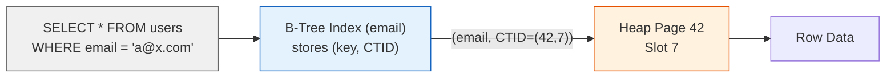
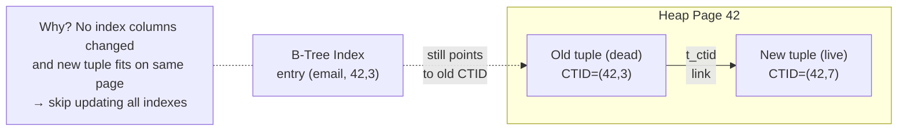
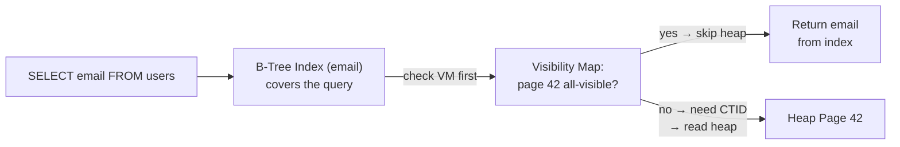

# PostgreSQL Architecture

> For the underlying mechanics of B-Trees, heap storage, WAL, MVCC, and related algorithms,
> see [Storage Engines](../storage-engines.md) and [Database Algorithms](../algorithms.md).


### PK is a B-Tree index pointing to heap

In most relational databases, the primary key determines where the row is stored physically. PostgreSQL chose differently. The SQL standard has no definition of a clustered index, so PG treats the table as an unordered heap of rows and the PK as just another B-Tree index pointing to them no special treatment.

When you do a PK lookup in PG, it takes two steps: first it finds the CTID (a disk address like `page 3, slot 7`) from the index, then it reads the actual row from the heap at that address. When you UPDATE a row, PG writes a new version somewhere else in the heap, so the CTID changes meaning every index on the table has to insert a new entry pointing to the new location. With 5 indexes, one UPDATE generates 5 index writes even if you only changed a single column. And when you define `PRIMARY KEY (a, b, c)`, it's a single B-Tree with a concatenated key so `WHERE a = 1` uses the index but `WHERE b = 2` alone does a full table scan, because PG won't infer "if `b` is in the PK it must be indexed."

So when someone coming from MySQL puts a UUID PK on a table with 10 indexes and does frequent `UPDATE last_login`, each login generates 10 extra index writes they never expected. Or when they define `PRIMARY KEY (org_id, user_id)` and query `WHERE user_id = 42`, PG does a full table scan no error, no warning, just slower queries.

**If you're thinking about clustering like InnoDB:** InnoDB stores the row directly in the PK B-Tree, giving a single-hop lookup and no CTID cascade on UPDATE. But that couples the PK to the physical layout changing the PK moves rows on disk, and custom index types like GiST or GIN don't fit a clustered model. PG chose flexibility over optimization.

---

### Process-per-connection

When a client connects to PostgreSQL, the server forks a dedicated OS process. Each backend has its own memory space, its own copy of catalog caches, and its own planner state. Extensions like PostGIS and pgvector load as shared libraries into this process.

A single connection costs about 5-10MB of RAM before any query runs so 500 connections eat 2.5-5GB before touching a single row. This means connection pooling (PgBouncer) becomes mandatory beyond roughly 200 concurrent connections. The planner generates a query plan for every incoming query no plan caching across sessions by default so a trivial `SELECT * FROM users WHERE id = ?` can spend more time planning (1-5ms) than executing.

When you run 1000 direct connections without PgBouncer, the OS spends more time context-switching between processes than doing actual query work throughput drops below what 100 connections with pooling deliver. And when you do 10,000 simple key-lookups per second without prepared statements, each query pays the full optimizer cost and burns a CPU core on planning alone.

**If you're thinking about threads like MySQL:** MySQL uses threads (~200KB per connection instead of ~5MB), so 1000 connections cost only ~200MB. But a crash in one thread can corrupt shared memory and bring down the whole server PG's process model means an extension crash kills only one session.

---

### MVCC with heap + VACUUM

PostgreSQL implements MVCC by writing new row versions directly into the heap. When you UPDATE a row, PG doesn't modify it in place it marks the old version as "dead" and appends a new version wherever there's free space. The old version stays on the page until VACUUM reclaims it.

This means readers never wait for writers concurrent SELECT and UPDATE don't block each other. But dead tuples accumulate in both heap pages and index entries. When a 1M-row table sees constant updates and no vacuum, it can bloat to 10M dead tuples so every sequential scan reads 10x as much data as it should. WAL is append-only as well, so under heavy writes without checkpointing, it grows until the disk fills.

When developers treat PG like InnoDB and don't tune autovacuum, a 1M-row active table with 10M dead tuples causes every sequential scan to read 10x the data and every index scan to follow longer CTID chains through dead space. The database slows down gradually no EXPLAIN says "too many dead tuples," no error says "WAL is filling." The fix is invisible until someone measures table bloat or WAL volume.

**If you're thinking about undo logs like Oracle or InnoDB:** Undo keeps old row versions in a separate segment clean table pages, no dead tuples, no VACUUM needed. But undo is a separate write path with its own management overhead. PG's approach is simpler internally old versions stay where they were and shifts the maintenance burden to the operator.

---

### Index-only scans require the Visibility Map

In PG's heap model, the index entry may point to a dead tuple on a page full of MVCC churn. PG needs proof that a page is clean before it can serve a query from the index alone that proof is the Visibility Map, a per-page bitmap that records "every tuple on this page is visible to all transactions."

When the Visibility Map is clean, a covering index query reads 1 page per row instead of 2 (skipping the heap hop). But only VACUUM updates the VM. Without regular vacuum, every page stays marked dirty, and what should be an index-only scan silently degrades to index plus heap lookup for every row.

When a developer creates a covering index expecting it to serve a dashboard query from the index alone, but autovacuum is too conservative or disabled, the optimizer still plans an index-only scan yet every row visit hits the heap anyway. Query latency doubles with no schema change, no EXPLAIN warning, no error.

**If you're thinking about using the CTID directly like SQL Server's RID:** SQL Server's RID for heap tables has the same staleness problem page splits change RIDs, creating forwarding pointer chains. PG's VM approach separates the proof (a bitmap) from the data (the heap), making index-only scans opt-in based on cleanliness. You check a flag instead of chasing pointers.

---

**When to reach for it:** Complex queries with CTEs/window functions/recursive, geospatial (PostGIS), custom data types, need standards compliance, want to avoid vendor lock-in, need table inheritance/partitioning.

**When not to:** Ultra-high connection counts (>200 without pooling), write-heavy append-only logs (use Cassandra), simple key-value (use Redis), need zero-maintenance embedded (use SQLite), or need a clustered PK with single-hop lookups (use InnoDB).

## Architecture

- **Process-per-connection model** each client connection forks a dedicated OS process; strong isolation at the cost of higher memory per connection
- **Heap storage with MVCC** updates create new row versions in the heap; dead tuples accumulate until VACUUM reclaims space
- **WAL for crash recovery** REDO-only logging; changes written to WAL before data pages, enabling roll-forward recovery without journaled filesystems
- **Extensible core** custom index types, procedural languages, and foreign data wrappers as first-class citizens; even the planner is hookable

## Storage Model

PostgreSQL uses **heap storage** tables are unordered collections of rows in 8KB pages. Each row has a physical identifier: `CTID = (page_number, slot_index)` a direct disk pointer.

New rows go into any page with free space (tracked by the Free Space Map). Updates mark the old row as dead and insert a new version (MVCC in the heap). Dead rows accumulate until `VACUUM` reclaims space and updates the Visibility Map.

(For B-Tree and heap page mechanics, see [B-Tree](../storage-engines.md#b-tree) and [Heap](../storage-engines.md#heap))

## Indexing Model

Indexes are **separate B-Trees** (or GiST, GIN, BRIN, SP-GiST, Hash) that store `(key, CTID)` pairs.
Every index lookup requires **two reads**: index → CTID → heap page.



**HOT (Heap-Only Tuples)**: When you do an UPDATE, PG writes a new tuple with a new CTID (MVCC old tuple stays, marked dead). Because indexes store `(key, CTID)` not a logical row ID every index on the table must get a new entry pointing to the new CTID. This happens on *every* UPDATE regardless of which column was modified, because the CTID itself changed. With 10 indexes, one UPDATE = 10 extra index writes. This is **index write amplification**.

HOT skips all index writes when (1) no indexed column changed and (2) the new tuple fits on the *same* 8KB heap page as the old one. PG chains old→new via `t_ctid` within the page, and the index entry keeps pointing to the old CTID. On lookup, the engine follows the chain to the live version. If the new tuple spills to a different page (no free space in the current one), HOT is lost.



**Index-Only Scans**: PG's double-lookup model normally costs two reads per row: index → CTID → heap. An index-only scan should skip the heap but PG can't trust index data alone: the index entry may point to a dead tuple on a page full of MVCC churn. PG needs proof the page is clean.

The Visibility Map provides that proof a per-page bitmap saying "every tuple on this page is visible to all transactions." When VM = all-visible and the query only needs columns in the index, PG serves from the index alone. Result: 1 read instead of 2 per row.

- Requires a covering index (all query columns in the index)
- VM is updated by VACUUM; without regular VACUUM, dead tuples accumulate and index-only scans degrade to normal index + heap lookups



### Parking Lot Analogy

| Parking Lot | Data Structure | Role |
|-------------|---------------|------|
| Directory | B-Tree | License plate → spot (quick lookup) |
| Parking spots | Heap | Actual cars at physical spots |
| Row status sheet | Visibility Map | Per-row: "clean" (no cars left) or "dirty" (some have left) |

```go
package main

type Position struct{ Row, Spot int }

type Spot struct {
	Plate, Owner string
	Dead bool // "withdrawn" car left
	CTIDRow int // t_ctid: "→ Row X, Spot Y"
	CTIDSpot int
}

func main() {
	directory := map[string]Position{} // B-Tree

	rows := make([][]Spot, 5) // Heap (5 rows, 4 spots each)
	for i := range rows {
		rows[i] = make([]Spot, 4)
	}

	rowStatus := make([]bool, 5) // Visibility Map
	for i := range rowStatus {
		rowStatus[i] = true
	}

	// ── 1. INSERT ──
	directory["ABC123"] = Position{0, 1}
	rows[0][1] = Spot{Plate: "ABC123", Owner: "Alice"}
	rowStatus[0] = true
	// B-Tree: {"ABC123" => (0,1)}
	// Heap: Row 0, Spot 1 = {ABC123, Alice}
	// VM: Row 0 = clean

	// ── 2. HOT: same car shifts spots within Row 0 ──
	rows[0][1].Dead = true
	rows[0][1].CTIDRow = 0
	rows[0][1].CTIDSpot = 3
	rows[0][3] = Spot{Plate: "ABC123", Owner: "Alice"}
	rowStatus[0] = false
	// B-Tree: {"ABC123" => (0,1)} ← unchanged (plate = key didn't change)
	// Heap: Row 0, Spot 1 = {dead, t_ctid → (0,3)}
	// Row 0, Spot 3 = {ABC123, Alice}
	// VM: Row 0 = dirty (dead spot)

	// ── 3. No-HOT: car moves to different row ──
	delete(directory, "ABC123")
	directory["ABC123"] = Position{2, 0}
	rows[0][3].Dead = true
	rows[2][0] = Spot{Plate: "ABC123", Owner: "Alice"}
	rowStatus[0] = false
	// B-Tree: {"ABC123" => (2,0)} ← entry rewritten (plate = key changed)
	// Heap: Row 0, Spot 3 = {dead}
	// Row 2, Spot 0 = {ABC123, Alice}
	// VM: Row 0 = dirty, Row 2 = clean

	// ── 4. Lookup ──
	pos, ok := directory["ABC123"]
	if !ok {
		// not found
	} else if rowStatus[pos.Row] {
		// clean → trust directory, 1 lookup
	} else {
		// dirty → walk to spot, follow t_ctid chain if dead
	}
	_ = pos
}
```

(For B-Tree index structure, see [Indexing](../storage-engines.md#b-tree))
