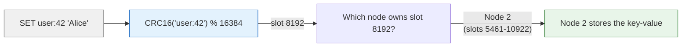
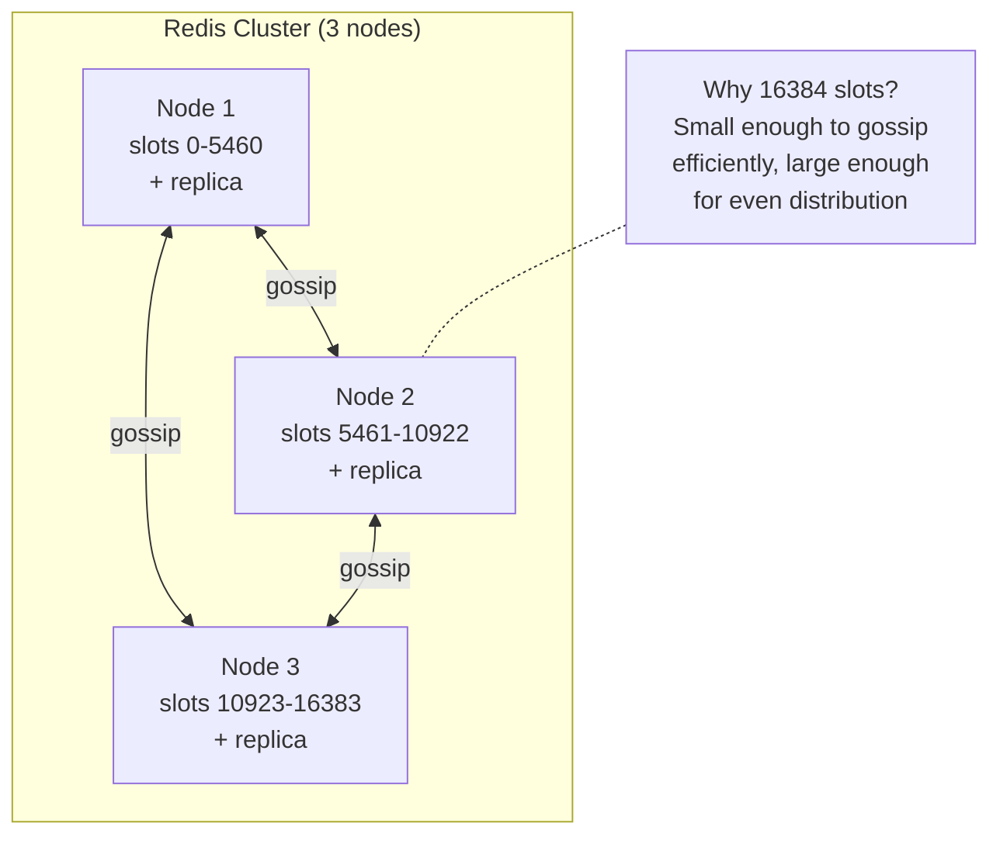

# Redis Architecture

> For the underlying mechanics of B-Trees, LSM-Trees, and WAL,
> see [Storage Engines](../storage-engines.md) and [Database Algorithms](../algorithms.md).

This deep dive examines Redis's internal architecture, storage model, and indexing design. Understanding these trade-offs helps data engineers and platform teams select the right database for pipeline workloads and avoid the sharp edges that bite production deployments.

### Single-threaded event loop

Most databases handle concurrent requests with multiple threads or processes, using locks to coordinate access to shared data. Redis uses a single-threaded event loop all commands execute serially in one thread. There are no locks because there is no contention.

When every command is serialized, operations like `INCR` are automatically atomic no transaction needed. But when one command is slow, it blocks everything. `KEYS *` on a 10M-key database blocks the event loop for seconds. `LRANGE` on a million-element list blocks cache lookups and heartbeats. The single thread also means only one CPU core is used to use more cores, you must run multiple Redis instances in a cluster.

When someone runs `KEYS *` in production because "it's just a debugging command," the event loop blocks for 5 seconds on a 10M-key instance. During those seconds, every cache miss hits the primary database, the connection pool saturates, and the application times out. The fix is migrating to `SCAN` (cursor-based and non-blocking), but the outage has already happened. Redis commands aren't annotated as "this blocks the event loop" the developer must know which commands are O(N).

**If you're thinking about multi-threading like memcached:** Multi-threading requires locks, cache-line coordination, and complex memory management. Memcached uses it for `GET`/`SET` throughput on multiple cores, but can't provide atomic multi-key operations or rich data structures without complex locking. Redis chose simplicity and predictable per-command latency over peak throughput.

---

### Data must fit in RAM

Redis stores every key-value as a pointer in an in-memory hash table. For persistence, it offers two approaches with opposite trade-offs. RDB (Redis Database) forks the process and dumps a point-in-time binary snapshot fast to load on restart because it's a single file read, but you lose anything written after the last snapshot. AOF (Append-Only File) logs every write command as it executes and replays them one by one on restart you control fsync frequency so data loss is at most seconds, but loading is slower since every command must be re-executed. Both reconstruct what was in memory; neither serves live reads. If a key isn't in RAM, Redis can't serve it period.

When you have a 10GB dataset, you need 10GB of RAM. There's no buffer pool or page cache the dataset IS the cache. RDB snapshots fork the server process to write a copy; on a 50GB instance, forking takes seconds, and copy-on-write can temporarily double memory usage if many pages are modified during the snapshot. AOF replay reads every logged command sequentially a 100GB AOF takes minutes to replay before serving any requests.

When someone runs Redis with `maxmemory` set to 90% of physical RAM and an RDB snapshot triggers a fork, the child writes pages, the parent continues serving writes, copy-on-write pages accumulate, and the kernel's OOM killer terminates Redis. The dataset is there one moment and gone the next. No persistence mechanism can serve reads from disk if it doesn't fit in RAM, it's inaccessible.

**If you're thinking about serving from disk like traditional databases:** Serving from disk adds 10-100ms of latency for pages not cached invalidating Redis's value of predictable microsecond latency. Traditional databases use a buffer pool to cache hot data in RAM and serve cold data from disk. Redis chose "all in RAM, all the time" for maximum speed at the cost of dataset size being limited by memory.

---

### Rich data structures as first-class operations

Most key-value stores offer only `GET`/`SET` a string by a string key. Redis elevates data structures to the protocol level: sorted sets, lists, hashes, sets, streams each with dedicated commands that operate server-side. A leaderboard is a single `ZINCRBY` plus `ZREVRANGE`, no application-level sorting.

When you use these data structures, each type uses internal encodings that switch silently at configurable thresholds. A small hash uses ziplist (compact sequential memory, fast), and upgrades to hashtable at 512 entries or 64 bytes per field value. The 513th entry is 10x slower than the 512th, and memory usage doubles. There is no warning when the encoding switches.

When an application stores 10,000 small hashes with 500 fields each, all in ziplist encoding at ~50μs per `HGETALL`, and a feature adds one more field, pushing all past the 512 threshold all 10,000 hashes upgrade to hashtable. Memory usage doubles overnight, latency jumps from 50μs to 500μs. No alert fires, no EXPLAIN warns. The only way to detect this is monitoring `INFO memory` for encoding statistics.

**If you're thinking about always using hashtable encoding:** Hashtable is always available but uses about 2x more memory. Redis optimizes for small collections with compact encodings and transparently upgrades when thresholds are crossed. This saves gigabytes at scale 10 million small hashes in ziplist vs hashtable is a difference of 10+ GB of RAM. The cost is the latency cliff when thresholds are crossed.

---

### Cluster without external coordinator

Redis Cluster partitions keys across nodes using 16384 hash slots determined by `CRC16(key) % 16384`. Nodes use gossip for membership no ZooKeeper, no etcd. Clients cache the slot-to-node mapping and handle `MOVED` redirects when the mapping changes.

When you add a replica, it's `REPLICAOF` no config change. But async replication means followers lag a failover during a lag spike loses the last N writes the follower hasn't received. Gossip-based membership has a detection window (`cluster-node-timeout`, default 15 seconds) a partition shorter than this may not trigger failover. Writing to an isolated node during a longer partition (with `cluster-require-full-coverage no`) creates split-brain: the isolated node's writes are discarded when the partition heals because Redis has no conflict resolution.

When someone runs a 3-node cluster with `cluster-require-full-coverage no` and a network partition isolates one node for 30 seconds, clients on that side continue writing. When the partition heals, the isolated node has 50,000 keys that conflict with the majority. Redis has no merge strategy those writes are silently discarded. The application acknowledged 50,000 writes that are now lost.

**If you're thinking about using Raft or Paxos like etcd:** Raft and Paxos provide linearizable consistency a minority partition stops accepting writes entirely. This prevents data loss but causes unavailability during partitions. Redis chose availability: a partitioned minority can still accept writes, but those writes may be lost when the partition heals. For cache use cases, this matches the expectation that data can be regenerated from the primary database.

---

### Durability is optional and configurable

Redis offers three persistence modes: none (in-memory only), RDB (point-in-time snapshots), and AOF (append-only command log). Hybrid mode writes an RDB base plus an AOF delta for faster restarts. The AOF `appendfsync` setting controls durability: `always` (fsync every command), `everysec` (default), `no` (OS decides).

When you use no persistence, you get maximum throughput but zero crash survival restarting an empty Redis means the application must repopulate the cache. AOF `everysec` loses at most 1 second of writes on crash, the best balance for most deployments. AOF `always` gives fsync-per-write durability but caps throughput at the disk's fsync rate. RDB loses up to N minutes of writes but restarts faster than AOF.

When someone runs a cache without persistence and the primary database can barely sustain normal read load, a power failure restarts Redis empty. The first 10,000 requests are cache misses. The primary database receives 10x its normal query rate and collapses under the thundering herd. Redis's durability configuration is a feature most users don't tune for their recovery SLA and they discover the gap during a real outage.

**If you're thinking about durable by default like PostgreSQL:** PostgreSQL assumes all data must survive crashes durability isn't optional. Redis was designed as a cache where data can be regenerated from the primary database. Making durability default would add fsync overhead to every write, penalizing the caching use case. Redis lets you opt into the durability level that matches your recovery time objective and throughput requirements.

---

**When to reach for it:** Caching layer in front of a slower database, real-time counters and leaderboards, pub/sub message distribution, distributed locking, rate limiting, session stores, real-time analytics with sorted sets (time-series data in streams).

**When not to:** Primary database for durable data (Redis risks data loss), datasets larger than available RAM (unless using Redis on Flash or as a cache), complex query patterns (Redis queries by key only no secondary indexes), ACID transactions across multiple keys (Redis transactions are optimistic, no rollback), or when you need strong consistency with automatic failover (async replication can lose writes).

## Architecture

- **Single-threaded event loop** all commands execute serially in one thread; atomic by design, no locking needed for data structures
- **In-memory primary store** data lives entirely in RAM; RDB snapshots (fork-based COW) and AOF (append-only command stream) for optional durability
- **16384-slot hash cluster** `CRC16(key) % 16384` determines slot; clients cache slot map; gossip-based cluster membership; no central metadata
- **Replication with configurable durability** leader-follower with async replication by default; WAIT command for sync consistency; Sentinel provides automatic failover

## Storage Model

Redis is an **in-memory data structure store** with optional persistence. All data lives in RAM,
backed by two persistence mechanisms:

- **RDB** point-in-time snapshots via copy-on-write fork; the child process writes a compact binary
 snapshot while the parent continues serving. Interval-triggered (e.g., save if N keys changed in M seconds).
 Fast restart (load RDB into memory), but may lose the last N minutes.

- **AOF** append-only command log. Every write operation is appended in Redis protocol format.
 `appendfsync everysec` (default) balances durability and performance. Background compaction rewrites
 the AOF from current memory state, removing redundant commands.

- **Hybrid** (4.0+) RDB base + AOF delta: fast restart (load RDB) + durability (replay AOF).

Redis is not an index. It's an O(1) hash lookup by key. Each data type (String, List, Hash, Set,
Sorted Set, Stream) uses internal encodings optimized for different sizes:

| Type | Small encoding | Large encoding | Switch at |
|------|---------------|----------------|-----------|
| Hash | ziplist (compact sequential) | hashtable | >512 entries or >64B values |
| Set | intset (sorted int array) | hashtable | >512 entries or non-integer |
| Sorted Set | ziplist | skiplist + hashtable | >128 elements |
| List | quicklist (linked ziplists) | | Always |

## Cluster & Sharding

Keyspace is partitioned into **16384 hash slots**. `CRC16(key) % 16384` determines the slot.
Each node owns a range of slots. Clients cache the slot map; `MOVED` redirects on wrong node,
`ASK` redirects during resharding. Failover is voted by a majority of master nodes.

(For eviction policy details, see Redis docs)
