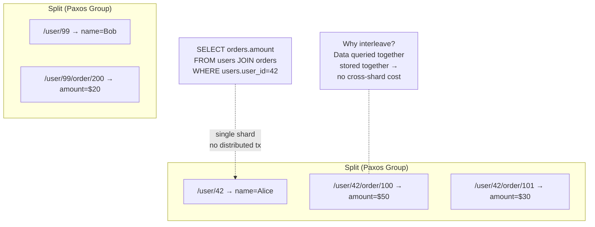
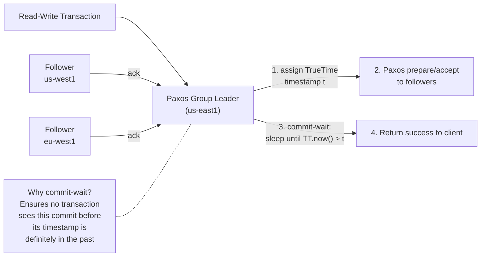
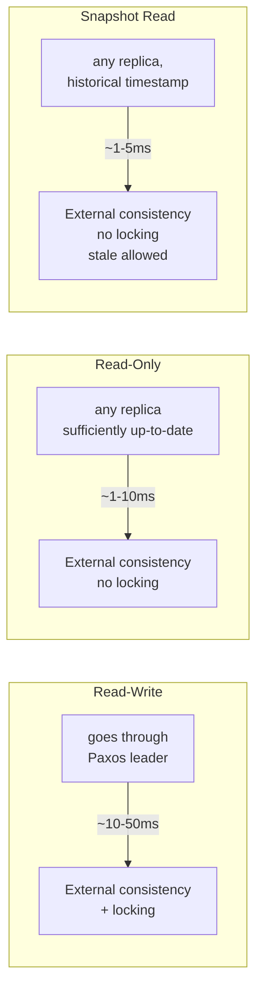

# Google Spanner — Architecture

> For the underlying mechanics of database algorithms,
> see [Storage Engines](../storage-engines.md) and [Database Algorithms](../algorithms.md).

## Why This Exists

Google Spanner is the globally distributed SQL database with external consistency — built for applications that need ACID transactions across continents, at planetary scale, with no downtime. It's the first database to solve "consistent reads and writes across the entire planet" by combining atomic clocks + GPS (TrueTime) for global timestamp ordering with Paxos for replication.

**What it's for:** Global-scale applications requiring strong ACID — banking systems that span regions, global booking platforms, multi-region user databases that need serializable transactions, any system where "eventual consistency" means lost revenue or data corruption.

---

### TrueTime + Paxos for global consistency

Before Spanner, globally distributed databases faced a problem: how do you order transactions across continents without a single clock? If server A in US-East assigns timestamp 100 and server B in EU-West assigns timestamp 101, which happened first? Clock skew between machines can be 1-10ms — enough to create ambiguity and violate serializability.

Spanner solves this with TrueTime — GPS receivers and atomic clocks in each datacenter provide a time interval instead of a single point, with bounded uncertainty of about 1-10ms. Every write goes through the leader of a Paxos group (a consensus protocol — it ensures a majority of replicas agree on every decision, so a write is committed only once enough nodes have acknowledged it), which assigns a commit timestamp, replicates to followers, and then waits until TrueTime confirms the timestamp is definitely in the past. This guarantees external consistency: if transaction A commits before B starts, B will always see A's changes — no stale reads anywhere on Earth.

When you use Spanner, commit-wait adds 1-10ms to every write transaction. Read-write transactions must go through the Paxos leader for that split, not the local replica. A read-write transaction from Sydney for data whose leader is in US-East incurs a 200ms round-trip before any work begins.

When someone uses read-write transactions for every request — including dashboard queries and profile lookups that never write — a user in Sydney loading their profile sends a read-write transaction to the Paxos leader in US-East. What could be a single-digit-millisecond local read becomes a 200ms cross-Pacific round-trip. The latency SLA is breached. The fix is using read-only or snapshot reads for queries that don't write, but those require explicit opt-in at the client level.

**If you're thinking about a central timestamp oracle like TiDB:** TiDB uses Placement Driver as a single timestamp oracle — simpler, but a single point of failure and a bottleneck at scale. TrueTime is distributed — every datacenter derives timestamps independently from GPS and atomic clocks, with no central coordinator to fail. The cost is commit-wait latency.

---

### PK determines transaction locality and scaling

Spanner partitions data into contiguous key-range splits, each replicated by its own Paxos group. A query touching one split is fast — a single Paxos group, no distributed transaction. A query touching multiple splits uses two-phase commit across the involved groups. Your PK design decides which queries are single-split and which are multi-split.

When you use interleaved tables, parent-child data lives in the same Paxos group — a `users` row and its `orders` rows colocate if the PK uses `(user_id)` for users and `(user_id, order_id)` for orders. Joining them for a single user is a single-split operation. But when you use an auto-increment PK, monotonically increasing keys all insert into the rightmost split, concentrating 100% of write load on one Paxos group while others sit idle. The split auto-splits dynamically, but the new split immediately becomes hot too.

When someone creates a user table with an auto-increment `INT64` PK (the default in many migrations), all new users insert into the same split. That split's Paxos group handles all write traffic, capping throughput at what a single Paxos leader can process — roughly 10,000 writes/s. The fix is `GENERATE_UUID()` which produces UUID v4 values distributed randomly across the key space.

**If you're thinking about hash-based partitioning like Cassandra:** Consistent hashing distributes writes evenly by default with no hot spots. But it destroys range scans — `WHERE id > 100 AND id < 200` must scatter to every partition because adjacent keys hash to different nodes. Spanner's key-range partitioning preserves range scans and enables interleaved tables. The cost is that you must design keys to distribute writes uniformly, typically using UUIDs or hash-prefixed keys.

---

### Three read types — choose your trade-off

Spanner offers three read types because serving every read through Paxos would be too slow for read-heavy workloads. Read-write goes through the Paxos leader, acquires locks, and provides external consistency but hits the leader which may be in a different region. Read-only reads from any sufficiently up-to-date replica with external consistency and no locking — but you must explicitly mark the transaction as read-only. Snapshot read reads from any replica at a historical timestamp — instantaneous and local, but returns stale data.

When you use snapshot reads, a dashboard showing "total orders in the last hour" can use `max_staleness=15s` — served from the nearest replica with zero Paxos overhead. But Spanner defaults to read-write because it conservatively assumes every transaction may write. Most reads in a global application can use read-only or snapshot reads.

When a globally-distributed team builds a dashboard using the default read-write context, and the dashboard refreshes every 30 seconds, each refresh fires a read-write transaction to the Paxos leader — possibly in a different continent. With 50 concurrent dashboard users, the Paxos leader receives 50 Paxos reads every 30 seconds. The leader's CPU saturates. The same query as a read-only stale read (15 seconds staleness is acceptable for a dashboard) would have zero cross-DC traffic and zero Paxos overhead.

**If you're thinking about detecting read-only queries automatically:** The query text alone can't distinguish "this will not write" from "this might write" — a SELECT within a transaction that later does UPDATE must route to the leader. Spanner defaults to conservative: assume every transaction may write until you mark it read-only. This prevents accidental write-through from connections intended to be read-only.

---

### Secondary indexes are separate Paxos groups

In Spanner, a secondary index isn't a local B-Tree — it's a separate table with its own PK, stored in its own Paxos groups across the global infrastructure. A lookup through a secondary index reads the index's group to find the base PK, then reads the base table's group to find the full row.

When you use this design, indexes are transactionally consistent — an index read is never stale because both index and base table use the same Paxos protocol. But every INSERT or UPDATE must write to every secondary index's Paxos group before acknowledging. A table with 10 secondary indexes pays Paxos write latency 10x per mutation. An interleaved index colocates with the base table's group — single-shard read and write — eliminating the extra round-trip.

When someone migrates a PostgreSQL schema to Spanner by creating the same 10 secondary indexes on a 100M-row table, every INSERT writes to 11 Paxos groups (base table plus 10 indexes). Index backfill is online and non-blocking, but after creation, every mutation pays 11x Paxos latency. Write throughput drops to roughly 1/11th of what a single interleaved index would deliver. The solution is using interleaved indexes where the indexed column is a suffix of the parent's PK.

**If you're thinking about eventual-consistency indexes like MongoDB:** MongoDB's secondary indexes are eventually consistent — index writes apply locally and propagate asynchronously, so reads may return stale results. Spanner chose transactional consistency: a read through a secondary index always sees the latest committed state. Critical for read-your-writes semantics, but the cost is Paxos write amplification for every index on every mutation.

---

### Online schema changes — no downtime

Most relational databases block writes during schema changes because they physically rewrite pages. Adding a `NOT NULL` column to a 500GB table in PostgreSQL can take hours and lock the table. Spanner avoids this entirely: compute servers are stateless, data persists on Colossus (Google's distributed filesystem), and schema changes are metadata operations.

When you add a NULLable column in Spanner, it's instantaneous — metadata only, no data movement. Adding an index starts an online backfill that reads the base table and writes the index data without blocking reads or writes. Node failures trigger automatic Paxos group re-replication. Splits split and merge based on load without operator intervention.

When a team used to traditional migrations designs their Spanner schema with all columns as `NOT NULL` from the start, they may need a table rebuild if they later need to add a column that can't be NULL initially. The better approach is: add columns as NULLable first, backfill the data in the application, then add the `NOT NULL` constraint as a separate online operation.

**If you're thinking about traditional blocking schema changes:** Blocking schema changes are simpler to implement — the database knows the exact page layout at all times. Spanner's stateless compute plus Colossus decouples the schema from the page layout — the schema is metadata describing how to interpret key-value pairs. This is one of Spanner's strongest operational advantages: zero-downtime schema changes are the default, not an opt-in feature.

---

**When to reach for it:** Global-scale applications that need strong consistency (banking, booking, multi-region user data), systems where CAP trade-offs are unacceptable (need both consistency and availability), SQL-based applications that need to scale across regions without application-level sharding, workloads that need zero-downtime schema changes at scale.

**When not to:** Single-region applications (Spanner's TrueTime + Paxos overhead is wasted — use PostgreSQL or CockroachDB), small datasets (under 1TB — complexity and cost not justified), prototype-stage applications where schema changes constantly (Spanner pricing is per-node, not per-use), or applications that can tolerate eventual consistency (Cassandra or DynamoDB are cheaper and faster for AP workloads).

## Architecture

- **Splits + Paxos + TrueTime** — data partitioned into contiguous key-range splits, each replicated via Paxos; TrueTime provides globally-synchronized timestamps with bounded uncertainty
- **External consistency** — commit-wait ensures no transaction reads a write before its timestamp is definitely in the past; first globally-consistent database at planetary scale
- **Single-shard reads are lock-free** — read-only transactions bypass Paxos leaders and can be served by any sufficiently up-to-date replica; no locking, no 2PC for single-split operations
- **Shared-nothing over Colossus** — compute servers are stateless; data persists in Colossus (distributed filesystem); fast recovery from machine failures via shared storage

## Storage Model

Spanner is a **SQL database** whose data is partitioned into **splits** — contiguous key ranges.
Each split is replicated via its own **Paxos group** (leader + followers across datacenters).
Splits can be split or merged based on load. Data is stored on Colossus (Google's distributed filesystem).

**Interleaved tables** allow parent-child data to be physically colocated within the same split:



```sql
CREATE TABLE users (...) PRIMARY KEY (user_id);
CREATE TABLE orders (...)
  PRIMARY KEY (user_id, order_id),
  INTERLEAVE IN PARENT users ON DELETE CASCADE;
```

This produces a physical layout like `/user/42` → `[name]`, `/user/42/order/100` → `[amount]`,
`/user/42/order/101` → `[amount]`. Queries joining users and orders for a single user are
single-shard — no distributed transaction needed.

**Primary key design** is critical: monotonically increasing keys (auto-increment) create hot spots
(all writes hit one tablet). Hash-based or reverse keys spread writes across tablets.

## Indexing Model

Secondary indexes are themselves tables — distributed across Paxos groups — with a primary key of
`(indexed_columns, base_table_PK)`. Index backfill is online and non-blocking.

- **Standard secondary**: global, distributed. Lookup hits the index's Paxos group(s), then the base table's.
- **Interleaved index** (`INTERLEAVE IN PARENT`): colocated with the base table in the same Paxos group.
  Single-shard reads, no cross-shard lookup.
- **STORING clause**: non-key columns added to the index leaf for covering queries — avoids a second lookup.
- **NULL-filtered index** (`WHERE col IS NOT NULL`): smaller index, skips rows with NULL keys.

## Transactions & Replication

Spanner uses **Paxos** for intra-shard replication and **2PC** for cross-shard transactions.



**Write path**: Client → leader → TrueTime timestamp → Paxos replicate → majority ack → commit-wait ε → success.

**Transaction path comparison**:



- **Read-write**: external consistency, goes through Paxos leader, pessimistic locking + wound-wait
- **Read-only**: external consistency, reads from any sufficiently up-to-date replica — no Paxos, no locking
- **Snapshot read**: reads at a historical timestamp, any replica, no locking

The commit-wait is the key: after a majority acks, the leader sleeps until `TT.now().earliest > commit_timestamp`.
This guarantees that no transaction can read a commit before its assigned timestamp is in the past — achieving
global ordering without a single global clock or centralized timestamp oracle.
