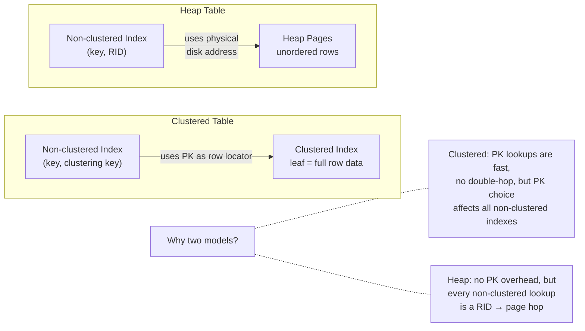
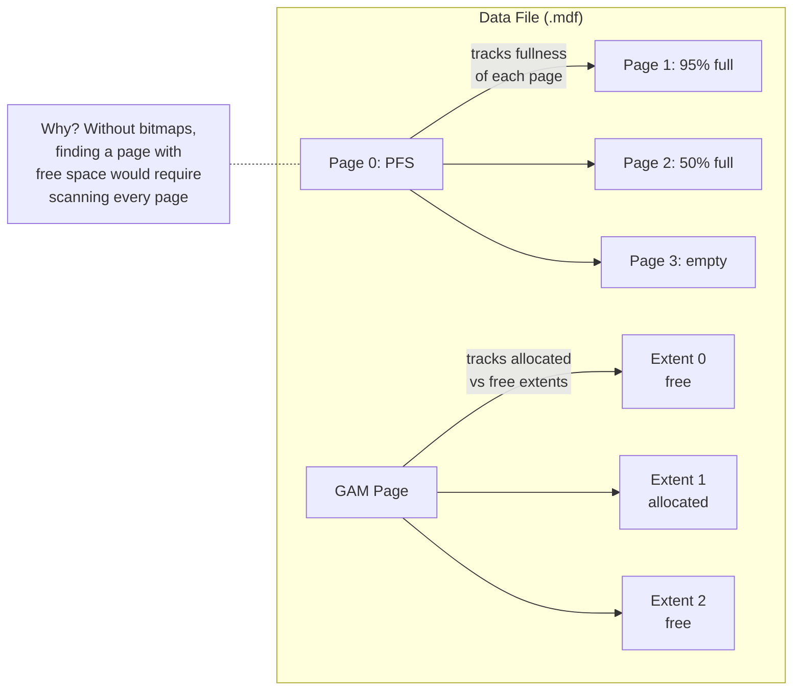

# SQL Server Architecture

> For the underlying mechanics of B-Trees, heap storage, WAL, and related algorithms,
> see [Storage Engines](../storage-engines.md) and [Database Algorithms](../algorithms.md).

This deep dive examines SQL Server's internal architecture, storage model, and indexing design. Understanding these trade-offs helps data engineers and platform teams select the right database for pipeline workloads and avoid the sharp edges that bite production deployments.

### Dual storage models clustered index or heap

Most relational databases commit to a single storage model PostgreSQL always uses a heap, InnoDB always clusters by PK. SQL Server offers both, per table, at creation time. A table can be a clustered index (a B-Tree where leaf pages hold full rows, ordered by the clustering key) or a heap (unordered 8KB pages where rows are identified by a physical RID).

When you use a clustered table, you get single-hop PK lookups and fast range scans because rows are physically adjacent by clustering key order. But the clustering key appears in every non-clustered index as the row locator a wide key like a UUID plus DATETIME bloats every secondary index by the full key width. A heap table avoids this non-clustered indexes store just the 8-byte RID. But heap tables develop forwarding pointers: when a row outgrows its page, SQL Server moves it to a new page and leaves a forwarding pointer behind. After many updates, a single-row read can chase a chain of forwarding pointers across multiple pages.

When someone chooses a heap table for an OLTP app thinking "no clustered index means no fragmentation," and row sizes grow over time as columns are added, a lookup that should read one page may instead traverse 10 forwarding pointers. A 1ms lookup becomes 50ms. No index rebuild fixes this the table must be rebuilt or converted to clustered.

**If you're thinking about always using clustered:** Heap tables excel in staging or bulk-load scenarios insert millions of rows, process them, truncate the table. No clustered index means no B-Tree maintenance during inserts and no fragmentation from truncation. For OLTP with point lookups, clustered is almost always better. SQL Server gives you the choice rather than forcing one model but you need to understand the trade-off.

---

### Clustering key width multiplies across all indexes

In a clustered table, the clustering key is the physical row identifier. Every non-clustered index stores the full clustering key value in its leaf pages as the pointer back to the row. So the wider the clustering key, the bigger every non-clustered index entry becomes.

When you choose a UUID (16 bytes) instead of an INT IDENTITY (4 bytes), it means every non-clustered index entry is 12 bytes larger. With 10 indexes and 10M rows, that's over a gigabyte of wasted space. And because UUIDs generated by `NEWID()` are random, new rows don't append at the end they insert at random B-Tree positions, causing page splits, index fragmentation, and buffer pool thrashing.

When a developer picks UUID as the clustered PK without considering the downstream cost, a 50M-row table with 15 indexes ends up with a 60% fragmented clustered index, 15 non-clustered indexes each carrying 16 extra bytes per entry, and the buffer pool wasting 40% of its space on fragmentation overhead. Queries run 3x slower than the same schema with INT IDENTITY. And the PK can't be changed without rebuilding a 200GB table the decision is effectively permanent.

**If you're thinking about using heap to avoid fragmentation:** A heap avoids clustered B-Tree fragmentation rows go wherever there's free space. But heaps have their own fragmentation (forwarding pointers) when rows grow, and every non-clustered index stores the physical RID which changes after page splits. Both models fragment just under different workloads.

---

### Always On Availability Groups

SQL Server's Always On Availability Groups replicate a database to up to 9 secondary replicas. Each replica can use synchronous commit (the primary waits for the secondary's log write before acknowledging) or asynchronous commit (the primary doesn't wait). A quorum-based cluster manages automatic failover.

When you use synchronous commit across geographic distance, it adds round-trip latency to every write. A sync replica replicating from US-East to EU-West incurs an 80ms round-trip a 10ms write becomes 90ms. Automatic failover requires a cluster quorum, so in a 2-node setup, losing the witness makes automatic failover impossible. Cross-database transactions also require the Distributed Transaction Coordinator, a complex additional configuration.

When a team enables synchronous replication across continents "for zero data loss," the latency penalty on every write causes application connection pools to time out. Application latency spikes from 10ms to over 100ms. The root cause is invisible in the application it just looks like "the database is slow." Synchronous replication is for same-datacenter or low-latency links; cross-continent replication should use asynchronous commit with manual failover.

**If you're thinking about async by default:** Async is faster with no latency penalty, but risks data loss on failover. SQL Server lets you configure each replica independently a synchronous replica in the same DC for zero-loss failover and asynchronous replicas in other regions for disaster recovery. You choose the consistency guarantee per replica.

---

### TempDB contention is the classic bottleneck

SQL Server tracks every page through bitmaps instead of scanning: GAM (Global Allocation Map) marks which 64KB extents are free or allocated, PFS (Page Free Space) records how full each 8KB page is, and IAM (Index Allocation Map) links extents to their owning index. Finding free space is just a bitmap check. But TempDB the system database used for sorts, hash joins, spools, and version store is shared across all user databases and all concurrent sessions.

When many sessions write to TempDB's metadata pages simultaneously, they cause `PAGELATCH_EX` waits. Throughput drops from 10,000 transactions/s to 1,000/s. The fix is adding multiple TempDB data files (one per CPU core) so concurrent sessions hit different pages allocation is striped across files.

When a new SQL Server instance is set up with the default single TempDB data file and a busy OLTP application with 200 concurrent sessions runs sorts in many queries, TempDB's PFS page becomes a hot spot. Every session waits for the same metadata page. The DBA sees `PAGELATCH_EX` waits but may not know the cause. Throughput is 1/10th of what the hardware can deliver, and the fix is adding more TempDB files a zero-downtime configuration change.

**If you're thinking about separate TempDB per session:** TempDB is shared by design to allow sharing temporary objects across sessions (global temp tables, version store). Multiple data files spread the metadata contention without changing shared semantics. Modern SQL Server setup guides recommend multi-file TempDB configuration, but many installations still start with the single-file default.

---

### Columnstore for mixed workloads

SQL Server stores data in two formats on the same engine: rowstore (traditional 8KB pages, B-Tree indexes) and columnstore (column-oriented compressed format with batch-mode execution). A table can have both types of indexes simultaneously.

Columnstore makes analytic queries 10-100x faster than rowstore without moving data to a separate system. Batch-mode execution processes 64-900+ rows per CPU cycle instead of one at a time. But columnstore is read-optimized updates use a delete bitmap plus a new version insert, never in-place. When you run high-frequency singleton UPDATES against a columnstore, deleted rows accumulate in the bitmap and new versions pile up in the delta store.

When a developer creates a columnstore index on a transactional table thinking "it will make everything faster," and the application runs 100,000 singleton updates per hour, the columnstore accumulates millions of deleted rows and new versions after a week. Scan performance degrades to slower than rowstore. Columnstore is for analytics on append-heavy tables not OLTP.

**If you're thinking about using a separate analytics database:** That requires ETL pipelines, data movement, and eventual consistency between systems. Columnstore on the same engine eliminates data movement you query live transactional data with analytic performance in the same database, with no replication lag. The trade-off is that the same instance shares CPU, memory, and I/O between both workloads.

---

**When to reach for it:** Microsoft-centric organisations (Active Directory, .NET, Azure), need Always On AGs for HA/DR, need SSIS/SSRS/SSAS in the same stack, prefer graphical management tools (SSMS), need columnstore for mixed OLTP/analytics workloads.

**When not to:** Linux-only environment (SQL Server on Linux exists but lacks full feature parity with Windows), cost-sensitive (SQL Server licensing is expensive), need extensible indexing (no GiST/GIN equivalents), or when you want an embedded database.

## Architecture

- **Pages (8KB) and extents (64KB)** GAM/SGAM/PFS/IAM allocation bitmaps track every page and extent without scanning
- **Dual storage models** clustered B-Tree (index IS the table) or heap (unordered pages, RID row locators); choice per-table with different performance characteristics
- **Write-ahead logging (WAL)** log records written before data page modifications; ARIES recovery protocol for crash recovery
- **Always On Availability Groups** database-level replication to readable secondaries; synchronous or async per replica; automatic failover with quorum-based cluster

## Storage Model

SQL Server stores data in 8KB **pages** grouped into **extents** (8 contiguous pages = 64KB). A single extent
can belong to one object (uniform) or be shared by up to 8 objects (mixed, for small tables).

Two storage structures:
- **Clustered index** the table IS a B-Tree. Leaf pages contain full rows ordered by the clustering key.
 The clustering key is included in every non-clustered index. Narrow, static, monotonically increasing
 keys (IDENTITY) minimize fragmentation.
- **Heap** a table without a clustered index. Rows are identified by `RID = (FileID:PageID:Slot)`.
 Non-clustered indexes store the RID. Updates that grow rows create **forwarding pointers** if the
 row no longer fits on its page.

(For B-Tree and heap page mechanics, see [B-Tree](../storage-engines.md#b-tree) and [Heap](../storage-engines.md#heap))

## Indexing Model

Non-clustered indexes are separate B-Trees storing `(key, row_locator)`. The row locator is either the
clustering key (clustered table) or the RID (heap). The `INCLUDE` clause stores non-key columns in the leaf
to create covering indexes.

When a non-clustered index doesn't cover the query, SQL Server performs a **Key Lookup** (clustered)
or **RID Lookup** (heap) to fetch the full row. For many rows, a full scan may be cheaper than many
individual lookups.

**Columnstore indexes** are a separate storage model: column-oriented, compressed, with batch-mode
execution for analytics. Not traditional 8KB pages.

**Allocation bitmaps** track every page without scanning:

**TempDB**: Internal work tables (sorts, hash joins, spools) and the row-versioning **version store**
(for READ COMMITTED SNAPSHOT and SNAPSHOT isolation) all live in TempDB. High-concurrency TempDB
contention on PFS/GAM/SGAM pages is a classic performance bottleneck mitigated by multiple data files.
