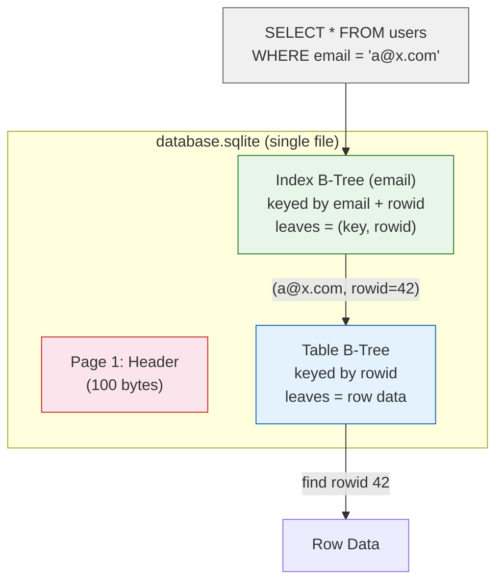

# SQLite Architecture

> For the underlying mechanics of B-Trees, WAL, and related algorithms,
> see [Storage Engines](../storage-engines.md) and [Database Algorithms](../algorithms.md).

## Why This Exists

SQLite is the zero-configuration embedded database no server process, no setup, no configuration. The entire database is a single file that any application can read and write with a library call. It exists because most software needs persistent structured storage but doesn't need (or want) a separate database server to manage.

**What it's for:** Mobile apps (iOS, Android ship with SQLite), desktop applications (browsers, editors), embedded systems (IoT, appliances), prototyping and testing, read-heavy workloads with modest write volume.

---

### Single-file B-Tree no server, no config

Most database engines use a client-server model a daemon listens on a port, authenticates connections, and manages concurrent access. SQLite took the opposite approach: embed the database engine directly into the application process. The entire database is a single `.sqlite` file.

When you open a SQLite database, it's just a file open call no socket, no IPC, no auth, no port. `sqlite3 db.sqlite` creates a working database instantly with zero configuration. But there's only one writer at a time a writer locks the entire database file. WAL mode allows concurrent readers plus one writer, but writes are always serialized. The database lives on the local filesystem; network filesystems like NFS or SMB have unreliable file locking and can corrupt the database under concurrent access.

When someone deploys SQLite as the backend for a web application with 50 concurrent users, each HTTP request opens a connection and issues a write. Requests queue behind the single writer lock. Under load, `SQLITE_BUSY` errors appear as "database is locked" to users. The developer never expected a database to become a serial bottleneck but SQLite is a local storage library, not a client-server database.

**If you're thinking about a client-server model like PostgreSQL:** A client-server database requires installing, configuring, securing, monitoring, and upgrading a daemon a full-time operations concern. SQLite's audience (mobile apps, embedded devices, desktop tools) has no sysadmin and just needs the database to be "a file." The trade-off is write concurrency and network access.

---

### Manifest typing columns are hints, not constraints

Most databases enforce strict column types putting text into an INTEGER column is an error. SQLite deliberately loosens this. Column declarations are "type affinities" hints that guide storage, not constraints that reject data. You can store a string in an INTEGER column and SQLite accepts it silently.

When you add a column in SQLite, it's `ALTER TABLE … ADD COLUMN` with zero backfill because there's no existing data to validate. But `INSERT INTO orders (price) VALUES ('expensive')` also succeeds without complaint the application discovers the type mismatch later when it tries to sum prices and gets NaN. Every table also gets a free auto-incrementing integer key (`INTEGER PRIMARY KEY` is an alias for the internal `rowid`) whether you define a PK or not.

When developers rely on SQLite's type system to validate data integrity, different application versions over months may insert slightly malformed data a string where a number belongs, a NULL where a NOT NULL was expected. The database accepts all of it. The application crashes intermittently months later when it processes the bad rows. The fix requires a data audit and cleanup script, plus adding CHECK constraints or application-level validation.

**If you're thinking about strict typing like PostgreSQL:** Strict typing prevents data corruption but requires schema design up front and blocks inserts that don't match. SQLite's audience includes prototypes and embedded apps where schemas change rapidly. The flexibility costs type safety, but SQLite 3.37+ added opt-in strict tables for when you need enforcement.

---

### INTEGER PK is free non-integer PK is not

SQLite's internal storage is a B-Tree keyed by `rowid` a 64-bit integer that auto-increments. When you define `INTEGER PRIMARY KEY`, that column becomes an alias for `rowid` no separate index needed, and lookup is a single B-Tree traversal straight to the row. But when you define a non-integer PK like `TEXT` or `UUID`, SQLite creates a unique B-Tree index on the PK columns so INSERT now writes to two B-Trees (the table by rowid AND the PK index), and JOINs through the PK traverse two trees instead of one.

`WITHOUT ROWID` tables flip this: the table B-Tree IS keyed by the PK directly, like InnoDB's clustered index, with rows physically ordered by PK. But unlike InnoDB, secondary indexes store the 8-byte rowid instead of the PK value, so updating the PK doesn't cascade to secondary indexes.

When someone with a PostgreSQL or MySQL background defines `PRIMARY KEY (uuid)` on a SQLite table with 1M rows, every INSERT writes to two B-Trees instead of one, and every JOIN through the PK traverses two B-Trees. The table is twice as large and slower than expected. `WITHOUT ROWID` would solve this by making the UUID the direct key but the developer has to know the option exists.

**If you're thinking about always using WITHOUT ROWID:** `WITHOUT ROWID` clusters by PK and gives faster PK lookups, but secondary indexes store the full PK value instead of an 8-byte rowid making them larger for wide keys. When the PK is your primary access path, `WITHOUT ROWID` wins. When you have many secondary indexes over a wide PK, the default rowid model is more compact.

---

### VFS abstraction runs everywhere, optimized nowhere

SQLite targets everything from an ARM microcontroller (a low-power processor family common in embedded devices and mobile phones) to an IBM mainframe. It achieves this through a pluggable Virtual FileSystem layer file operations route through function pointers that platform integrators implement. There are built-in VFS modules for Unix, Windows, Android, iOS, and in-memory.

The same SQLite library can run on a Raspberry Pi, an iPhone, and a Linux server. But it can't use OS-specific I/O optimizations like Linux Direct I/O or Windows unbuffered I/O because the VFS must work identically everywhere. Power-loss safety depends on whether the underlying OS `fsync` is honest some embedded platforms lie about `fsync` to avoid the write delay.

When someone deploys SQLite on a low-cost IoT board with a flash controller that reports `fsync` success without actually flushing, a power cut during a transaction makes the application believe it committed while data never reached storage. The database file is corrupted. SQLite's "power-safe" mode guarantees nothing when the OS below it lies.

**If you're thinking about optimizing per platform:** Platform-specific optimizations require separate code paths, testing, and maintenance for every target. SQLite chose a single, verified implementation that works correctly everywhere at the cost of peak performance on any specific platform. High-end servers needing maximum I/O should use a client-server database instead.

---

### File-level locking for ACID

SQLite's pager layer manages ACID transactions through a rollback journal or WAL mode. Multi-process access relies on the operating system's file locking mechanism `fcntl` or POSIX advisory locks on Unix, `LockFileEx` on Windows.

This gives full ACID in a single file with no external transaction coordinator. But network filesystems like NFS and SMB have notoriously unreliable file locking they don't implement locking correctly or cache lock state in ways that cause conflicts. Two servers writing to the same SQLite file over NFS can corrupt the database in seconds.

When an operations team puts a SQLite database on an NFS share shared by two web servers for "high availability," both servers write to the same file. The NFS locking implementation lies about acquiring exclusive locks. Both servers modify the file simultaneously, and the file header is overwritten with garbage. The database is corrupted with no recovery path and SQLite's documentation explicitly warns against this.

**If you're thinking about supporting multi-server access:** That requires a network protocol, authentication, and a daemon process turning SQLite into a different product (a client-server database). SQLite is an embedded library for local storage. When you need multi-server access, use PostgreSQL, MySQL, or Spanner.

---

**When to reach for it:** Mobile apps (iOS/Android), desktop apps (single-user), embedded devices, prototyping, unit test databases (in-memory SQLite), read-heavy local storage, any scenario where you don't want to manage a database server.

**When not to:** Concurrent writers (web servers, multi-process apps), network filesystem storage, high write volume (SQLite serializes writes), need row-level access control (no user/permission system), need replication (no built-in replication), or when you need strict type enforcement.

## Architecture

- **Bytecode virtual machine (VDBE)** SQL text is compiled to bytecode and executed by a register-based VM; the compilation process IS the query planner
- **Single-file B-Tree library** entire database is one disk file; tables and indexes are separate B-Trees in the same file; no client-server, no configuration
- **Pager layer for ACID** page cache with atomic commit via rollback journal (delete/truncate mode) or WAL mode; power-safe without OS fsync guarantees
- **VFS abstraction** pluggable OS interface enables portability; same library runs on Unix, Windows, embedded, and in-memory

## Storage Model

SQLite stores the entire database in a **single file** using a B-Tree structure. The file begins with a
header page (100-byte magic + metadata), followed by B-Tree pages (4KB default, configurable to 64KB).
- Each table is a B-Tree keyed by **rowid** (a 64-bit signed integer, accessible as `rowid`, `_rowid_`, or `oid`).
- Row data is stored as a record in the leaf page. `WITHOUT ROWID` tables use the primary key as the B-Tree
- key directly rows are ordered by PK, like InnoDB's clustered index, but without the PK update cascade problem (since there is no separate rowid to maintain in secondary indexes).

Values too large for a page are split across **overflow pages** a linked list of pages storing the excess. Deleted pages go on a **freelist** for reuse.

(For B-Tree mechanics, see [B-Tree](../storage-engines.md#b-tree))

## Indexing Model

Indexes are separate B-Trees stored in the same database file. Each index leaf stores `(key, rowid)`.
A secondary lookup follows: index → rowid → table B-Tree. No clustered indexes (except `WITHOUT ROWID`
which is the table itself, not a separate index).

SQLite supports **partial indexes** (`WHERE` clause), **expression indexes** (`LOWER(col)`),
and **automatic indexes** transient indexes built during a query for an unindexed join, discarded afterward.

Schema is stored in the `sqlite_schema` table (always at root page 1), read once at database open.
