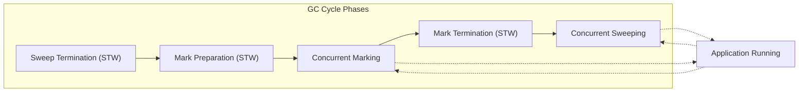

# Garbage Collector

A garbage collector finds memory the program no longer needs and gives it back. The programmer never calls `free` or `delete`. Without it, every allocation is either a leak or a chore.

To find dead memory, the GC must freeze the program briefly. If the program kept running while the GC scanned, pointers could change — the GC might miss live memory and free it by mistake. Every garbage-collected language pays this cost: Java, .NET, Python, Go all stop their programs for some amount of time [^1].

In 2014, Go froze everything for the entire collection cycle. A single pause could last hundreds of milliseconds [^3]. For a server processing hundreds of requests per second, that meant blocking requests mid-flight. Users felt the delay.

The Go team set one priority: shorten the freeze [^4]. They made rules:
- Never stop for more than 10 milliseconds [^3].
- Don't slow down normal code to make GC faster [^4].
- Don't move objects in memory — Go code points into the middle of them, and C code shares memory with Go [^1].
- Track pointer changes only while collecting, not all the time [^3].

The result: the collector pauses twice, each for a few hundred microseconds [^4]. One pause turns on tracking, the other turns it off. Everything else runs while the program keeps working. The price is more CPU and more memory. Two settings — `GOGC` and `GOMEMLIMIT` — let you control this [^2].

## GC Cycle



**Sweep Termination (STW):** The last cycle freed some memory but never told the allocator it was available. This phase walks through that freed memory and lists it for reuse. Program is paused.

**Mark Preparation (STW):** The GC needs to know where to start searching. It pauses the program and collects every pointer currently in use — every local variable on every goroutine stack, every global variable. These are the starting points. Program resumes.

**Concurrent Marking:** The GC starts from those starting points and follows every pointer it finds, then every pointer those point to, and so on. Like a web crawler: find a page, follow every link, then follow every link on those pages. Every object reached gets a mark: "still in use." Objects never reached are candidates for freeing. The program runs normally during this.

| Mark | Meaning |
|---|---|
| White | Not checked yet |
| Grey | Found, checking what it points to |
| Black | Done checking |

**Mark Termination (STW):** Briefly pauses to check nothing was missed during marking.

**Concurrent Sweeping:** Walks through all heap memory. Objects without a mark were not reachable — they are dead. Frees them for reuse. The program runs normally.

## GC Tuning: GOGC vs GOMEMLIMIT

**GOGC** sets the target heap growth before the next GC triggers. Default is 100.

```
Next GC Trigger = Live Heap × (1 + GOGC/100)
```

Live heap is 100MB and GOGC=100 → next GC at 200MB.
GOGC=200 → uses more memory, saves CPU. `GOGC=off` disables GC entirely.

**GOMEMLIMIT** (Go 1.19+) sets a firm memory ceiling. If the heap approaches this limit, the GC triggers aggressively to stay under it. Prevents OOM crashes in containerized environments without forcing a hyper-conservative GOGC value.

**Thrashing guard:** If live data genuinely exceeds GOMEMLIMIT, Go caps GC CPU time and lets the application crash gracefully rather than looping infinitely.

## The Scavenger

After a GC cycle marks memory as free, Go does not immediately return it to the OS. It keeps freed pages in an internal pool (the page allocator) on the assumption the app will allocate again soon — reusing memory is faster than asking the OS for new blocks.

The **scavenger** is a background process that slowly returns unused physical memory to the OS (typically over ~5 minutes of idle time). If your server dashboard shows high memory after processing a large batch job, this is intentional, not a leak.

## References

[^1]: Go GC guide: https://go.dev/doc/gc-guide

[^2]: `runtime` package `GOGC` / `GOMEMLIMIT` docs: https://pkg.go.dev/runtime#hdr-Environment_Variables

[^3]: Go 1.5 GC announcement: https://go.dev/blog/go15gc

[^4]: Getting to Go (ISMM 2018): https://go.dev/blog/ismmkeynote
