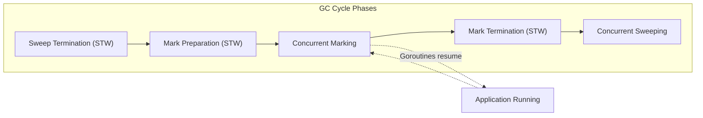

# Garbage Collector

Go uses a concurrent, tri-color, mark-and-sweep garbage collector designed for low latency. Stop-The-World (STW) pauses are kept well under a millisecond by doing the vast majority of work concurrently alongside application execution.

## GC Cycle & Concurrent Mark-Sweep



**Sweep Termination (STW):** Clears any remaining unswept spans from the previous cycle.

**Mark Preparation (STW):** Turns on the Write Barrier (a compiler-inserted check that tracks memory writes by running goroutines) and identifies root objects (stacks, globals).

**Concurrent Marking (Concurrent):** Goroutines resume. The GC marks objects using three logical colors:

| Color | Meaning |
|---|---|
| White | Unvisited — candidate for collection |
| Grey | Visited, children not yet scanned |
| Black | Visited, children scanned |

The GC pulls objects from the grey queue, marks their children grey, and moves the parent to black.

**Mark Termination (STW):** Pauses briefly to turn off the write barrier and clean up root tasks.

**Concurrent Sweeping (Concurrent):** Walks all white (unreachable) objects and reclaims their memory to the heap allocation pool.

## GC Tuning: GOGC vs GOMEMLIMIT

**GOGC** sets the target heap growth before the next GC triggers. Default is 100.

```
Next GC Trigger = Live Heap × (1 + GOGC/100)
```

Live heap is 100MB and GOGC=100 → next GC at 200MB.
GOGC=200 → uses more memory, saves CPU. `GOGC=off` disables GC entirely.

**GOMEMLIMIT** (Go 1.19+) sets a firm memory ceiling. If the heap approaches this limit, the GC triggers aggressively to stay under it. Prevents OOM crashes in containerized environments without forcing a hyper-conservative GOGC value.

**Thrashing guard:** If live data genuinely exceeds GOMEMLIMIT, Go caps GC CPU time and lets the application crash gracefully rather than looping infinitely.

## Allocation Profiling (pprof)

### Capture a Profile

```go
import (
	"os"
	"runtime/pprof"
)

func main() {
	f, _ := os.Create("mem.pprof")
	defer f.Close()
	runtime.GC()
	if err := pprof.WriteHeapProfile(f); err != nil {
		log.Fatal(err)
	}
}
```

### Analyze with `go tool pprof`

```bash
go tool pprof mem.pprof
```

| Command | Purpose |
|---|---|
| `-alloc_space` | Total memory allocated since start — find GC pressure |
| `-inuse_space` | Currently held memory — find leaks |
| `top10` | Functions with the most allocations |
| `list <Func>` | Line-by-line annotation of allocation sites |
| `web` / `svg` | Visual call graph of hot allocation paths |

## The Scavenger

After a GC cycle marks memory as free, Go does not immediately return it to the OS. It keeps freed pages in an internal pool (the page allocator) on the assumption the app will allocate again soon — reusing memory is faster than asking the OS for new blocks.

The **scavenger** is a background process that slowly returns unused physical memory to the OS (typically over ~5 minutes of idle time). If your server dashboard shows high memory after processing a large batch job, this is intentional, not a leak.

## Cheat Sheet

- **Architecture:** Concurrent tri-color mark-and-sweep, STW < 1ms.
- **Strategy:** Keep objects on the stack (automatically freed), avoid the heap (requires GC). Size slices upfront, avoid unnecessary pointers.
- **Knobs:** Set `GOMEMLIMIT` in containers to prevent OOM. Leave `GOGC=100` unless you have a specific reason to change it.
- **Triage:** If memory is high, run `go tool pprof -alloc_space` to find the line creating the most garbage.

## References

[1] Go GC guide: https://go.dev/doc/gc-guide

[2] `runtime` package `GOGC` / `GOMEMLIMIT` docs: https://pkg.go.dev/runtime#hdr-Environment_Variables
