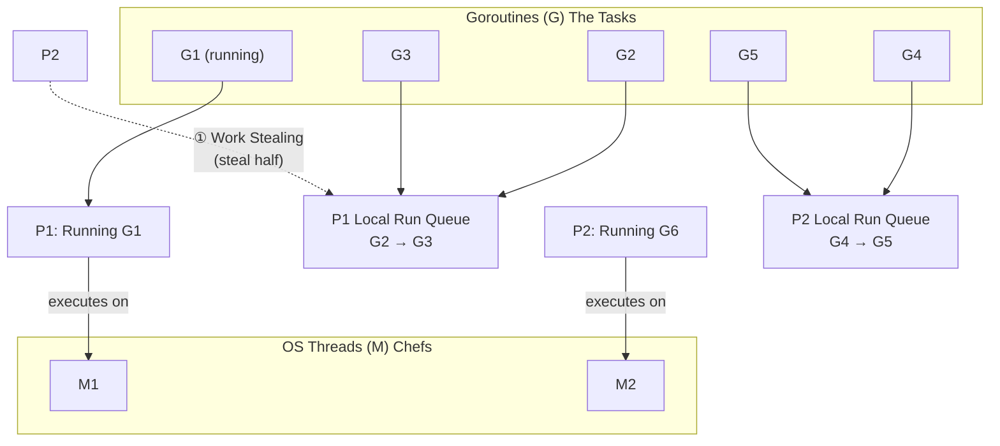
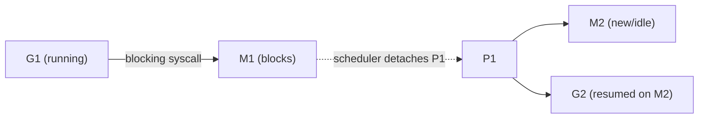
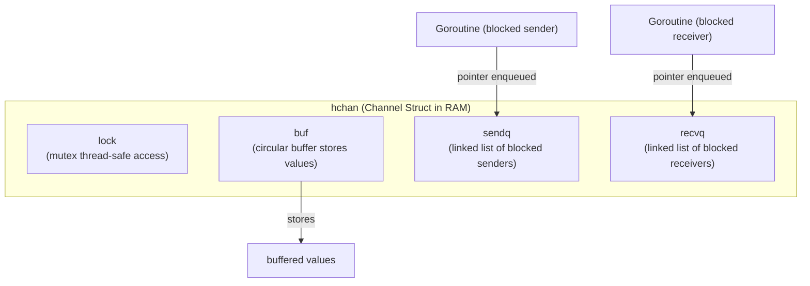

# Goroutine

A goroutine is a lightweight thread managed by the Go runtime. This guide covers how the scheduler works, how goroutines communicate through channels, how to coordinate them with select and sync primitives, and how to avoid common pitfalls like leaks and deadlocks.
## GPM Scheduler



**Syscall handoff flow:**



* **G (Goroutine)** → The task itself. **Physically, a `g` struct in RAM** (heap). It contains a private stack (starting at \~2KB [2]) and a "Program Counter" (a bookmark of the next line of code). [1][8]
* **P (Processor)** → The scheduler’s “cooking station.” A logical resource that holds the context for executing Go code.
* **M (Machine / OS Thread)** → The chef (physical/OS thread) who executes the task.

**Work Stealing (Load Balancing)**

* Each P has a **Local Run Queue** (a list of memory pointers to Goroutines waiting in RAM).
* If P1 runs out of Gs, it checks the **Global Run Queue**.
* If empty, it attempts to **steal half** of P2’s local queue. [3]
* _Result:_ Keeps all CPU cores saturated without expensive OS-level context switches.

**Syscall Handoff (Preventing Blocking)**

* If **G1** makes a blocking syscall (e.g., file I/O), the thread **M1** blocks.
* The Scheduler detaches **P1** from **M1** and moves it to a new/idle thread (**M2**). [4]
* **P1** continues executing other queued goroutines (**G2, G3**) on the new thread.
* _Result:_ Thousands of blocking syscalls won't starve your CPU.

***

Channels are the primary mechanism for communication between goroutines. Understanding how they work at both the API level and the runtime level is essential for writing correct concurrent programs.

## Channels

**Unbuffered:** `make(chan T)`. No storage. Send/Receive must synchronize (rendezvous).

```go
ch := make(chan string) // unbuffered
ch <- "apple"           // ❌ blocks immediately (no receiver)
```

```go
ch := make(chan string)

go func() {
	msg := <-ch
	fmt.Println("received:", msg)
}()

ch <- "apple" // blocks until receiver is ready
```

**Buffered:** `make(chan T, n)`. Has a "waiting room" of size `n`. Sends only block when the buffer is full. A non-blocking send via `select` + `default` can drop data when the buffer is full this is the basis of the [leaky buffer pattern](https://go.dev/doc/effective_go#leaky_buffer) for reusing allocations.

```go
func main() {
	ch := make(chan string, 2)

	ch <- "apple"
	ch <- "banana"
	ch <- "cherry" // blocks (buffer full)
}
```

```go
ch := make(chan string, 2)

go func() {
	for v := range ch {
		fmt.Println("received:", v)
	}
}()

ch <- "apple"
ch <- "banana"
ch <- "cherry" // waits until receiver drains a slot
```

### **Channel Internals (`hchan`)**

When you create a channel, Go allocates an `hchan` struct in **RAM**. This is the "manager" that coordinates goroutines.

Each channel maintains:

* **`buf`** → Circular buffer (the actual RAM storage for buffered values).
* **`sendq` & `recvq`** → Linked lists in RAM storing **pointers** to blocked goroutines.
* **`lock`** → A mutex ensuring thread-safe access to the channel. [5]

### **Lifecycle of a Blocked Operation**

When a Goroutine (G) hits a blocking operation (e.g., receiving from an empty channel):

1. **Suspension:** The G is removed from the **P's Local Run Queue**. Status changes from `running` to `waiting`.
2. **Enqueued:** A pointer to this G is placed in the channel’s `recvq` or `sendq`.
3. **RAM Persistence:** The G’s stack and variables stay in RAM. **No extra data is created**; the G is simply "parked" while the CPU moves on to other work.
4. **Resumption:** When a matching send/receive occurs, the scheduler moves the G pointer back to a **Local Run Queue** to resume.




When you need to wait on multiple channels at once or add timeouts and cancellation the select statement is the tool.

## Select Statement

`select` is a control structure that allows a goroutine to wait on **multiple channel operations** (send or receive) at the same time.

```go
select {
case msg := <-ch1:
	fmt.Println("Received from ch1:", msg)
case ch2 <- "ping":
	fmt.Println("Sent ping to ch2")
default:
	fmt.Println("No channel ready")
}
```

### Common Usecases

```go
// Wait on multiple channels
select {
case msg := <-ch1:
	fmt.Println("ch1 said", msg)
case msg := <-ch2:
	fmt.Println("ch2 said", msg)
}

// Using timeout
select {
case result := <-dbResponse:
	fmt.Println("Got data:", result)
case <-time.After(3 * time.Second):
	fmt.Println("Timeout waiting for DB")
}

// Graceful shutdown
func worker(ctx context.Context, ch <-chan int) {
	for {
	select {
	case val := <-ch:
	fmt.Println("got", val)
	case <-ctx.Done():
	fmt.Println("worker stopped")
	return
	}
	}
}

// Non blocking send
select {
case ch <- 1:
	fmt.Println("sent")
default:
	fmt.Println("channel is full, skipping")
}
```

Without `select`, you’d need manual checks, polling, or additional goroutines. But with `select`, Go gives you a built-in language feature that:

* waits on multiple channels **in a single place**
* picks whichever channel is ready
* prevents your goroutine from blocking forever

```go
// Without select
for {
	if len(ch1) > 0 {
		msg := <-ch1
		fmt.Println("Got from ch1:", msg)
	}

	if len(ch2) > 0 {
		msg := <-ch2
		fmt.Println("Got from ch2:", msg)
	}

	time.Sleep(1 * time.Millisecond) // avoid CPU burn
}

// With select
select {
case msg := <-ch1:
	fmt.Println("Got from ch1:", msg)

case msg := <-ch2:
	fmt.Println("Got from ch2:", msg)
}
```

## Closures


**The Scheduling Delay**

A common point of confusion is why goroutines don't execute immediately. When you call `go func()`, you aren't running the function "now"you are giving a task to the Go Scheduler.

The loop is running in the `main` goroutine, which already "owns" an OS Thread (M). Because the loop is extremely fast and doesn't "block" (wait for I/O), the computer prefers to finish the loop instructions before switching to the new tasks. Consequently, the new goroutines sit in the Local Run Queue while the loop finishes.

**In Go 1.21 and older**

The closure captures the reference (memory address) of the loop variable `n`. Since the `main` goroutine usually finishes the loop before the scheduler picks up the new goroutines, they all wake up, look at the same memory address, and see the final value of the loop. [6]

```go
numbers := []int{1, 2, 3}

for _, n := range numbers {
	// Each G holds a pointer to the SAME 'n'
	go func() {
		fmt.Println(n)
	}()
}
// Likely output: 3, 3, 3
```

**In Go 1.22 and newer**

The Go team changed the language semantics so that the loop variable `n` is instance-per-iteration. Now, each pass through the loop creates a brand new memory address for `n`. Even if the goroutines are delayed in the queue, they each point to a unique "snapshot" of the value. [6]

* Output: `1, 2, 3` (in random order).

***

**The Fix**

```go
for _, n := range numbers {
	// By passing 'n' as 'val', we copy the current value immediately
	go func(val int) {
		fmt.Println(val)
	}(n)
}
```

1. The value is "captured" the moment the `go` statement is executed, not when the goroutine eventually runs.
2. Since each goroutine has its own unique copy of the value on its own stack, it doesn’t matter if the `main` loop has moved on or finished.

## Synchronization Primitives (`sync` package)

### Mutex (`sync.Mutex` vs `sync.RWMutex`)

Use Mutexes when you need high-performance access to shared state (maps, structs, counters).

* Mutex: Locks for both read and write.
* RWMutex: Allows multiple readers OR one writer. Preferred for read-heavy workloads (e.g., caches).

```go
type SafeCounter struct {
	mu sync.RWMutex
	v  map[string]int
}

func (c *SafeCounter) Inc(key string) {
	c.mu.Lock() // 🔒 Write Lock: No one else can read or write
	defer c.mu.Unlock()
	c.v[key]++
}

func (c *SafeCounter) Value(key string) int {
	c.mu.RLock() // 🔓 Read Lock: Others can read, but no one can write
	defer c.mu.RUnlock()
	return c.v[key]
}
```

### WaitGroup (`sync.WaitGroup`)

Calling `Add(1)` _inside_ the goroutine. This creates a race condition where `Wait()` might finish before the goroutine starts.

```go
var wg sync.WaitGroup

for i := 0; i < 3; i++ {
	wg.Add(1) // ✅ Correct: Add BEFORE starting goroutine
	go func(id int) {
		defer wg.Done()
		fmt.Printf("Worker %d starting\n", id)
	}(i)
}

wg.Wait() // Blocks until counter is 0
```

### Atomic Operations (`sync/atomic`)

For simple counters or boolean flags, Mutex is overkill. Atomics use low-level CPU instructions (CAS - Compare And Swap) without entering the OS kernel, making them significantly faster for simple operations. However, they are harder to read and reason about than Mutex.

```go
var ops atomic.Int64 // Go 1.19+ types

// Inside goroutine
ops.Add(1)

// Reading
fmt.Println("Ops:", ops.Load())
```

## Advanced Patterns

### Worker Pool

Spawning `go func()` for every HTTP then you will get Out-Of-Memory (OOM) errors. Use a Worker Pool to throttle concurrency.

```go
func worker(id int, jobs <-chan int, results chan<- int) {
	for j := range jobs {
		fmt.Printf("worker %d processing job %d\n", id, j)
		time.Sleep(time.Second) // Simulate work
		results <- j * 2
	}
}

func main() {
	const numJobs = 100
	const numWorkers = 5

	jobs := make(chan int, numJobs)
	results := make(chan int, numJobs)

	// Start fixed number of workers
	for w := 1; w <= numWorkers; w++ {
		go worker(w, jobs, results)
	}

	// Send jobs
	for j := 1; j <= numJobs; j++ {
		jobs <- j
	}
	close(jobs) // Signal workers that no more jobs are coming

	// Collect results
	for a := 1; a <= numJobs; a++ {
		<-results
	}
}
```

### ErrGroup (`golang.org/x/sync/errgroup`)

The modern "Senior" alternative to `sync.WaitGroup`. It handles:

1. Waiting for goroutines.
2. Error propagation (returns the first error encountered).
3. Context cancellation (if one fails, cancel the others). [7]

```go
import "golang.org/x/sync/errgroup"

func main() {
	g, ctx := errgroup.WithContext(context.Background())
	urls := []string{"http://google.com", "http://bad-url.com", "http://bing.com"}

	for _, url := range urls {
		url := url // Capture loop var (standard in Go < 1.22)
		g.Go(func() error {
			// Check context before working
			if ctx.Err() != nil {
				return ctx.Err()
			}
			resp, err := http.Get(url)
			if err == nil {
				resp.Body.Close()
			}
			return err // If this returns error, all other Gs get cancelled via ctx
		})
	}

	if err := g.Wait(); err != nil {
		fmt.Println("Error encountered:", err)
	} else {
		fmt.Println("All fetches successful")
	}
}
```

### First-Responder Pattern (Replicated Databases)

Query multiple identical replicas and use the fastest response.

```go
// BUG: unbuffered channel + non-blocking send can drop every result
func QueryReplicas(query string, conns []DBConn) Result {
	ch := make(chan Result) // unbuffered

	for _, c := range conns {
		go func(c DBConn) {
			select {
			case ch <- c.DoQuery(query):
			default: // non-blocking send — exits if ch isn't ready
			}
		}(c)
	}

	return <-ch // blocks forever if all goroutines hit default
}
```

If all goroutines reach `ch <-` before the main goroutine reaches `<-ch`, every send hits `default` and exits. The main goroutine then blocks forever at `<-ch` — a classic race condition.

```go
// Fix ✅
func QueryReplicas(query string, conns []DBConn) Result {
	ch := make(chan Result, len(conns)) // buffer decouples send from receive

	for _, c := range conns {
		go func(c DBConn) {
			ch <- c.DoQuery(query) // blocking send; always succeeds
		}(c)
	}

	return <-ch // return the first result; others are GC'd
}
```

With a buffered channel sized to `len(conns)`, every goroutine drops its result immediately and exits. The main goroutine reads the first one; the rest stay in the buffer and are cleaned up when the channel goes out of scope.

## Goroutine Leak

Real world goroutine leak

* [https://github.com/kubernetes/kubernetes/pull/135078](https://github.com/kubernetes/kubernetes/pull/135078)
* [https://github.com/kubernetes/kubernetes/issues/134939](https://github.com/kubernetes/kubernetes/issues/134939)

Leaked goroutines cause:

* Increased memory consumption (each goroutine has its own stack)
* Increased scheduling overhead (scheduler now handles more runnable goroutines)
* Potential exhaustion of system resources

```go
// Lost goroutine due to async operations not tied to context
func handler(w http.ResponseWriter, r *http.Request) {
	go func() {
		// do db operation / send notification
		// BUG: ignores r.Context()
	}()
}

// Fix ✅
func handler(w http.ResponseWriter, r *http.Request) {
	ctx := r.Context()

	go func() {
		select {
		case <-time.After(time.Second):
		// finish work
		case <-ctx.Done(): // client disconnected → abort
			return
		}
	}()
}
```

```go
// Forgetting to stop goroutines when using select + channels
func doWork(ch chan int) {
	go func() {
		for {
			select {
			case <-ch:
				// do something
			}
			// BUG: no default / no cancel path
		}
	}()
}

// Fix ✅
func doWork(ctx context.Context, ch chan int) {
	go func() {
		for {
			select {
			case <-ch:
			// do something
			case <-ctx.Done(): // required exit
				return
			}
		}
	}()
}
```

```go
// Goroutine waiting forever on a channel (blocked read/write)
// If ch stops receiving values or is never closed, worker() blocks forever.
func worker(ch <-chan int) {
	for {
		v := <-ch // blocked forever if no one sends to ch
		fmt.Println(v)
	}
}

// Fix ✅
func worker(ctx context.Context, ch <-chan int) {
	for {
		select {
		case v, ok := <-ch:
			if !ok { // channel closed → exit goroutine
				return
			}
			fmt.Println(v)
		case <-ctx.Done(): // cancellation → exit goroutine
			return
		}
	}
}
```

```go
// Deadlock inside goroutine due to mutual channel dependency
func main() {
	ch1 := make(chan int)
	ch2 := make(chan int)

	go func() {
		<-ch1
		ch2 <- 1 // waits forever if main never reads ch2
	}()

	<-ch2 // waits forever if goroutine never writes to ch2
}

// Fix ✅
func main() {
	ch1 := make(chan int)
	ch2 := make(chan int, 1) // buffered channel prevents deadlock

	go func() {
		<-ch1
		ch2 <- 1
	}()

	ch1 <- 1
	fmt.Println(<-ch2)
}
```

### Detect Goroutine Leak with

* [https://github.com/uber-go/goleak](https://github.com/uber-go/goleak)


## References

[1] Go runtime source `src/runtime/proc.go` lines 28–31: G, P, M definitions.
 https://go.dev/src/runtime/proc.go

[2] Go runtime source `src/runtime/stack.go` line 78: `stackMin = 2048` (initial goroutine stack ~2KB).
 https://go.dev/src/runtime/stack.go

[3] Go runtime source `src/runtime/proc.go` lines 3837–3909: `stealWork()` function, line 7778: `runqsteal` steals half of another P's run queue.
 https://go.dev/src/runtime/proc.go

[4] Go runtime source `src/runtime/proc.go` lines 4859–4869: `entersyscallblock()`: P handoff during blocking syscall via `handoffp(releasep())`.
 https://go.dev/src/runtime/proc.go

[5] Go runtime source `src/runtime/chan.go` lines 34–55: `hchan` struct with `buf`, `sendq`/`recvq`, `lock`.
 https://go.dev/src/runtime/chan.go

[6] Go 1.22 Release Notes "each iteration of the loop creates new variables, to avoid accidental sharing bugs."
 https://go.dev/doc/go1.22#language

[7] `golang.org/x/sync/errgroup` error propagation and context cancellation on first error.
 https://pkg.go.dev/golang.org/x/sync/errgroup

[8] Go scheduler design document.
 https://golang.org/s/go11sched
