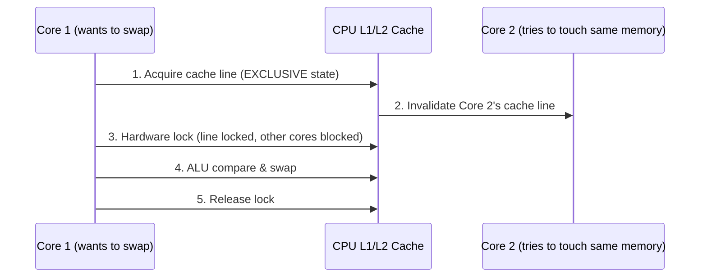
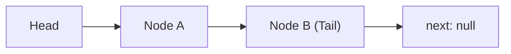
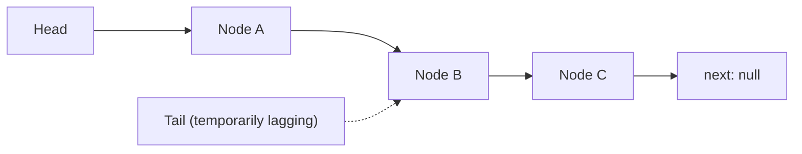
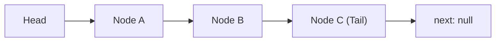
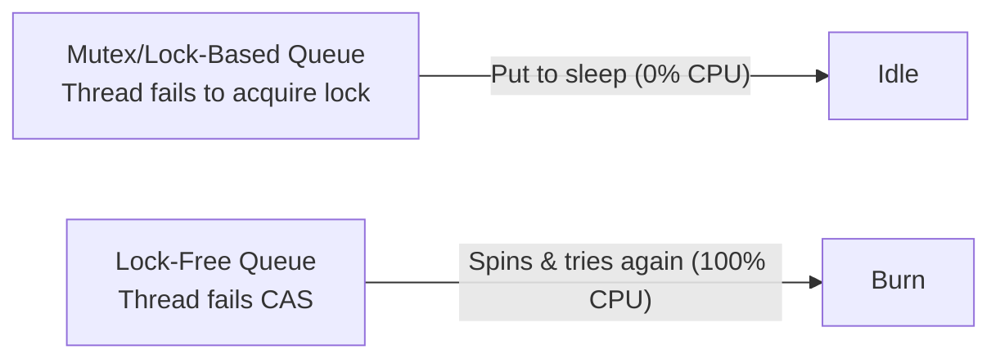

# Low-Level Systems Primitives & Garbage Collector Tuning

## Lock-Free Queue

- **Mechanism:** Uses CPU Compare-And-Swap (CAS) instructions to atomically swap memory pointers in a single cycle instead of using OS-level mutex locks.
- **Purpose:** Eliminates thread lock contention and context-switching overhead in ultra-high-throughput systems.

### Part 1: What Happens Inside the CPU During an Atomic Swap?

First, a quick technical distinction: an atomic pointer swap is executed as a single indivisible CPU instruction (like `LOCK CMPXCHG` on x86 or `LDAEX/STLEX` on ARM). While programmers view this as a "single step," it physically takes around 10 to 20 CPU clock cycles to complete because the CPU core must synchronize its cache with all other CPU cores.

Here is the exact step-by-step process happening inside the CPU silicon during a Compare-And-Swap (CAS) instruction:



**1. Cache Line Locking (MESI Protocol)**

Modern CPUs do not freeze the entire system memory bus. Instead, they lock a single 64-byte Cache Line in RAM where the pointer resides:

- Core 1 issues an instruction to grab Exclusive Ownership (E or M state in the MESI cache protocol) of the cache line containing the target pointer.
- The CPU interconnect sends an "Invalidate" signal to all other CPU cores (Core 2, Core 3), forcing them to drop their local copies of that cache line.

**2. Hardware-Level Lock**

For the brief duration of the atomic instruction, the CPU's cache controller rejects any read/write requests from other cores targeting that specific 64-byte line.

**3. ALU Comparison & Swap**

Inside Core 1's Arithmetic Logic Unit (ALU):

- **Read & Compare:** The hardware compares the value currently in memory at address A against the `expected_value` stored in a register.
- **Conditional Write:**
  - If **Match** (`Memory == Expected`): The ALU writes the `new_pointer` to address A and sets the CPU's Zero Flag (ZF=1).
  - If **No Match** (`Memory != Expected`): The ALU leaves address A untouched, loads the actual current memory value into a register, and sets the Zero Flag (ZF=0).

**4. Release Lock**

The cache controller releases the lock on the line. Core 1 now inspects ZF: if ZF=1, the swap succeeded; if ZF=0, it failed.

### Part 2: How Pointer Swapping Works in a Lock-Free Queue

In a standard lock-free queue (like the industry-standard Michael-Scott Queue), you have a linked list of nodes, a Head pointer, and a Tail pointer. Because a hardware CAS operation can only update one single pointer at a time (64-bit), adding a node requires a 2-step pointer swap.

**The Setup**

Imagine a queue with two nodes (A and B). Tail points to B. B.next is null:



Thread 1 wants to enqueue Node C. Here is the exact loop and pointer swapping process:

**Step 1: Allocate Node C**

Thread 1 creates Node C in memory with `C.next = null`. Thread 1 holds: `[ Node C ] --> next: null`.

**Step 2: Swap #1 - Link B.next to Node C**

Thread 1 reads the current tail (`tail_ptr = B`). It then attempts its first atomic CAS to update `B.next` from null to Node C:

```cpp
// CAS( destination_ptr, expected_old_value, new_value )
bool success = CAS( &B.next, null, Node_C );
```

What happens if two threads race?

- Thread 1 runs `CAS(&B.next, null, Node_C)` and succeeds. B.next now points to C.
- Thread 2 (simultaneously) tries `CAS(&B.next, null, Node_D)`. It fails instantly because B.next is no longer null (Thread 1 already changed it). Thread 2's CAS returns false, so Thread 2 spins around its while loop and retries.

Memory state after Step 2:



**Step 3: Swap #2 - Advance Tail to Node C**

Now that Node C is safely linked into the list, Thread 1 performs its second atomic CAS to move the Tail pointer forward:

```cpp
CAS( &Tail, Node_B, Node_C );
```

- If it succeeds: Tail now points directly to Node C.
- If it fails: It means another thread noticed that Tail was lagging behind and helped move Tail forward for us (a concept called **Helping** in lock-free programming).

Final Memory State:



**Code Representation of the Enqueue Process**

Here is what this looks like in C++ using atomic primitives:

```cpp
struct Node {
    int data;
    std::atomic<Node*> next{nullptr};
};

class LockFreeQueue {
    std::atomic<Node*> head;
    std::atomic<Node*> tail;

public:
    void enqueue(int value) {
        Node* newNode = new Node{value, nullptr};
        while (true) {
            Node* currentTail = tail.load();
            Node* tailNext = currentTail->next.load();
            // Double-check: Has Tail changed while we were reading?
            if (currentTail == tail.load()) {
                if (tailNext == nullptr) {
                    // STEP 1: Try to link the new node to the end of the list
                    if (currentTail->next.compare_exchange_weak(tailNext, newNode)) {
                        // STEP 2: Swap succeeded! Now advance Tail pointer to newNode
                        tail.compare_exchange_strong(currentTail, newNode);
                        return; // Enqueue complete!
                    }
                } else {
                    // Help another thread by advancing Tail if it lagged behind
                    tail.compare_exchange_strong(currentTail, tailNext);
                }
            }
        } // Loop retries automatically if CAS failed due to a race
    }
};
```

**Key Takeaways**

- **No Blocking:** If 10 threads attempt to swap a pointer at the exact same moment, the CPU hardware guarantees 1 thread succeeds instantly, and the other 9 threads fail safely without going to sleep.
- **The Retry Loop:** In a lock-free queue, a "failed" pointer swap isn't an error. The failing threads simply read the updated pointer and attempt the swap again immediately.
- **Hardware Granularity:** The atomic guarantee happens at the 64-byte cache-line level inside the CPU's L1 cache controller via the MESI protocol.

### Part 3: The Downsides & Tradeoffs of Lock-Free Queues

Lock-free queues are not a silver bullet. They trade CPU efficiency under extreme contention and memory management simplicity in exchange for ultra-low latency and non-blocking guarantees.

#### 1. CPU Overhead & Tradeoffs

**A. The "Spin Storm" under High Contention**

When 2 or 3 threads contend for a queue, lock-free algorithms perform exceptionally well. But if 64 CPU cores attempt to update the Tail pointer simultaneously:

- Only 1 thread succeeds per CPU cycle.
- The other 63 threads fail, re-read the state, and retry in a tight `while(true)` loop.
- **Result:** CPU usage spikes to 100% across all cores. The CPU burns clock cycles doing no useful work other than repeatedly failing atomic operations.



**B. Cache Interconnect Saturation (Bus Storms)**

Every time a CPU core executes a `LOCK CMPXCHG` (CAS) instruction, its cache controller broadcasts a cache invalidation signal over the CPU interconnect (the mesh/ring bus inside the CPU silicon):

- Under extreme contention, thousands of invalidation signals flood the CPU bus per millisecond.
- This thrashes the L1/L2 caches of all CPU cores, slowing down not just the queue itself, but unrelated threads running on the same CPU socket.

#### 2. Memory Overhead & Tradeoffs

**A. Cache Line Padding (Wasted Bytes)**

To prevent **False Sharing** (where Head and Tail sit in the same 64-byte cache line and invalidate each other), lock-free queues must pad their internal pointers:

```cpp
struct LockFreeQueue {
    alignas(64) std::atomic<Node*> head; // Occupies 64 bytes
    alignas(64) std::atomic<Node*> tail; // Occupies 64 bytes
};
```

Even though a pointer is only 8 bytes (64-bit), you allocate 128 bytes of memory just to keep them isolated on separate CPU cache lines.

**B. The Memory Reclamation Problem (No Safe delete)**

In languages without a Garbage Collector (C/C++), you cannot safely call `delete node` during a `dequeue()`. Why? Thread 1 might have pulled a pointer to Node A and been paused by the OS scheduler. Thread 2 dequeues Node A and frees its memory. When Thread 1 wakes back up and tries to read `NodeA->next`, it accesses freed memory, causing a Segmentation Fault or data corruption.

To fix this, lock-free queues require complex **Safe Memory Reclamation (SMR)** frameworks:

- **Hazard Pointers:** Every thread maintains a global array of pointers it is currently reading.
- **Epoch-Based Reclamation (EBR):** Memory is held in "epochs" and only freed once all active threads advance to a new epoch.
- **Cost:** These tracking structures consume extra RAM and require memory management overhead on every read/write operation.

**C. The ABA Problem & Double-Word CAS (128-bit)**

If a node at memory address `0x1000` is removed and a new node is allocated at the exact same address `0x1000`, a basic CAS operation won't notice the change - it sees `0x1000` and assumes the queue state hasn't changed. To solve this, systems use 128-bit Double-Width CAS (`CMPXCHG16B`), combining the pointer with a 64-bit sequence counter:

```cpp
struct PointerWithCounter {
    Node* ptr;      // 64 bits
    uint64_t count; // 64 bits
};
```

This doubles the memory required to store pointers across the queue structure.

#### 3. Lock-Free vs. Lock-Based Summary

| Metric | Lock-Based Queue (Mutex / Mutex + Condition Variable) | Lock-Free Queue (CAS / Michael-Scott) |
| --- | --- | --- |
| Low-to-Medium Contention Latency | Higher (thread context-switch overhead) | Ultra-Low (direct hardware execution) |
| High Contention Behavior | Threads sleep; CPU remains idle | CPU Spikes to 100% (Spinning) |
| Throughput under Contention | Capped, but predictable | Drops drastically if contention is severe |
| Deadlock Risk | Possible if locks acquired out of order | Zero (cannot deadlock) |
| Memory Overhead | Minimal (standard linked list/array) | High (padding, hazard tracking, 128-bit pointers) |
| Implementation Complexity | Low | Extremely High |

#### 4. When Should You Actually Use Lock-Free Queues?

- **Ultra-Low Latency Systems (HFT / Audio Processing):** Where an OS thread context-switch (1 to 5 microseconds) is unacceptable, and you can afford dedicated CPU cores spinning full-time.
- **Single-Producer Single-Consumer (SPSC) Scenarios:** When only one thread writes and only one thread reads, you do not need atomic CAS loops at all - a lock-free ring buffer can read and write using simple volatile memory fences with zero overhead.
- **Interrupt Handlers / OS Kernels:** Where putting a thread to sleep is physically impossible because you are inside an OS hardware interrupt context.

## Ring Buffer (Circular Queue)

- **Mechanism:** Allocates a fixed-size array where write/read pointers wrap from the end back to index 0 using modulo arithmetic or bitwise masking.
- **Purpose:** Avoids runtime memory allocation, deallocation, memory fragmentation, and garbage collection triggers.

## Intrusive Linked List

- **Mechanism:** Embeds pointer metadata (next / prev) directly inside the data object itself rather than allocating a separate wrapper node.
- **Purpose:** Removes extra heap allocations and boosts CPU cache locality by keeping pointer metadata adjacent to the payload in RAM.

## Cache-Aligned Flat Arrays

- **Mechanism:** Allocates continuous memory aligned with 64-byte CPU cache line boundaries to avoid false sharing across CPU cores.
- **Purpose:** Maximizes L1/L2 cache hits to allow sub-nanosecond data read speeds.

## Abstract Syntax Tree (AST)

- **Mechanism:** Represents the grammatical structure of source code parsed from text as a hierarchical tree.
- **Purpose:** Enables compilers, bundlers, and linters to analyze, optimize, transpile, or convert code into machine instructions.

## Tuning GC Engine Flags (Mild Expertise)

- **Mechanism:** Configures language runtime flags (e.g., `-XX:+UseZGC`, `-XX:MaxGCPauseMillis=10` in Java) to modify collector behavior without changing code.
- **Purpose:** Switches to concurrent collectors to minimize pause times at the cost of higher CPU utilization.

## Zero-Allocation Programming (Moderate Expertise)

- **Mechanism:** Employs design patterns like Object Pooling and uses primitive structs/arrays on the stack rather than dynamic heap allocations.
- **Purpose:** Prevents garbage creation entirely, eliminating GC sweeps and stop-the-world pauses.

## Off-Heap Memory & Custom Allocators (Extreme Expertise)

- **Mechanism:** Allocates raw memory directly from the OS outside GC tracking (e.g., `Unsafe` or `DirectByteBuffer` in Java).
- **Purpose:** Achieves zero GC pause times by bypassing runtime memory management, requiring engineers to manually handle allocation and deallocation.