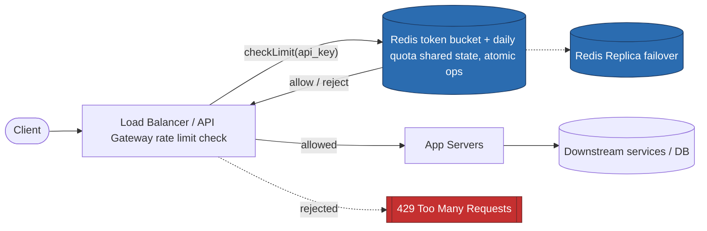

# Rate Limiter

## Scope & Requirements

**Functional Requirements**

- Limit the number of requests a client (identified by API key) can make within a given time window.
- Support multiple simultaneous limit types per client: a short burst limit (e.g., 100 req/sec) and a longer quota (e.g., 1M req/day).
- Support different limits per client tier (e.g., free vs. paid).
- Secondary IP-based limiting for clients without an API key (abuse prevention).

**Non-Functional Requirements**

- Availability: Fail-open preferred over fail-closed — rate limiter downtime should not take down the whole API platform. Eventual/approximate accuracy acceptable (not a strong-consistency system).
- Latency: Rate-limit check must add **< 5ms p99** to every request — it sits in the hot path.
- Scale: ~500,000 distinct API clients; ~50,000 req/sec average, ~200,000 req/sec peak.

## Capacity Estimation

- **Check QPS**: ~50K/sec avg, 200K/sec peak — every single request needs a rate-limit check, so this equals total platform traffic.
- **Storage**: One small counter/token-bucket record per client (~2 fields) — 500K clients × small footprint (~100 bytes) ≈ tens of MB. Trivially fits in memory (Redis).
- **Redis ops/sec**: ~200K/sec peak, all simple atomic ops (`INCR`, or token-bucket read/update) — well within Redis's single-digit-microsecond op capacity.
- Bandwidth: not a major factor here — payload is tiny (client ID + counter), no media/blob concerns.

## High-Level Design

**Core API / Interface**

- Not a client-facing API — it's an internal check invoked by the gateway/LB for every incoming request: `checkLimit(api_key) -> allow | reject`

**Data Model (in Redis, per client)**

- Token bucket state: `{tokens: int, last_refill_ts: timestamp}`
- Daily quota counter: `{count: int}` with a 24h TTL

**System Architecture**

Client → Load Balancer / API Gateway (rate limiter check happens **here**, before request reaches app servers) → Redis (shared counter/token state, atomic ops) → if allowed, forward to App Servers → downstream services/DB

Rate limiting placed at the **gateway/edge layer**, not the application layer — so a rejected request is discarded before it consumes any downstream resources (threads, DB connections, business logic).

**Big Picture**

## Deep Dive: Core Bottlenecks

**Deep Dive 1: Shared state across multiple gateway instances**  
Multiple LB/gateway instances handle traffic in parallel, so a client's requests get distributed across them. If each instance tracked counts locally, a client could exceed their true global limit by a multiple of however many instances they hit. Solution: externalize state to a shared Redis store, and use Redis's atomic operations (`INCR`, or a Lua script for token-bucket read-modify-write) instead of a distributed lock — a lock would serialize every request for a hot client and become a self-inflicted bottleneck at 200K req/sec.

**Deep Dive 2: Choosing the rate-limiting algorithm**

- **Fixed window counter** (simple `INCR` + TTL) is cheap but has a boundary-burst flaw: a client could send a full limit's worth of requests at the very end of one window and another full limit's worth at the start of the next, producing 2x the intended burst within milliseconds.
- **Token bucket** avoids this: tokens refill continuously based on elapsed time rather than resetting to zero at fixed boundaries, so there's no artificial "topping up" moment. Chosen for the **per-second burst limit**.
- **Fixed window counter** is still perfectly fine for the **daily quota** — at a 1M-request/day scale, the boundary-burst effect is negligible, and it's simpler than maintaining token-bucket state over a 24h horizon.
- Final design: a request must pass **both** checks — token bucket (burst/sec) **and** fixed window (daily quota) — to be allowed.

**Deep Dive 3: Redis failure / durability**  
Rate-limit state doesn't need strong durability — worst case on data loss is a brief window of over-admission, not corruption or financial loss (unlike a ledger). Approach:

- Redis native persistence (AOF/RDB) for approximate state recovery on restart.
- Primary + replica for availability/failover.
- **Fail open** if Redis is fully unavailable: allow requests through rather than blocking all traffic platform-wide; resume normal enforcement once Redis recovers. The bounded cost (a short unmetered window during a rare full outage) is preferable to synchronous DB writes on every request, which would blow the 5ms latency budget and require the DB to sustain 200K writes/sec just for rate-limiter bookkeeping.

## Scaling & Trade-offs

- **Single point of failure**: Redis itself — mitigated via replica failover and fail-open behavior rather than blocking all traffic on Redis unavailability.
- **Hot key problem**: A single very high-traffic client's counter could become a hot key in Redis — consider client-side sharding of the counter (e.g., split into N sub-counters summed at check time) if this becomes an issue at extreme scale.
- **Consistency trade-off**: Chose approximate/eventual accuracy over strict correctness — acceptable because rate limiting is a best-effort protection mechanism, not a system requiring exact guarantees, and this buys significant latency/throughput headroom.
- **Open question for further scaling**: is the celebrity-style "different limits per tier" static, or should limit tiers be dynamically adjustable based on current system load (mentioned as a follow-up in discussion, not fully explored)?