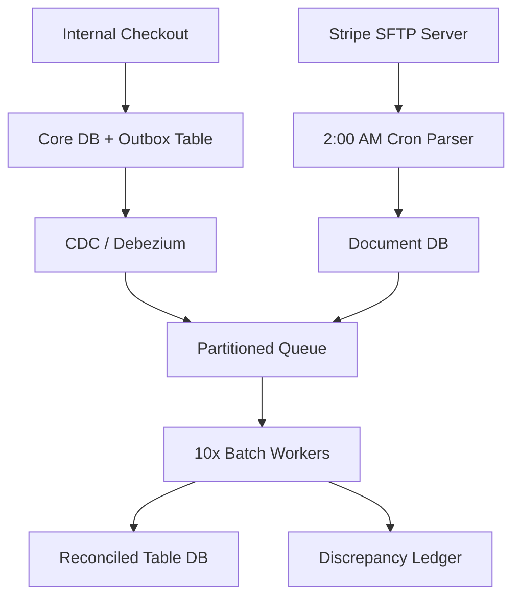
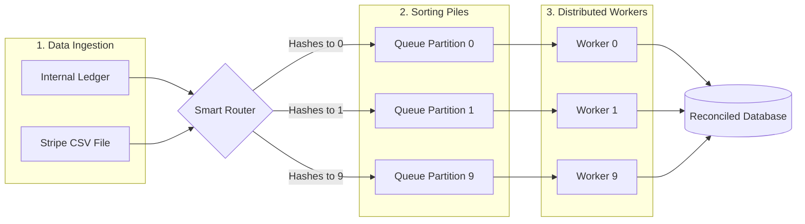
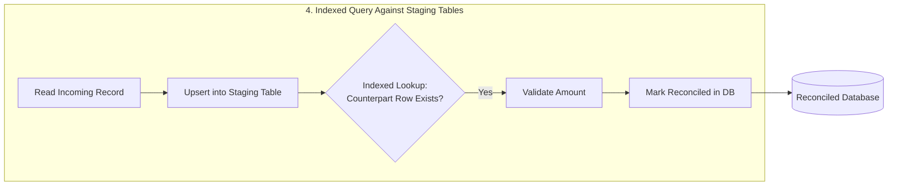

# Financial Reconciliation System

## Scope & Requirements

### Functional
- Ingest internal ledger data.
- Ingest external payment data (e.g., Stripe CSVs).
- Match transactions by ID.
- Flag and handle mismatches.
### Non-Functional
- **Scale:** 50 Million transactions per day.
- **Accuracy:** Strict financial consistency (no dropped data).
- **Latency:** Batch/offline processing (doesn't need to be real-time).

---

## Capacity Estimation (Back-of-the-Envelope Math)

- **Data Size:** Assume 1 record (internal ledger event or external CSV row) = 1 KB.
- **Daily Storage:**
  - Internal: 50,000,000 records × 1 KB = 50 GB / day.
  - External: 50,000,000 records × 1 KB = 50 GB / day.
  - Total Daily Raw Ingestion: 100 GB / day.
- **Throughput Rate (Flat Execution):** Spreading the 50M daily external transactions flatly across a controlled 24-hour ingestion window yields:
  $\approx 580 \text{ records/sec}$
  $\approx 580 \text{ KB/sec}$ inbound network bandwidth.
- **Memory Footprint:** 580 records/sec is only the arrival rate — it says nothing about the standing population of unmatched records waiting to be joined. Internal events arrive continuously all day via CDC, but the Stripe file only lands once, at 2:00 AM, so an internal record from 9:00 AM has to wait up to 17 hours before its counterpart even exists. The number that matters is the full day's accumulation right before the batch arrives: 50,000,000 records × 1 KB ≈ **50 GB of standing unmatched state**, not a 580/sec trickle that fits comfortably in 16 GB of RAM. This rules out a plain in-process hash map as the matching structure (see Deep Dive) and is why matching is done against durable, indexed staging tables instead.

---

## High-Level

### Core API & Event Endpoints

- `POST /v1/internal-events` -> Internal webhook pipeline to push transaction updates to the messaging layer via CDC (Change Data Capture).
- `SFTP Pull Event (Cron-triggered)` -> Batch job reads from `/settlements/stripe/YYYY-MM-DD.csv`.

### Database Schema

```sql
-- Operational DB (Protected via Outbox Pattern)
CREATE TABLE transaction_outbox (
    event_id UUID PRIMARY KEY,
    transaction_id VARCHAR(64) NOT NULL,
    amount DECIMAL(18, 4),
    currency VARCHAR(3),
    status VARCHAR(20),
    created_at TIMESTAMP
);

-- Reconciliation Staging & Audit DB
CREATE TABLE external_stripe_staging (
    stripe_tx_id VARCHAR(64) PRIMARY KEY,
    amount DECIMAL(18, 4),
    settled_at TIMESTAMP,
    raw_payload JSONB
);

CREATE TABLE discrepancy_ledger (
    audit_id UUID PRIMARY KEY,
    transaction_id VARCHAR(64),
    expected_amount DECIMAL(18, 4),
    actual_amount DECIMAL(18, 4),
    variance DECIMAL(18, 4),
    error_type VARCHAR(50), -- 'AMOUNT_MISMATCH', 'MISSING_EXTERNAL', 'MISSING_INTERNAL'
    resolved BOOLEAN DEFAULT FALSE
);
```

### System Architecture Map



---
	
## Deep Dive: Core Bottlenecks

### Hash-Based Partitioning & Data Shuffling



To reconcile millions of rows across distributed hardware without causing massive memory overhead or cross-worker chat network bottlenecks, we enforce strict Hash-Based Partitioning for distributing task to worker. 

The system collects our own data live all day then grabs Stripe's data once a night, and throws both into a smart sorting system that splits the heavy workload so multiple computers can share the job.

By setting the message key exclusively to the `transaction_id`, the message router runs an identical routing algorithm across both streams: `hash(transaction_id) % 10`. This guarantees that both the internal ledger event and the external Stripe record for any given ID are routed into the exact same partition queue. 

Distributed workers are assigned explicitly to individual partitions. Because internal records can wait up to ~17 hours for their Stripe counterpart (see Capacity Estimation), the "search map" cannot be a pure in-memory structure owned by a single stateless worker — a day's standing unmatched population is ~50 GB, and a worker restart or crash would silently wipe out everything it hadn't matched yet. Instead, each partition's incoming records (from both the internal CDC stream and the nightly Stripe load) are upserted directly into the durable staging tables (`transaction_outbox` / `external_stripe_staging`, both indexed on `transaction_id`), and the worker's "match" step is an indexed query — `SELECT` a candidate from one table, look up the same `transaction_id` in the other — rather than an in-memory join. This keeps the working set on disk instead of in a single process's RAM, so a worker crash mid-batch loses no state: on restart, it simply resumes querying the same partition's staging rows, since nothing was held only in memory.



### Resiliency & The Exception Pipeline

In financial systems, dropping or blocking execution loops over data anomalies introduces extreme operational risk. Our architecture separates automated stream matching from human auditing loops to guarantee uninterrupted batch execution.

**The Missing Record Trap (internal exists, Stripe missing):** If an internal record exists but the Stripe record is absent, the matching worker marks it as `UNRECONCILED_PENDING`. This has two explicit stages, not one ambiguous number: a **24-hour soft-pending window** to absorb normal processing delays or trailing bank webhooks, followed by escalation to a **48-hour hard-failure threshold** — if the record is still missing at that point, it is promoted to `RECONCILIATION_FAILURE` and routes to the `discrepancy_ledger` with `error_type = 'MISSING_EXTERNAL'`.

**The Reverse Case (Stripe exists, internal missing):** A Stripe settlement with no matching internal record is arguably the more dangerous case — it means money moved that the internal ledger never recorded. It follows the same staged grace period (24-hour soft-pending, 48-hour hard-failure) since the internal CDC event could simply be delayed, but on hard-failure it routes to `discrepancy_ledger` with `error_type = 'MISSING_INTERNAL'` and is paged to on-call immediately rather than waiting for routine audit review, since it represents unaccounted-for cash movement rather than a bookkeeping delay.

**The Amount Mismatch Bug:** If an internal event specifies a charge of $50 but Stripe reports only $45 was processed, the system considers the real-world cash movement (Stripe) as the ground truth. The matching worker flags this immediately as an application bug or telemetry fault. It bypasses any dangerous automated corrections or charge retries, writes the exact mismatch delta into the `discrepancy_ledger` with `error_type = 'AMOUNT_MISMATCH'`, increments a Prometheus metric counter, and safely processes the next message.

## Scaling & Trade-offs

**Transactional Outbox Over Live Ingestion:** We explicitly chose to implement a transactional outbox table instead of having the core checkout service publish directly to the reconciliation queue. This trades minor write latency overhead in the core checkout service for data integrity, ensuring we never drop transaction telemetry during network blips or broker failures.

**Scheduled Processing Over Real-Time Joins:** Instead of utilizing a massive, expensive, real-time distributed cache to hold millions of un-reconciled transactions for hours while waiting for Stripe's file, we trade real-time visibility for operational safety. By scheduling the core matching pipeline around Stripe's batch schedule and keeping the standing unmatched population in the indexed staging tables (see Deep Dive) rather than in worker RAM, we achieve flat, fully predictable compute costs, avoid out-of-memory cascading faults, and survive worker restarts without losing any in-flight match state.