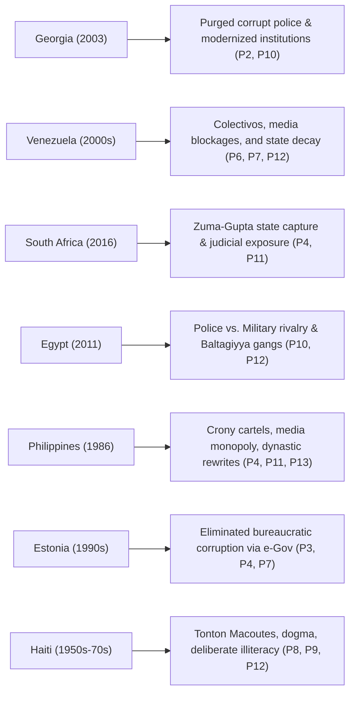

# PILLARS OF STATE CAPTURE

This section provides a systematic diagnostic mapping of the 14 structural issues defining total state capture in an Extractive Cartel Democracy. Each issue is analyzed by its root cause, institutional manifestation, and impact on state stability.

---

## Executive & Legislative Domain

### Unqualified & Uneducated Legislative Body (DPR)
* **Root Cause:** Money politics, open-list proportional party systems dominated by oligarchic financing, and party loyalty prioritizing obedience over competence.
* **Manifestation:** Up to 70% of lawmakers lack foundational governance, legal, or economic policy qualifications. Legislative drafting is outsourced to corrupt consultants or party cartels.
* **Systemic Impact:** The parliament functions as a rubber-stamp body for elite interests rather than a mechanism for public oversight.

### Nepotistic Loyalty Appointments & Technocratic Purges
* **Root Cause:** Executive consolidation strategy aimed at eliminating political threats and internal oversight.
* **Manifestation:** Systematic removal of independent technocrats, economists, and legal experts from ministries, state-owned enterprises (BUMN), and regulatory bodies. Replacement with family members, political allies, and loyalists.
* **Systemic Impact:** Destruction of institutional competence, leading to policy failure, fiscal waste, and institutional decay.

### Constitutional Bending for Dynastic Succession
* **Root Cause:** Long-term elite political preservation and immunity planning beyond legal term limits.
* **Manifestation:** Manipulation of the Constitutional Court (*Mahkamah Konstitusi*) and legal frameworks to alter eligibility rules for family members (e.g., lower age limits for executive office).
* **Systemic Impact:** Destroys the rule of law at the constitutional level, signaling that formal statutes are malleable under political power.

---

## Judicial, Security & Enforcement Domain

### Systemic Judicial Corruption, Elite Impunity, & Income Disparity
* **Root Cause:** Two-tiered legal apparatus designed to enforce strict penalties on the population while insulating the ruling class.
* **Manifestation:** 
  * Prosecutors and judges routinely sell verdicts or dismiss high-level corruption and violent crime cases (e.g., physical violence or murder committed by children of elites/military/parliament members).
  * High-profile judicial cases feature opaque evidence standards and political interference.
  * Parliamentary salaries and allowances exceed average national income by up to 75x, creating total detachment from public realities.
* **Systemic Impact:** Total breakdown of civic trust in equal justice under law.

### Police vs. Military Turf Warfare (Polri vs. TNI)
* **Root Cause:** Fragmented "coup-proofing" strategies by the executive combined with competition over off-budget illicit revenue streams.
* **Manifestation:** Separate power structures running independent extortion, protection, and illegal resource operations (smuggling, illegal mining, land grabs), leading to localized armed clashes between security forces.
* **Systemic Impact:** Loss of state monopoly on legitimate violence and paralysis of public safety enforcement.

### State-Sponsored Paramilitary & Gang Proxies (*Ormas*)
* **Root Cause:** Outsourcing state violence and intimidation to third-party civilian proxies for plausible deniability.
* **Manifestation:** State institutions, local leaders, and corporations pay mass organizations (*ormas*) and criminal syndicates to protect illegal businesses, suppress labor unions, intimidate political opponents, and secure land grabs.
* **Systemic Impact:** Privatization of violence, street-level extortion, and law enforcement breakdown.

---

## Financial & Institutional Corruption Domain

### Procurement Cartels & Vendor Exploitation
* **Root Cause:** Government procurement platforms designed for elite rent-seeking rather than competitive bidding.
* **Manifestation:** Public contracts, infrastructure projects, and welfare programs are pre-allocated to corporate shells and vendors owned by political party figures, lawmakers, and their families.
* **Systemic Impact:** Overpriced public goods, infrastructure failure, and massive fiscal leakage directly into elite bank accounts.

### Extrajudicial Financial Chokepoints & Banking Instability
* **Root Cause:** Executive overreach using financial monitoring agencies and law enforcement to silence opposition without trial.
* **Manifestation:** Direct freezing or blocking of personal and commercial bank accounts by police or financial intelligence units without prior judicial warrants or due process.
* **Systemic Impact:** Destruction of property rights, flight of domestic capital, and systemic loss of public trust in state-regulated banking institutions.

---

## Information, Digital & Civil Rights Control

### Digital Censorship & Arbitrary Account Blocking (Komdigi)
* **Root Cause:** Digital authoritarianism deployed to control political narratives and silence whistleblowers.
* **Manifestation:** Ministry of Digital Affairs (*Komdigi*) using state administrative powers to block social media channels, domain names, news outlets, and private user accounts without judicial oversight.
* **Systemic Impact:** Suppression of free speech, disruption of digital commerce, and destruction of digital civil liberties.

### Oligarchic Media Ownership & News Manipulation
* **Root Cause:** Consolidation of national broadcast television networks and digital media conglomerates under political party bosses and corporate oligarchs.
* **Manifestation:** Systemic suppression of investigative journalism, self-censorship regarding elite crimes, and coordinated pro-government propaganda.
* **Systemic Impact:** Asymmetric information landscape preventing citizens from making informed political decisions.

---

## Human Capital, Dogma & Socio-Economic Erosion

### Misallocation of Tax Revenue to Religious Bureaucracy
* **Root Cause:** Strategic co-optation of religious hierarchies to secure electoral blocks and moral legitimacy.
* **Manifestation:** Allocation of immense state budget shares to religious administration, ceremonial bureaucracies, and religious institutional funds—ranking higher in fiscal priority than foundational public education and scientific research.
* **Systemic Impact:** Severe misallocation of national wealth away from productive human capital development.

### Weaponization of Dogma for Public Passivity
* **Root Cause:** Elite deployment of identity politics and fatalist religious doctrine to deflect focus from material conditions.
* **Manifestation:** Framing systemic poverty, corruption, and infrastructure failures as divine tests or moral panics, directing public anger toward minority groups or moral issues rather than state corruption.
* **Systemic Impact:** Destruction of political accountability and civil rights organization.

### Chronic Educational Collapse & Foundational Deficits
* **Root Cause:** Deliberate underfunding and ideological distortion of public education to maintain an easily manipulable electorate.
* **Manifestation:** Over 90% of the population lacks access to quality education; secondary school students demonstrate catastrophic deficits in basic mathematics, scientific literacy, and critical thinking (reflected in declining PISA rankings).
* **Systemic Impact:** Creation of a low-skill economy incapable of industrial modernization, trapping the nation in raw resource dependency.

### Severe Socio-Economic Friction & Inflationary Pressure
* **Root Cause:** Regressive taxation policies paired with unchecked price inflation on basic commodities.
* **Manifestation:** Unilateral increases in Value-Added Tax (PPN) and property taxes (*PBB*) to cover fiscal deficits, while basic staple food prices (rice, cooking oil, fuel) rise continuously.
* **Systemic Impact:** Erosion of the middle class, severe increase in poverty rates, and triggering of explosive public unrest.

---

# ACTIONABLE SOLUTIONS PLAYBOOK – BREAKING STATE CAPTURE

This playbook maps specific, actionable solutions to each of the 14 diagnosed issues. Actions are divided into **Immediate Bottom-Up/Civil Society Levers** (executable immediately without government permission) and **Structural Policy Locks** (non-negotiable institutional resets).

---

## Comprehensive Issue-to-Solution Matrix

| Issue & Name                            | Immediate Civil Society Action (Bottom-Up)                                                                                           | Structural Policy Lock (Top-Down Reset)                                                                                                  |
| :-------------------------------------- | :----------------------------------------------------------------------------------------------------------------------------------- | :--------------------------------------------------------------------------------------------------------------------------------------- |
| **Uneducated/Corrupt DPR**           | Publish open-source candidate scorecards tracking vote history, assets, and educational backgrounds; initiate civic primary vetting. | Enforce minimum educational/competency testing for legislative candidates; mandate public debates on policy formulation.                 |
| **Judicial Impunity & High DPR Pay** | Deploy citizen court-monitoring teams; use crowdsourced asset tracking to expose unexplained wealth of judges/prosecutors.           | Pass the *RUU Perampasan Aset* with Non-Conviction Based (NCB) asset recovery; cap legislative pay relative to median wage.              |
| **Incompetent Loyalty Appointments** | Whistleblower leaks exposing political interference in technical agencies; civil suit challenges against unverified appointments.    | Establish an independent Meritocratic Civil Service Board; strip ministers of appointment power for technical posts.                     |
| **Corrupt Vendor Cartels**           | Deploy Open-Contracting OSINT tools to map corporate ownership connections between politicians and state vendors.                    | Mandate 100% open-data API access for public procurement; automate tender scoring via tamper-proof public ledgers.                       |
| **Tax Waste on Religion**            | Conduct independent public audits comparing education/R&D spending vs. religious administration expenditures.                        | Ring-fence the national budget: bind education funding directly to PISA/STEM metrics; cap administrative religious subsidies.            |
| **Arbitrary Komdigi Censorship**     | Deploy decentralized VPN infrastructure, mirror sites, and encrypted mesh networks; file class-action administrative suits (*PTUN*). | Pass digital rights legislation requiring prior judicial warrants signed by a panel of judges before any site/account blocking.          |
| **Extrajudicial Bank Freezes**       | Initiate legal defense coalitions for affected accounts; shift asset holdings into alternative decentralized/offshore vehicles.      | Amend banking statutes to explicitly criminalize administrative account freezes executed without a formal court order.                   |
| **Weaponized Dogma**                 | Establish independent secular community education hubs; run counter-narrative campaigns separating faith from state accountability.  | Strict enforcement of anti-politicking laws in religious institutions; strip tax-exempt status from politically active religious groups. |
| **Chronic Educational Collapse**     | Fund open-access digital education platforms, community STEM bootcamps, and foundational math/literacy networks.                     | Overhaul national curriculum to focus on logic, math, and science; tie teacher pay directly to objective competency evaluations.         |
| **Police vs. Military Turf Wars**   | Map and document illegal business enterprises operated by police/military factions; publish geo-tagged extortion maps.               | Complete statutory separation: legally restrict TNI exclusively to external defense; dismantle all off-budget security revenue streams.  |
| **Dynastic Law Bending**            | Mass civic litigation before the Constitutional Court (*MK*); boycott dynastic candidates during elections.                          | Constitutional amendment barring immediate family members of sitting executives from running for executive office.                       |
| **State-Sponsored *Ormas* Gangs**   | Document and publish video evidence linking *ormas* extortion directly to corporate/state funding sources.                           | Criminalize state/corporate funding of informal paramilitaries; strip legal status and seize assets of violent *ormas* networks.         |
| **Oligarchic Media Monopoly**       | Build independent, reader-funded digital media cooperatives; utilize global decentralized publishing platforms.                      | Enforce anti-monopoly laws in broadcast spectrums; prohibit active political party leaders from owning media networks.                   |
| **Food Inflation & Tax Squeezes**   | Establish consumer purchasing collectives, food cooperatives, and organized tax protest coordination.                                | Repeal regressive VAT hikes on basic goods; eliminate import cartels for staple foods through open-market deregulation.                  |

---

## Action Plan by Execution Phase

### Phase 1: Immediate Civilian Exposure Strategy (Months 0–6)
1. **Financial OSINT Coalitions:** Form investigative units uniting tech-workers, journalists, and legal experts to track unexplained wealth, corporate shell structures, and vendor links among DPR members and judges.
2. **Legal Resistance:** File simultaneous class-action lawsuits against Komdigi (censorship) and law enforcement agencies (extrajudicial bank freezes) in administrative courts to build legal precedents.
3. **Decentralized Education Networks:** Deploy offline and online open-source learning modules targeting basic logic, mathematics, and civic rights directly to youth organizations.

### Phase 2: Legislative Firewall & Campaign Strategy (Months 6–18)
1. **The RUU Perampasan Aset Campaign:** Unify all civil society, student, and labor unions around a single, non-negotiable legislative demand: passage of the Asset Forfeiture Bill containing **Non-Conviction Based (NCB)** recovery terms.
2. **Procurement Transparency:** Demand open API integration into all state e-catalogs, allowing public algorithms to monitor bidding patterns and flag vendor monopolies in real time.

### Phase 3: Radical Institutional Rebuild (Post-Crisis Window)
1. **Agency Purges & Re-Staffing:** Following political turning points, execute complete structural purges of compromised units (similar to Georgia's police overhaul), replacing personnel through vetted, meritocratic testing.
2. **Total Administrative Digitization:** Shift 90%+ of public approvals, land registries, tax filings, and court dockets to open e-governance infrastructure (similar to Estonia), removing human gatekeepers and bribe opportunities entirely.

---
---

# COMPARATIVE GLOBAL HISTORIES – CASE STUDIES IN STATE CAPTURE & BREAKOUT

This section documents historical precedents from other nations that experienced conditions identical to the 14 diagnosed issues. It details how state capture functioned in those contexts and the exact mechanisms used to break or adapt to it.

---

## Matrix of Global Precedents by Diagnosed Issue

---

## Detailed Country Case Studies

### 1. Georgia (2003 Rose Revolution)
* **Diagnosed Issues Addressed:** Judicial/Police Impunity (P2), Incompetent Appointments (P3), Police Corruption/Turf Warfare (P10).
* **The Captured State:** Following the collapse of the Soviet Union, Georgia became a mafiocracy. Traffic police operated as a legalized extortion syndicate, organized crime bosses (*thieves-in-law*) controlled government ministries, and public services functioned entirely through bribery.
* **The Breakout Mechanism:** 
  1. **Mass Mobilization:** The 2003 Rose Revolution forced out President Eduard Shevardnadze following rigged elections.
  2. **Radical Purge:** In July 2004, the new administration fired the entire 30,000-member traffic police force in a single day. Roads were left unpatrolled for weeks while an entirely new force was recruited, vetted, and paid competitive salaries.
  3. **Regulatory Deregulation:** Reduced government licenses and permits by 85%, eliminating the human discretionary points where bribes were demanded.
* **Outcome:** Georgia jumped from 133rd on Transparency International’s CPI to consistently rank among the top 45 cleanest nations globally.

---

### 2. Venezuela (2000s–Present): The Adaptive Capture Model
* **Diagnosed Issues Represented:** Digital Censorship (P6), Bank Freezes (P7), Educational Deficits/Dogma (P8, P9), State Paramilitaries (*Colectivos*) (P12).
* **The Captured State:** The ruling regime dismantled democratic institutions by packing the Supreme Court, replacing competent oil engineers at state-owned PDVSA with political loyalists, and deploying state-backed armed gangs (*colectivos*) to terrorize citizens.
* **The Mechanism of Control:**
  * **CONATEL & SUDEBAN:** The telecom agency (CONATEL) blocked independent news outlets and social media, while the banking regulator (SUDEBAN) froze the accounts of political opponents without court warrants.
  * **Colectivos:** Armed paramilitary gangs were granted local territorial control and extortion rights in exchange for attacking anti-government protests.
* **Current Status:** Following political transformations, state capture often adapts into institutional continuity. If underlying courts, military cartels, and gang networks are not systematically dismantled, state capture persists under altered elite coalitions.

---

### 3. South Africa (2016–2022): The Zuma-Gupta "State Capture"
* **Diagnosed Issues Addressed:** Vendor Cartels (P4), Incompetent Loyalty Appointments (P3), Dynastic Bending (P11).
* **The Captured State:** During President Jacob Zuma’s administration, a private business family (the Guptas) acquired total capture over state enterprises. They selected cabinet ministers, diverted procurement contracts from state energy (Eskom) and transport (Transnet) firms, and compromised the revenue service and prosecution authority.
* **The Breakout Mechanism:**
  1. **Whistleblowers & Media:** The "Gupta Leaks"—over 100,000 leaked emails published by investigative journalists—exposed the precise mechanics of the vendor cartels.
  2. **Judicial Resilience:** The independent **Constitutional Court** ruled that the president had violated the constitution, enforcing the authority of the Public Protector.
  3. **The Zondo Commission:** A judicial commission of inquiry systematically subpoenaed state officials, exposed the capture network, and forced the ruling party to recall Zuma.

---

### 4. Egypt (Hosni Mubarak Era, 1981–2011)
* **Diagnosed Issues Represented:** Police vs. Military Turf Wars (P10), Dynastic Law Bending (P11), State Thug Proxies (*Baltagiyya*) (P12).
* **The Captured State:** Mubarak created a police state run by the Ministry of Interior to balance the power of the Egyptian Armed Forces. 
* **The Mechanism of Control:**
  * **Baltagiyya:** The regime paid criminal gangs (*Baltagiyya*) to break up political rallies, intimidate voters, and run protection rackets.
  * **Dynastic Succession:** Formal laws were repeatedly amended to prepare Mubarak's son, Gamal Mubarak, for executive takeover.
* **The Breakout & Resegmentation:** Mass protests in Tahrir Square during the 2011 Arab Spring successfully removed Mubarak. However, because civil society lacked the organizational structure to rebuild the judiciary and civil administration, the military apparatus eventually re-consolidated power in 2013.

---

### 5. Estonia (1990s–Present): Total Structural Digitization
* **Diagnosed Issues Addressed:** Incompetent Bureaucracy (P3), Vendor Corruption (P4), Extrajudicial Banking Overreach (P7).
* **The Captured State:** Upon gaining independence from the Soviet Union in 1991, Estonia inherited a deeply corrupt administrative apparatus characterized by Soviet-style bribery, opaque record-keeping, and weak legal enforcement.
* **The Breakout Mechanism:**
  1. **E-Estonia Architecture:** Rather than attempting to retrain corrupt bureaucrats, Estonia built a digital government interface (the X-Road framework).
  2. **Removal of Discretion:** Shifted 99% of public services—including voting, business registration, tax filing, land registry, and medical records—online.
  3. **Public Audit Trails:** Implemented cryptographic logging where every instance of an official accessing a citizen's data is recorded and visible to the citizen, making illegal data or account access an immediate firing offense.
* **Outcome:** Estonia transformed into one of the least corrupt, most digitally advanced economies in the world, completely neutralizing low- and mid-level administrative corruption.

---

## Summary of Comparative Historical Lessons

| Country | Key Takeaway for Anti-Capture Movements |
| :--- | :--- |
| **Georgia** | Proves that deeply corrupt enforcement agencies (police) cannot be reformed incrementally; they must be completely dissolved, purged, and rebuilt. |
| **Venezuela** | Proves that removing top executive leadership without dismantling underlying courts, military cartels, and gang proxies simply leads to adaptive state capture. |
| **South Africa** | Demonstrates the power of combining independent media leaks with an uncaptured Constitutional Court to expose and dismantle vendor cartels. |
| **Estonia** | Shows that digitizing public administration and eliminating human official discretion is the most effective permanent barrier against bureaucratic bribery. |