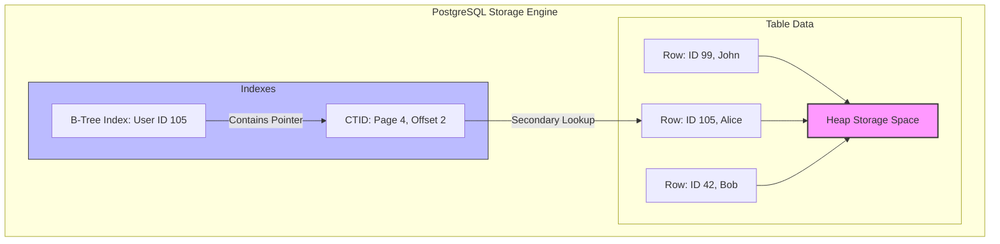
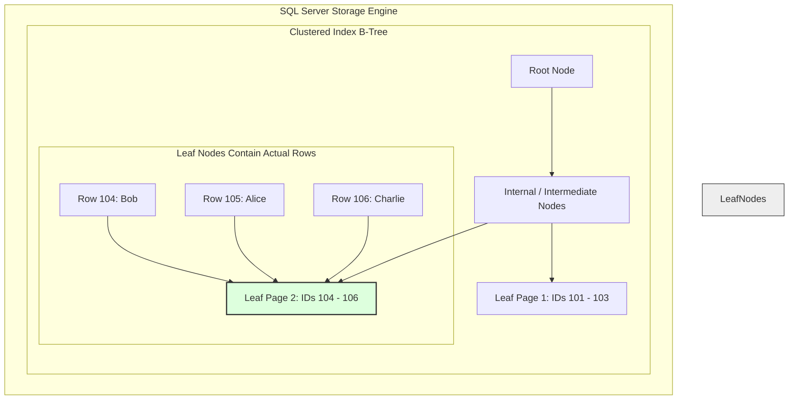
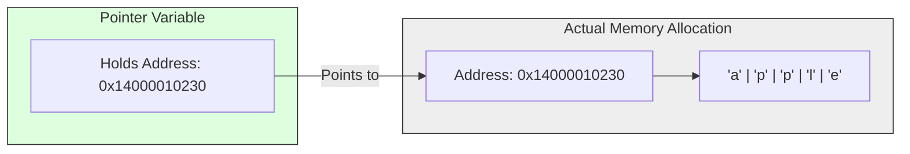
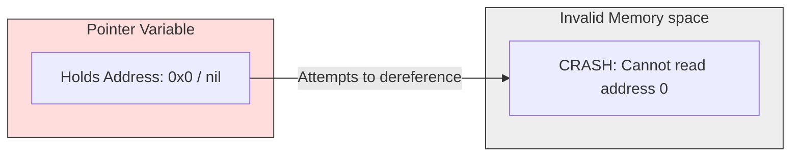

# Software Engineering Journey

## Variable Naming & Function Design

Determine when to use descriptive or short variable names; it really depends on how long the function process is. A long function with short variable names will lose context as we navigate the logic in that function.

A function name should also have a clear intent, like `GetProductDetail`. We don't really care how complex the logic is in that function, as long as the intent is GETTING data, not modifying it.
Use abstraction when needed for example:

```go
func GetNews() (NewsResp) {
  // call reddit news
  // return NewesResp{}
}
```

Later if we need to change news API we will have to refactor the code. This might complicate the function logic as we add new code to handle a different news API. The better approach is using interface

```go
type NewsReq struct {}
type NewsResp struct {}

type NewsAPI interface {
  func GetNews(req NewsReq)(NewsResp, error)
}
```

Here we defined struct like `NewsReq` and `NewsResp`. The purpose of this is to act as a translation layer, because every news API might have a different API response, so we map it to our data format. So if we want to change news API we can just change the concrete implementation

```go
// news/dependencies.go
func NewNews(n NewsAPI) {
}

// external/news.go
type RedditNews struct {}
type YahooNews struct {}

func (r *RedditNews) GetNews(req NewsReq) (NewsResp, error) {}
func (r *YahooNews) GetNews(req NewsReq) (NewsResp, error) {}

// server.go
rn := &RedditNews{}
yn := &YahooNews{}

news := news.NewNews(rn)
// news := news.NewNews(yn)
```

## Abstraction with Interfaces

A little tip that might be helpful if the codebase is large is to put a type assertion in the concrete implementation. This way, while we are still coding, we can know immediately if there is an error (meaning the function is not properly implementing the abstraction).

```go
// external/news.go
package external

import "yourproject/news"

type RedditNews struct {}
type YahooNews struct {}

// Interface compliance checks (Compile-time type assertions)
var _ news.NewsAPI = (*RedditNews)(nil)
var _ news.NewsAPI = (*YahooNews)(nil)

func (r *RedditNews) GetNews(req news.NewsReq) (news.NewsResp, error) {
    return news.NewsResp{}, nil
}

func (y *YahooNews) GetNews(req news.NewsReq) (news.NewsResp, error) {
    return news.NewsResp{}, nil
}
```

## Data Types & API Contracts

Variable data types is matter. Most of the time, we create API contracts for the frontend (WEB). JavaScript has a maximum safe integer length, and its default data type for numbers is `Number` (which uses 64-bit floating-point math) $9,007,199,254,740,991$ (16 digits).

So, returning number bigger than that like **Big Integer** will cause the number to be automatically rounded and corrupted by JavaScript. The solution to this problem is to convert that big integer into a **String** before sending it in the API response.

Another thing related to numbers is floating/decimal numbers. A lot of companies I worked at before used float data types for money, which results in number inaccuracy. For example, if you add small amounts together using floats, the math will eventually break:

```go
package main

import "fmt"

func main() {
    var price float64 = 0.1
    var total float64 = 0.0

    // Add 0.1 ten times
    for i := 0; i < 10; i++ {
        total += price
    }

    // You expect 1.0, but float inaccuracy gives you: 0.9999999999999999
    fmt.Println("Total:", total)
}
```

There are ways to handle this properly, like using the Stripe approach. With this method, we use the smallest unit of the currency, like "cents," and use an integer data type. Because integers don't have decimals, there will be absolutely no inaccuracy with decimal points. Ref: https://docs.stripe.com/api/charges/object

| **Actual Amount** | **Value Stored in Database / Code (as Integer)** |
| --- | --- |
| $1.00 | `100` (cents) |
| $10.50 | `1050` (cents) |
| $99.99 | `9999` (cents) |

Next is the return values of the fields in the API. Go has default zero values. For example, an integer defaults to `0`, a float to `0.0`, and a string to `""`.

In finance, `0` might actually mean something. You have to be very careful when deciding how to handle this, because an admin fee of `0` means something entirely different from a missing or unconfigured admin fee.

```go
type FeeResponse struct {
    // If AdminFee is 0, omitempty completely deletes it from the JSON output!
    AdminFee int64 `json:"admin_fee,omitempty"`
}
```

Also, check carefully when adding `omitempty` to a struct field. Unlike native data types (like integers or strings), an empty nested struct will **not** be excluded from the JSON payload. Instead, it will return an empty JSON object `{}` filled with its own default zero values.

Go's standard `encoding/json` package determines if a field is "empty" based on a strict list: `false`, `0`, a `nil` pointer, or an array/slice/map/string with a length of 0. An initialized struct value (like `Address{}`) does not fit any of those categories, so Go considers it "not empty" and serializes it as an empty object `{}`.

## Structured Logging

When it comes to logging, if we use third-party tools like CloudWatch or Datadog, their pricing models are by data ingestion per gigabyte (GB) and the total number of indexed log events. Make sure to compact your data. For example, requests formatted in JSON should be compacted into a single line rather than spread across multiple lines.

```go
// BAD: Wasteful multi-line logging (treated as 5+ log events)
{
  "request_id": "req-123",
  "status": 200,
  "path": "/v1/news",
  "latency_ms": 45
}

// GOOD: Compacted single-line structured logging (treated as 1 log event)
{"request_id":"req-123","status":200,"path":"/v1/news","latency_ms":45}
```

## Idempotency

**Idempotency** is often used in use cases involving **retries and accidental data duplication** whether it is implemented by data hashing, unique ID generation on multiple requests, or other techniques. Its to guarantee that performing the exact same request multiple times will have the exact same result as performing it once

## Context & Timeouts

Handling the request lifetime by using `context.WithTimeout` in Go. While Go or your web framework might have a global default timeout, we often have strict constraints on how long a specific internal process should be running, for example

```go
func GetUserAccount(db *sql.DB, userID int) (*sql.Rows, error) {
	// Create a context that automatically cancels after 2 seconds
	ctx, cancel := context.WithTimeout(context.Background(), 2*time.Time(time.Second*2))
	defer cancel() // Free up resources once the function returns

	// Pass the context directly into the library function.
	// If the database takes longer than 2 seconds, the query cancels automatically.
	query := "SELECT id, balance FROM accounts WHERE id = ?"
	return db.QueryContext(ctx, query, userID)
}
```

## Caching Strategies

Determining when to use a distributed cache versus local in-memory storage depends heavily on your specific use case.

For my company blog project, I chose to use **in-memory storage** because I already know the total size of the data being handled. For example, the main page uses less than 2 MB of data. Instead of setting up a separate Redis instance, I used Go's native `//go:embed` directive to load the blog content directly into memory once at compile time.

```go
//go:embed blog_data.json
var blogContent []byte

func main() {
	// The 2MB of data is baked right into the binary and ready instantly
	fmt.Println("Blog data size:", len(blogContent))
}
```

While this approach makes the initial application startup a bit slower, it results in much faster runtime performance. Because the data lives inside the application process itself, we eliminate the extra **network hop** required to fetch data from an external database or cache.

I applied a similar approach to some of our external APIs, like our weather data endpoint. I built an in-memory cache but added strict guardrails like a maximum memory limit and a Time-To-Live (TTL) expiration mechanism to keep memory leaks in check.

Why skip a dedicated cache like Redis entirely here? It comes down to **cost and realism**. A company blog isn't going to get millions of visitors overnight. Setting up, paying for, and maintaining a separate infrastructure piece like Redis for a low-traffic service is over-engineering. Local in-memory storage is faster, cheaper, and perfectly sufficient.

## Eager Initialization (Boot-time Singleton)

When the data we depend on is static and predefined, there is no need to use Redis or other cloud storage. Instead, we can fetch it once at startup and keep it in memory as a singleton. However, we must keep in mind the memory footprint, concurrent access, and how to handle a failed API call (e.g., whether to ignore it, throw an error, or panic). It all depends on the system's goals: if it is a non-blocking operation, we can simply ignore the failure or return an empty default; if it is critical, we should throw an error or panic to fail fast.

```go
var (
    config     *StaticConfig
    configOnce sync.Once
)

// LoadConfig guarantees the heavy fetch runs exactly once, even if multiple
// goroutines call it concurrently during boot.
func LoadConfig() *StaticConfig {
    configOnce.Do(func() {
        config = fetchFromRemoteAPI()
    })
    return config
}
```

## Message Broker Selection

Choosing the right message broker whether it's Kafka, RabbitMQ, NATS, or AWS SNS/SQS depends entirely on your specific use case, scale requirements, and team expertise. While Kafka is fantastic for real-time data streaming and event replayability due to its append-only log architecture, you have to look at your team.

If your company or team only has deep knowledge of AWS SNS/SQS, it often makes more sense to choose that tool to achieve the same business functionality. The main concern is service cost, but setting up and maintaining a complex message broker architecture yourself if not done right can quickly equal or exceed the infrastructure and maintenance costs of a managed third-party serverless solution.

If your system doesn't require the full, heavy feature set of a traditional message broker, you can opt for a highly performant, lightweight option like **NATS**. It provides incredibly fast pub/sub messaging without the operational footprint of bigger tools.

And again it depends on your specific use case and how it scales:
- **AWS SNS/SQS:** Best for cloud-native, zero-maintenance, standard asynchronous queuing where you want to pay only for what you use.
- **Kafka:** Best for high-throughput log streaming, event sourcing, and scenarios where multiple consumers need to replay old historical data.
- **RabbitMQ:** Best when you require complex routing logic (like wildcards, topic matching, and exchange bindings) before messages hit a queue.
- **NATS:** Best for ultra-low latency, lightweight cloud-native microservices where performance is critical and operational simplicity is preferred.

## Infrastructure & Observability

From my perspective, infrastructure is the foundation for long-term and sustainable software. It is something that must be built right first. An application developer's program depends heavily on how the infrastructure is set up, including things like system availability, data durability, and stability. If a company doesn't have proper observability, like distributed tracing to correlate logs between different microservices, or if they have painfully slow deployment times, it makes the software unsustainable for the future.

At the same time, application developers are responsible for keeping the system healthy. Our role is to ensure the code follows best practices. For example, even if the infrastructure is stable, bad code without proper timeouts can still crash the system.

## Overthinking vs Underthinking

How deep should you dive into a problem? When do you decide you are overthinking or underthinking?

I believe there is a specific level where you must stop because diving deeper is simply not worth the time, effort, or cost. A classic example of overthinking is designing an idempotency cache:

1. You start with an **in-memory cache** for idempotency, but realize it won't survive an app crash.
2. So, you decide to use **Redis**. But what if Redis crashes?
3. You decide to add a **Redis Replica**. But what if data volume grows too big?
4. You plan for **Redis Sharding**. But what if an entire AWS region goes down?
5. You start designing **Geo-Sharding** and a full **Disaster Recovery plan**.

While this covers every single disaster scenario, it is complete overkill to do all at once.

| **Approach**      | **What it looks like**                                                                                                                                   | **The Risk**                                                                                                                         |
| ----------------- | -------------------------------------------------------------------------------------------------------------------------------------------------------- | ------------------------------------------------------------------------------------------------------------------------------------ |
| **Underthinking** | Throwing a quick fix together without considering basic failures (e.g., using a local map for idempotency in a multi-instance, autoscaling environment). | The app breaks immediately under standard production conditions.                                                                     |
| **Overthinking**  | Designing for "Six Nines" ($99.9999\%$) availability for a service that has low traffic or low business criticality.                                     | You waste months building complex infrastructure, delay the product launch, and create a system that is too complicated to maintain. |

You need to stop at a reasonable level that satisfies your **current business constraints and immediate next phase of growth**. The best approach is to build the simplest version that safely handles standard production requirements, and then **gradually improve it step-by-step** if you actually encounter issues related to that scale. Don't solve problems you don't have yet. Solve the problems you have today, design the system so it is flexible enough to change tomorrow

## Go Container Deployment

When deploying Go applications, it is crucial to understand how concurrency and parallelism affect your container's CPU and memory usage.

If you deploy a Go application inside a container (like Docker or Kubernetes), **the application still consumes physical memory from the underlying host Virtual Machine (VM).**

By default, the Go runtime is "container-blind." It looks past the container boundaries and sees the full resource capacity of the host VM. This mismatch can cause major performance and stability issues if you don't configure your limits properly.

```go
import _ "go.uber.org/automaxprocs" // Automatically matches GOMAXPROCS to the container quota
```

Also golang Garbage Collector (GC) doesn't know your container has a memory limit. If your container is limited to 512 MB, but the host VM has 16 GB of RAM, Go might let its memory usage balloon past 512 MB before it decides to trigger a garbage collection\

```go
// In your Dockerfile or Kubernetes YAML (leave ~10% headroom for the OS)
GOMEMLIMIT=450MiB
```

## Choosing a SQL Database

When choosing an SQL database, it is important to evaluate its storage architecture and indexing mechanics. PostgreSQL uses a heap storage engine, meaning that table data is stored independently of its indexes.

Indexing in Postgres uses a B-Tree structure, so a query lookup requires the engine to find the tuple identifier (CTID) in the index and then perform a secondary lookup in the heap to retrieve the row data.



For SQL Server, the engine defaults to a clustered index architecture, where the table data itself is physically stored directly inside the B-Tree leaf nodes. As a result, SQL Server performs exceptionally well with sequential primary keys, as new inserts can be cleanly appended to the end of the clustered B-Tree without causing heavy page splits.



PostgreSQL performs best in High-Volume Catalogs with Heavy Updates:
- Product updates (like stock or price changes) append a new version of the row directly to the heap space.
- If the updated column is not indexed, Postgres uses Heap-Only Tuples (HOT) to skip modifying the index entirely, avoiding massive disk write overhead.

SQL Server performs best in Sequential Ledgers and Time-Series Logs:
- Chronological or auto-incrementing inserts are appended straight to the very last page of the clustered index B-Tree.
- This sequential fill eliminates the overhead of searching for data placement and completely prevents internal page splits.

## Error Wrapping and Centered Logging

When building layered applications, adding log statements to every layer creates code noise and duplicate logs. A better approach is to wrap errors with contextual information at each layer, letting the error chain move upward naturally. By logging the accumulated error chain once at the presentation layer (such as the HTTP API handler), you eliminate redundant logs while preserving the execution context.

```go
package main

import (
	"fmt"
	"log"
	"net/http"
)

// 1. Adapter Layer: Interacts with the database
func fetchUserFromDB(userID string) error {
	// Simulate a low-level database connection failure
	baseErr := fmt.Errorf("connection timed out") 
	return fmt.Errorf("database adapter failed: %w", baseErr)
}

// 2. Business Logic Layer: Processes core business rules
func GetUserProfile(userID string) error {
	err := fetchUserFromDB(userID)
	if err != nil {
		// Wrap the error with high-level business context
		return fmt.Errorf("failed to retrieve user profile for ID %s: %w", userID, err)
	}
	return nil
}

// 3. Presentation Layer: The entry point (HTTP API)
func UserHandler(w http.ResponseWriter, r *http.Request) {
	userID := "user_123"

	err := GetUserProfile(userID)
	if err != nil {
		// LOG ONCE: Captures the entire architectural journey of the failure
		log.Printf("[ERROR] API Request Failed: %v", err)
		
		http.Error(w, "Internal Server Error", http.StatusInternalServerError)
		return
	}

	w.WriteHeader(http.StatusOK)
}

func main() {
	// [ERROR] API Request Failed: failed to retrieve user profile for ID user_123: database adapter failed: connection timed out
}
```

## Concurrency Lifecycles and Failure Strategies

When you writing concurrent code, managing how your goroutines live and die is your top priority. You have to check for common traps like deadlocks, operations that hang forever without a timeout, out of memory issues, data races, and accessing corrupted or deleted data. For advanced systems, you also have to consider data modification across distributed environments, which heavily depends on your specific use case.

For instance, if you need to fire off one hundred API calls at once, your approach depends entirely on your design requirements. If you allow partial failures so one bad call does not block the others, you can simply log the errors and let the remaining calls finish. But if a single failure means the whole batch should stop immediately, an error group is the perfect tool to manage the context cancellation.

You also need to evaluate if each API call requires an independent timeout context, and whether they are completely separate or dependent on each other. When API calls depend on the output of previous ones, you can use channels to coordinate it. Just remember to always clean up your resources using defer to cancel your contexts, check for channel closure before processing data, and define default fallback behaviors so your app never sits around doing nothing.

#### Example 1: Handling Partial Failures
Use this approach when you want to run all API calls to completion, even if some of them fail. A failure in one call does not stop the others.

```go
package main

import (
	"context"
	"fmt"
	"net/http"
	"sync"
	"time"
)

func fetchWorker(ctx context.Context, url string, wg *sync.WaitGroup) {
	defer wg.Done()

	req, err := http.NewRequestWithContext(ctx, "GET", url, nil)
	if err != nil {
		fmt.Printf("Error creating request for %s: %v\n", url, err)
		return
	}
	
	client := &http.Client{}
	resp, err := client.Do(req)
	if err != nil {
		// Log the error locally and allow other goroutines to keep running
		fmt.Printf("Error fetching %s: %v\n", url, err)
		return
	}
	defer resp.Body.Close()

	fmt.Printf("Successfully fetched %s (Status: %d)\n", url, resp.StatusCode)
}

func main() {
	urls := []string{
		"https://httpbin.org/delay/1",
		"https://invalid-url-that-will-fail.com",
		"https://httpbin.org/delay/2",
	}

	var wg sync.WaitGroup
	
	// Create a global 5-second timeout so no operation hangs forever
	ctx, cancel := context.WithTimeout(context.Background(), 5*time.Second)
	defer cancel() // Resource cleanup to prevent memory leaks

	for _, url := range urls {
		wg.Add(1)
		go fetchWorker(ctx, url, &wg)
	}

	wg.Wait()
	fmt.Println("All individual workers finished processing.")
}
```

#### Example 2: Stop Everything on First Error (Using errgroup.Group)

Use this approach when you want an all-or-nothing operation. If any API call returns an error, the error group automatically cancels the context, which tells all other active workers to abort immediately.

```go
package main

import (
	"context"
	"errors"
	"fmt"
	"time"

	"golang.org/x/sync/errgroup"
)

func fetchCriticalData(ctx context.Context, id int) error {
	// Simulate an API call that fails specifically on ID 2
	if id == 2 {
		time.Sleep(500 * time.Millisecond)
		return errors.New("critical API dependency failed")
	}

	// Simulate a successful API call that takes 2 seconds
	select {
	case <-time.After(2 * time.Second):
		fmt.Printf("API call %d completed successfully\n", id)
		return nil
	case <-ctx.Done():
		// This triggers when another worker fails and cancels the context
		fmt.Printf("API call %d was aborted early\n", id)
		return ctx.Err()
	}
}

func main() {
	// Derive an error group from a base context
	g, ctx := errgroup.WithContext(context.Background())
	
	// Set a hard absolute timeout for the entire group
	ctx, cancel := context.WithTimeout(ctx, 5*time.Second)
	defer cancel()

	for i := 1; i <= 3; i++ {
		workerID := i
		// Launch the task inside the error group manager
		g.Go(func() error {
			return fetchCriticalData(ctx, workerID)
		})
	}

	// Wait blocks until all tasks finish OR the first error occurs
	if err := g.Wait(); err != nil {
		fmt.Printf("Batch processing stopped early due to error: %v\n", err)
		return
	}

	fmt.Println("Entire batch processing completed successfully.")
}
```

## Memory and Pointers

If you have a background in C++, you will find familiar mechanics in Go when it comes to memory management. Go uses the exact same symbols for pointer operations: the `&` operator retrieves the memory address of a variable, while the `*` operator dereferences a pointer to access the actual value stored at that specific memory location.

A common misunderstanding is how pointers become `nil`. A pointer does not dynamically turn `nil` because the garbage collector cleared the underlying data, nor does it become `nil` during an out-of-memory event or an application crash. In fact, Go's tracing garbage collector guarantees that as long as an active pointer points to a memory allocation, that data will never be collected.

Instead, a nil pointer exception occurs simply because a pointer variable was never initialized to point to a valid memory address in the first place. If an application encounters an unmanaged out-of-memory error or a severe internal system fault, the entire application process terminates immediately rather than resetting individual pointer values.

#### Valid Memory Pointer
The pointer holds a real, trackable memory address. Dereferencing it safely reads the data block.



#### Invalid Memory Pointer (Nil)
The pointer holds the default zero-value address (`0x0`). Attempting to read it forces the runtime to panic instantly to prevent system corruption.


When you initialize a basic string variable, such as `test := "apple"`, Go allocates memory using a specific internal structure known as a string header. On a 64-bit architecture, this header consumes exactly 16 bytes of storage on the stack, split into two distinct fields:

- **Data Pointer (8 bytes):** Stores the memory address pointing to the underlying immutable byte array where the character text is kept.
- **Length (8 bytes):** Stores the total size of the string in bytes.

When you pass a string to a function or assign it to another variable without using a pointer, Go does not copy the entire body text of the string. Because strings are designed to be strictly immutable, multiple string headers can safely point to the exact same backing array. Therefore, copying a string value only copies the lightweight 16-byte header, making it a highly efficient operation.

```go
package main

import (
	"fmt"
	"unsafe"
)

func main() {
	original := "apple"
	copied := original // Only the 16-byte header is duplicated here

	// 1. The headers live in separate locations on the stack
	fmt.Printf("Original header stack location: %p\n", &original)
	fmt.Printf("Copied header stack location:   %p\n\n", &copied)

	// 2. Both headers point to the exact same byte array in memory
	fmt.Printf("Original backing array pointer: %p\n", unsafe.StringData(original))
	fmt.Printf("Copied backing array pointer:   %p\n", unsafe.StringData(copied))
}
```

Go applies this exact same design principle to other major structural types, using lightweight headers or internal descriptors to point to a shared space in memory:

- **Slices:** Just like strings, passing a slice by value only copies a small 24-byte header containing a data pointer, length, and capacity. It points to a shared backing array. _The big difference:_ Slices are mutable. If you modify the elements of a copied slice, you will directly alter the data in the original backing array.
- **Maps and Channels:** Under the hood, maps and channels are direct pointers to complex internal runtime structures (`hmap` and `hchan`). Copying a map or channel variable only copies a tiny 8-byte memory address. Both the original variable and the copy point to the exact same live data buckets.

**Note on Primitives:** Primitives like integers, floats, and booleans do not use headers or pointer descriptors at all. Because their raw values are already tiny (1 to 8 bytes), Go simply duplicates the value directly from one stack slot to another. It fits perfectly inside a single CPU register, making it incredibly fast.

Because strings, slices, and maps are already just lightweight headers or pointers under the hood, **you almost never need to pass them as pointers (`*string`, `*[]int`, `*map`) for performance reasons.** You only use a pointer if you explicitly need to change the header itself, like reallocating a new slice or replacing the entire map reference.

#### Stack vs. Heap
Deciding whether to pass a data structure by value or by pointer requires an understanding of how the Go compiler conducts escape analysis to choose between stack and heap distribution:

- **Passing by Value (Stack Allocation):** Copying values keeps data isolated within the local execution stack frame. The moment the function finishes its execution, the entire stack frame is discarded. This releases the memory with zero processing overhead and places no strain on the garbage collector.
- **Passing by Pointer (Heap Allocation):** When you pass a pointer, the compiler often cannot verify if the memory will be referenced elsewhere after the current function exits. This causes the data to escape to the heap. Heap allocations must be actively tracked and cleaned up by the garbage collector.

```go
package main

// A global variable that lives for the entire duration of the program
var globalStorage *int

func storePointer(p *int) {
	globalStorage = p // The pointer escapes the function scope here
}

func main() {
	// Declared locally inside main's stack frame
	num := 42 

	// Passing the pointer to a function that stores it globally.
	// The compiler cannot verify if 'num' will be safe on the stack 
	// after main finishes, so it escapes to the heap.
	storePointer(&num) 
}
```

Overusing pointers to avoid value copying can easily backfire. Flooding the heap with unnecessary pointers forces the garbage collector to run more frequently, which spikes CPU utilization. If long-running application loops continuously create heap references faster than the garbage collector can reclaim them, memory usage will compound over time, ultimately leading to an out-of-memory crash.

**As a general rule**: pass basic types, small structures, and header types by value, and reserve pointers for large custom data objects or states that require direct modification.

## Rest API
Use HTTP status codes correctly (like `400` for bad requests). For further handling on the client side, we can return a business error code, for example, `"error_code: 23"`. Keep it informative while not displaying sensitive information to the user.

Clients can read `404 Not Found` or read directly from the response body (like `cats: []`). It all depends on each company’s standards, as there are no global rules.

Carefully design how the fields behave in the API response. For example:

- `"admin_fee: 0"` could mean something specific in finance.
- Multi-platform clients (mobile, web) handling existing logic might have different mechanisms. While Client A treats `"jelly: {}"` as an unhandled empobject, another client treats it as valid object. We in the backend need to communicate clearly to the client how we handle it

We need to consider the worst-case scenario if we depend on an API, whether communicating between internal company services or external services. We cannot be sure that their service is consistent or free of production bugs. By using schema validation, we define what the structure is so that only API responses matching our definition will be parsed, allowing us to validate data early (such as checking whether they return `null` or empty data).

Each API may originate from the same base URL, but their response times and authentication can be different. Other things like headers can vary too, so we need to make them independent in terms of timeouts, headers, cookies, and related settings.