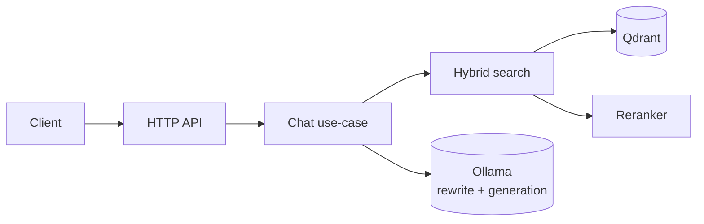
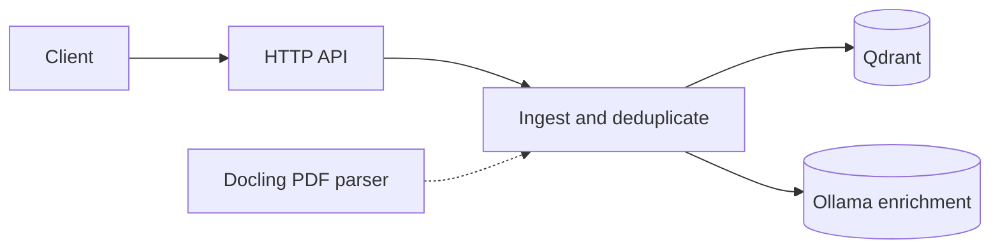
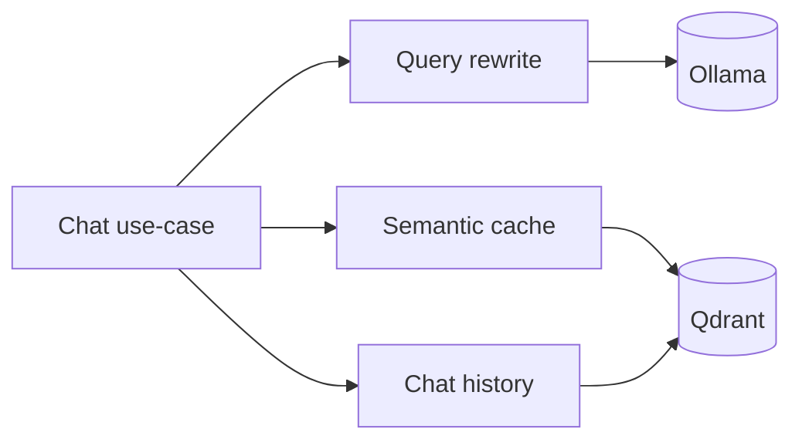

# Nadir Architecture

Nadir RAG search engine with Chat based conversatiion

## Request and retrieval flow

The public request path stays intentionally small. Nadir is one Go server, with
Qdrant and Ollama providing the main external dependencies.

## Ingestion flow

Ingestion is a separate path from question answering, so it can be understood
without the chat and retrieval internals.

## State and supporting services

Chat history and the semantic cache are both stored as separate Qdrant
collections. Query rewriting is optional and only applies to follow-up turns.

## Server

One Go binary: HTTP API, chat use-case, search and ingest pipelines, and the
composition root that wires everything together. No microservices.

## Dashboard

An htmx + Alpine chat UI: templates in `dashboard/` are embedded via
`go:embed` and parsed once at startup (no markup in Go source); it calls the
same HTTP API as curl and receives answers over plain EventSource (SSE).

## Vector store

All state lives in Qdrant (indexed chunks, semantic cache, chat history —
separate collections): self-hosted, dense + sparse with server-side fusion
in one query, no extra infrastructure.

## LLM service

Using Ollama service for embeddings, answer generation, enrichment, and
query rewriting — fully private and offline-capable.

## Ingest & chunking 

Chunking using markdown headings (paragraph/sentence boundaries, hard character split as fallback).

## Embeddings

Chunks are embedded with `nomic-embed-text`, with a document prefix at
ingest and a query prefix at search time, so the model distinguishes
document from search-query representations.

## Retrieval

Using hybrid search (dense + sparse, fused with RRF) each runs dense (semantics) and BM25
sparse (exact terms) legs in parallel, fused server-side with RRF to avoid
calibrating incompatible scores, then merged by best score with a per-file
cap so one document can't crowd out others.

## Re-ranking

Top candidates are re-scored by a swappable cross-encoder (Python); only a small candidate set is
reranked, so latency stays low.

## Semantic cache

Near-repeat questions hit a similarity-thresholded query-level cache in the vector store collection, skipping re-retrieval; it is cleared on ingest and full reset.

## Query rewriting

Follow-up turns are rewritten into standalone search queries over Ollama
(Rewrite-Retrieve-Read, feature-flagged, gated on chat history);
best-effort — a rewrite failure falls back to the raw query.

## Answer generation

Chunks are assembled into a citation-constrained prompt with the best chunks
in the middle, fit to a token budget, so answers stay faithful and
attributable to indexed documents. grounded RAG with lost-in-the-middle ordering

## Chat history

Each turn (query, rewritten query, chunks, prompt, answer, errors, timing)
is persisted per session, enabling conversation continuity and a reviewable
trace; sessions are listed in the sidebar and can be deleted individually.

## Index-time enrichment

Optional ingest-time passes over Ollama: HyPE generates hypothetical user
questions, contextual writes a short situational intro — both one-time per
chunk and off the query path, closing the gap between how documents read
and how users ask.

## Docling

A Python service converts PDFs to Markdown so they can be ingested (the
Python ecosystem isn't vendored into the Go binary); currently a standalone
script, not wired into the server.
