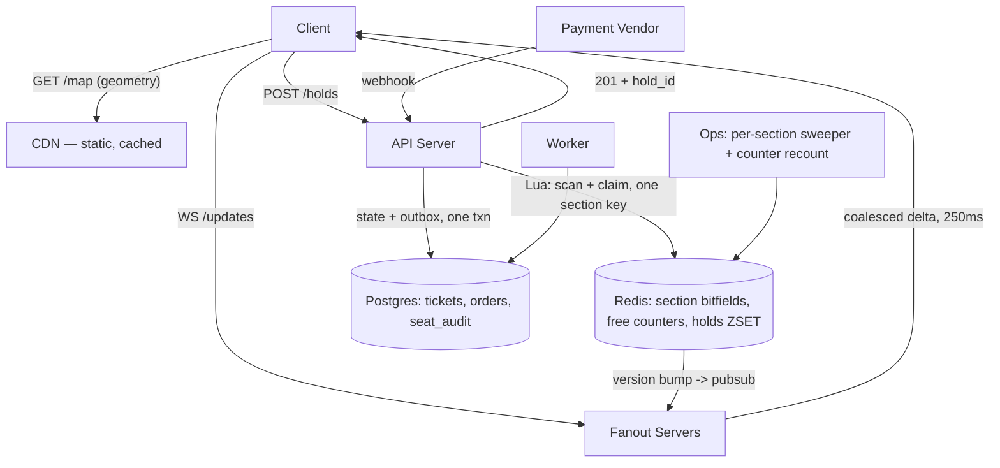

# Ticketing System with Seat Selection

## 1. Scope & Requirements

A stadium concert goes on sale at 10:00. 60,000 seats, 500,000 people waiting. Unlike a flash sale, **the inventory is not fungible** — a buyer wants *seat 14F*, or four seats *next to each other*, and "here's a different one" is not an acceptable substitute. That single difference invalidates the atomic-counter design that a flash sale rests on, and drives everything below.

### Functional Requirements

*  User views a live seat map for an event, showing which seats are free, held, or sold.
*  User selects specific seats — or asks for "best available, N together" and the system picks.
*  Selected seats are held exclusively while the user pays; an unpaid hold expires and the seats return.
*  A group request is **all-or-nothing**: four seats together, or none. Never a partial hold.
*  Payment is charged by an external vendor and confirmed asynchronously.
*  Out of scope: pricing engine, dynamic pricing, resale/transfer market, ticket delivery.

### Non-Functional Requirements

*  **Consistency:** strict for seat state. A seat is held by at most one session, ever. No double-sell.
*  **Latency:** seat map first paint < 500ms; hold attempt acknowledged < 100ms.
*  **Freshness:** the displayed map may lag reality by up to ~1s. The *hold* must not.
*  **Scale:** 500k users at on-sale; ~20k hold attempts/sec admitted at peak; ~500k seat-map snapshot fetches in the first minute.
*  **Fairness:** no systematic advantage between users — no seat is reserved for a privileged path, and automation is made expensive. Note that *click order* cannot be honoured: arrival order at Redis decides, and network jitter means the two differ. Promising "first click wins" would be a lie.

---

## 2. Capacity Estimation

*  **Seats:** 60k per event. ~100 sections, ~600 seats each.
*  **Admitted hold QPS:** 20k/sec peak. This is a **chosen** number, not a property of demand — the waiting room (§5) admits at a controlled rate, which is what makes every figure below finite. Raw demand at on-sale is unbounded.
*  Each hold touches 1–8 seats, so ~60k seat-state writes/sec.
*  **Read load, two ways.** Naive polling of the 18KB map by 500k clients at 1Hz is 9 GB/sec — the number the read design exists to avoid. After CDN geometry plus delta streaming (§4), origin sees ~500k snapshot fetches concentrated in the first minute and near-zero steady state.
*  **Seat state size:** 2 bits per seat. Rows are padded to a fixed stride (§3), costing ~20% extra slots, so 60k seats ≈ 18 KB per event. The entire live state of a stadium fits in one Redis string, comfortably in cache.
*  **Storage:** 60k ticket rows per event. Trivial. The concurrency problem is the whole problem.

---

## 3. High-Level Design

### Core API Endpoints

*  `GET /v1/events/{id}/map` → static seat geometry (CDN, cached indefinitely).
*  `GET /v1/events/{id}/state` → current state bitmap + version. Short TTL.
*  `WS /v1/events/{id}/updates` → delta stream of seat state changes.
*  `POST /v1/events/{id}/holds` → `{seats: [...]}` or `{count: 4, contiguous: true, tier: "lower-bowl"}`. All-or-nothing.
*  `DELETE /v1/holds/{id}` → release early.
*  `POST /v1/payment/webhook` → vendor confirmation, converts hold → sold. The finalize semantics — outbox before ack, idempotent state transition, at-least-once redelivery — are unchanged from [order-inventory-system.md](order-inventory-system.md) and are not re-derived here; seat identity does not alter them.

### Data Model

**Redis — authoritative for live seat state.**

| Key | Type | Purpose |
|---|---|---|
| `seats:{event}:{section}` | string (bitfield, `u2` per seat) | 0=free, 1=held, 2=sold, 3=blocked/padding |
| `free:{event}:{section}` | counter | Free seats remaining. Lets a full section reject in O(1) |
| `hold:{event}:{section}:{hold_id}` | hash | user, seat indices, expiry |
| `holds:{event}:{section}` | ZSET | hold_id scored by expiry — the sweeper's queue for that section |
| `ver:{event}:{section}` | counter | Bumped on every change; drives delta streaming |

**Postgres — durable record.**

*  `tickets` — `(event_id, seat_id)` PK, `status`, `order_id`, `updated_at`.
*  `orders` — `order_id` PK, `user_id`, `event_id`, `status`, `created_at`.
*  `seat_audit` — append-only log of every state transition. Reconstruction source.

**The choice that matters:** seat state lives in a **packed bitfield per section**, not as one key per seat. 600 seats plus row padding become one ~180-byte string, and a group hold is a single read-modify-write on one key inside one Lua script — which is what makes all-or-nothing atomicity cheap. Per-seat keys would make an 8-seat hold an 8-key transaction, and under sharding those keys could land on 8 different nodes.

**Every key above is section-scoped, and that is deliberate.** Sharding is by `(event, section)`, so any key an operation touches must live on the same instance as the section's bitfield. An event-scoped hold queue would put the sweeper's ZSET on one instance and the bitfield it must update on another — releasing a hold would then span instances and stop being atomic, leaking seats on a partial failure.

The rule catches the hold record too, which is why it is keyed `hold:{event}:{section}:{hold_id}` rather than by hold id alone. A bare `hold:{hold_id}` hashes independently of its section and lands anywhere, so the claim script would write across instances. **This has a client-visible consequence:** the hold id handed to the client must encode event and section — `{event}-{section}-{uuid}` — because `DELETE /v1/holds/{id}` has to route to the right shard from the id alone. An opaque id would require a global lookup table, which is the same cross-instance dependency wearing a different hat.

**Pub/sub is per-shard, not per-event.** A `PUBLISH` issued from a Lua script executes on the instance holding that section, and reaches only subscribers connected to *that* instance. Fanout servers therefore subscribe to every shard, not to a single event channel. The channel name is event-scoped; its delivery is not.

**Row geometry is encoded by padding, not by lookup.** Every row occupies a fixed stride in the bitfield, with unused slots set to `blocked`. A seat's row is therefore `index / stride` — arithmetic the Lua script can do with no additional data. Without this, the script would need row-boundary information that lives only in the CDN geometry payload, and "contiguous" could silently span an aisle.

**Known gap:** the bitfield stores state but not ownership, so there is no seat → hold reverse index. The happy path never needs one (the sweeper walks holds, not seats), and adding one would double the write cost on the hot path to serve a rare query. Post-crash "who holds seat 14F" is answered by replaying `seat_audit` in Postgres instead — slower, off the hot path, and already required for reconstruction.

### Architecture

**Two paths, deliberately different guarantees.** The read path is optimistic and eventually consistent — the map a user sees may be up to a second stale, and that is fine, because seeing a seat as free and losing it is a normal outcome the UI must handle anyway. The write path is strictly serialized per section, in Redis, and is the only thing that decides who gets a seat. **Display is advisory; the hold is authoritative.**

---

## 4. Deep Dive: Core Bottlenecks

### Deep Dive 1: Atomic all-or-nothing contiguous holds

The hard requirement: "4 seats together, or nothing," under 20k concurrent attempts, with no partial holds and no double-hold.

**Why the flash-sale approach doesn't transfer.** A flash sale decrements a counter — any unit is as good as any other, so a `DECR` returning ≥ 0 is a complete answer. Here, availability is a *predicate over identified seats*: does a run of k free seats exist in this row, and can I claim exactly those k atomically? A counter cannot express it.

**Approach: bitfield scan-and-claim in one Lua script.**

1. Check `free:{event}:{section}` — if below k, return immediately. A sold-out section costs O(1), not a 600-seat scan.
2. Read the section bitfield (~180 bytes — a single memory read).
3. Scan for the first run of k consecutive `free` seats **within one row**, where row membership is `index / stride`. Padding slots are `blocked` and terminate a run naturally, so no aisle-spanning check is needed.
4. If found: write `held` into exactly those k positions, decrement the free counter by k, record `hold:{event}:{section}:{hold_id}`, `ZADD` the expiry onto that **section's** hold queue, bump the version, publish the delta.
5. If not found: return empty. Nothing was written.

Redis executes the script atomically on one thread, so scan and claim cannot interleave. Partial holds are impossible: the script writes all k or none. Every key the script touches is section-scoped, so the whole operation stays on one instance under sharding — and so does its inverse, the sweeper's release.

**Keeping the counter honest.** The free counter is written atomically with the bitfield in this script, but the sweeper (held→free) and the payment path (held→sold) also move seats between states. A drifted counter is quietly damaging in both directions: too low blocks a section that has seats, too high admits scans that can never succeed. A recount job walks each section's bitfield — ~180 bytes — and corrects the counter on an interval. Cheap enough to run continuously, and it is the only thing standing between a single missed decrement and a section that silently stops selling.

**Cost:** scanning 600 seats in Lua is microseconds — the section fits in cache and the work is a linear pass over ~180 bytes. The concurrency bound is per-section serialization, which is the right bound: two people buying in different sections never contend.

**Best-available, and the trap in it.** The obvious implementation — iterate sections in strict preference order until one succeeds — is wrong at scale. Every best-available request then starts at the same section, so they all serialize on one key until it fills, then all move to the next. That reconstructs the single-hot-key problem this design is supposed to avoid, and best-available is plausibly the majority of real traffic.

Instead: **weighted random selection within a price tier.** Pick a section from the tier with probability proportional to its free count, skipping empty ones via the O(1) counter. Load spreads across every section in the tier from the first second, the user still gets what they asked for (a good seat in their price band), and a failed attempt writes nothing so retrying against another section needs no compensation.

The cost is that "best" becomes "good, in your tier" rather than strictly optimal. For a stadium where a tier contains thousands of comparable seats, that is not a user-visible loss — and it is the difference between a partitioned write path and a serialized one.

**Where the weights come from, because reading them naively is worse than the problem.** Weighting by free count means knowing every section's count in the tier before choosing. Read live, that is 20 counter reads per request — at 20k/sec, 400k reads/sec, which would make selection the largest read source in the system and undo the saving.

Instead the API process holds a **cached weight table per tier, refreshed on a ~500ms interval** from one pipelined read of the tier's counters. Weights are therefore stale by up to half a second, which is harmless here: a stale weight can only cause a poor *choice*, never an incorrect one, and the O(1) counter check inside the script rejects a section that filled in the meantime for almost nothing. Selection cost drops from 20 reads per request to 20 reads per refresh interval per process.

Retries against the next weighted pick are **capped at 3, then 409**. Stale weights near sell-out can miss repeatedly, and an unbounded retry loop would blow the 100ms acknowledgement budget precisely when the tier is nearly full — turning a fast, honest "sold out" into a slow one.

### Deep Dive 2: Serving a live seat map to 500k concurrent viewers

The read load is the second hard problem, and one a flash sale doesn't have — there, the read is a single number on a CDN.

**Naive:** clients poll `GET /state` every second. 500k clients × 18KB = 9 GB/sec of egress for data that is 99% unchanged between polls. Not viable.

**Design: static geometry + delta streaming.**

1. **Geometry to the CDN.** Seat positions, labels, and section shapes never change during a sale. Fetched once, cached forever, never touches origin.
2. **One state snapshot on connect** — 18KB, versioned, and **served from cache, never assembled per client.** Under `(event, section)` sharding the snapshot is a scatter-gather across ~100 sections on N instances; at ~8k connects/sec in the opening minute that would be 800k reads/sec, larger than the selection read load eliminated in Deep Dive 1. Instead the fanout tier rebuilds one assembled snapshot per event on a ~250ms interval — the same cadence as the delta frames — and every connecting client gets that copy. Assembly cost becomes a function of events in progress, not of arrivals. A client whose snapshot is a quarter-second stale is indistinguishable from one that connected a quarter-second earlier, and the version field lets the delta stream close the gap.
3. **Deltas over WebSocket thereafter.** A change is `(section, seat_index, new_state)` — a few bytes. Fanout servers subscribe to Redis pub/sub per event, batch changes over a ~250ms window, and broadcast one coalesced frame per batch. A seat that flips free→held→free inside the window is never sent.
4. **Fanout scales horizontally and holds no state.** Each server subscribes once per event regardless of client count; a dropped client resyncs via snapshot + version.

**What coalescing does and does not buy.** Broadcast cost is frames × viewers — **O(viewers)**, and coalescing shrinks the constant, not the order. At 500k clients and 4 frames/sec that is ~2M messages/sec across the tier; at 50k connections per server, ~10 servers each pushing 200k msg/sec of a few hundred bytes. The win is that the message *rate* is decoupled from the 60k/sec seat-write rate — without batching, per-seat broadcast to 500k clients is not a number worth writing down.

**Accepting staleness deliberately.** A client may click a seat taken 300ms ago. The hold fails, the UI shows "just taken" and refreshes that section. This is not a bug to engineer away — a perfectly live map would mean synchronous reads on the write path, trading the entire read-scaling design for an outcome users already understand.

---

## 5. Scaling & Trade-offs

*  **Sections partition writes, with one caveat.** Shard by `(event, section)`. Because a hold never spans sections, no operation ever crosses instances — there is genuinely no cross-shard atomicity problem, which is the complexity the flash-sale design spends most of its effort on. This holds only because *every* key in §3 is section-scoped, including the hold queue; a single event-scoped coordination key would silently reintroduce cross-instance writes. The second caveat is that the partition is only *automatic* for user-picked seats; best-available needs the weighted selection in §4 to spread, and without it it is nominal.
*  **Counter drift** between the free counter and the bitfield is the quiet failure mode — it degrades sales without erroring. The recount job (§4) is not optional infrastructure.
*  **Single point of failure:** Redis holds live seat state. Mitigated with AOF and replica failover, and reconstructible from `seat_audit`. Same tradeoff as any Redis-authoritative design: a crash can lose recent writes, and that window is where double-hold becomes possible. Reconstruction is safe in the undersell direction — a lost hold means a seat wrongly appears free until its expiry passes.
*  **Waiting room.** 500k users against 60k seats means 87% of traffic is doomed by arithmetic. Admitting at a controlled rate converts a spike into a flat line and is what makes §2's numbers finite rather than aspirational.
*  **Anti-automation.** Fair-queue tokens issued before the sale, per-account hold limits, a cost on retry. Enforced at the edge, since the hold path must stay cheap.
*  **Hold TTL is a business lever, not a constant.** Longer TTL means better conversion and worse inventory turnover; at 87% oversubscription, a 10-minute hold on a seat eight people want is expensive. Configurable per event, and measured.

### What this design shares with, and doesn't share from, a flash sale

| | Flash sale | Ticketing |
|---|---|---|
| Inventory | Fungible counter | Identified, non-substitutable seats |
| Unit of reservation | One of N | A specific set, all-or-nothing |
| Load shape | Write-dominated | Write-heavy plus a large one-shot read burst |
| Partitioning | Invented (buckets), needs fallback + rebalance | Real (sections), but best-available must spread deliberately |
| Cross-shard atomicity | Required, and the main source of complexity | Never arises — a hold cannot span sections |
| Hardest problem | Contention on one key | Fanning changing state out to 500k viewers |
| Shared | Atomic Lua reservation, TTL holds with a sweeper, async finalize on webhook, Redis-authoritative with an audit log | |

The bottom row is the reusable part; the rows above it are why this is a different system and not a re-skin. See [flash-sale.md](flash-sale.md) and [order-inventory-system.md](order-inventory-system.md) for the fungible-counter case.
