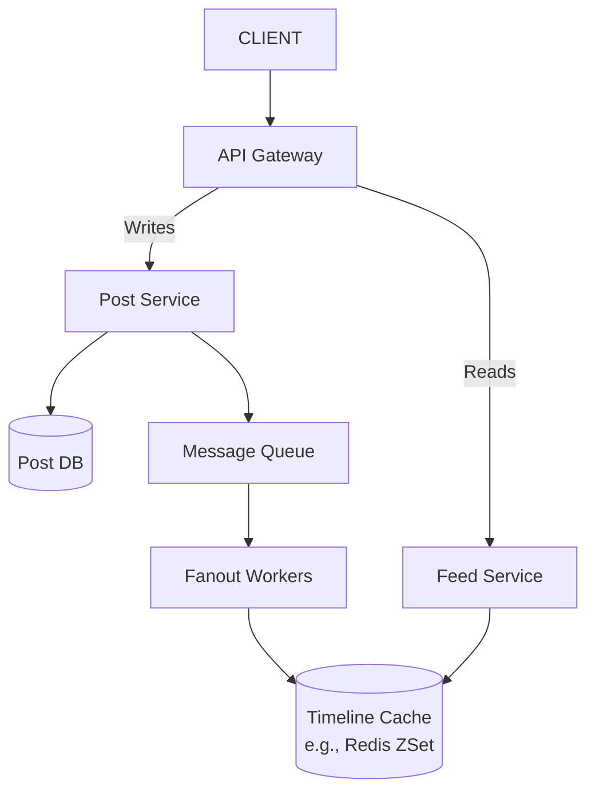

# Design a Social Media Feed System (Twitter/Instagram-style)

## Scope & Requirements

### Functional Requirements
*  Users can create **text posts** (media upload explicitly out of scope for this version, but design should extend to object storage/CDN/async processing later).
*  Each post has: `post_id`, `user_id`, `content`, `created_at`, `visibility` (`ACTIVE`, `DELETED`).
*  Users can fetch a personalized feed via `GET /v1/feed?cursor=<cursor>&limit=20`, using cursor-based pagination with infinite scroll.
*  Read tracking (impressions, clicks) and analytics are explicitly out of scope.

### Non-Functional Requirements
*  **Consistency:** Eventual consistency is acceptable. A new post should appear in followers' feeds within a few seconds (not immediate). **Losing a post permanently is unacceptable.**
*  **Latency:** Feed reads should feel fast/interactive; celebrity posts must not take minutes/hours to propagate.
*  **Scale:**
    *   100M Daily Active Users (DAU)
    *   10M posts/day, ~1KB average post size
    *   User opens feed ~20 times/day
    *   Celebrity case: a single account (`@celebrity`) with 50M followers

---

## Capacity Estimation

*  **Write QPS:** 10M posts/day ÷ 86,400s ≈ **116/sec avg**, ~**1-2K/sec peak**. Writing posts is not the hard part — fanout is.
*  **Read QPS:** 100M DAU × 20 opens/day = 2B feed requests/day ≈ **23K/sec avg**, **~100-200K/sec peak**. This is the real scaling challenge.
*  **Celebrity Fanout Load:** Naive fanout-on-write for a 50M-follower celebrity = **50,000,000 cache writes for a single post** → clogs queues, breaks the "few seconds" latency requirement. This one number motivates the entire push/pull design in Deep Dive 1 — say it out loud, don't just compute it.

---

## High-Level Design

### Core API Endpoints
*  `POST /v1/posts` -> Creates a post; returns `201 Created` immediately after durable write + queue emit (does not wait for fanout).
*  `GET /v1/feed?cursor=<cursor>&limit=20` -> Returns 20 personalized post IDs (hydrated with content), cursor-paginated for infinite scroll.

### Database Schema (Highly Abstract)
*  **Post Table (Post DB):** `post_id` (PK), `user_id` (FK), `content`, `created_at`, `visibility` (`ACTIVE`/`DELETED`)
*  **User/Social Graph:** `user_id` (PK), `following` (set), `followers` (set), `is_celebrity` (denormalized flag, updated async)
*  **Timeline Cache (Redis ZSet, per user):** member = `post_id`, score = `published_at` (Unix timestamp)
*  **Per-user "recent posts" cache:** last N (~20-50) `post_id`s per user — used for both celebrity pull-fanout *and* cold-start rebuild

### System Architecture Map

*  **Write Path:** Client → API Gateway → Post Service writes to Post DB (source of truth) + Post Cache, emits `PostCreated` event to Message Queue, returns `201` immediately (no synchronous fanout).
*  **Fanout Path (async):** Fanout Workers consume `PostCreated` events, look up followers via Social Graph, push `post_id` into each follower's Timeline Cache ZSet (only for non-celebrity accounts — see Deep Dive 1).
*  **Read Path:** Client → API Gateway → Feed Service queries Timeline Cache for top 20 post_ids → hydrates with content from Post Cache (fallback to Post DB on miss) → returns payload.
*  **Key principle:** Never mix the post store with the timeline store — Post DB stores *what was published*, Timeline Store stores *who should see what*.

---

## Deep Dive 1: Celebrity Fanout Problem (Push vs. Pull Hybrid)

*  **Normal users (small follower count):** Fanout-on-write (push). Cheap — Fanout Worker writes `post_id` into each follower's Timeline Cache at post time.
*  **Celebrities (follower count above threshold):** Fanout-on-read (pull). Never fan out to millions of timelines; instead maintain a `celebrity:{id}:recent_posts` cache (last 20-50 posts).
*  **Threshold:** Not a fixed universal number — should be based on system write capacity ÷ acceptable fanout latency, realistically in the **10K-100K follower range**, not 50M. Stored as a denormalized `is_celebrity` flag on the user record (updated via periodic background job, not computed live on every post) so the Fanout Worker can check it cheaply without an extra DB query per post.
*  **Read-time merge:** Feed Service combines pushed Timeline Cache entries + pulled celebrity recent-posts entries via a k-way merge sorted by `created_at`, deduplicated by `post_id` (cheap insurance), then returns top 20.
*  **Migration across the threshold:** Posts are naturally **time-partitioned** — posts made *before* a user flips to celebrity status live only in the push path (already delivered); posts made *after* the flip are only ever pulled (Fanout Worker checks the flag at *processing time*, not cached at enqueue time). This avoids duplicate or missing posts without needing a receipt/tracking log.
*  **Hot-key protection:** Single-flight/request-coalescing applies to protecting the `celebrity:{id}:recent_posts` cache key from thundering-herd reads when many followers open their feed simultaneously right after a celebrity posts — not to deduplicating feed reads generally.

---

## Deep Dive 2: Timeline Cache Design & Cold-Start Rebuild

* **ZSet structure:** member = `post_id` only (score already handles sort); score = `published_at`
* **Cap size:** sized to pagination depth, not "one phone screen" — realistic cap is **~200-800 entries** per user, still only a few KB per user even at scale.
*  **Cache miss / cold-start rebuild (fan-in approach):**
    1. Fetch the user's follow list from the Social Graph.
    2. For each followed user, pull their last N posts from the per-user "recent posts" cache — in parallel, not a full historical scan.
    3. K-way merge all fetched lists by `created_at`, take top ~200, batch-write into the Timeline Cache ZSet.
    4. Serve the original request from the now-populated cache.
    *   **Risk:** users who follow a very large number of accounts make this fan-in proportionally expensive — mirror image of the celebrity fanout problem. Mitigate with follow-count caps or caching "recently rebuilt" status.

---

## Scaling & Trade-offs / Close

*  **Database Sharding:** Shard Post DB by `post_id` (not `user_id`) — dominant access pattern is point lookups by `post_id` during feed hydration; sharding by `user_id` would create hot shards for celebrity accounts.
*  **Caching Strategy:** Hybrid push/pull fanout *is* the core scaling strategy.
*  **Queue Partitioning:** Shard celebrity fanout so large jobs can't starve normal-user throughput.
*  **Idempotent Writes:** Idempotent `ZADD` + at-least-once delivery instead of exactly-once guarantees.
*  **Good closing line (cheap, shows breadth, costs 30 seconds):** name open gaps you'd explore with more time rather than solving them —
    *   Read-path fallback if Timeline Cache (Redis) is down entirely — degrade to pure pull-based reconstruction for all users? Survivable at 100-200K QPS?
    *   Feed staleness/cursor stability while new posts arrive mid-scroll.
