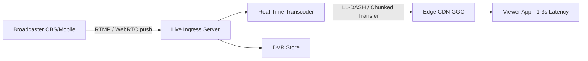
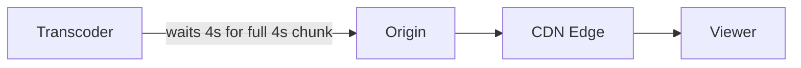
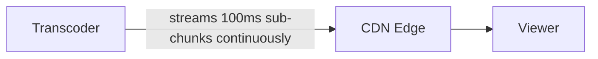
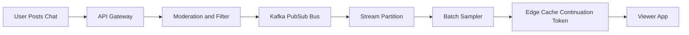
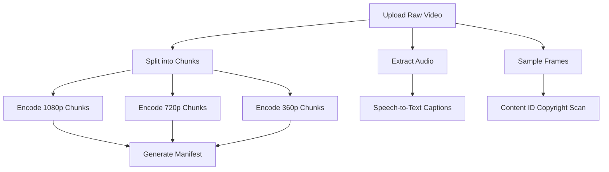
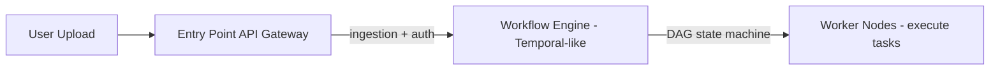

# YouTube Architecture

YouTube's system design is a massively distributed microservice architecture engineered to ingest over 500 hours of video every minute and serve billions of hours of stream daily with sub-second latency.

## Video Ingestion & DAG Transcoding

When a creator uploads a raw video file, YouTube processes it through an asynchronous Directed Acyclic Graph (DAG) pipeline rather than a single monolithic conversion:

- **Chunking**: The upload service splits the master video into uniform 2- to 5-second GOP (Group of Pictures) chunks. This allows parallel processing across thousands of worker nodes simultaneously.
- **Transcoding DAG**: Parallel workers encode raw chunks into multiple video codecs (AV1, VP9, H.264/AVC) across various resolutions (from 144p up to 8K) and frame rates (30/60 fps).
- **Parallel Workflows**: Simultaneous to encoding, secondary DAG nodes generate animated thumbnails, extract audio tracks, run speech-to-text for closed captions, and scan audio signatures against the Content ID database.
- **Adaptive Bitrate (ABR) Packaging**: Encoded chunks are indexed into MPEG-DASH and HLS manifest files (.mpd or .m3u8). During playback, the client dynamically adjusts video quality segment-by-segment based on real-time network bandwidth and device performance.

## Storage Tier: Blobs vs. Relational Data

YouTube separates static video media from transactional metadata to optimize read/write performance:

| Storage Layer | Technology Used | Functional Role |
| --- | --- | --- |
| Blob Storage | Google Cloud Storage / Colossus | Stores original source videos and generated encoded chunk segments. |
| Metadata Storage | Vitess (MySQL sharding framework) | Stores structured data including user accounts, video channel maps, video titles, and privacy configurations. |
| NoSQL / Key-Value | Bigtable / Spanner | Stores high-volume time-series data such as watch history, user preferences, and analytics traces. |
| Distributed Caching | Memcached / Redis | Caches hot metadata, channel info, and session states to protect database backends from read spikes. |

### Handling High-Volume Writes (View Counter Problem)

To handle tens of thousands of concurrent view writes on viral videos, YouTube avoids updating transactional databases directly. Writes are buffered into an event stream (Apache Kafka-style messaging bus), aggregated asynchronously in memory across distributed workers, and periodically committed in batch to the database.

## Global Content Delivery (CDN & Edge Strategy)

To minimize buffering and latency, video bytes are delivered through Google Global Cache (GGC), edge servers deployed directly inside ISP networks worldwide.

- **Hot Content** (Popular Videos): Cached on high-speed NVMe/SSD edge servers located physically close to the end user.
- **Warm Content**: Retained in regional Google Data Center caches.
- **Cold Content** (Tail Videos): Streamed on demand directly from central Blob storage using Google's backbone fiber network.

## Recommendation & Search Engine

YouTube uses a two-stage Deep Neural Network (DNN) architecture to deliver personalized feeds from billions of available videos within milliseconds:

- **Candidate Generation (Candidate Retrieval)**: The model takes user history, search tokens, and demographics as input and filters millions of candidate videos down to a few hundred relative matches using collaborative filtering.
- **Ranking**: The remaining candidates are scored using rich feature sets (e.g., past click-through rate, historical watch time, user satisfaction signals). The candidate set is then ordered and returned as the final feed.

## Live Streaming Engine (YouTube Live)

Live streaming cannot use standard VOD DAG chunking because encoding must happen in real time with near-zero delay:



- **Ingress Protocols**: Broadcasters push raw streams using RTMP, WebRTC, SRT, or DASH-PUT endpoints.
- **Low-Latency DASH (LL-DASH) & CMAF**: Real-time transcoders stream sub-second frame chunks to the edge as they are generated, rather than waiting for a full 5-second GOP chunk.
- **DVR Engine**: Simultaneously writes live segments to Colossus blob storage so viewers can rewind a live stream in real time.

### VOD vs. Live: Architecture Comparison

**Video-on-Demand** is optimized for maximum compression and highest visual quality; processing latency does not matter (a 10-minute upload can take 5 minutes to encode). **Live Streaming** is optimized for ultra-low latency (1-3 seconds broadcaster-to-viewer); processing must happen in milliseconds without delaying frames.

| Architectural Dimension | VOD Pipeline | Live Pipeline |
| --- | --- | --- |
| Primary Goal | Minimize bandwidth usage & storage space. | Minimize broadcast-to-viewer delay. |
| Ingestion Protocol | Resumable HTTP POST / gRPC chunk uploads. | Push protocols (RTMP, WebRTC, SRT, or DASH-Ingest). |
| Processing Engine | Asynchronous DAG across thousands of nodes. | Continuous stream pipeline (real-time workers with small memory buffers). |
| Encoding Passes | Multi-pass: scans the whole video to optimize bitrate allocation frame-by-frame. | Single-pass (hardware) encoding; no lookahead. |
| Codecs Used | Heavy, compute-intensive (AV1, VP9, H.264). | Fast, lightweight (H.264, VP9 w/ hardware acceleration). |
| Delivery Protocols | Standard MPEG-DASH / HLS (2-6 s static chunks). | LL-DASH / CMAF w/ HTTP Chunked Transfer (sub-second sub-chunks). |
| Caching Strategy | Static files aggressively cached on CDN edges (high hit ratio). | Live ring buffer in memory; consumed as it is generated. |
| Storage Engine | Permanent Blob Storage (Google Colossus). | Temporary volatile RAM/SSD ring buffer + async dump to Colossus for DVR. |

### Three Core Architectural Divergences

**1. Ingestion & Transcoding: DAG vs. Pipeline.**
- **VOD (batch)**: The file is complete before processing starts. It is chopped into GOP chunks, dispatched across a CPU/GPU cluster via the DAG workflow engine, encoded in parallel, then assembled.
- **Live (stream)**: Video bytes arrive continuously. A single live transcoding server holds a frame buffer (~milliseconds wide) in memory, encodes incoming frames into lower resolutions with hardware ASICs on the fly, and pushes them to the distribution network. There is no file-assembly stage.

**2. CDN Mechanics: Pull vs. Push/Chunked Streaming.**
- **VOD (pull)**: The player requests a 4-second chunk (`chunk_10.m4s`); the edge CDN checks its NVMe drive and, if missing, fetches (pulls) it from origin.
- **Live (push / chunked transfer)**: A 2-second chunk is broken into tiny ~100-ms sub-chunks and streamed to the CDN via HTTP/1.1 Chunked Transfer Encoding; the viewer starts playing sub-chunks while the tail of the segment is still being filmed.





**3. State & Storage: Static Blobs vs. the "DVR Loop".**
- **VOD**: Video files are immutable, static blobs in Google Colossus.
- **Live**: Uses a circular ring buffer: as new video arrives, the oldest segments drop off the live-edge window. If a user pauses or rewinds, a separate DVR worker writes the stream to permanent blob storage in the background.

### Where the Architectures Merge (Live → VOD)

When a live broadcast ends, a post-live task stitches together all background DVR chunks in Colossus, generates a permanent VideoID, and hands the raw recording to the VOD DAG Pipeline. Multi-pass encoding then produces high-compression AV1 files, automatic chapters, and full captions, and the live stream seamlessly becomes a standard VOD video.

## Content ID & Copyright Matching Engine

Before or during video publication, every audio and visual stream is checked against YouTube's Content ID system:

- **Digital Fingerprinting**: The audio track is converted into spectral audio fingerprints; visual frames are converted into perceptual hashes.
- **Vector Search Database**: Fingerprints are compared against a reference database of 100M+ copyrighted assets in seconds.
- **Policy Router**: On a match, the engine triggers automated rights-holder actions: **Block**, **Track Analytics**, or **Claim Revenue** (monetize).

## Monetization & Ad Insertion (SSAI vs. CSAI)

Serving targeted ads requires executing real-time auctions within milliseconds:

- **Server-Side Ad Insertion (SSAI / Dynamic Ad Insertion)**: The ad server dynamically injects personalized ad segments directly into the manifest file (`.mpd`/`.m3u8`) at natural GOP boundaries. The client player sees a seamless video stream, rendering ad-blockers ineffective.
- **Client-Side Ad Insertion (CSAI)**: The player requests ad tags (VAST/VMAP standards), pauses the main video buffer, fetches the ad chunk, and resumes the primary stream upon completion.

## Real-Time Analytics & Data Pipeline

YouTube processes petabytes of telemetry per hour (watch time, impressions, click-through rates, drop-off rates):

- **Stream Processing Engine**: Distributed stream frameworks (Google Cloud Dataflow / Apache Flink / MillWheel).
- **Anti-Fraud & Bot Detection**: Filters out fake views, automated scrapers, and click farms in near-real-time before committing views to the public counter or advertiser billing ledgers.
- **Aggregated Storage**: Cleaned metrics are flushed into Bigtable and ClickHouse/Spanner for creator Studio dashboards.

## Comments, Community & Notifications

- **Fan-Out Notification Engine**: When a channel uploads a video, a publish-subscribe event bus (like Cloud Pub/Sub) fans out push notifications to millions of subscribed devices in batches to prevent server overload.
- **Comment Graph**: Comments are stored in a distributed sharded database (Vitess) structured as a tree; high-volume channels use asynchronous write buffers to absorb comment spikes during viral events.

### Live Chat at Scale

Chat for millions of concurrent viewers is a fan-out nightmare. With 2M viewers and 5,000 messages/second, a naive push approach would require ~10 billion message deliveries per second. The design abandons true 1:1 realtime delivery in favor of a decoupled write-ingestion pipeline, server-side sampling, multi-tiered fan-out, and adaptive polling.



**Write path (ingestion & moderation):**
- **Rate-limiting**: The API gateway enforces per-user token buckets (e.g., max 1 message every 2-5 s, modified by channel "Slow Mode").
- **Synchronous moderation**: ML classifiers scan for blocklisted terms, links, and toxic content in under 20 ms.
- **Super Chat validation**: Paid messages are validated synchronously, given a priority metadata flag and pinning duration.
- **Event ingest**: Validated messages land on a pub/sub topic (Kafka / Pub/Sub) partitioned strictly by `LiveStreamID`.

**Core optimization: server-side sampling & throttling.**
Humans read only ~3-5 msgs/s; delivering 5,000 raw msgs/s would crash the browser DOM thread and waste bandwidth. The server ranks messages for a time window and sheds the firehose:

$$\text{Priority Score} = f(\text{SuperChat Value}, \text{Subscriber Status}, \text{Moderator Badge}, \text{User Engagement})$$

- **Low-volume stream** (<5 msgs/s): 100% of messages pass through.
- **Viral stream** (>1,000 msgs/s): keep all Super Chats and Moderator messages, then randomly sample regular messages down to a cap of ~3-5 msgs/s total; excess drops server-side.

**Read path: adaptive HTTP batch polling, not WebSockets.**
Unlike 1:1 messaging apps (WhatsApp/Slack) that rely on persistent bidirectional WebSockets, live chat primarily uses an adaptive `get_live_chat` batch-polling endpoint. WebSockets hold stateful per-server connections; 2M open sockets on one stream create routing bottlenecks during edge failovers. Instead:

```json
{
  "actions": [ ],
  "continuationToken": "EiQxMj...",
  "pollIntervalMs": 1500
}
```

The server returns a batch of sampled messages plus a `continuationToken` and `pollIntervalMs`. The edge server dynamically raises `pollIntervalMs` (1,000 → 3,000 ms) when volume drops and lowers it when chat spikes, giving the backend full control over global read traffic.

**Multi-tiered memory caching:** Edge HTTP servers never hit a primary DB to read chat:

| Storage Tier | Technology | Purpose |
| --- | --- | --- |
| L1 Edge Cache | In-memory Edge Ring Buffer | Holds the last 10-30 s of sampled chat batches on CDN/Edge nodes. |
| L2 Aggregation Cache | Distributed Redis / Memcached | Sliding time-window state per `LiveStreamID`; serves L1 misses. |
| L3 Persistent Store | Bigtable / Spanner | Asynchronously writes full (unsampled) chat logs for Live Chat Replay on VODs. |

Over 99% of poll requests are served from L1/L2, turning DB lookups into cheap RAM byte streaming.

**Client-side virtualization (browser & app):**
- **DOM virtualization**: The client keeps a strict buffer (e.g., max 100 array items); oldest items drop as new ones arrive.
- **Animation queueing**: Incoming batches go into an internal JS queue and slide onto screen every 200-300 ms to preserve readability and avoid OOM.

## Security, DRM & Asset Protection

- **Widevine DRM**: Premium content (e.g., YouTube Movies/Rentals) uses AES-128 encryption via Encrypted Media Extensions (EME). Encrypted segments sit on the CDN; the browser must fetch a hardware-backed decryption key from Google's License Server.
- **Signed CDN URLs**: CDN media URLs carry short-lived cryptographic tokens bound to the user's IP address and session ID to prevent unauthorized hotlinking or scraping.

## Deep Dives

### What is a "Group of Pictures" (GOP) Chunk & Do They Have Unique IDs?

A video is a sequence of individual image frames played rapidly. To save space, video compression doesn't store full pictures for every frame:

- **I-Frame (Keyframe)**: A complete, uncompressed image standalone frame.
- **P/B-Frames (Delta frames)**: Incomplete frames that only store what changed since the last frame.

A Group of Pictures (GOP) is a self-contained group of frames that begins with an I-Frame. You cannot slice a video file at a random byte because if you cut in the middle of a delta frame, the video corrupts. YouTube splits raw videos precisely at GOP boundaries (usually every 2 to 5 seconds).

**Do they have unique IDs?** Yes. Every chunk is stored in blob storage with a deterministic naming scheme and timestamp offset (e.g., `video_1080p_chunk_0042.m4s`). The master playlist (called a manifest file) stores these IDs in exact sequential order so the video player knows how to stitch them together seamlessly.

### Why Encode into Multiple Codecs? (Is It For Resolution?)

Resolution is the dimensions of the screen (e.g., $1920 \times 1080$). A codec (Encoder/Decoder) is the mathematical formula used to compress those pixels into bytes. YouTube encodes videos into multiple codecs for compatibility and bandwidth cost:

- **H.264 (AVC)**: The legacy standard. It produces larger file sizes, but virtually every device on Earth (old smart TVs, legacy smartphones, older web browsers) has a physical hardware chip built to play it.
- **VP9**: Developed by Google. It compresses video roughly 30%-40% better than H.264 at the same visual quality. Most modern web browsers and Android devices support it.
- **AV1**: The latest open-source codec. It offers extreme compression (saving massive amounts of mobile data), but encoding it requires heavy computing power.

YouTube serves AV1 or VP9 to modern devices with fast processors to save server bandwidth, while falling back to H.264 for older or low-power devices.

### Why a DAG & a Workflow Engine (Temporal-like)

A DAG is a workflow structure made of steps ("nodes") connected by directional paths ("edges") with no circular loops (acyclic). Video processing cannot happen in a simple step-by-step linear line. A single upload triggers dozens of tasks that depend on each other in parallel:



**Why DAG is crucial:**
- **Parallel Execution**: Nodes that don't depend on each other (like speech-to-text vs. 1080p encoding) run simultaneously across thousands of server nodes.
- **Fault Tolerance**: If chunk #42 fails, only Node #42 is retried, not the entire 2-hour video.

**The DAG is not the entry point.** It runs on a separate workflow engine (Temporal-like, cf. Airflow / Netflix Conductor):



| Feature | Entry Point (API Gateway) | Workflow Engine (Temporal / DAG engine) |
| --- | --- | --- |
| Primary Role | Accepts traffic, validates auth, ingests file. | Orchestrates multi-step dependencies, maintains cross-server state. |
| Lifespan | Short-lived (seconds); ends once upload is stored. | Long-lived (minutes-hours); lives until all encoding completes. |
| State Handling | Stateless. | Stateful: tracks which chunks succeeded, failed, or are running. |

**What happens at the Entry Point:**
1. The creator hits "Upload"; the gateway streams raw bytes into Google Cloud Storage (Colossus).
2. It assigns a `VideoID` and creates a row in Vitess with status `PROCESSING`.
3. It fires a trigger: `Start Workflow "ProcessVideo" for VideoID: 9x2A_kL`.
4. The connection closes, and the entry point's job is done.

**What the workflow engine adds on top of the DAG:** durable orchestration with runtime expansion, heartbeat-based retries, and fine-grained dependency ordering:
- **Dynamic Fan-Out / Fan-In**: a 2-hour video yields ~1,000 GOP chunks; the engine expands the DAG at runtime, spawning 1,000 parallel encoding Activities onto worker pools, then performs a barrier sync before "Generate Manifest" fires.
- **Durable Execution & Retries**: workers crash or get preempted all the time. If Worker #342 dies mid-chunk, the engine detects the heartbeat timeout, re-queues only chunk 342 onto another worker, and resumes; the other 999 chunks are never restarted.
- **Dependency Management**: thumbnail generation needs only chunk #1 (starts immediately); speech-to-text needs all audio chunks; the "video delivery" signal fires only when at least one video quality + audio are fully packaged.

**Mapping to Temporal concepts** (if you rebuilt ingest with Temporal today):

| YouTube DAG Concept | Temporal Equivalent | Responsibility |
| --- | --- | --- |
| Ingestion Pipeline | Workflow | Defines task order, timeouts, and retry policies. |
| Chunk Transcode Task | Activity | The CPU/GPU-heavy function that encodes one chunk. |
| Transcoding Servers | Workers | Clusters polling Temporal task queues for jobs. |
| DAG Orchestrator | Temporal Server | Persists workflow/DAG state, timers, and retries. |

### Why Separate Audio & Video, and What is "ABR Packaging"?

**Why Separate Audio and Video?** If your Wi-Fi drops from fast to slow while watching a video, the app needs to downgrade your video from 4K to 480p without stuttering. If audio and video were fused into a single file, swapping files mid-stream would cause the audio to cut out, glitch, or restart. By separating them, your device downloads 1 continuous audio track while seamlessly switching video chunk resolutions on the fly behind the scenes.

**What is "ABR Packaging"? (Is it put back into 1 video?)** No, ABR (Adaptive Bitrate) packaging does NOT fuse everything back into one video file. "Packaging" means taking all the encoded audio/video chunk files and creating a Manifest File (such as an `.mpd` for MPEG-DASH or `.m3u8` for HLS). The Manifest File acts as an index/playlist file that contains:

- The web addresses (URLs) of every audio chunk.
- The web addresses of every video chunk broken down by resolution and codec.
- The exact timestamp alignment for every chunk.

**How Playback Actually Works:**
1. The YouTube client app downloads the Manifest File.
2. The app monitors your network speed. If your connection is fast, it requests `audio_chunk_1.m4s` + `video_4k_chunk_1.m4s`.
3. If your network slows down, for chunk #2 it requests `audio_chunk_2.m4s` + `video_720p_chunk_2.m4s`.
4. Your device's media player receives the separate audio and video streams, synchronizes their timestamps using your device's clock, and renders them together on your screen.